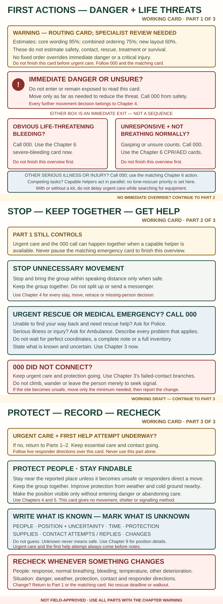

# The first minutes

> **WARNING — COMBINED CHECKLIST REVIEW OUTSTANDING**
>
> **Evidence confidence: High for each emergency principle; Moderate for this combined order. Estimated wording accuracy: 95% for the core actions and 80% for the sequence.** These are subjective editorial estimates, not survival odds. Immediate danger or critical injury always overrides the list. Do not finish an inventory before helping someone.

## Do this now

1. **Look for immediate danger:** fire, rising water, traffic, unstable ground or falling branches. Move only far enough to get clear.
2. **Check every person:** severe bleeding, response, breathing, serious illness, dangerous cold or heat.
3. **Give urgent care and call 000.** Ask for Ambulance for a medical emergency or Police if you are lost; describe both problems when both apply.
4. **Stop unnecessary movement.** Bring the group within speaking distance when safe. Do not send people in different directions.
5. **Protect people and stay visible.** Get out of wind, rain, cold ground or sun. Keep the phone, beacon, light and whistle close.
6. **Check again whenever anything changes.**

*Working routing card; specialist and stressed-reader review remain outstanding.*

## If someone may die soon

- **Obvious life-threatening bleeding:** press firmly on the wound now. If another person is available, have them call 000 while you control it.
- **Unresponsive and not breathing normally:** call 000 on speaker and start [CPR](06-first-aid-and-evacuation.md#unresponsive-or-not-breathing-normally). Gasping is not normal breathing.
- **Other serious illness, injury or breathing trouble:** call 000 and use the matching [first-aid action](06-first-aid-and-evacuation.md).

With or without a first-aid kit, do not delay urgent care while unpacking everything. If more than one life threat exists, get the call-taker's help; this page does not set a lone-rescuer priority between simultaneous severe bleeding and abnormal breathing.

## Make the first help attempt

Call 000 before waiting for perfect coordinates or a complete note. Say:

- what has happened and what is urgent;
- that you are in Victoria;
- the nearest place you know;
- the coordinates exactly as displayed, if available;
- what you do not know;
- any danger that may force you to move.

If the call will not connect, keep giving care and use [Emergency communication](03-emergency-communication.md). Do not climb, wander or leave an injured person merely to chase a signal.

After reporting a position or activating a beacon, stay near that place unless it becomes unsafe or responders direct you to move. See [Stay or move](04-stay-or-move.md).

## Record only useful facts

Once urgent care and the first help attempt are underway, write:

- number and names of people; injuries and needed medicines;
- current displayed position and last certain place;
- when the trouble began and remaining daylight;
- shelter, drinking water, batteries and ready-to-eat food;
- contacts attempted, replies and directions received.

Mark unknown facts as **unknown**. Do not guess.

## Do not

- Blame, argue or split the group.
- Turn a short escape from danger into an unplanned walkout.
- Assume a sent message means rescuers are coming.
- Set a rescue deadline. Delay is a reason to improve shelter, care and signals—not proof that the alert failed.

**Check:** Is everyone responsive and breathing normally? Is bleeding controlled? Is anyone getting colder, hotter, confused or weaker? Is the site still safe? Tell rescuers about important changes.

**Sources and review:** ANZCOR bleeding and CPR guidance; Victoria Police, ACMA and Bushwalking Victoria; S-021, S-043, S-052 and S-072–S-078. FIRST-001–004, BLS-001, BLEED-001, EVAC-001 and MON-001. Rechecked 30 September 2026; no independent manuscript approval.
