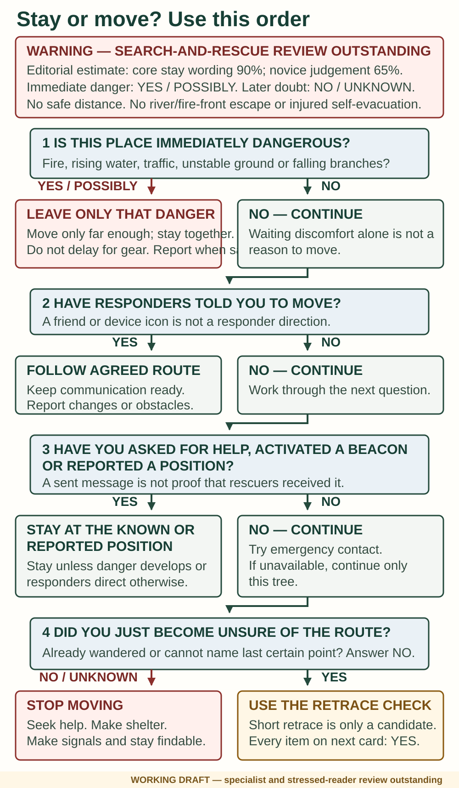
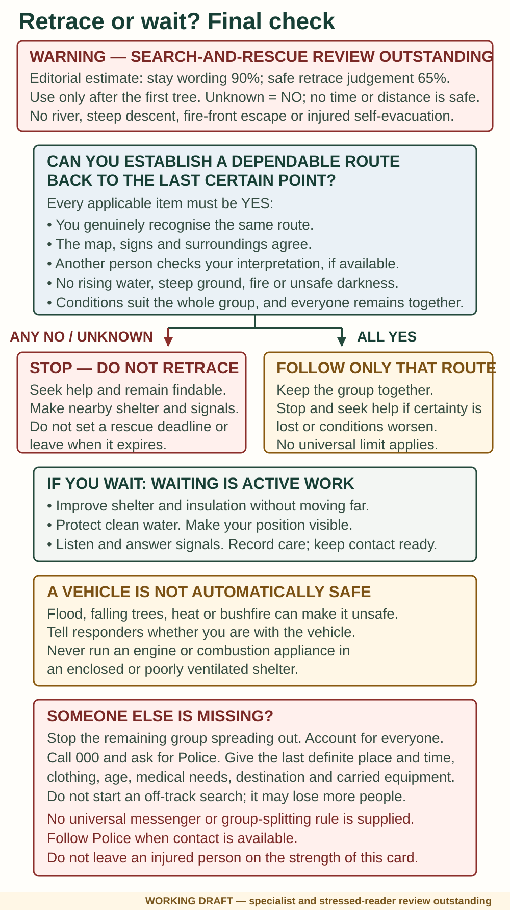

# Stay or move

> **WARNING — SPECIALIST REVIEW OUTSTANDING**
>
> **Evidence confidence: High for staying findable after seeking rescue; Moderate for judging immediate danger or a retrace. Estimated wording accuracy: 90% for the stay/findability rule and 65% for the complete decision path.** These are subjective editorial estimates, not the odds that a route is safe. No universal distance, time or bearing makes a walkout safe. If an answer is unknown, treat it as **NO** and stop.

## Do this now

1. **Stop.** Do not let uncertainty turn into more walking.
2. **Escape immediate danger only as far as needed.**
3. **Call for help or activate the suitable emergency device.**
4. **Stay together and near the position you report.**
5. **Improve shelter, care and signals while you wait.**

Moving out of immediate danger is not a walkout. Following a route agreed with responders is not guessing where a road might be.

## Choose your situation

- **The site is immediately dangerous:** move the minimum needed to reduce the threat. Take communication and essential protection if this does not delay escape. Report the new position as soon as possible.
- **You have called, sent a distress alert or reported a position:** stay at or near that place unless it becomes unsafe or responders direct movement. Tell them if nearby shelter shifts your exact position.
- **You have only just become uncertain:** compare the map, signs and last certain point; ask someone else to check. Consider a short retrace only if you genuinely recognise the route, can keep following it, and every hazard and group check is safe. “I think it was that way” is not confirmation.
- **A responder gives a route:** read it back, follow it and report any condition that prevents you.
- **Any answer is unknown:** stop, seek help and prepare to wait.

> **WARNING — WORKING DECISION DIAGRAMS**
>
> The diagrams have not been approved by search and rescue or tested with a stressed reader. They do not authorise river crossings, steep descents, fire-front escape, off-track searches or an injured person's self-evacuation.

## If someone is missing

Stop the remaining group from spreading out. Note who is missing, when and where they were last definitely seen, their clothing, age, medical needs, equipment and planned destination. Call **000**, ask for Police and keep everyone else accounted for.

> **WARNING — SEPARATION EXCEPTIONS NOT SETTLED**
>
> **Evidence confidence: Insufficient for a universal messenger or search-party procedure. Estimated wording accuracy: 90% for this conservative stop-and-report limit.** Terrain, injury, supervision and findability change the risk. This guide does not tell a lone helper to abandon an injured person or a group to split for an improvised off-track search.

## If a vehicle or fixed shelter is available

A vehicle may help rescuers identify you and may hold protection, water and equipment. It is not safe merely because it is a vehicle: consider floodwater, unstable trees, extreme heat and bushfire. Tell responders whether you are with it and whether it is accessible. Do not leave because a road looks close on a small map.

Never run an engine or combustion appliance in an enclosed or poorly ventilated shelter for warmth.

## Wait actively

- Keep first aid going and record changes.
- Improve insulation and shelter.
- Preserve clean water and battery power.
- Make the position visible; listen and answer signals.
- Keep track of the last successful contact.

## Do not

- Treat a position fix, sent icon or friend's reply as proof that rescuers are coming.
- Create separate search parties.
- Cross water, descend steep ground or enter fire danger on a guessed route.
- Set a rescue deadline and leave when it expires.

**Check:** Is the site becoming unsafe? Is anyone weaker, confused, colder, hotter or harder to move? Has the actual position changed? Report important changes through any working contact.

**Sources and review:** Victoria Police, Bushwalking Victoria and an NPS cross-check; S-021, S-052 and S-056. MOVE-001, FIRST-002–003 and EVAC-001–003; [EP-009](../../research/evidence-packets/EP-009-evacuation-monitoring-and-handover.md) and [EP-010](../../research/evidence-packets/EP-010-shelter-air-flood-and-alpine-hazards.md). Checked 7 September 2026; no search-and-rescue approval.
