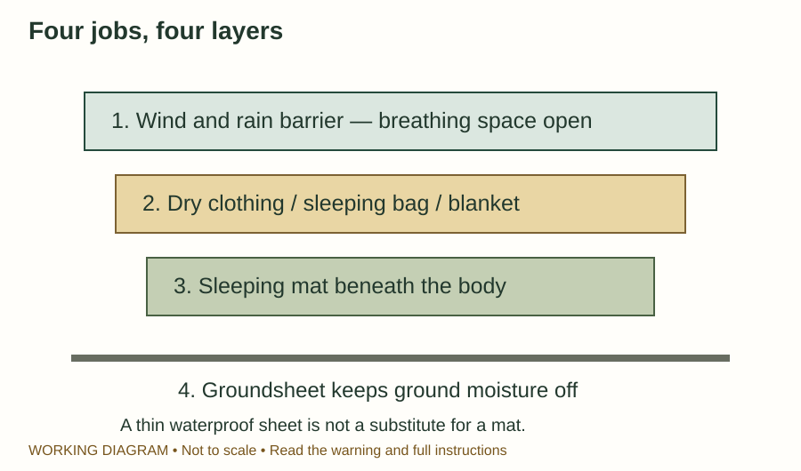
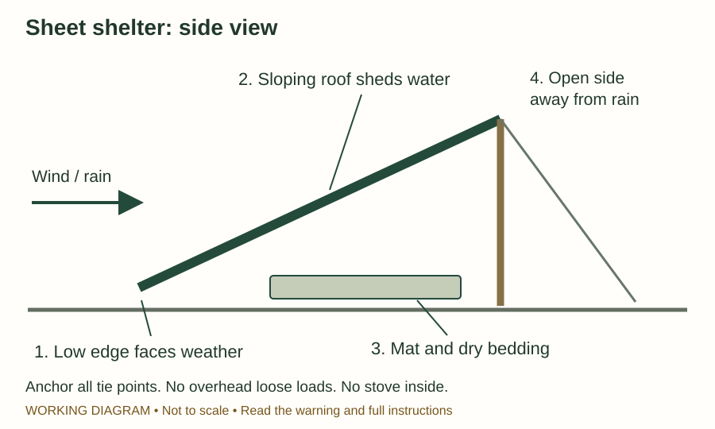
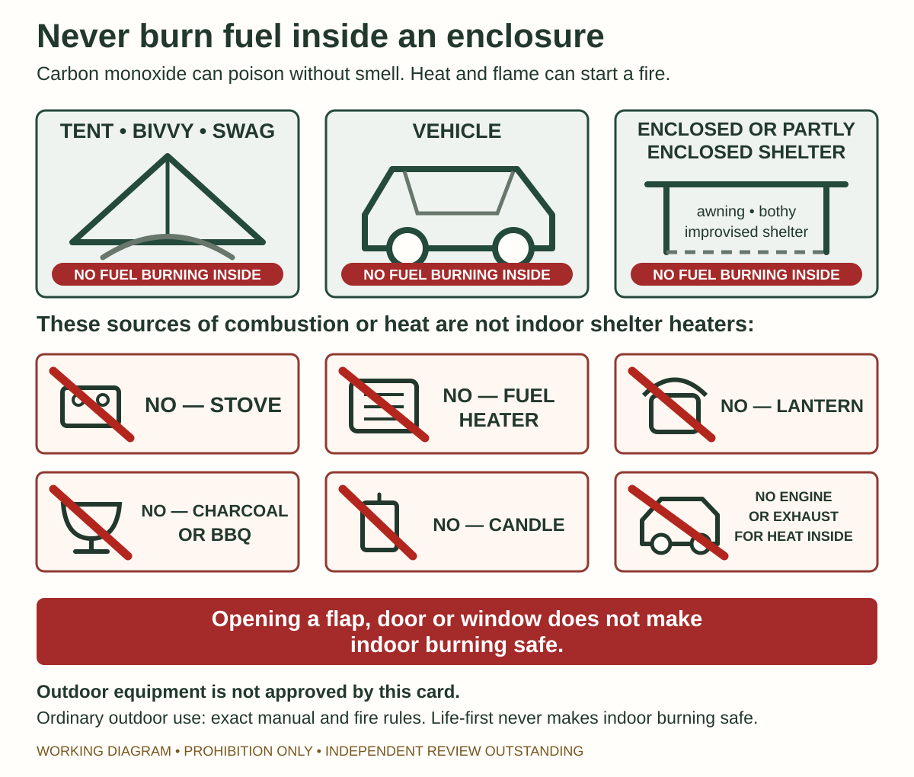

# Temperature and shelter

> **WARNING — MEDICAL AND OUTDOOR REVIEW OUTSTANDING**
>
> **Evidence confidence: High for recognising dangerous exposure and preventing further heat loss; Moderate for the shelter setup examples.**
>
> The examples have not been physically tested with your equipment. No thin blanket, tarp or natural shelter has a guaranteed safe temperature. A person becoming confused, very weak or less responsive needs emergency help, not just a better campsite.

## Choose the place before building

Look above, around and under the proposed shelter position.

- Avoid falling-branch and whole-tree exposure. A tree that looks sound can still fail.
- Stay out of creek beds, drains, gullies carrying runoff and places already threatened by rising water. Dry ground now does not prove it will remain dry.
- Avoid unstable rocks, cliff edges and slopes that could shed material.
- Check for fire, smoke and an escape route from an immediate local threat.
- Consider wind, rain and sun together. A site good for one may be bad for another.

During a thunderstorm, a substantial building or fully enclosed hard-top vehicle is preferable if safely reachable. A tent, open shelter or isolated tree is not lightning protection. There is no guaranteed safe outdoor position. Do not leave a known location for a hazardous dash towards an uncertain shelter.

**Sources:** [Parks Victoria tree risks](https://www.parks.vic.gov.au/news/2022/12/16/06/28/be-aware-of-tree-risks), [VICSES floods](https://www.ses.vic.gov.au/plan-and-stay-safe/emergencies/flood) and [BOM severe-weather safety](https://www.bom.gov.au/resources/learn-and-explore/severe-weather-knowledge-centre/severe-weather-and-coastal-hazard-warning-services); S-066–S-071, S-182–S-185.

## Build protection in layers

Think of four separate jobs: **keep rain off, block wind, insulate underneath, and hold warmth around the person**. Shade and ventilation replace warmth retention when overheating is the problem.

Start before poor light and cold hands make setup difficult. Use carried equipment before investing energy in an unfamiliar construction project.

*IM-065. Original working diagram; source basis: Bushwalking Victoria and NZ Mountain Safety Council below. Layers have different jobs. Their order here is a cutaway explanation, not a tested product or temperature rating.*

### With a tent, bivvy bag or emergency shelter

1. Put the shelter in the screened location and secure it using its own poles, ties and anchors.
2. Put a sleeping mat beneath the person's body. A waterproof sheet keeps moisture off but provides little padding or insulation by itself.
3. Add dry clothing and a sleeping bag or blanket.
4. Arrange the rain/wind layer around the insulation, leaving the face and breathing space open.
5. Keep the entrance and necessary ventilation clear. Place the phone, light and whistle where they can be reached.
6. Check for wind entering, water running towards the bedding, sagging fabric and cold contact with the ground. Correct the specific failure.

A foil sheet is a wind/moisture barrier, not a thick sleeping bag. Use it with insulation rather than expecting the shiny surface alone to stop heat loss.

### A simple sheet shelter for a person who can set it up

> **WARNING — SETUP EXAMPLE, NOT A TESTED DESIGN**
>
> **Evidence confidence: Moderate.** Subjective editorial estimates are 95% for the hazard and prohibition wording, 70% for the project-synthesis setup order and 60% for the untested layout. These are not probabilities of safety, warmth, holding strength or survival. The carried-shelter principle is supported; the exact order, dimensions, wind loading and anchors for your sheet are not verified. Use an established tent or the maker's setup if available. Do not use this example in strong winds, lightning exposure or unstable terrain.

Use this route only if you have an intact tarp with sound tie points, suitable lines and pegs or anchors, a stable support intended for the equipment, mild enough conditions, and an exact setup you already know and have practised. You must also be able to pitch it without climbing, unsafe effort, stopping essential care or leaving an injured person. If any answer is no or uncertain, do not build this design.

*IM-064. Original working diagram; source basis: Bushwalking Victoria and NZ Mountain Safety Council below. A side view cannot show every tie point. This is not a wind-load or anchor specification.*

1. Lay the sheet over the screened site. Decide where the bedding will fit, with space between your body and the wet roof.
2. Secure the edge facing the wind low to the ground, using the sheet's existing tie points and suitable pegs.
3. Support the opposite edge just high enough to create usable space. Keep the opening away from incoming rain. Use the pole and guy-line arrangement intended for your equipment; do not depend on a loose pole balanced in place.
4. Secure the remaining tie points. Keep the roof sloping so water runs off outside the bedding. Tension without tearing the fabric. Avoid pockets where rain can collect.
5. Put the mat and dry bedding under cover, clear of runoff. Keep lines out of the entrance and away from faces.
6. Test the setup from inside using the checks below. Recheck after rain starts or wind changes. If it cannot remain stable, use a safer available shelter rather than staying under failing supports.

![Working rapid sheet-shelter sequence: first require an intact sheet, sound existing tie points, suitable lines and anchors, an intended stable support, mild enough conditions, a practised exact setup and the physical capacity to pitch it without unsafe effort; then screen the site, lay out the bedding and weather-facing low edge, secure only through the known equipment arrangement, raise a continuously sloping roof and complete the inside pass-or-fail checks. The card provides a no-build fallback and gives no dimensions, knot, anchor geometry, wind rating, temperature claim or natural-material shelter method.](../assets/sheet-shelter-setup-card.svg)

*IM-196. Original working project synthesis based on Bushwalking Victoria, NZ Mountain Safety Council, Parks Victoria, BOM and the current Chapter 5 evidence set; S-057, S-061, S-064–S-071 and S-179–S-185. It is a setup and failure-check aid, not proof that a site, attachment or shelter will hold. Exact-equipment, outdoor and search-and-rescue, practical, weather, greyscale/print and stressed-reader review remain outstanding.*

Check from inside: can you sit or lie without pressing the fabric onto your face? Does runoff land outside? Are anchors holding? Lower the opening or change the arrangement if wind drives rain in. Do not hang heavy branches or loose rocks overhead.

### Without purpose-made shelter

Use rainwear and intact available sheets to interrupt wind and rain. Put spare clothing or a pack between you and the ground where possible, removing hard objects that cause pressure. Preserve a dry layer for the person who is least able to keep warm.

Do not put a plastic bag over anyone's head or seal a person inside it. Do not strip bark, fell a tree or climb for materials. A laborious debris hut is not a dependable first response for someone cold, injured or lost.

This edition does **not** contain an approved no-equipment shelter-building method. Without purpose-made shelter, the actions above reduce exposure; they do not create an equivalent shelter or a proven weather rating.

**Shelter basis:** [Bushwalking Victoria](https://bushwalkingmanual.org.au/emergencies/emergency-shelters/), [NZ Mountain Safety Council](https://www.mountainsafety.org.nz/learn/skills/emergency-shelters), plus the heat-loss sources below; S-064–S-065. Setup wording is an explicitly marked synthesis.

## Someone is getting dangerously cold

Watch for clumsiness, slurred speech, delayed answers, confusion or decreasing responsiveness after cold or wet exposure. Do not wait for a thermometer reading. Stopping shivering while still cold and deteriorating is not reassuring.

**Do this immediately:** Call 000 for suspected hypothermia. Protect the person from wind, rain and cold ground. Keep them resting; handle gently. If unresponsive and not breathing normally, use [CPR](06-first-aid-and-evacuation.md#unresponsive-or-not-breathing-normally).

**With a first-aid kit:** Use the emergency wrap together with dry insulation and ground protection. Prepare shelter and replacement clothing before exposing the person to remove wet garments. Change them with as little exposure and movement as possible.

**Without a first-aid kit:** Use dry spare clothing, a sleeping bag, mat, pack and windproof sheet already available. Protect yourself as well; losing your own essential clothing can create a second casualty.

Do not rub cold limbs, force the person to exercise or give alcohol. Give nothing by mouth if drowsy, confused or unable to swallow normally. Blankets reduce loss but may not rewarm a severely cold person; report deterioration urgently.

> **WARNING — ACTIVE REWARMING NEEDS MORE SPECIFIC INSTRUCTIONS**
>
> **Evidence confidence: Moderate for applying heat in this remote setting.** Australian guidance supports active warming, but heat sources can burn and device instructions differ. No hot-stone, fire-side or improvised hot-water-bottle procedure is given. Use a suitable purpose-made device only as directed and, where possible, under responder advice.

**Sources:** [ANZCOR cold injury](https://www.anzcor.org/home/first-aid/guideline-9-3-3-first-aid-management-of-hypothermia-and-cold-related-injuries), [healthdirect hypothermia](https://www.healthdirect.gov.au/hypothermia), WMS remote-care cross-check S-061; S-057, S-059, S-063. High confidence in guidance agreement does not imply high-certainty clinical trials.

## Someone is getting dangerously hot

Confusion, collapse, seizure, marked weakness or inability to continue in heat can mean serious heat illness. The person may still be sweating. Call **000** and start cooling; do not wait for a particular temperature.

**With a first-aid kit:** Move into shade or a cooler place if this is safe. Loosen excess clothing. Use water and cloths to repeatedly moisten exposed skin, and fan continuously. Supplies help, but do not delay cooling to fetch a kit.

**Without a first-aid kit:** The same cooling can use a water bottle, clean clothing and air moved with a hat or other broad object. For children five and under, use moistening and fanning; do not substitute the adult cold-immersion method.

Keep watching response and breathing. Give cool drinking water only when fully conscious and swallowing normally. Do not pour water into a confused person's mouth.

> **WARNING — NATURAL-WATER IMMERSION EXCLUDED**
>
> **Evidence confidence: Insufficient for a generic bush-water immersion instruction.** Supervised cold-water immersion is effective in suitable clinical/first-aid circumstances, but an impaired person in a creek or dam can drown. This guide uses the supported non-immersion alternative; it does not direct you to put someone in a waterway.

**Sources:** [ANZCOR heat illness](https://www.anzcor.org/home/first-aid/guideline-9-3-4-heat-induced-illness-hyperthermia), [healthdirect heatstroke](https://www.healthdirect.gov.au/heatstroke), WMS 2024 cross-check S-062; S-058, S-060.

## Never heat an enclosed shelter by burning fuel

> **WARNING — UNREVIEWED COMBUSTION-PROHIBITION VISUAL**
>
> **Estimated confidence in the accuracy of the wording: 95% for the core prohibition; 85% for the completeness of the listed enclosure and equipment examples.** These are subjective editorial estimates, not the chance that a person will be safe or survive. The core rule closely follows current public-health and product-safety guidance, but this combined visual has not had Victorian public-health, toxicology, fire, product-safety or stressed-reader review.
>
> **Review limit:** this diagram prohibits indoor and enclosed-space use; it does not approve any outdoor placement or use. For outdoor equipment, the exact manual, current fire law and suitable conditions still control. It gives no safe opening, ventilation rate or separation distance, and it does not treat a carbon-monoxide alarm as permission to burn fuel.

Do not use a stove, barbecue, charcoal, candle or fuel heater inside a tent, bivvy, vehicle or enclosed shelter. Carbon monoxide can poison occupants, and flame can ignite fabric. Opening a flap is not a reliable fix. Use insulation for warmth. Operate combustion equipment outdoors only when the exact manual, current fire law and conditions allow it.

*IM-186. Original working prohibition diagram based on EP-010 and S-179–S-181. It is not an appliance-placement guide and does not show a safe outdoor setup.*

**Review record:** EP-002 and [EP-010](../../research/evidence-packets/EP-010-shelter-air-flood-and-alpine-hazards.md). Medical and wider source checks were refreshed 7 September 2026. The current Victorian public-health and product-safety sources supporting the IM-186 combustion prohibition were checked again 29 September 2026; the visual has no public-health, toxicology, fire, product-safety, stressed-reader or physical-setup approval.
