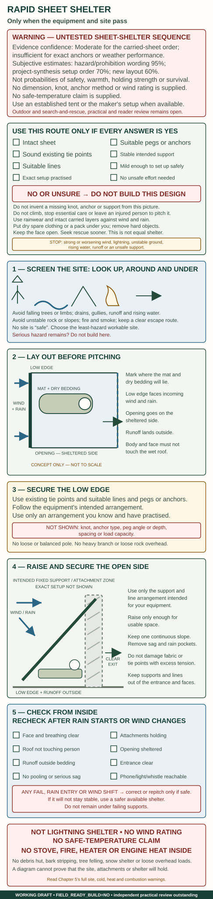

# Temperature and shelter

> **WARNING — MEDICAL AND OUTDOOR REVIEW OUTSTANDING**
>
> **Evidence confidence: High for recognising dangerous exposure and preventing further heat loss; Moderate for the shelter examples. Estimated wording accuracy: 95% for the core cold/heat actions and 75% for complete shelter coverage.** These are subjective editorial estimates, not temperature limits or survival odds. The examples have not been tested with your equipment. Confusion, collapse, marked weakness or decreasing response needs emergency help—not only a better shelter.

## Do this now

1. **Check the person:** response, breathing, severe cold or heat signs.
2. **Call 000** for dangerous cold or heat illness. Start CPR if unresponsive and not breathing normally.
3. **Get clear of immediate danger:** fire, rising water, falling branches, unstable ground or traffic.
4. **Cold or wet:** stop wind and rain, insulate from the ground, add dry layers and keep the person resting.
5. **Hot:** move to shade, loosen excess clothing, wet exposed skin and fan continuously.
6. **Use carried shelter first. Never burn fuel inside an enclosed shelter.**

## Someone is getting dangerously cold

Clumsiness, slurred speech, delayed answers, confusion or decreasing response after cold or wet exposure can mean hypothermia. Do not wait for a thermometer. If shivering stops while the cold person gets worse, that is not reassuring.

- Call **000**.
- Protect the person from wind, rain and cold ground.
- Keep them resting and handle them gently.
- If unresponsive and not breathing normally, use [CPR](06-first-aid-and-evacuation.md#unresponsive-or-not-breathing-normally).

**With a first-aid kit:** combine an emergency wrap with dry insulation and ground protection. Prepare shelter and replacement clothing before exposing the person to remove wet clothes; change them with as little exposure and movement as possible.

**Without a first-aid kit:** use dry spare clothing, a sleeping bag, mat, pack and windproof sheet already available. Protect yourself too; do not create a second casualty by giving away essential clothing.

**Do not:** rub cold limbs, force exercise or give alcohol. Give nothing by mouth if the person is drowsy, confused or unable to swallow normally. Blankets reduce heat loss but may not rewarm severe hypothermia.

> **WARNING — ACTIVE REWARMING NEEDS SPECIFIC INSTRUCTIONS**
>
> **Evidence confidence: Moderate for applying heat in this remote setting. Estimated wording accuracy: 85% for this conservative limit.** Heat sources can burn and devices differ. This guide gives no hot-stone, fire-side or improvised hot-water-bottle method. Use a suitable purpose-made device only as directed and, where possible, under responder advice.

## Someone is getting dangerously hot

Confusion, collapse, seizure, marked weakness or inability to continue in heat can mean serious heat illness. The person may still be sweating. Call **000** and begin cooling; do not wait for a particular temperature.

- Move to shade or a cooler place if safe.
- Loosen excess clothing.
- Repeatedly wet exposed skin and fan continuously.
- Keep checking response and breathing.
- Give cool drinking water only if fully conscious and swallowing normally. Never pour it into a confused person's mouth.

**With a first-aid kit:** use available water and cloths. Do not delay cooling to fetch the kit.

**Without a first-aid kit:** use a water bottle, clean clothing and a hat or other broad object for fanning.

For children aged five and under, use moistening and fanning; do not substitute adult cold-water immersion.

> **WARNING — NATURAL-WATER IMMERSION EXCLUDED**
>
> **Evidence confidence: Insufficient for a generic bush-water immersion method. Estimated wording accuracy: 90% for this conservative exclusion.** An impaired person in a creek or dam can drown. This guide directs moistening and fanning; it does not tell you to put someone in a waterway.

## Choose the shelter place

Look **above, around and under** the site.

- Avoid falling branches, whole-tree failure, unstable rocks, cliff edges and shedding slopes.
- Stay out of creek beds, drains, runoff gullies and places threatened by rising water.
- Check fire and smoke. Keep a way out of an immediate local threat.
- Consider wind, rain and sun together.

During a thunderstorm, a substantial building or fully enclosed hard-top vehicle is preferable if safely reachable. A tent, open shelter or isolated tree is not lightning protection. No outdoor position is guaranteed safe. Do not make a hazardous dash to uncertain shelter.

## Build protection in layers

The shelter has four jobs: **keep rain off, block wind, insulate underneath, and hold dry warmth around the person**. In heat, use shade and airflow instead of trapping warmth. Start before darkness and cold hands make work harder.

### With a tent, bivvy or emergency shelter

1. Put it on the screened site and secure it with its intended poles, ties and anchors.
2. Put a sleeping mat under the body. A waterproof sheet alone gives little padding or insulation.
3. Add dry clothing, sleeping bag or blanket.
4. Keep the rain and wind layer outside the insulation; leave the face and breathing space open.
5. Keep the entrance and needed ventilation clear. Put the phone, light and whistle within reach.
6. Check for wind, runoff, sagging fabric and cold contact with the ground; fix the failed layer.

A foil sheet is a wind and moisture barrier, not a thick sleeping bag. Combine it with insulation.

### A simple sheet shelter

> **WARNING — UNTESTED SETUP EXAMPLE**
>
> **Evidence confidence: Moderate. Estimated wording accuracy: 95% for hazards and prohibitions, 70% for the setup order and 60% for the layout.** These are not the chances of warmth, holding or survival. Dimensions, anchors, wind loading and your exact sheet remain unverified. Use an established tent or maker's setup when available. Do not use this example in strong wind, lightning exposure or unstable terrain.

Only attempt this if you have an intact tarp with sound tie points, suitable lines and anchors, an intended stable support, mild enough conditions, and a setup you have practised. You must be able to build it without climbing, unsafe effort, stopping essential care or leaving an injured person. If any part is missing or uncertain, use the no-build actions below.

1. Screen the site and lay out where bedding will fit without touching the wet roof.
2. Secure the wind-facing edge low, through the sheet's existing tie points.
3. Raise the opposite edge only enough for usable space, using the equipment's intended support and line arrangement.
4. Secure the other tie points. Keep a continuous slope so water runs outside; avoid collecting pockets.
5. Put mat and dry bedding clear of runoff. Keep lines away from faces and the entrance.
6. From inside, check breathing space, runoff, anchors and wind-driven rain. Recheck when weather changes. Leave a failing setup.

### Without purpose-made shelter

Use rainwear and intact available sheets to reduce wind and rain. Put spare clothing or a pack between the body and ground, after removing hard objects. Preserve the driest layer for the person least able to keep warm.

Do not put a plastic bag over anyone's head, seal a person inside plastic, strip bark, fell a tree or climb for materials. A labour-heavy debris hut is not a dependable first response for someone cold, injured or lost.

This edition has **no approved no-equipment shelter-building method**. These actions reduce exposure; they do not create an equal shelter or a proven temperature rating.

## Never heat an enclosed shelter by burning fuel

> **WARNING — UNREVIEWED COMBUSTION-PROHIBITION VISUAL**
>
> **Estimated wording accuracy: 95% for the core prohibition and 85% for complete examples.** These are subjective estimates, not safety or survival odds. The diagram has not had public-health, toxicology, fire, product-safety or stressed-reader review. It approves no outdoor placement and gives no safe opening, ventilation rate or distance.

Do not use a stove, barbecue, charcoal, candle, fuel heater or engine for warmth inside a tent, bivvy, vehicle, or enclosed or partly enclosed shelter. Carbon monoxide can poison people and flame can ignite fabric. Opening a flap or using an alarm does not make burning fuel safe. Use insulation. Operate equipment outdoors only when its manual, current fire law and conditions permit.

**Check:** Is the person becoming less responsive, colder, hotter or weaker? Is bedding dry and off the cold ground? Is water entering? Are anchors failing? Is the site threatened by trees, flood, fire, lightning or unstable ground? Call or update responders when conditions worsen.

**Sources and review:** ANZCOR cold and heat guidance; healthdirect; Bushwalking Victoria; NZ Mountain Safety Council; Parks Victoria, VICSES and BOM; S-057–S-071 and S-179–S-185. EP-002 and [EP-010](../../research/evidence-packets/EP-010-shelter-air-flood-and-alpine-hazards.md). Medical checks refreshed 7 September 2026 and combustion sources 29 September 2026; independent review outstanding.
