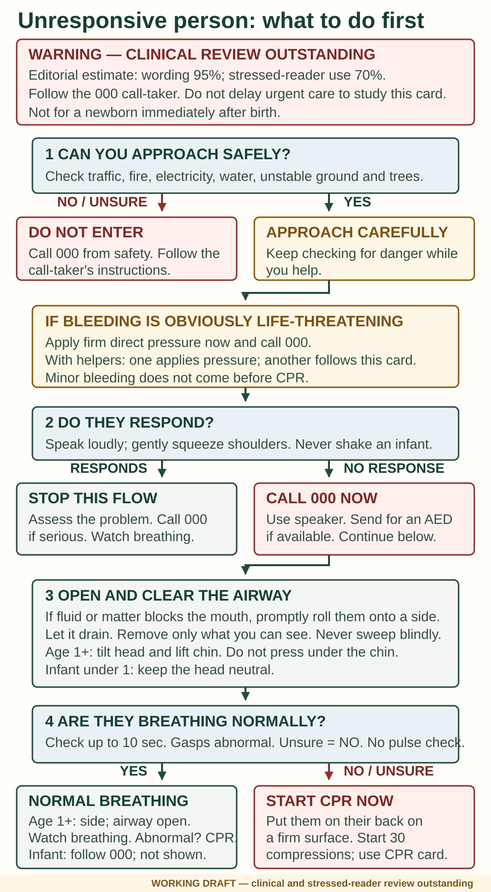
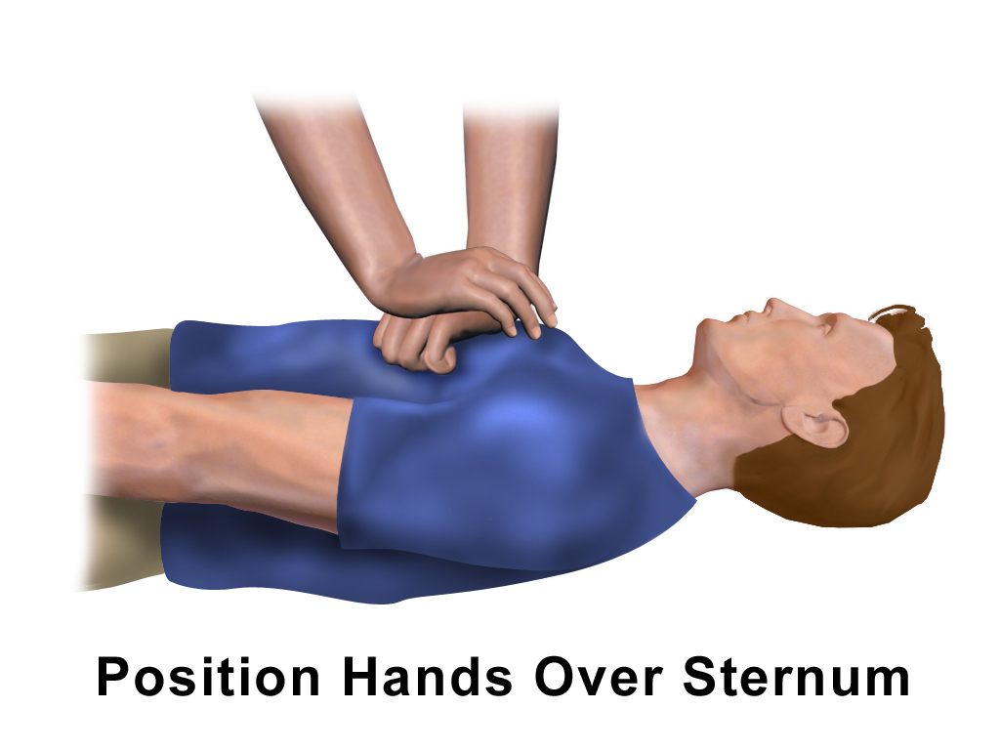
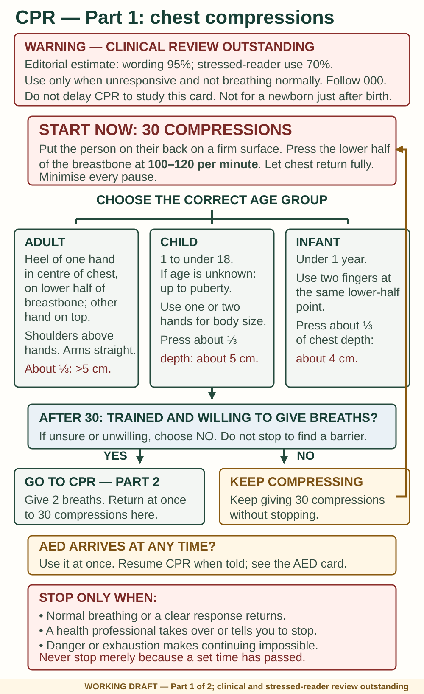
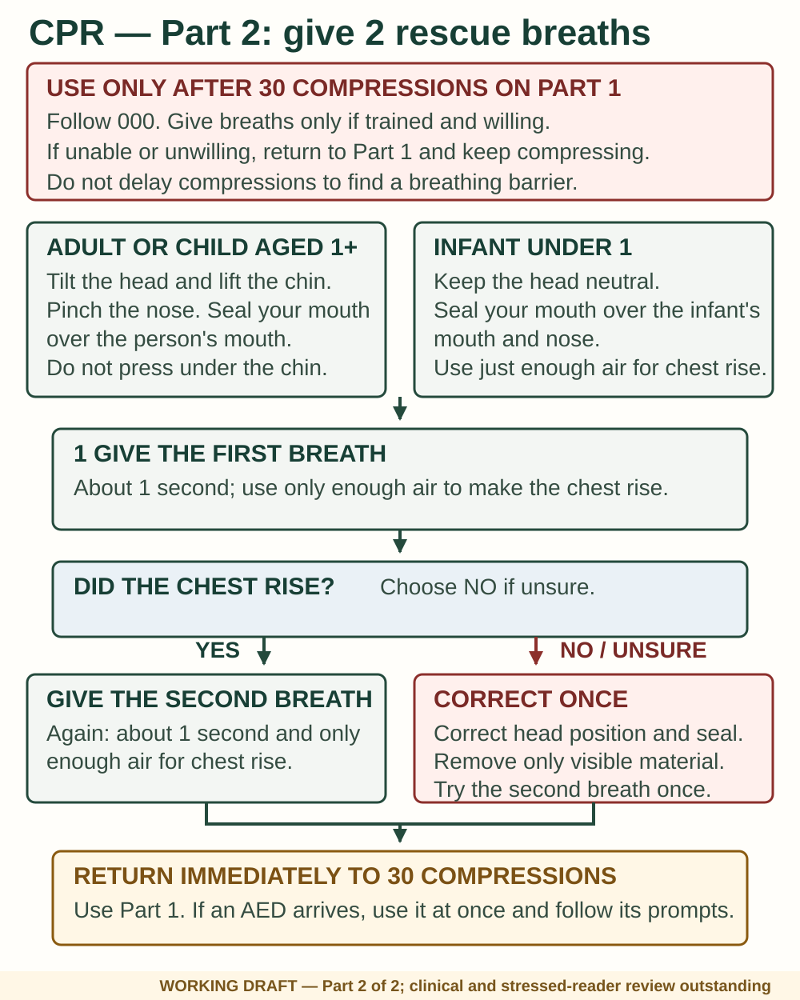
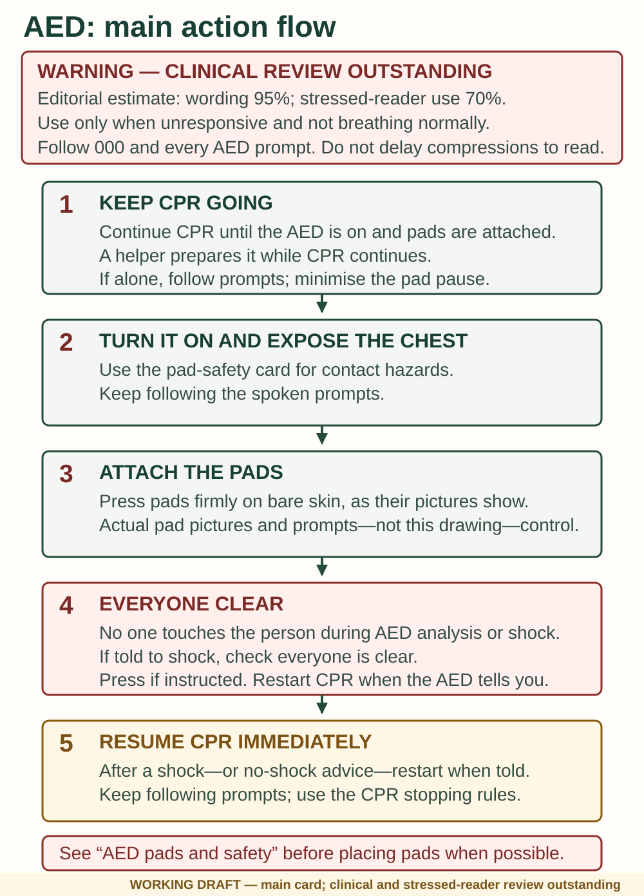
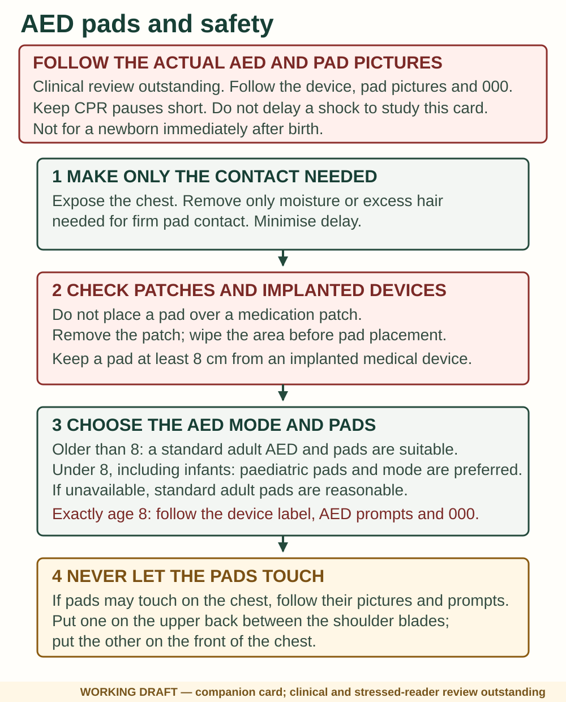
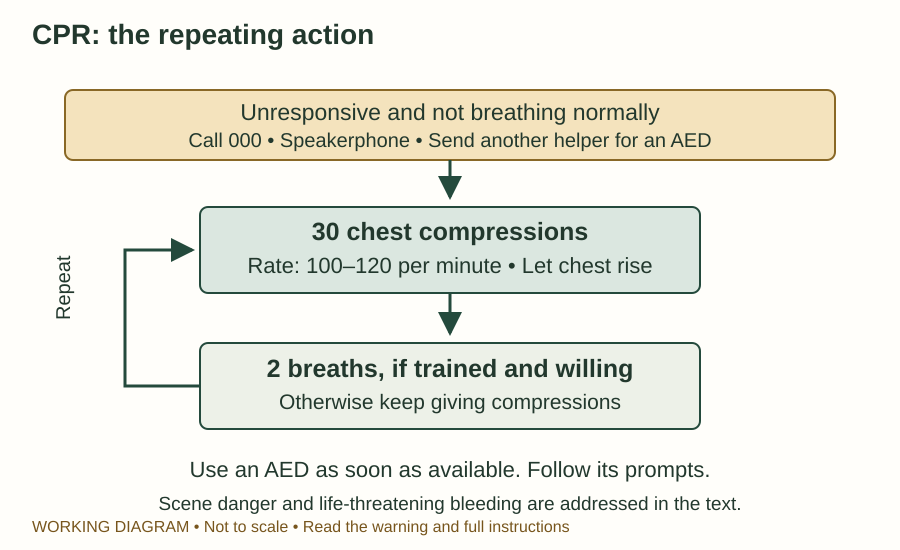
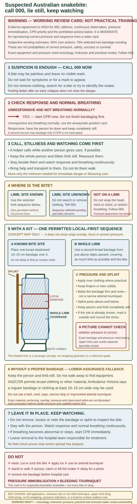
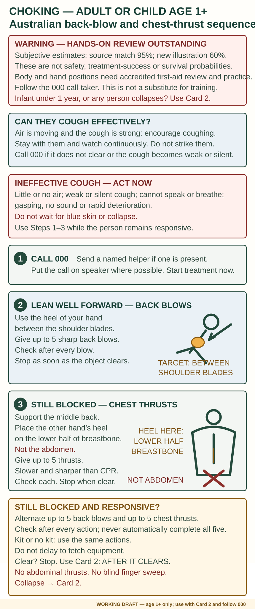
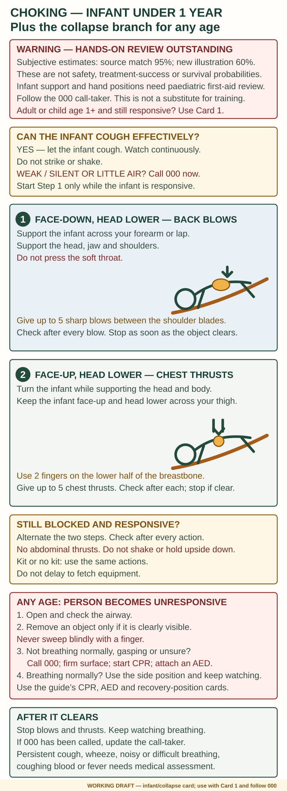

# First aid and evacuation

> **WARNING — MEDICAL REVIEW OUTSTANDING**
>
> **Evidence confidence: High for agreement with the cited Australian first-aid guidance.** This is not a percentage, proof of successful treatment, or independent approval of this manuscript.
>
> These instructions cannot diagnose illness or replace practical training. Call **000** for serious illness or injury and follow the call-taker. Additional boxes identify genuine uncertainties. Exact medicine plans and device labels control where stated.

## Unresponsive or not breathing normally

### Immediate sequence

Check danger first. Speak loudly and gently squeeze the shoulders; do not shake an infant. If there is no response, call 000 on speaker or ask another person to call and obtain an automated external defibrillator (**AED**) if available.

**Exception: obvious life-threatening bleeding needs immediate pressure and emergency help.** If there are several helpers, one controls bleeding while another handles the airway, breathing and call. Minor bleeding does not come before CPR.

Open the mouth. If fluid or matter is blocking the airway, promptly roll the person onto their side, let it drain and remove only material you can clearly see. Do not use a blind finger sweep. If they are not breathing normally, return them to their back on a firm surface and start CPR.

For an unresponsive adult or child, open the airway by tilting the head back and lifting the chin. Do not press into the soft area under the chin. For an infant under one year, keep the head in a neutral position rather than tilting far back.

Look, listen and feel for normal breathing for up to ten seconds. Occasional gasps or abnormal breathing do not count as normal breathing. If you are unsure, treat the breathing as abnormal and start CPR. Do not check for a pulse.

- **Breathing normally:** place on the side with the airway open; see the next section.
- **Not breathing normally:** start chest compressions.

> **WARNING — WORKING BLS FLOWCHART, NOT AN APPROVED SKILLS CHECK**
>
> **Estimated confidence in the accuracy of the wording: 95% for its match to the cited ANZCOR guidance; 70% for the completeness of this untested field-guide layout.** These are conservative editorial estimates, not a probability of safe or correct performance. This is a field-guide adaptation, not ANZCOR's official flowchart. Follow the 000 call-taker and AED prompts. Do not delay care to study it. Independent clinical and human-factors review is outstanding.

*IM-160. Original working diagram based on current ANZCOR Guidelines 3–5 and 9.1.1; S-123 and S-076. The added bleeding branch and infant boundary make this a project adaptation, not an official ANZCOR flowchart. It does not show infant side positioning or demonstrate physical technique. Read the full section and follow 000.*

### Give CPR

> **WARNING — WORKING ADULT CPR VISUALS, NOT A PRACTICAL SKILLS CHECK**
>
> **Evidence confidence: High for the written ANZCOR sequence; Moderate for what these pictures can teach.** The hand picture is a supporting view, not a complete demonstration of the heel contact, arm position or compression movement. It does not apply to infants. Read the numbered steps and follow 000; do not delay CPR to study a picture. Independent medical review of these visuals is outstanding.

*IM-062. BruceBlaus, [original file](https://commons.wikimedia.org/wiki/File:CPR_Adult_Chest_Compression.png), unchanged, [CC BY-SA 4.0](https://creativecommons.org/licenses/by-sa/4.0/). The picture crops out the rescuer's shoulders and elbows. Use the heel of the lower hand on the lower half of the breastbone as described below; do not interpret the curled fingers as pressure points.*

1. Put the person on their back on a firm surface.
2. For an adult, put the heel of one hand on the lower half of the breastbone, in the centre of the chest. Put your other hand over it. Keep shoulders above your hands and arms straight.
3. Press about one third of the chest depth; ANZCOR describes this as more than 5 cm in an adult. Let the chest rise fully after each compression.
4. Give **30 compressions at 100–120 per minute**.
5. If trained and willing, open the airway, pinch the adult/child's nose and seal your mouth over theirs. Give **two breaths**, about one second each, just enough to make the chest rise.
6. Repeat 30 compressions and two breaths. If unable or unwilling to give breaths, keep giving compressions. Do not stop to fetch a barrier.
7. Use an AED as soon as available and follow its spoken instructions.

> **WARNING — WORKING CPR CARD, NOT A PRACTICAL SKILLS CHECK**
>
> **Estimated confidence in the accuracy of the wording: 95% for its match to the cited ANZCOR guidance; 70% for the completeness of the untested two-card layout.** These are conservative editorial estimates, not a probability of safe or correct performance. This is not ANZCOR's official artwork or independent approval. It cannot show correct force, body position or breath volume. Follow 000; do not delay CPR to study it.

*IM-162. Original working CPR card, part 1, based on current ANZCOR Guidelines 4–6 and 8; S-072, S-074, S-123 and S-310. It is a reading aid, not a physical-skills demonstration. Continue to part 2; independent Australian clinical, manikin and stressed-reader review remains outstanding.*

*IM-169. Original working CPR card, part 2, from the same ANZCOR sources. It keeps breath, age, repeat-loop and stopping details at readable size. It cannot teach breath volume or physical technique; follow 000 and the AED.*

> **WARNING — WORKING AED CARD, NOT A PRACTICAL SKILLS CHECK**
>
> **Estimated confidence in the accuracy of the wording: 95% for its match to the cited ANZCOR guidance; 70% for the completeness of the untested two-card layout.** These are conservative editorial estimates, not a probability of safe or correct performance. The cards are not ANZCOR's official artwork. Follow every AED prompt and the 000 call-taker; do not delay compressions while reading them.

*IM-163. Original working AED card, part 1, based on current ANZCOR Guideline 7; S-073 and S-310. The actual AED prompts and pad pictures control. Continue to part 2; independent Australian clinical and stressed-reader review remains outstanding.*

*IM-170. Original working AED pad and safety card from current ANZCOR Guideline 7. Any torso drawing is an orientation cue only; the actual pad pictures and AED prompts control. The exact eight-year boundary and physical pad application require Australian clinical review.*

*IM-063. Original working reminder based on ANZCOR and healthdirect below. This is a repeat-cycle aid, not the whole danger, airway, breathing, bleeding and stopping assessment. Read this section in full.*

For a child aged one year or older, use one or two hands according to size, pressing about one third of the chest depth—approximately 5 cm. For an infant under one year, use two fingers on the lower half of the breastbone, pressing about one third of the chest depth—approximately 4 cm. For infant breaths, cover the mouth and nose with your mouth; use only enough air for visible chest rise. The bystander ratio remains 30:2.

If the chest does not rise, correct the head position and mouth seal and remove only clearly visible material. Try the second breath, then return promptly to compressions. Do not repeatedly attempt breaths or use a blind finger sweep.

**With a first-aid kit:** Use a breathing barrier if immediately available and you know how. With an AED, expose and dry the chest, place pads as shown on them, and make sure nobody touches the person during analysis or a shock. Resume CPR when instructed. For anyone under eight years, including an infant, use paediatric mode and pads if available. If they are unavailable, use the standard adult AED and pads. Pads must not touch; if they are too large to fit apart on the chest, place one between the shoulder blades and the other on the front of the chest. Follow the AED prompts.

**Without a first-aid kit:** CPR does not require a kit. Use your hands and, if willing and able, rescue breaths. Send someone else for equipment only when that can be done without abandoning essential care.

Do not pause CPR merely to recheck breathing or response. Continue until the person responds or begins breathing normally, a health professional takes over or directs you to stop, or it becomes impossible to continue because of exhaustion or immediate danger. Never stop merely because a set time has passed.

**Sources:** [ANZCOR CPR](https://www.anzcor.org/home/basic-life-support/guideline-8-cardiopulmonary-resuscitation-cpr), [airway](https://www.anzcor.org/home/basic-life-support/guideline-4-airway), [breathing](https://www.anzcor.org/home/basic-life-support/guideline-5-breathing), [compressions](https://www.anzcor.org/home/basic-life-support/guideline-6-compressions), [healthdirect CPR](https://www.healthdirect.gov.au/how-to-perform-cpr) and [St John action plan](https://stjohn.org.au/fact-sheet/drsabcd-action-plan/); S-072–S-075, S-123, S-310. Newborn resuscitation immediately after birth is outside this section.

## Unconscious but breathing normally

> **WARNING — WORKING RECOVERY-POSITION CARD; PRACTICAL REVIEW NEEDED**
>
> **Evidence agreement: High for the adult/child indication, airway priority, continued breathing checks and the switch to CPR; Moderate for learning the physical roll from a static card. ANZCOR describes the recovery-position recommendation itself as weak and based on very-low-certainty evidence. Estimated confidence in the accuracy of the wording: 93% for its match to the cited Australian guidance; 65% for the completeness and learnability of this untested movement layout.** These are subjective editorial estimates, not the probability that the movement will be safe or successful. This sequence applies only to an unresponsive adult or child aged one year or older who is breathing normally. It does not show infant handling or prove practical skill. Suspected spinal injury calls for care, but an obstructed airway is the more immediate threat. Follow the 000 call-taker.

*IM-188. Original working recovery-position prompt based on current ANZCOR guidance, the St John adult/child sequence and an Ambulance Victoria teaching cross-check; S-097, S-170, S-311 and S-480. It follows one roll-away sequence and must not be mixed with a different roll-toward method. It does not demonstrate infant handling, spinal clearance or physical competence. Independent Australian clinical, accredited-instructor, practical and stressed-reader review remains outstanding.*

For an adult or child aged one year or older, kneel beside them. Put their farther arm out from the body and their nearer arm across their chest. Bend the nearer knee with that foot on the ground. Roll them away from you onto their side while carefully supporting the head and neck. Keep the bent knee on the ground to prevent rolling onto the face. Place a hand under the chin to support the head and maintain the open airway; the mouth should allow fluid to drain. Avoid twisting the head and spine, especially after an injury.

Check breathing continuously. If it becomes abnormal, roll onto the back and begin CPR. If vomiting occurs, allow drainage and remove visible material, not a blind finger sweep.

**With a first-aid kit:** Add ground insulation and a blanket without covering the face or hiding breathing.

**Without a first-aid kit:** Use folded clothing for support and warmth. Stay beside the person; positioning is not a reason to leave them unattended.

**Sources:** [ANZCOR unconscious person](https://www.anzcor.org/home/basic-life-support/guideline-3-recognition-and-first-aid-management-of-the-unconscious-person), [St John recovery position](https://stjohn.org.au/fact-sheet/recovery-position/), [ANZCOR spinal injury](https://www.anzcor.org/home/first-aid/guideline-9-1-6-management-of-suspected-spinal-injury), and [Ambulance Victoria teaching guide](https://www.ambulance.vic.gov.au/sites/default/files/2025-04/Lesson-Guide.pdf). Adult/child positioning is not a substitute for an infant-handling demonstration.

## Moving an injured or ill person: know the boundary

> **WARNING — CASUALTY MOVEMENT NEEDS CLINICAL, RESCUE AND PRACTICAL REVIEW**
>
> **Estimated confidence in the accuracy of the wording: 94% for its match to the cited Australian guidance; 72% for the completeness of this untested bush decision layout.** These are subjective editorial estimates, not a probability that a move will be safe or successful. The section gives decision boundaries, not a drag, carry, lifting or stretcher technique. Follow 000 or responsible rescuers whenever contact is available.

Moving a collapsed or injured person can increase pain, injury, bleeding and shock. Do not move someone merely for convenience or because help may take time. First ask whether the danger can be reduced, or warmth and shelter brought to the person, without moving them.

Use this sequence:

1. **Is there a present hazard, or is the person's position blocking lifesaving care?** A lifesaving reposition may be needed to open the airway, start CPR or reach severe bleeding. A minimum hazard move may be needed when the present place is unsafe, or when extreme-weather exposure cannot be managed where the person lies.
2. **If yes, move only the minimum needed to solve that immediate problem.** This guide does not define a distance or teach the physical move.
3. **Stop as soon as that problem is solved.** Do not let a short emergency move become a carry or walkout.
4. **Recheck response, normal breathing, severe bleeding and the person's condition.** Return immediately to the relevant first-aid section if anything has changed.
5. **Report the new position.** Tell 000 or rescuers where the person is now, why they were moved and what changed. If a PLB or other rescue alert has been activated, remain findable and follow responder instructions.

If there is no present hazard and lifesaving care is possible where the person lies, treat them there. Protect them from weather, keep the group together, maintain communication and signalling, and wait for organised help unless the exact condition guidance or responsible responders direct otherwise.

Keep these five situations separate:

1. **Lifesaving reposition:** only enough movement to manage the airway, provide CPR or control severe bleeding.
2. **Minimum hazard move:** only enough movement to leave a present danger or otherwise unmanageable extreme-weather exposure.
3. **Supported movement:** only when the exact condition guidance or responder plan permits it and the person can participate. It is not a general self-evacuation clearance.
4. **Organised evacuation:** a trained team uses a planned route, suitable equipment and clear coordination.
5. **Technical rescue:** steep, vertical, swift-water, unstable-ground, vehicle-entrapment and other complex extraction is not taught here.

*IM-187. Original working decision aid based on current ANZCOR Guideline 2 and EP-009; S-169–S-176. It deliberately shows no carry, drag, lift, spinal transfer or extraction technique. Independent Australian remote-emergency, Victorian search-and-rescue, manual-handling and stressed-reader review remains outstanding.*

**With a first-aid kit:** Use padding, ground insulation and weather protection around the person when those items do not obstruct the airway, breathing, bleeding care or observation. A first-aid kit does not make a carry safe. Do not use a purpose-made litter unless a trained team and the exact responder plan support it.

**Without a first-aid kit:** Reduce the hazard or build protection around the person where possible. Do not turn a tarp, blanket, rope, belt, clothing or branches into an untested litter. Communication, signalling, shelter and keeping the casualty observed are safer than inventing equipment.

This section does **not** authorise an improvised litter, drag, carry, long walkout, lone messenger, spinal transfer, water rescue, steep-ground rescue or vehicle extraction. Do not use it to walk out a person whom another section says to keep still, including a suspected snakebite or anaphylaxis. Do not split a lost group to send one person for help. If the current place remains immediately dangerous, protect yourself from becoming another casualty, call 000 from safety and follow the call-taker.

**Sources:** [ANZCOR managing an emergency](https://www.anzcor.org/home/basic-life-support/guideline-2-managing-an-emergency), [ANZCOR spinal injury](https://www.anzcor.org/home/first-aid/guideline-9-1-6-management-of-suspected-spinal-injury), [Victoria Police outdoor and bush safety](https://www.police.vic.gov.au/outdoor-and-bush-safety); S-021, S-097 and S-169–S-176. See EP-009 for the movement, monitoring and handover evidence boundary.

## Someone is seriously unwell and you are not sure why

Use this section when someone looks or feels seriously unwell but you cannot name the cause. Do not wait to diagnose “shock”, sepsis or another illness. **Call 000 if there is any concern that serious illness may be present, or if you, the person, a parent or another carer think “something is wrong”.** Do not wait for a severe sign.

> **WARNING — WORKING SERIOUS-DETERIORATION CARD; CLINICAL REVIEW NEEDED**
>
> **Evidence confidence: High for the current Australian call, breathing, comfortable-position, cause-specific-care, temperature and continued-observation principles; Moderate for the completeness of the sign set and its use across different illnesses, injuries, ages and bush conditions.**
>
> **Subjective editorial estimates: 95% for the source wording, 75% for the cross-condition limits and 60% for the untested layout.** These figures do not estimate diagnostic accuracy, safety, treatment success, recovery or survival. This card cannot prove that a person is well, diagnose shock or sepsis, select a universal position, or replace the matching condition card and 000 instructions. Australian emergency, paediatric, resuscitation, remote-care, practical and stressed-reader review remains outstanding.

![Working serious-deterioration card. Part one says to call Triple Zero if serious illness may be present or anyone thinks something is wrong, without waiting for a diagnosis, a severe sign or every listed sign. Part two checks response and normal breathing and routes CPR, the age-one-plus recovery-position card, severe bleeding, seizure and known causes to the existing Chapter 6 cards; infant side-position mechanics are not shown. Part three uses a comfortable lying-or-chair choice for a conscious person, prohibits routine leg raising and a generic food, drink or medicine instruction, separates kit and no-kit limits, protects temperature according to what is found, and requires continued rechecking and reporting of change.](../assets/serious-deterioration-action-card.svg)

*IM-205. Original working action-and-routing card based on current ANZCOR serious-illness and general-emergency guidance, cross-checked against healthdirect, St John Australia and Ambulance Victoria; S-117–S-119, S-169–S-171 and S-481. It is not a diagnostic checklist or a universal “shock treatment” card. Its recovery-position link is limited to an adult or child aged one year or older; infant side-position mechanics are not supplied. It gives no routine legs-up position, automatic warming, generic drink, medicine, oxygen, device, measurement or evacuation method. Follow 000 and the matching condition card. Independent Australian clinical, practical, complete-card, detached-panel and stressed-reader review remains outstanding.*

Possible signs include:

- struggling, fast, noisy or gasping breathing; difficulty speaking normally; or blue or grey lips or skin;
- being hard to wake, unusually sleepy or floppy, newly confused, collapsed, seizing or becoming less responsive;
- very pale, cool, sweaty, blotchy or newly discoloured skin; a new widespread rash; or a new rash with rapidly worsening illness;
- feeling very hot or very cold, shaking chills, repeated vomiting, passing little or no urine, sudden weakness, severe unexplained pain or getting worse quickly; or
- the person saying “I do not feel right” or “I think I may die”, or a parent or carer saying that a child is much more unwell than usual.

This list is not a test to clear the person. Do not wait for a severe sign, several signs, a temperature reading, a pulse count or a device result. Call whenever serious illness may be present or anyone thinks something is wrong.

1. **Check for current danger.** Do not remain exposed merely to treat the person where they are. If movement is essential for safety or lifesaving care, use the minimum-movement boundary earlier in this chapter.
2. **Call 000 now and ask for Ambulance.** Say that the person is seriously unwell and describe what you can see. A capable helper calls while urgent care continues. If the call does not connect, keep care going and use the failed-contact routes in [Emergency communication](03-emergency-communication.md). Do not leave the person merely to look for reception.
3. **Check response and normal breathing.** An unresponsive person who is not breathing normally—including gasping, absent breathing or when you are unsure—goes immediately to the CPR and AED cards. An unresponsive person who is breathing normally goes to the recovery-position section and continuous breathing checks. The illustrated recovery-position sequence applies only to an adult or child aged one year or older. This guide does not teach infant side-position mechanics; for an infant, follow 000 and keep rechecking normal breathing.
4. **Treat an obvious life threat or known cause using its own page.** Use the severe-bleeding, anaphylaxis, asthma, seizure, stroke, heart-attack, low-glucose, poisoning, burn, heat or cold section when it matches. Keep following the call-taker. A known cause does not cancel the ambulance call when the person is seriously unwell. If abnormal breathing and life-threatening bleeding occur together and you are alone, this page does not set a priority; follow 000. A capable helper can keep pressure on severe bleeding while CPR starts.
5. **If conscious, help the person lie down when comfortable.** If they cannot, do not want to or are not comfortable lying down, bring a chair to them. Do not make them walk and do not routinely raise their legs. The matching condition page and 000 directions control any different position. This is not an infant-positioning or physical-handling method.
6. **Protect body temperature according to what you find.** If the person feels very hot, do not add a blanket; remove excess clothing and use the heat-illness section in [Temperature and shelter](05-temperature-and-shelter.md). If they are cold or losing heat, insulate them from the ground and add dry layers or a blanket without hiding the face or breathing. Do not apply direct heat.
7. **Keep watching.** Recheck response, normal breathing, bleeding, temperature and other change. Report deterioration to 000. Abnormal or uncertain breathing switches immediately to CPR. There is no fixed waiting time after which no change means that the person is safe.

**With a first-aid kit:** Use only the supplies, personal plan, medicine or device named by the matching condition section or directed by 000. Record what was used and when after urgent care is underway. A thermometer, pulse oximeter, blood-pressure cuff or other number must not delay care or overrule worsening signs.

**Without a first-aid kit:** The same safety, call, position, temperature and breathing actions still apply. Use ordinary dry clothing or a blanket for insulation when the person is cold. There is no improvised medicine, oxygen, stimulant, “shock drink” or plant remedy. This generic section gives no food or drink; only give something by mouth when the matching condition section or 000 specifically directs it and the person can swallow safely.

**Sources:** [ANZCOR seriously ill person](https://www.anzcor.org/home/first-aid/guideline-9-2-3-shock-first-aid-management-of-the-seriously-ill-or-injured-person), [ANZCOR managing an emergency](https://www.anzcor.org/home/basic-life-support/guideline-2-managing-an-emergency), [healthdirect shock](https://www.healthdirect.gov.au/shock), [St John Australia shock](https://stjohn.org.au/fact-sheet/shock/), [Ambulance Victoria emergency help](https://www.ambulance.vic.gov.au/who-call-help); S-117–S-119, S-169–S-171 and S-481. ANZCOR controls the response, breathing, conscious-person position and temperature branches where the public sources differ. healthdirect and St John explicitly say not to raise the legs. This project also withholds a generic water route and does not automatically blanket someone who feels hot.

## Severe bleeding

Treat bleeding as life threatening when it is heavy or spurting, rapidly soaks material, follows an amputation or other major injury, does not stop with firm pressure, or is accompanied by pale sweaty skin, faintness, confusion or reduced responsiveness. Call **000** now; do not wait for every sign.

> **WARNING — WORKING SEVERE-BLEEDING CARD; PRACTICAL REVIEW NEEDED**
>
> **Evidence confidence: High for agreement with current Australian guidance on early 000, firm direct pressure, embedded-object care, one-or-two-pad reassessment and continued observation. Subjective editorial estimate: 95% accuracy for the core wording and 72% completeness for this untested layout.** These percentages are not estimates of correct pressure, safety, treatment success or survival. A static page cannot verify force, teach a lone rescuer how to divide simultaneous bleeding and CPR tasks, or establish practical skill. Tourniquet, haemostatic-dressing and wound-packing mechanics are not shown. Follow the 000 call-taker. Australian emergency-clinical, accredited-instructor, task-trainer and stressed-reader review remains outstanding.

*IM-190. Original working severe-bleeding action card based on current ANZCOR guidance and cross-checked against St John Australia, healthdirect and current Victorian emergency-service material, S-076–S-080 and S-481. It is a direct-pressure reading aid, not a physical-skills demonstration. It gives no tourniquet placement, improvised-tourniquet construction, haemostatic-dressing application or wound-packing method. Follow 000; independent Australian clinical, practical and stressed-reader review remains outstanding.*

1. **Press now.** If bleeding is obviously life threatening, firm pressure starts immediately. Have another person call 000 while pressure continues when possible; if alone, call on speaker. Use gloves if they are immediately ready, but do not delay pressure while looking for them.
2. **Find the bleeding point.** Help the person lie down when breathing and other injuries permit. Expose only enough to locate the source. Do not clean or flush a severely bleeding wound before controlling it.
3. **Press firmly and continuously.** Use hands or a pad directly on the bleeding point. A conscious injured person or helper can press. Do not keep lifting the pad to look.
4. **Object stuck in the wound?** Do not pull it out or press on it. Apply pressure and padding around its sides. An eye or torso impalement needs direct 000 guidance; the small card does not teach that specialised care.

**With a first-aid kit:** Put on gloves if immediately available. Press a trauma pad or dressing firmly over the bleeding point. Once bleeding is controlled, secure the pad firmly without moving it away from the source, then keep watching for renewed bleeding.

**Without a first-aid kit:** Use clean, dry folded cloth or clothing. If nothing suitable is ready, hand pressure is better than delay. Avoid direct blood contact where possible.

**If blood keeps coming through:** Keep pressure on the exact point. Add one second pad and a tighter bandage if available. If it remains uncontrolled, check whether the pads have missed the source and apply firmer, more focused pressure. Do not build a loose stack of dressings. Tell 000 that bleeding remains uncontrolled.

> **WARNING — TOURNIQUET, HAEMOSTATIC-DRESSING AND WOUND-PACKING LIMIT**
>
> **Evidence confidence: High that trained use can be indicated in narrowly defined life-threatening bleeding; Low for safe transfer to an untrained, device-independent procedure.** ANZCOR's tourniquet recommendation is weak and based on very-low-certainty evidence. For life-threatening **limb** bleeding not controlled by pressure, a trained person with a manufactured arterial tourniquet follows their training and the exact device instructions. A haemostatic dressing is also a trained adjunct, not an ordinary wound pad. This guide does not teach placement, tightening, improvised construction, wound packing or product use. Do not use a blood-draw band, narrow cord or wire; failed constriction can increase bleeding. Never use an arterial tourniquet for snakebite. If a trained person applies a tourniquet, record the time, keep it visible and do not loosen or remove it before specialist care.

Keep the person still, warm and observed. Recheck response, normal breathing and the dressing. If bleeding returns, press again. Give no food, drink or medicine. If the person is unresponsive and not breathing normally, use the CPR section and follow 000; where another helper is present, they should maintain bleeding control.

**Sources:** [ANZCOR bleeding](https://www.anzcor.org/home/first-aid/guideline-9-1-1-first-aid-for-management-of-bleeding), [St John severe bleeding](https://stjohn.org.au/fact-sheet/severe-bleeding/), [healthdirect wounds](https://www.healthdirect.gov.au/wounds-cuts-and-grazes), [Ambulance Victoria emergency calls](https://www.ambulance.vic.gov.au/who-call-help); S-076–S-080 and S-481.

## Suspected snakebite

Call **000** immediately. Keep the person lying still. A bite may be painless and leave no visible mark. Do not wait for symptoms, search for a mark, remove clothing to look, or try to catch or identify the snake. Resuscitation takes priority if breathing fails.

> **WARNING — BANDAGING ACCURACY AND SOLO RESCUE**
>
> **Evidence confidence: High that current Australian guidance recommends 000, stillness, observation and pressure immobilisation; Moderate for reproducing correct pressure and sequence from a static page. Subjective editorial estimate: 95% wording accuracy for the core actions and 78% for the selected two-bandage wording.** Those percentages are not estimates of correct pressure, safety, treatment success or survival. Field application is often poor, and evidence does not establish one best wrapping sequence. The steps below follow one ANZCOR-permitted local-pressure-then-whole-limb approach, not a claim that it is proven best. Exact equipment, pressure, unknown-site care, upper-limb technique and no-kit wrapping still need Australian toxicology, instructor and practical review.
>
> A lone bitten person with no way to summon help presents an unresolved movement trade-off. This book cannot give a universally safe walkout instruction. Use any available emergency contact and minimise movement while arranging rescue.

*IM-189. Original working snakebite decision card and pressure-immobilisation concept map, based on ANZCOR Guidelines 9.4.1 and 9.4.8, current Ambulance Victoria guidance, healthdirect and St John Australia. The local-first two-bandage sequence is one ANZCOR-permitted method, not a proven best method. The limb picture shows intended coverage and immobilisation only; it does not teach wrapping geometry or verify pressure. Unknown-site, non-limb, upper-limb, self-application, no-kit and lone/no-contact techniques remain under specialist and practical review.*

**With a first-aid kit:**

1. Apply a broad elastic pressure bandage over the bite promptly.
2. Use another broad bandage from fingers or toes upwards to cover the limb as far as possible, including the bite. Apply over clothing where practical. Leave fingertips or toes visible.
3. Make it firm and even, not a narrow arterial tourniquet that stops blood flow. A static page cannot verify the pressure. Follow pressure-indicator markings only when they belong to the exact bandage and you know its instructions.
4. Splint the limb to limit movement at joints above and below the bite. Keep the person and limb still.
5. Note the time and mark the bite position on the outer bandage if known. Leave bandages and splint in place for medical assessment.

**Without a first-aid kit:** Use broad strips of available clothing if no elastic bandage exists; Ambulance Victoria describes 10–15 cm wide material. The pressure is less predictable. Keep the limb still and supported. Do not walk to collect ideal materials.

Do not wash, cut or suck the bite, apply ice, or use an arterial tourniquet. For a bite away from a limb, do not wrap the head, neck or chest or restrict breathing; seek direct emergency advice.

**Sources:** [ANZCOR snakebite](https://www.anzcor.org/home/first-aid/guideline-9-4-1-first-aid-management-of-australian-snake-bite), [pressure immobilisation](https://www.anzcor.org/home/first-aid/guideline-9-4-8-envenomation-pressure-immobilisation-technique), [Ambulance Victoria](https://www.ambulance.vic.gov.au/be-snake-aware-long-weekend), St John S-085 and healthdirect S-084. No identification image is required before calling.

## Anaphylaxis: a severe allergic reaction

> **WARNING — WORKING ANAPHYLAXIS CARDS; NOT DEVICE OR HANDLING TRAINING**
>
> **Evidence confidence: High for the core recognition, positioning, adrenaline-first, 000, five-minute reassessment and CPR wording; Insufficient for one universal device sequence. Subjective editorial estimate: 95% source match for the core wording and 60% completeness for this newly split, untested layout.** These percentages are not estimates of treatment success, safety or survival. Australia now has injection and nasal adrenaline devices with different doses, routes, ends, caps and activation steps. The cards deliberately show none of those mechanics. The person's current ASCIA action plan and exact device instructions control how their device is used; follow any directions from the 000 call-taker. The rapid sign list uses the public-plan wording for abdominal pain or vomiting after an insect sting; broader severe stomach symptoms require clinical judgement. Australian allergy, resuscitation, respiratory, pharmacist/device, practical and stressed-reader review remains outstanding.

![Working anaphylaxis action card. Any one severe breathing, throat, voice, collapse or pale-and-floppy-child sign can be enough, and a rash is not required. If the person is unresponsive and not breathing normally, including gasping or uncertain breathing, call Triple Zero and start CPR on a firm surface; a helper follows the person's adrenaline plan. Otherwise keep the person correctly positioned and never let them stand or walk. Give their adrenaline device exactly as their current plan or label shows, start a five-minute timer and call Triple Zero. If no device is available, call Triple Zero immediately, keep the correct position and watch breathing; the follow-up card gives the full no-device route. If the call will not connect, keep care going, use Chapter 3's emergency-contact options and do not leave the person merely to seek reception. No device mechanics are shown.](../assets/anaphylaxis-immediate-action.svg)

*IM-191. Original working anaphylaxis recognition and immediate-action card based on current ASCIA first-aid and acute-management guidance, cross-checked against ANZCOR and the Royal Children's Hospital; S-087–S-092, S-149 and S-482. It shows no brand, dose, route, cap or end, activation, hold time, age/weight selection, borrowed-device decision or ampoule-and-syringe use. Follow the person's current plan, exact device instructions and 000. Independent Australian allergy-clinical, resuscitation, pharmacist/device, practical and stressed-reader review remains outstanding.*

*IM-192. Original working ordered anaphylaxis-position card from the same source set. It makes the abnormal-breathing CPR gate and overlapping pregnancy, vomiting, consciousness, breathing-difficulty and child branches visible. The silhouettes are reminders, not handling instruction, and do not teach the recovery-position roll. Independent Australian allergy-clinical, resuscitation, paediatric/pregnancy, practical and stressed-reader review remains outstanding.*

![Anaphylaxis follow-up card. Start the timer when the first adrenaline device is given. Five minutes after that first device, if severe signs have not improved, are still present or have returned, use the person's next adrenaline device, following their current action plan and that device's own instructions. Follow any directions from Triple Zero and record the device and time. If no device is available, call Triple Zero immediately, use the correct position, watch breathing, and prevent further exposure only when safe and without delaying care; there is no first-aid substitute. For a person with known asthma and known severe allergy who develops severe sudden breathing difficulty after possible contact with something they are severely allergic to, adrenaline comes before asthma medicine. Keep watching response and breathing, start CPR if unresponsive and not breathing normally, and continue ambulance and hospital care even after improvement.](../assets/anaphylaxis-follow-up.svg)

*IM-193. Original working five-minute and follow-up card from the same source set. It does not select a device or dose, decide use of another person's device, teach product mechanics or resolve a lone rescuer's simultaneous CPR and adrenaline tasks. Follow the current plan, exact device instructions and 000. Independent Australian allergy, respiratory, resuscitation, pharmacist/device, practical and stressed-reader review remains outstanding.*

Treat **any one** of these severe signs as possible anaphylaxis: difficult or noisy breathing; wheeze or a sudden persistent cough; a swollen tongue; throat swelling or tightness; difficulty talking or a hoarse voice; persistent dizziness, collapse or loss of consciousness; or a young child becoming pale and floppy. Abdominal pain or vomiting after an insect sting is also on the public ASCIA first-aid list. Detailed ASCIA and Royal Children's Hospital guidance says severe persistent abdominal pain or repeated vomiting after another possible trigger can also indicate anaphylaxis; that broader threshold needs clinical judgement, so follow the person's current plan and 000. A rash, hives or visible swelling is **not** required. Do not wait for every sign or delay while trying to prove the trigger.

**CPR overrides this sequence only when the person is unresponsive and not breathing normally.** This includes gasping or when you are unsure whether breathing is normal. Do not work through Steps 1–5 first. Call 000, put the person on a firm surface and start CPR now. If another person is present, that helper follows the person's adrenaline plan while CPR starts. This working guide does not yet resolve how a lone rescuer should divide simultaneous CPR and adrenaline tasks; follow the 000 call-taker and the person's current plan.

1. **Position now.** Lay the person flat and keep them still. Never let them stand or walk, even if they seem better. If breathing is difficult, they may sit on the ground with legs outstretched—not upright in a chair. Return them flat if they become faint, drowsy or worse. If unconscious but breathing normally, vomiting or pregnant, use the side position; use the left side in pregnancy. Hold an infant or young child flat across a carer's lap, or seated with legs outstretched if breathing is difficult, never upright or over a shoulder.
2. **Give adrenaline first.** Give their adrenaline device now, exactly as its label or personal ASCIA Action Plan shows. Do not copy the cap, end, route, dose, activation or hold time from another device. If another person is present, they can call 000 while adrenaline is given. If alone, give adrenaline first, then call 000. Start a five-minute timer and record the device and time. If no device is available, do not wait at this step: go straight to Step 3 and use the no-device care below.
3. **Call 000.** Say “suspected anaphylaxis”, give the exact location, and report the device and time, or say that no device is available. If two-way contact cannot be made, keep care going and use the emergency-communication and rescue-alert pathway in Chapter 3. Do not leave the person merely to seek reception. Do not let the person walk to a vehicle or cancel help because they improve.
4. **Five minutes after the first device:** if severe signs have not improved, are still present or have returned, use the person's next adrenaline device, following their current action plan and that device's own instructions. Follow any directions from 000. This guide does not decide use of someone else's device. Record every device and time.
5. **Keep watching.** Recheck response and normal breathing continuously. If the person is unresponsive **and** not breathing normally, place them on a firm surface and start CPR. If unresponsive but breathing normally, use the side-position branch. Prevent further exposure only when safe and without delaying adrenaline or the emergency call. Ambulance transfer and hospital observation are still required, usually for at least four hours after the last adrenaline dose.

**With a first-aid kit:** Use the person's current adrenaline device and action plan; the device may be carried separately from the kit. Start a five-minute timer after it is used. Do not delay adrenaline while looking for antihistamines or an asthma inhaler.

**Without a first-aid kit:** Use the person's separately carried adrenaline device if available. If no adrenaline device is available, there is no medication or improvised substitute: call 000 immediately, keep the correct position, watch breathing and follow the call-taker. Antihistamines, an asthma reliever alone, food, drink and plant remedies do not replace adrenaline.

For someone with known asthma and a known severe allergy who develops **severe and sudden** breathing difficulty after possible contact with something they are severely allergic to, give adrenaline first, then follow their asthma plan. Do not dismiss wheeze, persistent cough or a hoarse voice as “just asthma”, and do not require skin signs.

**Sources:** [ASCIA 2026 first-aid plan](https://www.allergy.org.au/hp/anaphylaxis/first-aid-for-anaphylaxis), [ASCIA July 2026 acute guidance](https://www.allergy.org.au/hp/anaphylaxis/acute-management-guidelines), [ANZCOR anaphylaxis](https://www.anzcor.org/home/first-aid/guideline-9-2-7-first-aid-management-of-anaphylaxis), [healthdirect](https://www.healthdirect.gov.au/anaphylaxis) and [Royal Children's Hospital](https://www.rch.org.au/kidsinfo/fact_sheets/Allergic_and_anaphylactic_reactions/); S-087–S-092, S-149 and S-482. Current ASCIA controls the positioning and multi-product wording where older public pages differ.

## Choking

> **WARNING — HANDS-ON TECHNIQUE REVIEW OUTSTANDING**
>
> **Subjective source-match confidence: 95%. Subjective new-illustration confidence: 60%.** These figures describe editorial confidence, not the probability of correct treatment, safety or survival. The actions follow current Australian guidance, but the body positions and original diagrams have not been approved by an accredited first-aid or paediatric reviewer or tested on manikins. Follow the 000 call-taker and do not substitute abdominal thrusts.

*IM-194. Original working adult/child choking card based on current ANZCOR Guideline 4 and cross-checked against healthdirect and St John Australia; S-123–S-125. The posture and target drawings are review aids, not proof of force or practical competence. Use IM-195 if the person is an infant or becomes unresponsive.*

*IM-195. Original working infant/collapse card from the same Australian evidence set. The infant support and hand-position drawings need paediatric first-aid and manikin review. It points to the guide's existing CPR, AED and recovery-position cards instead of redrawing those techniques.*

First ask whether air is moving and the cough is effective. If the person can cough strongly, encourage coughing and watch continuously. Do not strike them. Call 000 if the obstruction does not clear or the cough becomes weak or silent. Do not give food or drink to push an object down.

Treat a weak or silent cough, little or no air, inability to speak or breathe, gasping, no sound or rapid deterioration as a severe obstruction. Call 000 immediately. Name a helper to call and use speakerphone where possible, but do not wait for blue skin or collapse before starting treatment.

**Adults and children aged one year or older:** Lean the person well forward. Give up to five sharp blows between the shoulder blades with the heel of your hand. Check after every blow and stop when the object clears. If still blocked, support the middle of their back with one hand. Put the heel of your other hand on the lower half of the breastbone—not the abdomen—and give up to five chest thrusts, slower and sharper than CPR compressions. Check after every thrust. While the person remains responsive and blocked, alternate up to five back blows with up to five chest thrusts.

**Infants under one year:** Call 000. Support the responsive infant face-down across your forearm or lap, with the head lower than the body. Support the head, jaw and shoulders without pressing the soft throat. Give up to five sharp back blows between the shoulder blades, checking after each. If still blocked, turn the infant face-up while supporting the head and body, with the head lower across your thigh. Use two fingers on the lower half of the breastbone for up to five chest thrusts, checking after each. Alternate the two steps while the infant remains responsive and blocked. Do not shake an infant or hold an infant upside down.

**If any choking person becomes unresponsive:** Open and check the airway. Remove an object only when it is clearly visible; never sweep blindly with a finger. If the person is unresponsive **and not breathing normally**, including gasping or when breathing is uncertain, call 000, place them on a firm surface, start CPR and attach an AED when available. If unresponsive but breathing normally, use the recovery position and watch breathing continuously. Use the CPR, AED and recovery-position cards in this chapter rather than trying to continue standing blows or thrusts.

**If you are choking while alone:** Cough forcefully and attract emergency help. This guide does not teach a chair-edge or self-abdominal-thrust method because the selected Australian sources do not validate one.

**With a first-aid kit:** No choking-specific tool is needed. Do not delay back blows or chest thrusts to look for equipment. If CPR begins, use a breathing barrier only when it is ready and causes no delay. Use an AED when it becomes available.

**Without a first-aid kit:** Use the same sequence. Do not perform abdominal thrusts or blindly sweep inside the mouth.

**After the obstruction clears:** Stop blows and thrusts and keep watching breathing. If 000 has been called, update the call-taker. Persistent cough, wheeze, noisy breathing, breathlessness, coughing blood or fever needs medical assessment because material may remain in the airway. A normal initial examination or chest X-ray does not always exclude an inhaled object in a child.

**Sources:** [ANZCOR Guideline 4 — Airway](https://www.anzcor.org/home/basic-life-support/guideline-4-airway) and its [choking algorithm](https://www.anzcor.org/home/algorithms-and-flowcharts/choking-management-of-foreign-body-airway-obstruction), [ANZCOR CPR](https://www.anzcor.org/home/basic-life-support/guideline-8-cardiopulmonary-resuscitation-cpr), [healthdirect choking](https://www.healthdirect.gov.au/choking), St John adult/infant sheets S-125 and [Royal Children's Hospital Melbourne](https://www.rch.org.au/clinicalguide/guideline_index/Foreign_Bodies_Inhaled/); S-072, S-123–S-125 and S-483. Current ANZCOR controls the unresponsive-and-not-breathing-normally CPR gate and the head-low infant route where simplified public pages differ. Hands-on review remains outstanding.

## A person has been in trouble in water

> **WARNING — CLINICAL AND AQUATIC-RESCUE REVIEW OUTSTANDING**
>
> **Subjective source-match confidence: 95%. Subjective new-illustration confidence: 60% for the non-contact rescue card and 65% for the out-of-water card.** These are editorial estimates, not probabilities of safe rescue, correct treatment, recovery or survival. The cards follow current Australian public guidance, but they have not been approved by an aquatic-rescue trainer or resuscitation clinician or tested with wet manikins or stressed readers. They do not qualify anyone to enter water, swim to a casualty or make a contact rescue. Follow the 000 call-taker.

*IM-197. Original working non-contact rescue card based on current ANZCOR drowning guidance, Royal Life Saving Australia's rescue hierarchy and St John Australia; S-126, S-127 and S-129. It does not teach wading, craft handling, swimming, towing, in-water breaths or contact rescue. Independent Australian aquatic-rescue, practical and stressed-reader review remains outstanding.*

![Working out-of-water drowning card: call 000 after every drowning incident and have ambulance clinicians assess the person even after apparent recovery; assess an unresponsive person on the back with head and body level; use the side position for normal breathing from age one but do not infer infant mechanics; use CPR with rescue breaths for abnormal or uncertain breathing; clear only an obvious obstruction with the shortest possible CPR interruption; and use kit or no-kit care without delaying CPR.](../assets/drowning-out-of-water-action.svg)

*IM-198. Original working out-of-water card based on current ANZCOR Guidelines 3, 4, 8 and 9.3.2, with St John, Royal Life Saving and wilderness evidence cross-checks; S-072, S-126, S-128–S-131, S-170 and S-310. It follows the general Australian bystander 30:2 route and excludes the trained-responder initial-breath variant, lay field clearance, in-water resuscitation, abdominal drainage and improvised airway tools. Independent Australian resuscitation, emergency, aquatic-rescue, practical and stressed-reader review remains outstanding.*

### Person still in water — secure-land path

Shout for help and call 000. If another person is present, name them to call while you keep the casualty in sight. If there is no two-way contact, use the emergency communication options in [Chapter 3](03-emergency-communication.md).

Stay on secure land. **Talk** to the person first: reassure them, point to the nearest safe edge and tell them to hold any flotation already within reach. If you can remain stable, **reach** with a long, sturdy aid or **throw** a rope or something that floats. Stop immediately if you could fall or be pulled in.

If you are already on a craft, stay aboard. Use its rescue equipment and procedures only within your current training and follow 000. This guide gives no craft-handling method.

Do not turn a failed non-contact attempt into an untrained water entry. Wading, swimming, towing, in-water breaths, swift-water action and contact rescue require suitable current training, flotation, equipment and conditions. Chest compressions are ineffective in water and must not be attempted there.

### Person out of water

On a safe, firm surface, call 000 after every drowning incident, even when it seemed minor or the person appears recovered. If the person is unresponsive, place them on their back with the head and body level. Check response, open the airway and check whether breathing is normal.

- **Responsive:** let them sit or lie comfortably, reassure them, watch breathing continuously and protect them from wind, wet ground and further cooling when immediate care allows.
- **Unresponsive but breathing normally:** place them on the side with the airway open and keep watching. For a person aged one year or older, use the [recovery-position sequence](#unconscious-but-breathing-normally). For an infant, keep the airway open, watch breathing and follow 000; this edition does not provide infant side-position mechanics. Do not copy the adult/child limb layout.
- **Unresponsive and not breathing normally, gasping or uncertain:** start [CPR](#unresponsive-or-not-breathing-normally) immediately. Use 30 compressions and two breaths. Rescue breaths are particularly important after drowning. If you cannot or will not give breaths, keep compressing as a temporary fallback and add breaths when a willing, able rescuer or ready barrier is available.

Do not wait for oxygen, an AED, a breathing barrier, dry clothes or shelter before starting needed CPR. Attach an AED when available without interrupting compressions more than its prompts require. Dry the chest if feasible and follow the exact pad pictures and spoken prompts.

If vomit, blood, sand or debris **obviously blocks the airway**, keep any CPR interruption as short as possible. Roll the person promptly onto the side, open the mouth and turn it slightly down so obvious matter can drain. Remove only material you can clearly see; never sweep blindly. Recheck response and normal breathing. Return a person who is not breathing normally to the firm surface and resume CPR immediately. Do not hang anyone head-down, press the abdomen or keep clearing froth that reforms.

**With a first-aid kit:** Use a breathing barrier only when it is ready, familiar and causes no delay. A helper may prepare the AED, dry insulation and wind protection while essential care continues. Oxygen is for currently trained and certified people using suitable equipment.

**Without a first-aid kit:** Use your hands for CPR and give breaths if willing and able. Do not improvise suction, an airway tool or a drainage method. Use dry clothing, a mat and available shelter for warmth only without interrupting airway care or CPR.

Call 000 for every drowning incident and have ambulance clinicians assess the person, even if they appear recovered. Keep checking response and normal breathing; deterioration can occur later. After diving, surf, rocks or a craft incident, minimise twisting if spinal injury is possible—but never delay removal from danger, airway care or CPR. This guide gives no lay field-clearance time.

**Sources:** [ANZCOR drowning](https://www.anzcor.org/home/first-aid/guideline-9-3-2-resuscitation-in-drowning), [ANZCOR airway](https://www.anzcor.org/home/basic-life-support/guideline-4-airway), [ANZCOR CPR](https://www.anzcor.org/home/basic-life-support/guideline-8-cardiopulmonary-resuscitation-cpr), [Royal Life Saving rescue safety](https://www.royallifesaving.com.au/stay-safe-active/in-an-emergency/how-to-carry-out-a-rescue-safely), St John S-129 and the current AED/recovery-position evidence; S-072, S-126–S-131, S-170 and S-310. The trained-responder initial-breath variant and wilderness lay-release criteria are not transferred to this general-reader card.

## Burns

> **WARNING — LIMITED WATER OR COLD EXPOSURE**
>
> **Evidence confidence: High for cooling guidance; Moderate for its management with scarce water and severe exposure.** Prevent whole-body chilling, especially in children, and seek emergency direction. The book does not invent a smaller effective cooling dose or promise that an improvised gel replaces water.
>
> **Subjective estimates: 95% for the core stop/call/cool/cover source wording; 70% for the completeness of the remote and scarce-water boundaries; 60% for the new card layout.** These estimates rate wording and layout only. They are **not** probabilities that a burn is minor, that treatment is safe or successful, or that the person will recover or survive.

![Working ordinary thermal-burn card. Do not enter fire, toxic air or live electricity. An unresponsive person who is not breathing normally goes to Triple Zero and CPR before skin care. Call Triple Zero for breathing trouble, smoke or facial or throat burns, deep or large burns, electrical or chemical burns, or doubt that a burn is significant. Chemical, electrical and smoke or inhalation injuries need their own route. For an ordinary external heat burn in a safe scene, cool the burned area under cool running water for at least 20 minutes as soon as possible; it may still help when started within three hours. Remove rings, watches, jewellery and wet loose clothing only when they are not stuck. Keep every unburned area warm. The card gives no scarce-water amount or untreated-natural-water substitute. After cooling, cover loosely with a sterile non-stick dressing when available or clean dry non-fluffy material without a kit. Do not wrap tightly, cover the face, use ice, creams, oils, toothpaste or plant paste, burst blisters, peel stuck material or treat another burn mechanism as ordinary. Keep watching response, normal breathing and warmth.](../assets/burn-first-aid-card.svg)

*IM-203. Original working text-led action card based on current ANZCOR, healthdirect, Royal Children's Hospital Melbourne and St John guidance; S-093–S-096. It does not diagnose depth or size, allocate scarce drinking water, approve untreated natural water, teach chemical decontamination or electrical approach, clear smoke exposure, select a product or establish a whole-person cooling pause rule. Australian burns, emergency, paediatric, remote-care, toxicology/electrical, practical, complete-card, detached-panel and stressed-reader review remain outstanding.*

Stop the burning process without exposing yourself to flame, toxic air, live electricity or chemicals. If the person is unresponsive and not breathing normally, call 000 and start CPR before focusing on the skin. Call 000 for a large/deep burn, breathing difficulty or smoke inhalation, significant chemical/electrical injury, burns affecting the face/airway, or any doubt that a burn is significant. Chemical, electrical and smoke/inhalation injuries need their own hazard-specific advice; the ordinary thermal-burn sequence below is not their complete treatment.

For an ordinary heat burn, cool the burned area with **cool running water for at least 20 minutes**. Remove jewellery and loose clothing before swelling, but not material stuck to the skin. Keep the rest of the person warm.

**With a first-aid kit:** After cooling, cover loosely with a sterile non-stick dressing. A burn gel is not an equivalent substitute for the initial running-water cooling.

**Without a first-aid kit:** If running water is unavailable, use clean cool liquid when available, then use a clean, dry, non-fluffy loose covering. The checked sources do not establish how much scarce drinking water to allocate or make untreated creek water clean; this guide does not invent either rule. Do not use ice, butter, oil, toothpaste or plant paste. Do not burst blisters.

**Sources:** [ANZCOR burns](https://www.anzcor.org/home/first-aid/guideline-9-1-3-first-aid-for-burns), [healthdirect burns](https://www.healthdirect.gov.au/burns-and-scalds), [Royal Children's Hospital](https://www.rch.org.au/clinicalguide/guideline_index/Burns/), St John S-095; S-093–S-096.

## Head, neck, back or limb injury

Call 000 after a major fall or impact with reduced responsiveness, worsening confusion, repeated vomiting, weakness, loss of feeling, severe neck/back pain or inability to move safely. A normal conversation immediately after impact does not rule out later deterioration.

Keep a responsive person still in a comfortable position and discourage twisting. Airway care takes priority if unconscious. Do not fit an improvised neck collar or force the head straight.

For a suspected fracture, support the injured part as found. Do not straighten it, push protruding bone back or test whether it can bear weight.

**With a first-aid kit:** Use padding and a suitable splint if trained, securing without pressure over the injury. Check exposed fingers/toes for warmth, colour, feeling and new numbness before and after support.

**Without a first-aid kit:** Support with folded clothing or hands rather than forcing a branch into place. Avoid unnecessary movement. If support causes increasing pain, numbness or cold/pale extremities, seek urgent advice and relieve constricting ties without moving the injury.

**Sources:** [ANZCOR spinal injury](https://www.anzcor.org/home/first-aid/guideline-9-1-6-management-of-suspected-spinal-injury), [head injury](https://www.anzcor.org/home/first-aid/guideline-9-1-4-head-injury), [healthdirect fractures](https://www.healthdirect.gov.au/fractures), St John S-100/S-104 and Victorian cross-checks S-101–S-103.

## Asthma or severe breathing difficulty

> **WARNING — WORKING ASTHMA CARD; RESPIRATORY AND DEVICE REVIEW OUTSTANDING**
>
> **Evidence confidence: High for putting CPR and severe-attack escalation first, and for the Australian blue/grey-salbutamol-puffer pathway; Insufficient to transfer that pathway to a different reliever.** Combination, dry-powder and other inhalers have separate current instructions. The person’s current Asthma Action Plan and exact reliever control.
>
> **Subjective estimates: 93% for the source wording; 60% for the new layout.** These estimate only how closely this working card reflects S-105–S-107 and how complete the untested layout appears. They are **not** probabilities of correct treatment, recovery or survival.

![Working asthma card. If the person is unresponsive and not breathing normally, including gasping or uncertain breathing, call Triple Zero and start CPR on a firm surface. Call Triple Zero immediately for severe or rapidly worsening breathing trouble, inability to speak comfortably, blue lips, drowsiness, little or no relief, no reliever or doubt. For known asthma plus a known severe allergy and sudden breathing trouble after possible contact with that severe allergen, follow the anaphylaxis cards: give the person's current adrenaline device first if available and as the plan and exact instructions direct, call Triple Zero, use the correct anaphylaxis position and then follow the asthma plan. Otherwise sit a conscious person comfortably upright, stay and follow their plan. Only when there is no plan and the device is a recognised blue-grey salbutamol puffer, give four separate puffs through a spacer, one puff and four breaths at a time, wait four minutes, repeat four puffs for little or no improvement, and call Triple Zero if still not improving or at any time severe or worsening. Continue four puffs every four minutes while awaiting help. Do not transfer this sequence to another inhaler. No reliever means call Triple Zero, not steam, a paper bag or improvised medicine.](../assets/asthma-first-aid-card.svg)

*IM-201. Original text-led working asthma card based on the current ANZCOR Australian first-aid table, National Asthma Council Australia and healthdirect; S-105–S-107. It contains no product-identification drawing and supplies no operating or dose sequence for a different reliever. Australian respiratory, allergy, resuscitation, pharmacist/device, paediatric, practical, complete-card, detached-panel and stressed-reader review remain outstanding.*

A person who is unresponsive and not breathing normally—including gasping, or when you are unsure—needs **000 and CPR on a firm surface now**. Use the CPR and AED cards earlier in this chapter; do not work through an inhaler cycle first.

Call **000 immediately** if the breathing problem is severe or worsening quickly, the person cannot speak comfortably, their lips look blue, they are becoming drowsy, the reliever gives little or no relief, no reliever is available, or you are unsure. Do not finish a four-minute wait when one of these triggers already applies.

If a person with known asthma and a known severe allergy develops sudden breathing trouble after possible contact with something they are severely allergic to, follow the anaphylaxis cards: give their current adrenaline device first if it is available and as their action plan and exact product instructions direct, call 000, use the correct anaphylaxis position and then follow the asthma plan. If no adrenaline device is available, use the anaphylaxis no-device route. Do not wait for a rash and do not apply the upright asthma position over an anaphylaxis position.

Otherwise, sit a conscious person comfortably upright, stay with them, reassure them and follow their current Asthma Action Plan and exact reliever instructions.

**With a first-aid kit:** Only when there is no personal plan and the device is a recognised blue/grey salbutamol puffer, give four separate puffs through a spacer: shake the puffer, put one puff into the spacer, take four breaths in and out through it, then repeat one puff at a time until four puffs have been given. Wait four minutes while watching the person. If there is little or no improvement, give another four puffs the same way. If still not improving—or at any time severe or worsening—call 000 and continue four puffs every four minutes while awaiting help.

**Without a first-aid kit:** Use the person’s correct reliever under their current plan and its exact instructions. If the recognised blue/grey salbutamol puffer has no spacer, use that puffer according to its current instructions; this card does not provide a universal no-spacer technique for every age or device. If no reliever is available, call 000 immediately, keep the conscious person comfortably upright and watch breathing. Steam, breathing into a bag and improvised medicine are not substitutes.

Do not apply the blue/grey-puffer count to a different reliever, dry-powder inhaler or combination inhaler. If the person returns to normal breathing, stop giving extra doses and arrange medical review as soon as possible. If 000 will not connect, keep care going and use the life-threatening-emergency contact path in [Chapter 3](03-emergency-communication.md); do not leave the person merely to seek reception.

**Sources:** [ANZCOR asthma](https://www.anzcor.org/home/first-aid/guideline-9-2-5-first-aid-for-asthma), [National Asthma Council](https://www.nationalasthma.org.au/resources/first-aid-for-asthma-ages-12), healthdirect S-107; S-105–S-107.

## Other urgent illness

### Possible stroke

Sudden facial droop, weakness of an arm, or changed/slurred speech means call 000 immediately—even if it clears. Other sudden neurological changes can also be serious. Note when the person was last known well.

**With a first-aid kit:** Use a blanket or support as needed; there is no kit medicine that a layperson should give to reverse a suspected stroke.

**Without a first-aid kit:** Rest, support, watch breathing and obtain help. Give nothing by mouth and do not give aspirin for a suspected stroke.

**Sources:** [ANZCOR stroke](https://www.anzcor.org/home/first-aid/guideline-9-2-2-stroke), [Stroke Foundation](https://strokefoundation.org.au/about-stroke/learn/signs-of-stroke), healthdirect S-110; S-108–S-110.

### Possible heart attack

Chest pressure or discomfort, pain spreading to an arm/jaw/back, breathlessness, nausea or unexplained sweating can be a heart emergency. Stop activity, rest and call 000. Do not attempt to walk or drive yourself out.

**With a first-aid kit:** Help with the person's own prescribed angina medicine according to their plan. Have an AED ready if available.

**Without a first-aid kit:** Rest, stay with the person and watch for the need for CPR.

> **WARNING — ASPIRIN DECISION**
>
> **Evidence confidence: High that Australian guidance may recommend aspirin for suspected adult heart attack; Insufficient for a complete individual contraindication check here.** Ask 000 about aspirin rather than giving an improvised dose or transferring this advice to stroke, bleeding or a child.

**Sources:** [ANZCOR heart attack](https://www.anzcor.org/home/first-aid/guideline-9-2-1-recognition-and-first-aid-management-of-suspected-heart-attack), [Heart Foundation](https://www.heartfoundation.org.au/your-heart/heart-attack-warning-signs), healthdirect S-116; S-114–S-116.

### Seizure

> **WARNING — WORKING SEIZURE CARD; CLINICAL AND HANDS-ON REVIEW OUTSTANDING**
>
> **Estimated confidence: 95% that the core wording matches the current Australian sources; 60% that this new layout will work under stress.** These are subjective editorial estimates, not probabilities of safe treatment, recovery or survival. Side-position timing during active convulsions, remote escalation and plan-specific exceptions still need Australian clinical, practical and stressed-reader review.

![Working seizure card. If the person is unresponsive and not breathing normally, including gasping or uncertain breathing, call 000 and start CPR on a firm surface before using the rest of the card. Otherwise stay, start timing, clear hazards, protect the head and do not restrain the person, put anything in the mouth or force a roll. Call 000 as soon as any listed trigger applies; do not wait for five minutes when another trigger already applies. After movements stop, use CPR for abnormal breathing, the recovery-position card for an unresponsive person breathing normally, or rest and observation when responsive. With or without a kit, use the same safety, call and breathing steps; rescue medicine is only for a trained carer following the current plan and exact product instructions.](../assets/seizure-safety-and-call-card.svg)

*IM-199. Original working seizure safety, ambulance-trigger and breathing-check card based on current ANZCOR, Epilepsy Action Australia and healthdirect guidance; S-111–S-113. It does not teach a forced roll, physical handling, water rescue or medicine mechanics, and it gives no fixed post-seizure “all clear” time. Australian clinical, accredited-instructor, practical and stressed-reader review remains outstanding.*

If the person is unresponsive and not breathing normally—including gasping, or when you are unsure—call **000**, put them on their back on a firm surface and start CPR. Use the CPR and AED cards earlier in this chapter. Do not work through the seizure steps first.

Otherwise:

1. Stay with the person and start timing immediately.
2. Follow their current seizure plan if one is available.
3. Clear hard, sharp or unstable objects. Move the person only from immediate danger.
4. Protect the head with a soft, flat item such as folded clothing.
5. Let the movements happen. Do not hold the person down, force their mouth open, put anything in their mouth or force a roll.

Call **000 as soon as any one** of these applies:

- the seizure lasts more than five minutes;
- another seizure starts before the person fully recovers;
- it is the first known seizure, the history is unknown, you do not know the person, or there is no seizure plan;
- the seizure happened in water;
- the person has diabetes or may be pregnant;
- there is injury or breathing trouble;
- the person is still not responsive five minutes after the movements stop;
- the event is different from their plan or usual pattern;
- food, fluid or vomit is in the mouth; or
- you have any doubt or concern.

The five-minute threshold is **one** reason to call. It is not a reason to wait when another trigger already applies. A seizure in water is life threatening: call 000 and use the secure-land water-rescue and out-of-water cards earlier in this chapter. Do not enter or wade into water for an untrained rescue.

After the movements stop, check response and breathing again:

- **Unresponsive and not breathing normally, gasping or unsure:** call 000, use a firm surface and start CPR.
- **Unresponsive but breathing normally:** use the recovery-position card and keep checking breathing.
- **Responsive:** let the person rest, speak calmly, check for injury and keep watching them.

If 000 will not connect, keep care going and use the life-threatening-emergency contact path in [Chapter 3](03-emergency-communication.md). Do not leave the person merely to seek reception.

**With a first-aid kit:** Use a timer and soft, flat head padding. A prescribed rescue medicine is only for a trained carer following the person's current plan and the exact product instructions.

**Without a first-aid kit:** Use a phone or watch to time if available and folded clothing for head protection. Use the same safety, calling and breathing steps. Do not improvise seizure medicine.

Give nothing by mouth until the person is fully awake and alert. There is no fixed “all clear” time; continue to watch breathing and follow the person's plan and ambulance instructions.

**Sources:** [ANZCOR seizure](https://www.anzcor.org/home/first-aid/9-2-4-first-aid-management-of-a-seizure), [Epilepsy Action](https://www.epilepsy.org.au/about-epilepsy/first-aid/), healthdirect S-113; S-111–S-113.

### Low blood glucose in a person with diabetes

Follow the person's plan. Shaking, sweating, hunger, unusual behaviour or confusion may be low glucose, but other emergencies can look similar.

**With a first-aid kit:** For an adult who is awake and can swallow safely, give 15 g of fast-acting glucose, measured from the product label. Recheck after 15 minutes; repeat if still low or not improving, and obtain help. Once recovered, follow the person's plan for longer-lasting food. Use their meter only if familiar with it.

**Without a first-aid kit:** A measured amount of ordinary sugary drink—not diet drink—may provide the glucose; check its carbohydrate label. Do not guess a universal number of sweets or use this adult amount for a young child.

**If drowsy, unconscious, seizing or unable to swallow: nothing by mouth, 000, airway/CPR care.** Glucagon is only for someone trained with the person's prescribed product. Do not adjust insulin or an insulin pump as an improvised first-aid action.

**Sources:** [ANZCOR diabetic emergency](https://www.anzcor.org/home/first-aid/guideline-9-2-9-first-aid-management-of-a-diabetic-emergency), [Diabetes Australia](https://www.diabetesaustralia.com.au/managing-diabetes/hypo-hyperglycaemia/), healthdirect S-122; S-120–S-122.

## Poisoning and eye injury

For possible poisoning, call **13 11 26** promptly; do not wait for symptoms. Call **000 first** for collapse, abnormal breathing, seizure or serious illness. Do not enter fumes or contaminate yourself while helping.

For swallowed poison, do not induce vomiting or give food, drink, charcoal or a home remedy unless Poisons directs it. Keep the label or a photograph, and record the amount/time if known.

**With a first-aid kit:** Use gloves to avoid contamination. For a chemical splash in the eye, begin gentle irrigation with water or saline immediately.

**Without a first-aid kit:** Use available clean water; do not delay for sterile saline. Hold the eyelids open gently and direct runoff away from the other eye. Contact Poisons while irrigation continues.

> **WARNING — CHEMICAL EYE FLUSHING**
>
> **Evidence confidence: High for immediate irrigation; Moderate for one duration across all chemicals.** Public Australian sources give differing minimum times. Start at once, continue for at least 20 minutes unless Poisons or the exact chemical's emergency instructions direct otherwise, and obtain urgent medical care. Do not stop solely because pain eases or attempt chemical neutralisation.

**A penetrating object is different:** do not remove it, press on the eye or flush a visibly penetrated eye as though it were loose dust. Call 000. With a kit, a rigid eye shield can protect without pressure; without one, prevent rubbing and do not improvise a compressive patch.

**Sources:** [Poisons first aid](https://www.poisonsinfo.nsw.gov.au/first-aid), [ANZCOR poisoning](https://www.anzcor.org/home/first-aid/guideline-9-5-1-first-aid-management-of-poisoning), [healthdirect eyes](https://www.healthdirect.gov.au/objects-or-chemicals-in-eye), RCH S-139; S-132–S-140.

## Smaller wounds and waiting for evacuation

Control bleeding before cleaning. Rinse a superficial wound with clean drinking water or saline. Do not dig for embedded objects, glue a deep dirty wound closed, or put soil, ash or plant material into it.

**With a first-aid kit:** Cover with a clean non-stick dressing. Replace if wet or dirty.

**Without a first-aid kit:** Use the cleanest suitable cloth available after rinsing. Keep dirty hands and untreated water away.

Seek medical care for deep, gaping, puncture, bite or heavily contaminated wounds, loss of movement/feeling, or increasing pain, redness, swelling, discharge or fever. Tetanus protection may need review.

While waiting, record times, treatment, medicines given and changes in response/breathing. Keep the person protected from the weather. Do not force food or water on someone with impaired swallowing. Tell rescuers exactly what you can and cannot do; do not attempt an improvised carry across difficult ground.

**Sources:** [healthdirect wounds](https://www.healthdirect.gov.au/wounds-cuts-and-grazes), [RCH wound care](https://www.rch.org.au/clinicalguide/guideline_index/Wound_dressings_acute_traumatic_wounds/), S-141–S-142; ongoing care EP-009.

**Related pages:** [cold and heat illness](05-temperature-and-shelter.md); [water and dehydration](07-water.md); [other bites and stings](12-food-fishing-and-wildlife.md).

**Review record:** Sources were rechecked selectively 7 September 2026. Current ANZCOR Guideline 2 was checked again 29 September 2026 for the IM-187 minimum-movement boundary. ANZCOR Guidelines 3 and 9.1.6, the St John recovery-position sequence and the Ambulance Victoria teaching cross-check were checked 29 September 2026 for IM-188. ANZCOR Guidelines 9.4.1 and 9.4.8, Ambulance Victoria's guidance updated 25 February 2026, healthdirect and St John were rechecked 29 September 2026 for IM-189. Their sequence and pressure limits are visible on the card; the overdue Safer Care Victoria page does not control the technique. Current ANZCOR Guideline 9.1.1, St John Australia, healthdirect, Ambulance Victoria and St John Victoria were compared 29 September 2026 for IM-190. The card follows ANZCOR where public guidance conflicts: it uses early 000 and continuous direct pressure, omits elevation, keeps an embedded object in place and limits extra pads. D-051 withholds tourniquet placement, improvised construction, haemostatic-dressing application, wound packing and specialised impalement mechanics. ASCIA's February 2026 first-aid material and July 2026 acute/device material, current ANZCOR and Royal Children's Hospital guidance were reconciled 29 September 2026 for IM-191–IM-193. The three-card split follows D-043, uses **unresponsive and not breathing normally** for CPR, restricts the rapid stomach-sign bullet to the public insect-sting wording, and omits every device-specific mechanism. D-062/R-484 then remove a possible five-minute permission deadlock, make failed contact a general route, correct the detached-panel sequence and limit the asthma overlap to known severe allergy; SR12-23 keeps the complete and detached-card tests open. Older healthdirect, St John and ASCIA availability wording does not control the 2026 device landscape or position branches. Current ANZCOR Guideline 4 and its choking algorithm were then checked against healthdirect, the St John adult/infant pages and Royal Children's Hospital guidance for IM-194–IM-195. ANZCOR controls the **unresponsive and not breathing normally** CPR gate and the head-low infant route. Current ANZCOR, healthdirect, Royal Children's Hospital Melbourne and St John burns guidance were rechecked 30 September 2026 for D-067/IM-203. Their ordinary-thermal-burn core is shown, while burn-depth/area diagnosis, scarce-water allocation, untreated-natural-water substitution, chemical/electrical/smoke mechanics, product advice and a whole-person cooling-pause threshold remain withheld. Current ANZCOR Guideline 9.2.3 was then reconciled with healthdirect, St John Australia, ANZCOR general-emergency guidance and Ambulance Victoria for D-069/IM-205. ANZCOR controls the response/breathing, conscious-person position and temperature branches. healthdirect and St John explicitly say not to raise the legs. The project withholds St John's conditional water suggestion and ANZCOR's conditional trained/available oxygen branch because no generic cross-condition oral or reviewed exact oxygen route is established. IM-205 repeats the age-one-plus recovery-position limit, withholds infant mechanics and sets no lone-rescuer priority between simultaneous abnormal breathing and life-threatening bleeding. The cards remain unapproved for anatomy, force, age transfer, practical skill and page-scale print/reflow. The exact manuscript, recovery-position movement, serious-deterioration adult/child recognition and cross-condition branches, snakebite pressure and sequence, severe-bleeding pressure and advanced-device use, anaphylaxis recognition and positioning, current-device wording, choking technique, burn remote-care boundaries, casualty-movement decisions and hands-on performance remain without Australian resuscitation/remote-emergency, emergency/paediatric, allergy, respiratory, burns/emergency, toxicology/electrical, pharmacist/device, paediatric/pregnancy, accredited-instructor, Victorian search-and-rescue, manual-handling, task-trainer, practical or stressed-reader review.
