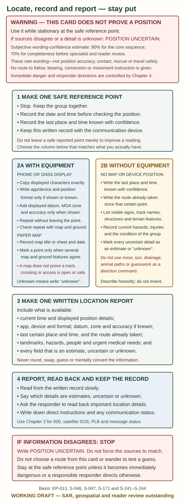
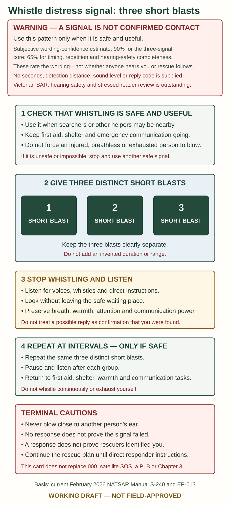

# Navigation and signalling

> **WARNING — SEARCH-AND-RESCUE REVIEW OUTSTANDING**
>
> **Evidence confidence: High for map-format and basic signalling principles; Moderate for interpreting terrain without practice.**
>
> Knowing which way is north is not the same as knowing a safe way out. Do not cross dangerous ground because a compass, phone or straight line points towards a destination.

## Locate yourself before planning movement

Keep still while checking a map. Find a named point you definitely recognised earlier, then compare the track, direction of travel and elapsed time with what is around you now.

Use several matching features. One bend in a creek or one hill shape can fit many places. If the map and ground disagree, label your position uncertain; do not force them to match.

A satellite position can be available without mobile coverage, but the map may be missing unless downloaded. A blank map behind a dot is not a usable route. Phone position, mobile calling and satellite SOS are different functions.

Write down coordinates exactly as displayed and provide the format to rescuers. See [Emergency communication](03-emergency-communication.md). Do not round, swap or mentally convert numbers under pressure.

> **WARNING — WORKING LOCATION CARD, NOT A ROUTE OR POSITION GUARANTEE**
>
> **Evidence confidence: High for copying and reporting displayed information; Moderate for interpreting maps, satellite positions and terrain without practice.**
>
> **Estimated confidence in the accuracy of the wording: 90% for the core locate-record-report sequence; 70% for its completeness before Victorian search-and-rescue, geospatial and stressed-reader review.** These are subjective editorial estimates, not the odds that a position is correct, that a message connects or that travel is safe. Stay at the safe reference point while using the card. Do not round, swap, guess or convert location information. If the map, device and ground disagree, write **POSITION UNCERTAIN** and take the **STOP / NO–UNKNOWN** response. This card gives no route recommendation, route to follow, bearing or permission to move; [Stay or move](04-stay-or-move.md) controls that decision.

*IM-184. Original working location-record card based on EP-013, current Victorian mapping and emergency-location sources S-046, S-047, S-171 and S-241–S-244. It contains no coordinate example, conversion, route recommendation, route to follow, bearing, movement arrow or implied accuracy. It has not been approved by Victorian search and rescue, a geospatial specialist or stressed readers.*

**Sources:** [Victorian map access](https://www.land.vic.gov.au/maps-and-spatial/maps/how-to-access-a-map), S-241; GNSS and communications comparisons in EP-001/EP-013, S-043–S-047, S-244–S-245.

## Read what a paper map can actually tell you

**Scale** is the relationship between map and ground. On a 1:25,000 map, 1 cm represents 250 m horizontally. On a 1:50,000 map it represents 500 m. This is arithmetic, not a walking-time estimate.

**Contour lines** join points of equal height. The legend states the height interval. Closely spaced contours usually mean steeper ground; widely spaced ones usually mean gentler ground. A small-scale map can hide cliffs and obstacles.

Read the legend for tracks, roads, watercourses and boundaries. A mapped watercourse may be dry. A mapped track may be closed, overgrown or impassable. Check the edition date and current closures before relying on access.

**Sources:** [Geoscience Australia map guide](https://www.ga.gov.au/image_cache/GA7194.pdf) and Victorian map guidance above; S-241–S-243. Examples explain map reading, not a proposed route.

## Use a compass as a check, not an escape instruction

Hold the compass level and away from the vehicle, phone, knife and other metal or magnetic objects. Allow the needle to settle. Compare the direction you expected with the map and known features.

**Magnetic north, map grid north and true north are different.** Victorian map sheets and compass models require the correct local adjustment. Do not apply a statewide “add this many degrees” shortcut or mix a pre-adjusted compass with a second correction.

If you have never practised setting and following a bearing, the immediate task is to communicate your position and avoid wandering, not learn cross-country navigation in an emergency.

**Sources:** [Victorian grid and magnetic information](https://www.land.vic.gov.au/maps-and-spatial/maps/how-to-access-a-map/map-grids-and-magnetic-information), Geoscience Australia S-243 and exact compass manuals S-259.

## Make your waiting place easier to find

Use contrast: a bright cloth or signal panel against a different-coloured background. Place it where it can be seen from above or an approach route **without leaving a safe site or giving up essential warmth**.

Secure it so it does not blow away. Keep the visible signal near the actual shelter and report any difference between your signal and your position. A small item hidden under foliage may be invisible from the air.

Do not cut down trees to make a clearing, climb a tree to hang a signal or build a signal fire. These add hazards without guaranteeing detection.

## Use sound and light

> **WARNING — WORKING DISTRESS-SIGNAL CARD, NOT CONFIRMED CONTACT**
>
> **Evidence confidence: High for the three-short-blast distress core; Moderate for timing, repetition and hearing-safety completeness.**
>
> **Estimated confidence in the accuracy of the wording: 90% for the three-signal core; 65% for the completeness of the unreviewed timing, repetition and hearing-safety wording.** These are subjective editorial estimates, not the odds that anyone will hear the signal or that rescue will follow. The current Australian and Victorian sources do not agree on an exact blast duration, so the card gives no seconds. It gives no distance or reply code. Do not exhaust an injured or breathless person, blow near another person's ear, or delay first aid, shelter, 000, satellite SOS or PLB use. A sound, light or aircraft response is not proof that rescuers have identified you; continue the rescue plan until a responsible responder gives direct instructions.

*IM-185. Original working audible-signal card based on the February 2026 National Search and Rescue Manual S-240 and the Victorian cross-check S-245. It deliberately supplies no seconds, distance, reply code, product claim or guarantee of contact. Victorian search-and-rescue, hearing-safety and stressed-reader review remain outstanding.*

If searchers may be nearby, give **three short whistle blasts**, pause to listen and repeat. A whistle usually costs less effort than continued shouting. Shout to answer a nearby voice, but do not exhaust yourself calling continuously.

At night, repeated light flashes can attract attention. The recognised SOS rhythm is **three short, three long, three short**. Keep enough battery for care and shelter tasks. A light flash or whistle is not proof that it was seen or heard.

A purpose-made signal mirror can help in sunlight. Use its aiming instructions. Do not look directly into the sun, and do not replace it with a laser pointed at an aircraft.

**Sources:** Australian SAR manual S-240, [NPS emergency plan](https://www.nps.gov/articles/gtgemergencyplan.htm), [Bushwalking Victoria lost-person guidance](https://bushwalkingmanual.org.au/emergencies/lost/). These support the signalling principle, not a detection range or guaranteed response.

## Layer signals at the safe waiting place

> **WARNING — WORKING LAYERED-SIGNALLING CARD, NOT A DETECTION GUARANTEE**
>
> **Evidence confidence: High for the five separate basic signalling principles; Moderate for the completeness of this combined field card.**
>
> **Estimated confidence in the accuracy of the wording: 90% that the five signal categories and principal cautions match the cited sources; 60% that this unreviewed combination and layout is complete.** These are subjective editorial estimates, not probabilities of detection, contact, rescue, safety or survival. The five modes are a project grouping, not an authority-issued sequence or technically independent system. Use more than one safe mode when possible, but do not delay urgent care or move merely to add one. Keep people, shelter and signals at or beside the safe reported waiting place. Do not surrender essential protection or treat a possible response as proof that you were found.

*IM-206. Original working product-neutral synthesis based on Victoria Police S-021, AMSA beacon guidance S-172, the February 2026 National Search and Rescue Manual S-240 and cross-checks S-056/S-245. No authority publishes this exact combined card. It gives no movement permission, detection range, signal size, shape or colour, ground-air-symbol construction, beacon deployment or mirror-aiming lesson, light runtime, generic strobe/night-vision assurance, exact blast seconds, reply code, fire, smoke, flare, pyrotechnic or laser method. Victorian land/aviation search-and-rescue, hearing-safety, electrical/product, environmental, controlled-visibility, complete-card, detached-panel, practical and stressed-reader review remain outstanding.*

## When rescuers approach

Stay visible and follow their directions. Do not run after an aircraft or approach a helicopter until crew explicitly instructs you. Secure loose items before rotor wash reaches them if this can be done without leaving safety. Do not try to create a landing pad or direct a landing with improvised signals.

When ground rescuers reach you, give the last condition changes, care already provided and medicines/times. Tell them about anyone separated from the group.

**Review record:** [EP-013](../../research/evidence-packets/EP-013-navigation-and-non-fire-signalling.md), EP-009 and S-240. Current Victorian mapping and emergency-location sources supporting IM-184, and the February 2026 National Search and Rescue Manual plus Victorian sources supporting IM-185/IM-206, were checked again 30 September 2026. No practical navigation, position-reporting, hearing-safety, signal-visibility, complete-card, detached-panel or stressed-reader test has been performed.
