# Plants and natural materials

> **WARNING — PLANT AND TECHNIQUE REVIEW OUTSTANDING**
>
> **Evidence confidence:** High for the cited descriptions and exact food-composition samples; Moderate as a learning reference; **Insufficient to identify a specimen in front of you.** No botanist or food-safety specialist has approved these pages.
>
> **Wording confidence: 84% (subjective).** This rates the warning against the cited evidence—not identity, safety, success or survival.

## Do this now

1. Deal with [urgent care](06-first-aid-and-evacuation.md), [getting help](03-emergency-communication.md), [cold, heat and rain](05-temperature-and-shelter.md), and [water](07-water.md) before food.
2. Use carried food first. It is safer, easier to ration and usually gives far more useful energy than leaves or a few berries.
3. **Do not identify or trial a plant for the first time while stranded.** A similar photograph, smell, animal feeding, skin rub, lip test, tiny taste or cooking is not a safety test.
4. Use a wild plant only if you learned that exact species before the emergency and every feature, usable part, preparation step, place and stop rule still agrees.
5. Do not eat plants beside roads or sprayed tracks, drains, mine or industrial land, flood contamination, treated grounds or anywhere chemical history is unknown. Rinsing does not remove that uncertainty.
6. After possible poisoning, call **13 11 26**. Call **000** first for collapse, abnormal breathing or serious symptoms. Do not induce vomiting.

> **ORDINARY COLLECTION RULE — PICKING MAY BE ILLEGAL**
>
> Victorian parks, State forests and protected flora have collection controls. For planned learning and ordinary food gathering, use cultivated plants or a place where both owner and land manager permit collection. Do not take from a threatened population or culturally sensitive place.
>
> If someone instead faces an immediate risk of death or really serious injury, use the book-wide [life-first emergency test](01-how-to-use-this-guide.md#when-a-rule-conflicts-with-saving-a-life). This is not blanket permission, and it does not identify an unknown plant, make a contaminated plant safe, supply missing preparation steps or justify a slow food search when rescue, warmth, shelter or water can address the danger sooner.
>
> **Evidence confidence: High** for the linked ordinary Victorian rules and the statutory emergency test; **Moderate** for this condensed field distinction. **Wording confidence: 94% (subjective).**

Current checks: [National Parks Regulations 2024](https://www.legislation.vic.gov.au/in-force/statutory-rules/national-parks-regulations-2024/001), [regulation 41](https://classic.austlii.edu.au/au/legis/vic/num_reg/npr2024n76o2024349/s41.html), [forest-produce licences](https://www.vic.gov.au/forest-produce-licence) and [protected flora](https://www.environment.vic.gov.au/conserving-threatened-species/protected-flora-and-listed-fish), checked 7 September 2026.

## Only if you learned the plant before the emergency

Inspect **one connected plant**. Stop at one contradiction.

1. Follow the proposed food to its own stem; nearby plants may be tangled through it.
2. Match the whole plant, size, growth form, stem or bark.
3. Match a complete leaf: arrangement, edge, top and underside.
4. Match flowers and fruit when the entry requires them. Measure features; an unscaled photograph cannot supply size.
5. Match the habitat, part of Victoria and season.
6. Check every lookalike and stop condition in the entry.

Expected taste is only a final spoilage warning **after positive identification**. It never identifies a plant. The full six-step gate is an original organising aid based on the cited botanical and [Poisons first-aid](https://www.poisonsinfo.nsw.gov.au/first-aid) sources; it is not a botanical key.

## Light-use material cards

Use carried cord, straps, bottles, shelter and sleeping gear first. Unknown bark, sap, resin or hollow stems may irritate, poison or contaminate. Do not strip living plants or damage essential clothing to experiment.

| Need | Use first | Stop if |
|---|---|---|
| Fastening | Spare cord or strap | It frays, slips, cuts or would carry a person/overhead load |
| Ground insulation | Mat, folded spare clothing or an emptied pack | Hard objects remain or the layer is crushed flat |
| Rain barrier | Tarp, rainwear or carried sheet | Water drains into bedding or the face/air space is covered |
| Drinking-water storage | Intact food-grade bottle reserved for clean water | Previous contents are unknown, it leaks, or the opening cannot stay clean |
| Small prop or handle | Sound material already available | Cracks, rot, hidden sharp points or any person-bearing use |

A cooking pot is not automatically clean-water storage. Follow the clean/untreated separation in [Water](07-water.md). Use carried fuel. For ordinary collection, take no firewood unless the current rule for the exact site permits it. A separate immediate threat to human life uses the [Fire](08-fire.md) life-first rule; it does not make unknown material safe fuel. [Parks Victoria firewood guidance](https://www.parks.vic.gov.au/things-to-do/Using-firewood).

> **WARNING — NON-CRITICAL LOADS ONLY**
>
> **Evidence confidence:** High for the knot and braid forms; Moderate for any improvised material. **Wording confidence: 84% (subjective).** Never use these for a person's weight, climbing, rescue, towing, a main shelter support or anything overhead.

### Three-strand braid

1. Align three flexible strands and tie their starting ends together.
2. Hold the knot. Separate the strands into left, middle and right.
3. Cross **left over middle**, then **right over the new middle**.
4. Repeat, keeping even tension. Tie the finish before letting go.
5. Test only on a small bundle close to the ground. Reject splitting, slipping or opening; recheck after wetting or drying.

### Join two cords with a sheet bend

1. Fold the thicker cord end into a U.
2. Pass the thinner cord up through the U, behind both arms, then under its own crossed section.
3. Keep both short ends on the same side and leave visible tails.
4. Pull the long parts to snug the knot. Reject it if a tail creeps or the shape changes; recheck after load or wetting.

If you cannot recognise the finished knot, use a familiar fastening instead. Detailed evidence and limitations appear after the plant atlas.

---

## Reference boundary — not an emergency identification key

Everything below is for **learning before travel** or recognising hazards. Each plant keeps its own status, diagnostic features, photographs, lookalikes, Country-specific attribution, preparation boundary and warning. A `CONDITIONAL FOOD` label still means the plant must already be known; every other status means **do not eat from this guide**.

## Reference — read food-value numbers honestly

Australian labels usually use kilojoules (kJ). A food Calorie is a kilocalorie (kcal). For a rough conversion:

**kcal = kJ ÷ 4.2**

If a value is given per 100 g and the edible portion was actually weighed:

**portion kJ = kJ per 100 g × edible grams ÷ 100**

Do not turn “one handful”, “one cup” or a photograph into grams. Hand size, packing, water content, fruit size and discarded parts make that arithmetic unreliable. Fresh and dried values are not interchangeable. Boiling and draining can change both weight and nutrients.

| Food in this chapter | Best usable energy evidence | What that means in practice |
|---|---|---|
| Native raspberry fruit | No species-specific kJ or kcal value located | Sparse, small fruit: snack only; do not budget energy from it |
| Native pigface ripe inner fruit | No food-energy value located; one Warrnambool study found fresh fruit about 84–85% water | Supplemental food only; not a substitute for safe drinking water |
| Warrigal greens | Australian government card: 61 kJ per 100 g, preparation state not stated. US dataset: 59 kJ (14 kcal) raw and 51 kJ (12 kcal) boiled and drained per 100 g | Very low-energy vegetable. Even 250 g of the required boiled-and-drained form at 51 kJ per 100 g is only about 128 kJ or 30 kcal; that is arithmetic, not a suggested portion |
| Fresh muntries | One 2025 Victorian lab sample: about 299 kJ (71 kcal) per 100 g including its natural water | A useful supplement if a lawful, correctly identified crop is genuinely available. A weighed 250 g at that sample value is about 748 kJ or 178 kcal; availability is not promised |
| Cherry ballart fleshy stalk | No species-specific food-energy or realistic portion value located | Too little to count as food |
| Ruby saltbush fruit | No defensible fresh-fruit energy value located; an older composition table records energy as “not determined” | Tiny fruit and no energy result: flavour supplement only |
| Native currant fruit | No defensible species-specific energy value located | Small fruit with large seeds: refreshment only; do not budget calories from it |
| Lilly pilly fruit | An older Australian table gives 89 kJ (about 21 kcal) per 100 g for raw *Syzygium smithii* fruit | Very low energy. The old sample count, origin and Victorian relevance are not stated |
| European blackberry fruit | Current FSANZ data for raw commercial blackberry: 192 kJ (about 46 kcal) per 100 g, including fibre | A useful scale comparison, not a measurement of a Victorian wild thicket. Public-land spray risk usually rules it out |
| Cranberry-heath fruit | No species-specific energy value, edible-pulp weight or safe serving was located | Tiny fruit, mostly hard stone: recognition and cultural context only in this edition |
| River-mint leaf | No defensible fresh-leaf energy or safe serving was located | Flavouring rather than survival calories; no eating, tea, oil or extract instruction in this edition |
| Sweet-quandong fruit flesh | Current FSANZ data: 213 kJ (about 51 kcal) per 100 g for commercially supplied frozen flesh with kernels removed | A useful supplement only where the uncommon tree is already known. Thin flesh and an excluded kernel make whole-fruit weight misleading |
| Bower spinach | No defensible species-specific energy, safe serving or field-preparation value located | Comparison with Warrigal greens only; do not eat from this page |
| Kangaroo apples — *Solanum aviculare* and *S. laciniatum* | No food-energy figure is used because this edition gives no eating clearance or safe serving | Hazard-recognition only. Do not taste either species |
| Cumbungi — *Typha* spp. | An old table reports 277 kJ (about 66 kcal) per 100 g for one raw, peeled *T. orientalis* rhizome sample of unknown place and season | Historical scale only. It is not a safe serving, cooked-food result, field yield or instruction to identify or dig cumbungi |
| Water-ribbons — *Cycnogeton* spp. | An old table reports 297 kJ (about 71 kcal) per 100 g for a root sample under the former broad name *Triglochin procera* | The name was later split into several species. The number cannot be assigned confidently to a found plant, a safe serving or realistic field return |
| Beaded glasswort or samphire — *Salicornia quinqueflora* | No defensible energy value for fresh Victorian material was found | Recognition only. Similar species, invisible metal contamination, threatened taxa and saltmarsh damage prevent a wild-food instruction |
| Bulbine lily — *Bulbine bulbosa* | An old table reports 251 kJ (about 60 kcal) per 100 g for one raw bulb sample | Historical scale only. The result does not establish identity, safe preparation, cooked yield, serving or the cost of destructive harvest |
| Common nardoo — *Marsilea drummondii* | No field-usable value or safe serving is supplied | Thiaminase can destroy vitamin B1. Calories cannot make an incomplete detoxification method safe |
| Nitre-bush — *Nitraria billardierei* | No defensible fresh-fruit energy value was found | Education only until a complete plate and food-safety review separate ripe flesh from the stone, other parts and African boxthorn |
| Common apple-berry fruit | No species-specific fresh-fruit energy, edible-pulp yield or safe serving was located | A small, seed-filled fruit with no usable energy figure. Recognition and cultural context only in this edition |
| Kangaroo-grass grain | No published number could be transferred safely to a wild Victorian field serving. One modern native-grain study deliberately hid the species-to-result mapping, and its kangaroo-grass sample was a composite because so little seed was available | Do not budget energy from wild seed. The grain is culturally important, but scattered ripening, rapid seed fall, processing work and low yield make it a poor emergency return |
| Coast beard-heath fruit | One Victorian study reports dry-basis nutrients from about 300 g collected from one plant in 2017, but no fresh edible-flesh kJ or kcal value | The fruit is about 5 mm wide and mostly hard stone. It may offer taste, not dependable calories; this edition gives no harvest or eating instruction |
| White elderberry mature pale fruit | No species-specific fresh-food kJ or kcal value, edible-pulp yield or safe serving was located | Small fruit with no usable energy figure. The page records food history but gives no eating instruction |
| Rounded noon-flower leaves | One overseas cultivated *D. crassifolium* sample reported about 34 kJ (8.1 kcal) per 100 g fresh leaf | Indirect scale only. Even if Victorian material were similar, this is a very low-energy salty green, not drinking water or a dependable ration |
| Old-man saltbush leaves | One refrigerated commercial Australian sample reported 111 kJ (about 26.5 kcal) per 100 g fresh leaf | Commercial-sample scale only. Wild chemistry, subspecies, site, safe serving and preparation are unresolved; no wild eating instruction |
| Seaberry saltbush ripe fruit | A Victorian study measured dry-basis composition but did not supply a validated fresh edible-flesh kJ or kcal value | Tiny bitter fruit with unknown safe serving and field yield. Recognition and cultural context only |
| Chocolate-lily tubers | One Victorian study measured moisture and dry-basis nutrients, but no validated fresh-food energy or safe field serving follows | Do not invent a fresh calorie figure from dry-basis results. Digging is destructive and the page gives no eating instruction |
| Pale vanilla-lily root | An old table reports 124 kJ (about 30 kcal) per 100 g raw root, with specimen and preparation details unresolved | Historical scale only. Low energy, destructive harvest, lookalikes and missing safe preparation make this a non-harvest page |
| Murnong and wild wattle seed | Cultural importance or high dry-seed energy does not supply a safe novice harvest method | Do not count them as accessible field calories in this edition |

For scale only, Australian food labels use **8700 kJ** as an average-adult daily reference and warn that individual needs can be higher or lower. It is not a survival target. At the sample values above, a weighed 250 g of boiled-and-drained Warrigal greens would be about **1.5%** of that label reference; 250 g of the analysed muntries about **9%**; 250 g at the old lilly-pilly value about **2.6%**; 250 g at the commercial-blackberry value about **5.5%**; and 250 g of the exact commercial quandong-flesh form about **6.1%**. Those are arithmetic examples, not realistic field portions or eating advice. Cold, heat, work, body size, age, health, injury and how long rescue takes all change real needs. The comparison simply shows why these foods do not replace carried rations. [Current in-force Standard 1.2.8, section 1.2.8—8](https://www.legislation.gov.au/F2015L00395/latest/text).

The muntries result came from fruit donated by a Victorian grower and frozen at harvest. It does not establish the value of every wild fruit. An older **998 kJ per 100 g muntries** figure is for dry material and must not be shown as fresh fruit. For Warrigal greens, the Australian and US numbers are broadly similar, but they are not directly comparable because the Australian card does not state the preparation. The old lilly-pilly result and the current commercial-blackberry result have their own sample limits, explained in the entries below. Current FSANZ quandong energy is calculated from the nutrients in commercially supplied, frozen, kernel-removed flesh; an older table's **335 kJ per 100 g** average of four raw-fruit samples is not averaged with it or silently substituted. Plant variety, site, ripeness, edible-part trimming, storage and analysis can all change results. [Australian nutrition cards](https://www.agriculture.gov.au/sites/default/files/documents/iyfv-nutrition-cards.pdf), [USDA vegetable report](https://www.ars.usda.gov/ARSUserFiles/80400535/Data/SR/SR28/reports/sr28fg11.pdf), [2025 muntries study](https://doi.org/10.1016/j.jfoodeng.2025.112526), [older dry-weight muntries report](https://irp-cdn.multiscreensite.com/4c3353cf/files/uploaded/Muntries.pdf), [1993 Australian Aboriginal-food tables reproduced by Kidney Health Australia](https://kidney.org.au/wp-content/uploads/2025/11/KHA-First-Nations-booklet-Bush-tucker-and-kidney-disease.pdf), [FSANZ raw-blackberry record](https://www.foodstandards.gov.au/science-data/food-nutrient-databases/afcd/search/food/F001267) and [FSANZ quandong record](https://www.foodstandards.gov.au/science-data/food-nutrient-databases/afcd/search/food/F007571).

## Native raspberry — Rubus parvifolius

**Status — CONDITIONAL FOOD:** Use only after the species, ripe fruit, lawful site and contamination status have already been confirmed. This page is not a first-time emergency identification key.

> **WARNING — CONFIRMED PLANT ONLY**
>
> **Evidence confidence: High that multiple sources document people eating the ripe fruit of this species; Moderate for this personal-use preparation summary; Insufficient for identifying your specimen.** The photographed specimens and this final page have not been independently authenticated. Do not eat fruit from an uncertain plant.
>
> **Wording confidence: 82% (subjective).** This rates this warning against the cited sources—not identity, safety, technique success or survival.

Also called small-leaf bramble. This is a low, scrambling, prickly plant, not a tree bearing smooth red berries.

### Features to check together

- Slender trailing or scrambling stems, often around a metre long, with curved prickles.
- A leaf divided into **three or five leaflets**. Individual leaflets are usually about **1–4 cm long**.
- Leaflet tops green and wrinkled, edges distinctly toothed; undersides whitish and hairy.
- Small pink or red flowers.
- A rounded fruit about **1 cm across**, made of separate fleshy beads. Mature fruit can be red or orange and comes away from its central support when ripe.

**Habitat and Victoria:** widespread through cooler parts of the state, from near sea level to the subalps, in forest, woodland and scrub, sometimes amongst rocks. It is not a promised food supply in every region.

**Season:** VicFlora gives flowering mainly November–February; Yarra Ranges gives October–December and fruit December–April. These are regional guides, not conflicting dates to average into a guarantee. Look for the actual fruit stage.

**Botanical checks:** [VicFlora](https://vicflora.rbg.vic.gov.au/flora/taxon/bc19413d-6b07-4c94-84ee-4b5fef7e2f98), [NSW PlantNET](https://plantnet.rbgsyd.nsw.gov.au/cgi-bin/NSWfl.pl?lvl=sp&name=Rubus~parvifolius&page=nswfl) and [Yarra Ranges](https://www.yarraranges.vic.gov.au/PlantDirectory/Climbers-Creepers/Rubus-parvifolius). Neither flora alone establishes food safety.

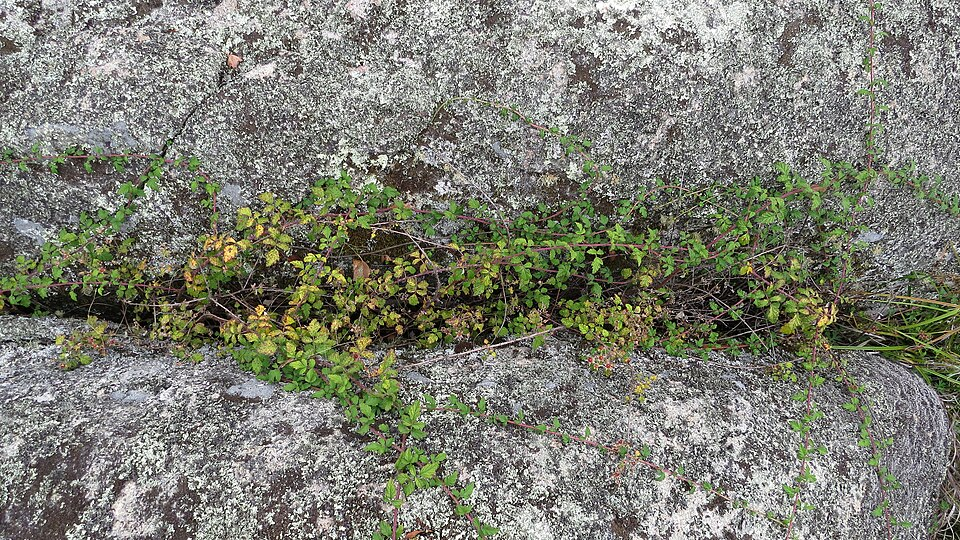

*Photo: John Tann, New South Wales, [CC BY 2.0](https://creativecommons.org/licenses/by/2.0/); Wikimedia 960-pixel resize, otherwise unchanged. [Original and attribution](https://commons.wikimedia.org/wiki/File:Rubus_parvifolius_(13854550343).jpg). Do not identify from this distant view.*

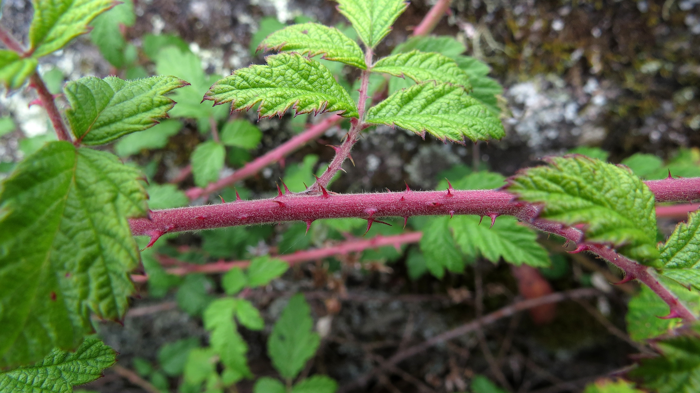

*Photo: John Tann, New South Wales, [CC BY 2.0](https://creativecommons.org/licenses/by/2.0/); unchanged. [Original and attribution](https://commons.wikimedia.org/wiki/File:Rubus_parvifolius_stem_(13854496483).jpg). Pale leaf undersides, flowers and fruit are absent.*

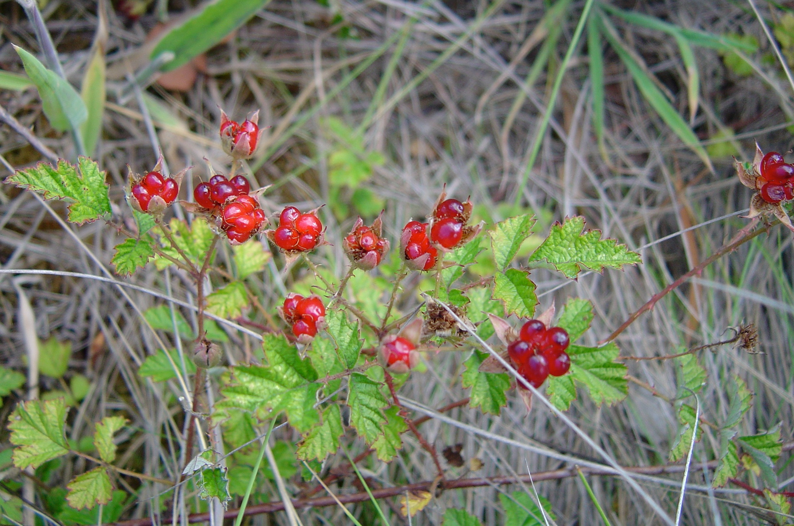

*Photo: Nadiatalent, Nowa Nowa, Victoria, public-domain dedication; unchanged. [Original and rights](https://commons.wikimedia.org/wiki/File:Rubus_parvifolius_fruit.jpg). This photograph does not show every feature needed for identification.*

### Fruit use and preparation

For correctly identified native raspberry from a permitted, uncontaminated source:

1. Select ripe fruit still associated with the identified plant. Leave mouldy, damaged or contaminated fruit.
2. Pick without dragging your hand along the prickly stem. Keep the fruit separate from unknown plants.
3. Remove attached stalk or leafy pieces and rinse with drinking-quality water.
4. Eat the fruit fresh. This entry does not recommend the leaves, roots, an herbal tea or a medicinal preparation.

**Expected taste:** an Australian National Botanic Gardens plant profile describes the separate fruit beads as juicy. No controlled sweetness or acidity data were located. Ripeness and site can change the result. An unexpectedly unpleasant taste is a reason to spit it out and stop, not proof of a different safe species.

**Food value:** no measured species-specific energy value was located. An older botanical table reports an average fruit mass of about **0.285 g**, and an ANBG account says fruit can be sparse. That small study value does not predict your plant or convert into calories. Treat the fruit as a supplemental snack, not a ration. Do not substitute the nutrition value of cultivated European raspberry. No serving size or allergy-free claim has been established.

**Food-use checks:** [Yarra Ranges](https://www.yarraranges.vic.gov.au/PlantDirectory/Climbers-Creepers/Rubus-parvifolius), [The Hills Shire Council](https://www.thehills.nsw.gov.au/News-and-Publications/Plant-of-the-Month-December), [ANBG Aboriginal Plant Use](https://www.anbg.gov.au/aborig.s.e.aust/rubus-parvifolius.html), [ANBG plant profile](https://www.anbg.gov.au/apu/plants/rubuparv.html) and the [Cunninghamia seed-biology table](https://www.botanicgardens.org.au/sites/default/files/2023-06/Volume-6%284%29-2000-Cun6Ben1016-1202.pdf). The ANBG words are favourable descriptions, not measured taste results. Cleaning and contamination precautions are general food-handling measures, not a detoxification treatment.

### Lookalikes and stop conditions

Other brambles, introduced blackberries and hybrids can confuse identification. VicFlora and PlantNET both record hybridisation with another native Rubus. Do not convert this entry into “every red berry is edible” or “anything prickly is safe”.

If the fruit is a single smooth berry, the leaves do not match, you cannot see their pale hairy underside, or the fruiting stem cannot be traced confidently, stop. The three photographs are not a complete comparison with poisonous red-fruited plants. A flower view, measured leaf-underside view and expert-checked lookalike panel are still needed.

**Coranderrk cultural record:** Wandoon Estate Aboriginal Corporation's *Plants of Coranderrk* project records **Eepaeep** for *Rubus parvifolius* and marks it as a food plant. The brochure says its Woiwurrung names were checked with a current custodian and language expert. This exact Coranderrk record is not presented as a statewide name, and its food icon is not used to expand the preparation above. [Source brochure](https://nespurban.edu.au/wp-content/uploads/2020/10/Coranderrk-Plant-Brochure-pdf-002.pdf). **Entry:** SP-003; botanical, food-safety and cultural-scope review outstanding.

## Native pigface — Carpobrotus rossii

**Status — CONDITIONAL FOOD:** Use only after the exact species, ripe fruit, lawful site and contamination status have already been confirmed. The current photographs do not show ripe fruit.

> **WARNING — SPECIES AND RIPENESS MUST ALREADY BE KNOWN**
>
> **Evidence confidence: High that multiple sources document people eating the specified ripe inner fruit; Moderate for this preparation summary; Insufficient for novice identification from the two incomplete images.** Neither picture shows demonstrably ripe fruit or a complete lookalike comparison. Use this as a reminder after learning the plant, not as permission to identify a new food during an emergency.
>
> **Wording confidence: 81% (subjective).** This rates this warning against the cited sources—not identity, safety, technique success or survival.

The name “pigface” is shared by several plants; the common name alone is not an identification. This edition does not assign a Traditional Owner name because the available sources do not establish one authorised Victorian group-by-group attribution.

### Features and location

This spreading succulent forms low growth on coastal dunes and cliffs. Its thick, fleshy leaves are triangular in cross-section, commonly **3.5–10 cm long**, and tend to curve inward near the tip. Flowers have many narrow pink-purple parts, often paler near the centre. The fleshy fruit is roughly rounded to oval, around **1.5–2.5 cm long** in VicFlora's description.

VicFlora places it commonly along the Victorian coast and notes doubtful origin for some inland records. Do not apply this entry to every inland succulent. Flowering can occur through much of the year; fruit availability must be checked on the plant.

**Identity/distribution:** [VicFlora](https://vicflora.rbg.vic.gov.au/flora/taxon/c01a1b80-5d85-460c-ab13-094247ad1ca4). Its indexed full description was available during this check although direct page retrieval failed. The South Australian identification resource and Victorian nursery references provide separate context.

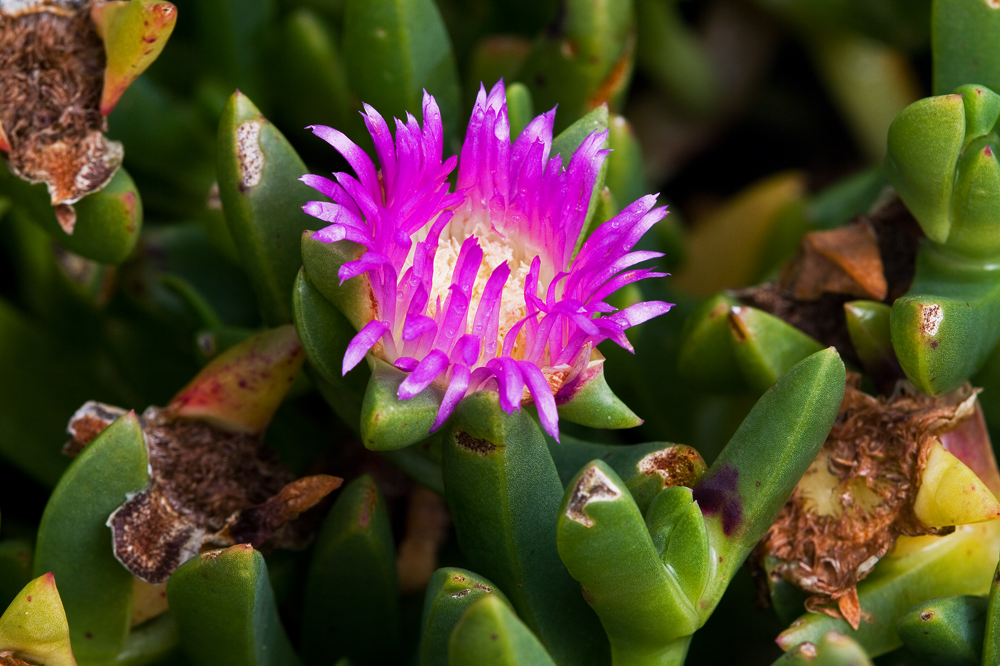

*Photo: JJ Harrison, Cape Raoul, Tasmania; unchanged, [CC BY-SA 3.0](https://creativecommons.org/licenses/by-sa/3.0/). [Original and attribution](https://commons.wikimedia.org/wiki/File:Carpobrotus_rossii.jpg). The species label is the photographer's; a botanist has not authenticated this final panel.*

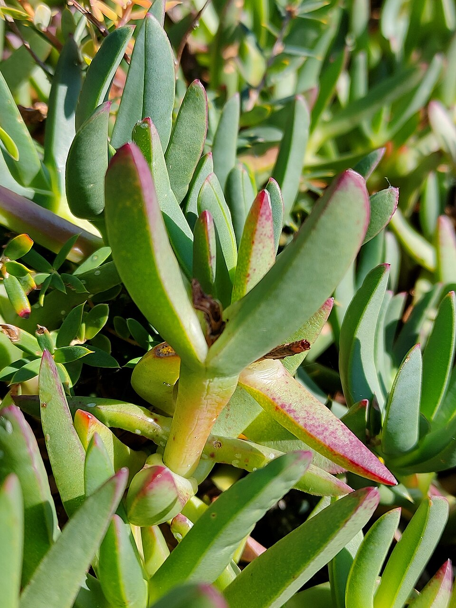

*Photo: Tony van Kampen, Tasmania, [CC BY 4.0](https://creativecommons.org/licenses/by/4.0/); Wikimedia 960-pixel resize, otherwise unchanged. [Original and attribution](https://commons.wikimedia.org/wiki/File:Carpobrotus_rossii_199860302.jpg). A cut cross-section and lookalike comparison are absent.*

### Ripe fruit: usable part and preparation

For confirmed **Carpobrotus rossii**, gathered lawfully from an uncontaminated site:

1. Select intact ripe fruit; the sources describe a red to pinkish-red stage. Colour alone does not establish either species or ripeness.
2. Rinse off sand and dirt with drinking-quality water.
3. Open the tough outer skin with clean fingers and squeeze out the soft inner flesh. Eat the inner fruit flesh, leaving the skin.
4. Discard spoiled or contaminated fruit. Do not transfer this procedure to an unknown succulent.

**Expected taste:** one horticultural source describes ripe *C. rossii* fruit as salty-sweet, but that description was not independently corroborated. Treat it only as a variable expectation after identification, never as an identity test. This entry does not recommend eating the leaves.

**Food value:** a study of fruit collected near Warrnambool found roughly 84–85% water in the fresh fruit but did not publish food energy. Its protein, carbohydrate, fat and fibre results were reported on a dry basis and must not be copied as fresh-food percentages. Treat the small inner portion as supplemental food, not a calorie or water ration.

This entry deliberately covers the ripe fruit, not leaf consumption, drinking extracted sap or treating wounds. It gives no guaranteed calorie yield or serving size.

**Food/preparation checks:** [Nature Glenelg Trust's Portland garden](https://natureglenelg.org.au/current-projects/community-nursery-project/indigenous-display-gardens/portland-native-plant-display-garden/), [Bili Nursery and Landcare](https://westgatebiodiversity.org.au/carpobrotus-rossii-native-pigface/), horticulturist Karen Sutherland's [ABC Organic Gardener article](https://www.organicgardener.com.au/edible-succulents/), and [Njume and colleagues' fruit study](https://doi.org/10.1111/ijfs.14400). The paper reports collection with help from elders of the Martang Djab Wurrung community. Its ethics statement separately says the Warrnambool collections followed the blessing of Indigenous Elders. Neither statement is this project's permission or current cultural authority. The [Natural Resources South East cards](https://cdn.environment.sa.gov.au/landscape/docs/lc/aboriginal-bush-foods-identification-cards-gen.pdf) present their material as Bunganditj knowledge, acknowledge Neville Bonney and Des Hartman, and warn against eating without experienced instruction. We have not copied their pictures, language names or medicinal claims.

### Lookalikes, hybrids and exclusions

Other Carpobrotus species and hybrids can look very similar. Round-leaved Disphyma is also called pigface. A pink flower and a succulent leaf do not settle which one you have.

Do not transfer this entry to **Carpobrotus aff. rossii (N.W. Victoria)**. VicFlora treats that as a separate, critically endangered taxon of uncertain affinity. It is not a permitted gathering substitute. [Separate taxon record](https://vicflora.rbg.vic.gov.au/flora/taxon/d5d1c6a0-3c30-4fce-ba6c-d69033a1dc02).

A complete comparison of these plants, and photographs of demonstrably ripe fruit and the whole mat, remain required. **Entry:** SP-004; conditional working prose only, no independent approval.

## Warrigal greens — Tetragonia tetragonoides

**Status — CONDITIONAL FOOD:** Learn the species and this exact boil-drain-discard process before travel; do not identify or trial it for the first time while stranded.

Also called New Zealand spinach. The accepted Victorian spelling is **tetragonoides**. Some other databases and older sources spell it *tetragonioides*; a spelling match is not an identity check.

### Features to check together

- A low, sprawling plant with branches that can reach about 1 m.
- Thick, soft green leaves about **2–8 cm long and 1–5 cm wide**, broadly triangular or diamond-shaped, on short stalks.
- A finely dotted or slightly blistered-looking surface.
- Small green flowers where the leaf joins the stem. Victorian sources describe **five** flower-like segments; PlantNET records four or five. In this Victorian guide, finding four is a reason to stop and seek expert confirmation, not proof of another species.
- A hard or only slightly fleshy fruit about **1 cm** across, with four angles, wings or short horns.

**Habitat and Victoria:** occasional, mainly near the eastern Victorian coast, growing among rocks or on sandy or silty ground. It is not a statewide fallback. VicFlora records flowering through much of the year.

**Botanical checks:** [VicFlora](https://vicflora.rbg.vic.gov.au/flora/taxon/3aabdc16-7e9f-4c80-95ef-a903edee4ad0), an indexed copy of the now-decommissioned Victorian Resources Online species page, and [NSW PlantNET](https://plantnet.rbgsyd.nsw.gov.au/cgi-bin/NSWfl.pl?lvl=sp&name=Tetragonia~tetragonoides&page=nswfl). PlantNET warns that specimens now grouped under this name may actually include more than one distinct kind of plant. It also records *Tetragonia expansa*, the name used in the oxalate study below, as a synonym. These issues make expert review more important. The old Victorian page is retained only as a historical comparison; [Agriculture Victoria now says VRO was decommissioned in July 2025](https://agriculture.vic.gov.au/support-and-resources/resources/victorian-resources-online).

### Stop check before any preparation — compare bower spinach

> **WARNING — LEAVES ALONE ARE NOT ENOUGH**
>
> **Evidence confidence: High for the current VicFlora growth, flower and fruit descriptions; Moderate for the source-labelled photographs; Insufficient for first-time identification or eating clearance.** The views are not a matched specimen set. The Victorian bower-spinach fruit photograph is unmeasured, and its probable mature or near-mature stage is an editorial inference rather than an expert finding. No botanist or food-safety specialist has approved this comparison.
>
> **Wording confidence: 92% (subjective).** This rates this warning against the cited sources—not identity, safety, technique success or survival.
>
> **IM-202 photo-specific subjective wording estimates:** 99% that the licence and provenance were transcribed correctly; about 90% that the caption accurately reports the community record and visible attached fruit; and about 85% that “probable mature or near-mature stage” is a fair, deliberately qualified description of the visible red fruit. There is **0% evidentiary basis for any size inferred from the unscaled photograph**. These estimates rate documentation and caption wording, not the true identity or maturity of a plant, and never the chance that a field plant is safe to eat.
>
> Follow the **same plant** from its overall growth to flower attachment and mature fruit. If any stage is absent, hidden or inconsistent, stop. Do not taste it, eat it or prepare it. **Never transfer the Warrigal-greens boiling method to bower spinach.**

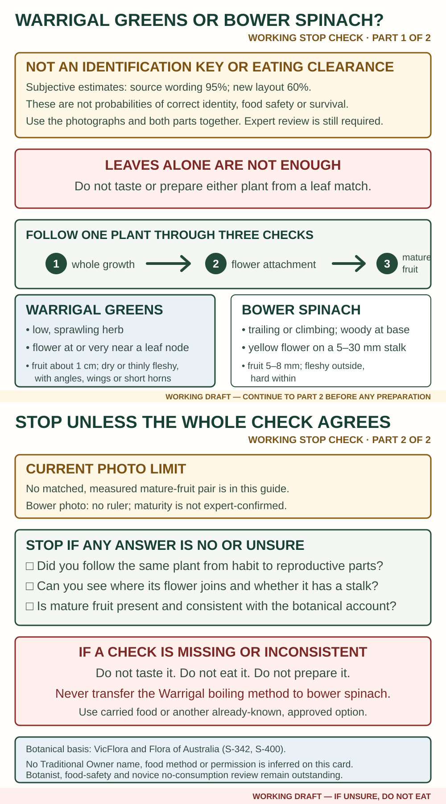

*IM-200. Original working stop-check card based on the current authoritative flora descriptions in S-342 and S-400. It contains no invented plant drawing and is not an identification key or eating clearance. Its 95% source-wording and 60% new-layout figures are subjective editorial estimates, not identity, food-safety or survival probabilities. Botanist, food-safety/toxicology, complete-card, detached-panel and novice no-consumption review remain outstanding.*

The card gives an order for looking. The photographs below supply the current evidence. Use them together; none is enough on its own.

| Feature | Bower spinach — *T. implexicoma* | Warrigal greens — *T. tetragonoides* |
|---|---|---|
| Overall growth | Low, trailing or sometimes climbing woody-based plant; branches can extend 3 m or more | Low sprawling herb; branches commonly reach about 1 m |
| Leaves | Semi-succulent, diamond-shaped to angular-oval, about 1.5–6 cm long; young growth can be hairy | Thick, soft, broadly triangular or diamond-shaped, about 2–8 cm long; finely dotted surface |
| Flowers | Usually yellow inside, strongly scented, on slender stalks about 5–30 mm long | Small green to yellow-green flowers sitting at or very near the point where the leaf joins the stem |
| Fruit | About 5–8 mm, fleshy outside and hard within; the Victorian photograph below shows attached red and yellow-orange fruit but has no ruler, and mature stage is not expert-confirmed | Becomes dry or only slightly fleshy, about 1 cm across, with prominent angles, wings or short horns |

These are orientation features, not a short key. Victorian bower spinach varies geographically, and PlantNET warns that plants grouped as Warrigal greens may include more than one kind. A measurement in text cannot be estimated reliably from an unscaled photograph.

#### 1. Compare the whole growth

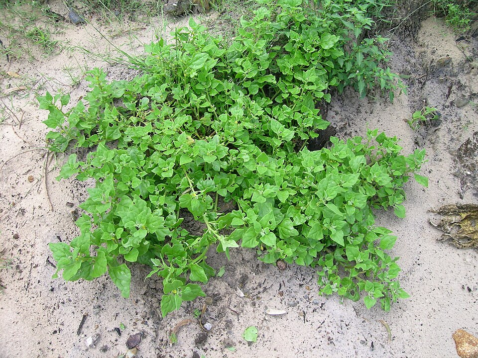

*Photo: Harry Rose / Macleay Grass Man, [CC BY 2.0](https://creativecommons.org/licenses/by/2.0/); Wikimedia 960-pixel resize, otherwise unchanged. [Original and attribution](https://commons.wikimedia.org/wiki/File:Tetragonia_tetragonioides_plant1_-_Flickr_-_Macleay_Grass_Man.jpg). Capture location is not recorded; fine diagnostic parts are not visible.*

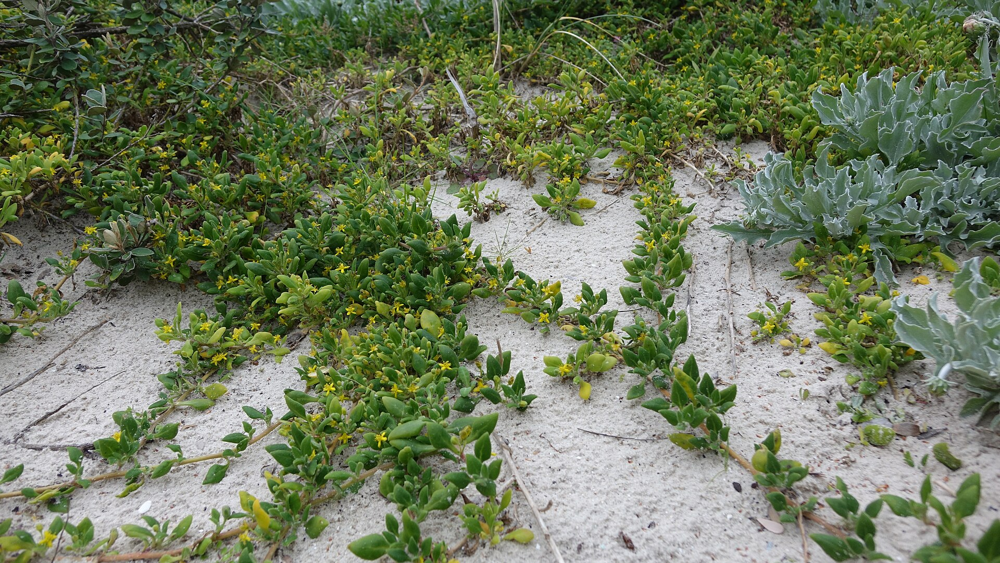

*Photo: Neb.st, 7 August 2020; place not supplied; Wikimedia display derivative, otherwise unchanged; [CC BY-SA 4.0](https://creativecommons.org/licenses/by-sa/4.0/). [Original and attribution](https://commons.wikimedia.org/wiki/File:Tetragonia_implexicoma_habit.jpg). The reproductive parts are too small to identify, several other plants occur in the frame, and no fruit or scale is shown.*

#### Leaf view — useful, but never decisive

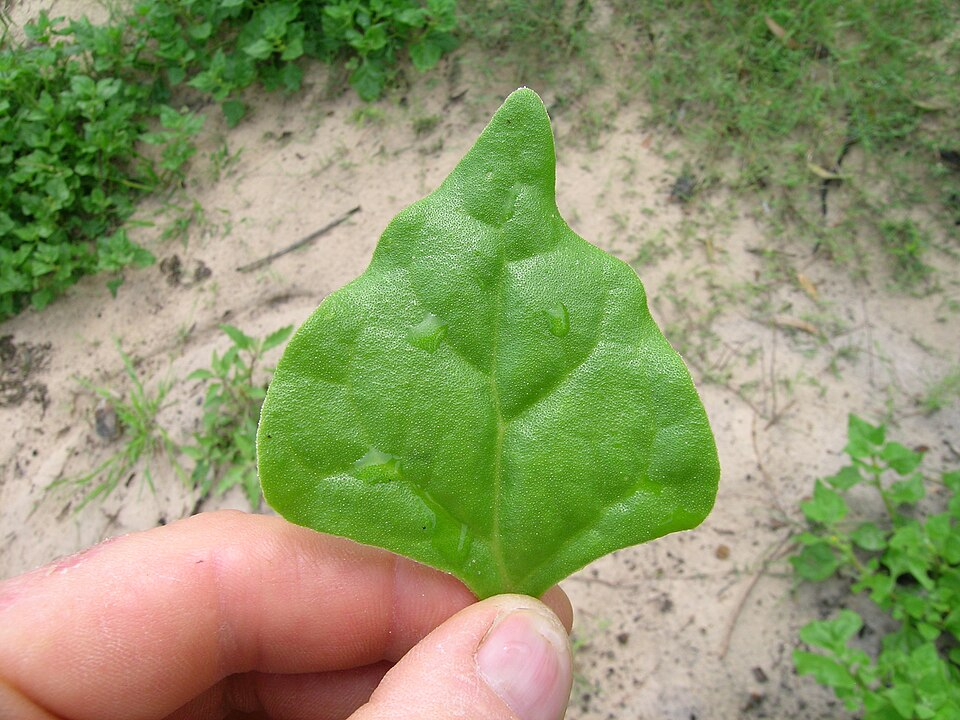

*Photo: Harry Rose / Macleay Grass Man, [CC BY 2.0](https://creativecommons.org/licenses/by/2.0/); Wikimedia 960-pixel resize, otherwise unchanged. [Original and attribution](https://commons.wikimedia.org/wiki/File:Tetragonia_tetragonioides_leaf2_-_Flickr_-_Macleay_Grass_Man.jpg). The hand gives rough context, not a measurement; the leaf is detached and its underside is absent. **A leaf match is not positive identification.***

#### 2. Compare where the flower joins

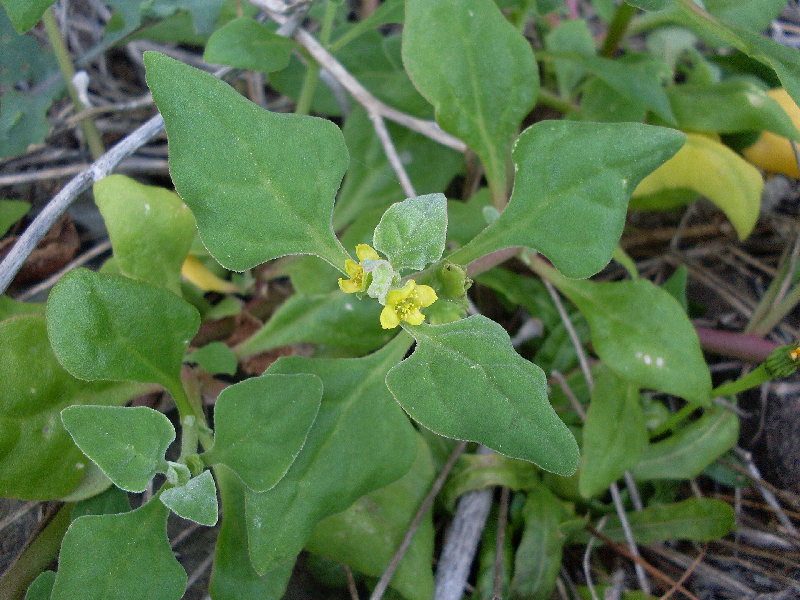

*Photo: John Tann, Gerroa, New South Wales, 29 March 2009; Wikimedia display derivative, otherwise unchanged; [CC BY 2.0](https://creativecommons.org/licenses/by/2.0/). [Original and attribution](https://commons.wikimedia.org/wiki/File:Warrigal_cabbage_flower_(3394737762).jpg). Crowded leaves partly hide the attachment. This non-Victorian, source-labelled plant has no linked voucher or ruler.*

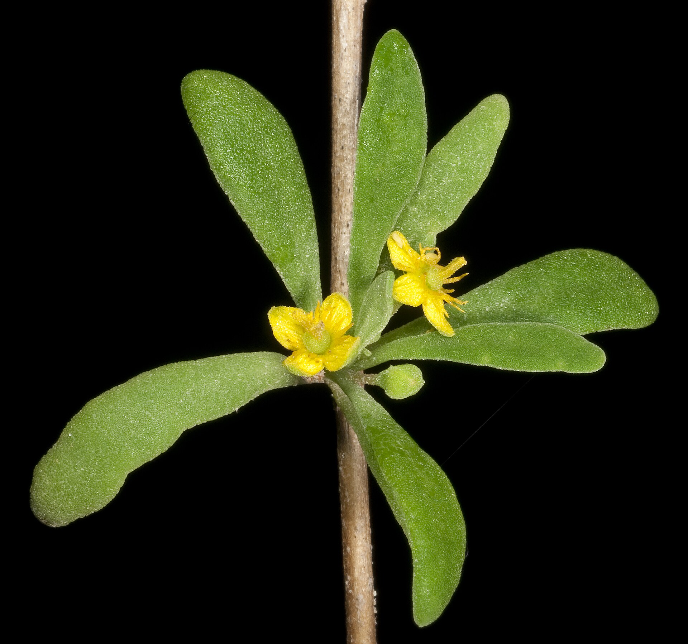

*Photo: Kevin Thiele, 9 June 2012; place not supplied; Wikimedia display derivative, otherwise unchanged; [CC BY 2.0](https://creativecommons.org/licenses/by/2.0/). [Original and attribution](https://commons.wikimedia.org/wiki/File:Tetragonia_implexicoma_(7596767522).jpg). This arranged twig has no scale, habitat or fruit; stalk length cannot be measured from the photograph.*

#### 3. Compare fruit — maturity is not yet verified

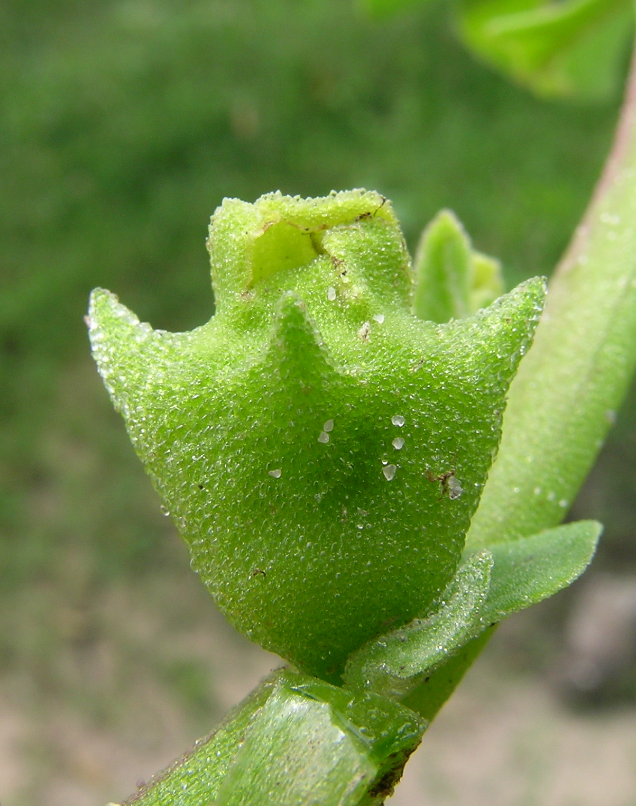

*Photo: Harry Rose / Macleay Grass Man, 5 November 2006, [CC BY 2.0](https://creativecommons.org/licenses/by/2.0/); unchanged source crop. [Original and attribution](https://commons.wikimedia.org/wiki/File:Tetragonia_tetragonioides_fruit2_-_Flickr_-_Macleay_Grass_Man.jpg). Place is not recorded. This is one green stage with no ruler; it does not show the mature hard fruit.*

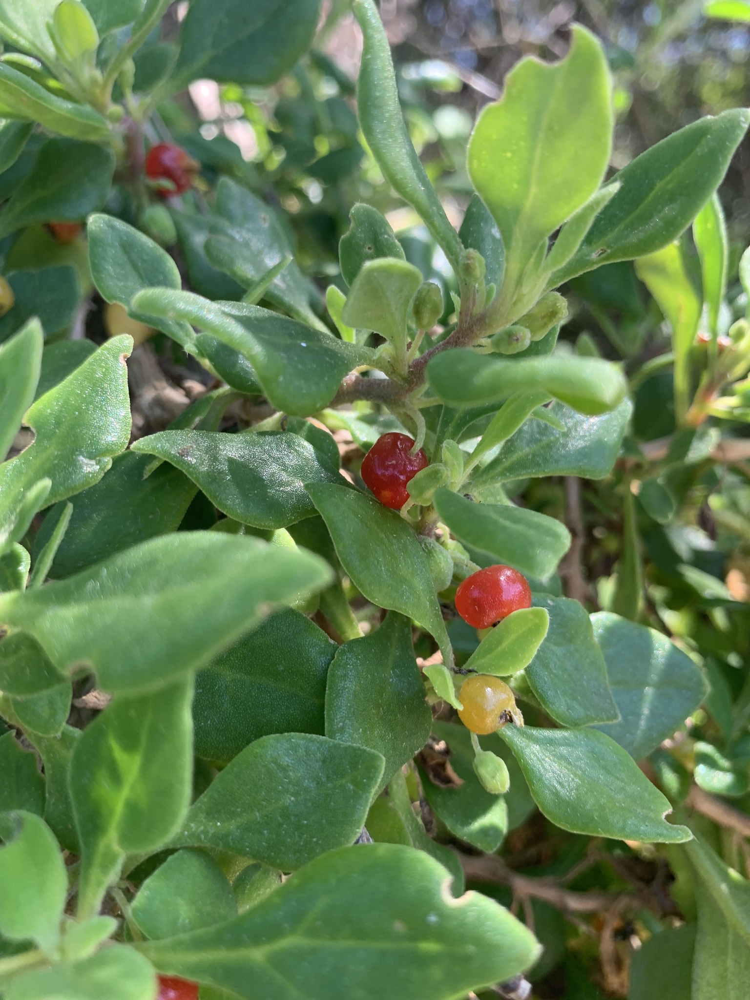

*IM-202. Photo © mraph, 9 November 2022, Beaumaris Foreshore Reserve, Victoria; [CC BY-NC 4.0](https://creativecommons.org/licenses/by-nc/4.0/), via [iNaturalist observation 141515353](https://www.inaturalist.org/observations/141515353) and [photo record 242459573](https://www.inaturalist.org/photos/242459573); unchanged. The community record is source-labelled as* Tetragonia implexicoma *and Research Grade with two agreeing identifications, but that is not independent botanist authentication for this book. The red fruits are probably mature or near mature by appearance; the record does not say this. There is no ruler, linked voucher, cut fruit or matched Warrigal photograph. **Different photographs—not to scale. Personal non-commercial edition only.***

> **STOP — THE MATCHED FRUIT CHECK IS INCOMPLETE**
>
> This guide now contains one rights-cleared Victorian bower-spinach fruit photograph, but it is unmeasured, the mature stage is not expert-confirmed, and it is not matched to the Warrigal photograph. If you cannot inspect mature fruit on the same plant and reconcile it with an authoritative botanical account, do not continue to the preparation below.

> **WARNING — ONLY AFTER THE IDENTITY GATE: BOIL, DRAIN AND DISCARD THE WATER**
>
> **Evidence confidence: High that positively identified Warrigal leaves contain substantial oxalate and boiling reduces the soluble amount; Moderate for the 3–5 minute working method; Insufficient for a safe universal serving.** The working sequence now includes habit, leaf, flower-attachment and fruit views for comparison, but it lacks a matched local plate, complete attached-leaf views and measured mature fruits for both species. A food-safety specialist has not approved this page.
>
> **Wording confidence: 78% (subjective).** This rates this warning against the cited sources—not identity, safety, technique success or survival.
>
> Do not eat positively identified Warrigal greens raw. Do not merely wilt, fry, steam or add them directly to soup. People with kidney disease or a history of calcium-oxalate stones should skip them unless their clinician has already said they are suitable.

### Conditional preparation — only after the stop check passes

Use this section only for Warrigal greens that you learned to identify before the emergency and have positively identified from the complete plant—not from this book for the first time. Use only leaves from a lawfully gathered, uncontaminated plant.

1. Remove dirt and unknown plant material. Rinse with drinking-quality water.
2. Use enough drinking-quality water to keep every leaf submerged and allow the water to return quickly to a full boil. No validated field water-to-leaf ratio has yet been established.
3. Put in the leaves. Keep the water boiling for **3–5 minutes**.
4. Drain completely. **Discard all the cooking water**; do not use it as soup, tea or drinking water.
5. Immediately rinse the leaves thoroughly with cold drinking-quality water, then drain them again.
6. If you have never safely eaten correctly identified and correctly prepared Warrigal greens before, do not make an emergency your first tolerance test. If you have eaten them before, keep the amount modest. If symptoms occur, stop eating and call the Poisons Information Centre on **13 11 26**; call **000** for collapse, breathing trouble or serious symptoms.

Boiling lowered soluble oxalate substantially in a published New Zealand-spinach analysis, but did not remove all total oxalate. The exact field batch, leaf age, growing conditions and water ratio will vary. If you lack enough safe water and lawful fuel for boiling and discarding, choose another food.

**Expected taste:** a current NSW government article describes the leaves as slightly bitter and says their salty quality can weaken away from ocean air. This is subjective NSW context, not a Victorian identity test. An unexpected taste is a reason to stop, not a way to decide the species.

**Food value:** the Australian government card gives **61 kJ per 100 g** but does not state whether the sample was raw or cooked. An independent US food dataset gives **59 kJ per 100 g raw** and **51 kJ per 100 g boiled and drained**. The required boiled form is about **12 kcal per 100 g** in that dataset. This is a low-energy vegetable and cannot carry the calorie load of a stranded person.

### Lookalike and stop rule

The old Victorian Resources Online page separated it from bower spinach partly by five flower segments rather than four and by its green flower and drier fruit. PlantNET's four-or-five count means segment number alone is not a dependable separator. If you cannot check flower attachment and mature fruit on the same plant, if you find four segments, or if any feature disagrees, stop. Do not use “succulent on a beach,” a leaf photograph, taste or the presence of one expected feature as identification.

**Preparation, taste and oxalate checks:** [Victorian Seniors Online](https://www.seniorsonline.vic.gov.au/news/warrigal-greens-pesto-spaghetti), [Darebin sustainable gardening guide](https://www.darebin.vic.gov.au/files/assets/public/v/1/waste-environment-and-climate/documents/sustainablegardeningawdigitalv2-2pdf.pdf), [Savage and colleagues' cooking analysis](https://anemiacentral.com/wp-content/uploads/2017/03/Effects-of-cooking-on-the-oxalate-content-of-New-Zealand-Foods.pdf), a [2023 oxalate review](https://pmc.ncbi.nlm.nih.gov/articles/PMC10486698/) and [NSW National Parks' taste description](https://www.nationalparks.nsw.gov.au/get-inspired/stories/bush-tucker-on-the-menu). **Entry:** SP-005; working only, no expert approval.

## Bower spinach compared with Warrigal greens

**Status — DO NOT EAT:** This is a comparison page only. It supplies no edible part, preparation or serving.

Bower spinach, *Tetragonia implexicoma*, is a native coastal plant that can occupy the same broad setting and share succulent-looking leaves with Warrigal greens. The pre-preparation stop check and multiple views above exist to prevent a leaf-only identification.

> **WARNING — COMPARISON ONLY; DO NOT EAT BOWER SPINACH FROM THIS PAGE**
>
> **Evidence confidence: High for the two VicFlora descriptions and the need to use the same plant's growth, flower attachment and fruit rather than leaf colour alone; Moderate for the source-labelled photographs; Insufficient for a safe edible part, preparation, serving, calorie value or complete novice identification.** The available Victorian bower-spinach fruit view has no scale, and the mature stage has not been expert-confirmed. No food-safety specialist or botanist has approved this comparison.
>
> **Wording confidence: 91% (subjective).** This rates this warning against the cited sources—not identity, safety, technique success or survival.

### Why this does not become another food entry

The reviewed sources did not establish a species-specific field preparation, safe serving, oxalate treatment, energy value or consistent account of which bower-spinach fruit stage might be eaten. Sources also disagreed about berry use. This guide will not transfer Warrigal greens' boiling method to a different species. The photographs above are for recognition of the comparison problem, not permission to eat bower spinach.

**Expected taste:** none is supplied. Tasting an uncertain coastal succulent would add risk and cannot decide the identity.  
**Calories:** unknown for the exact wild species and usable part. No number from Warrigal greens or another *Tetragonia* is substituted.  
**Cultural attribution:** no current Victorian Traditional Owner-controlled source authorising a food or preparation account was located in this pass, so no name or method is assigned.

**Botanical checks:** [VicFlora bower spinach](https://vicflora.rbg.vic.gov.au/flora/taxon/25eab479-d6c1-4a28-a7c5-0a0c11dc2d1d), [VicFlora Warrigal greens](https://vicflora.rbg.vic.gov.au/flora/taxon/3aabdc16-7e9f-4c80-95ef-a903edee4ad0) and [Flora of Australia](https://www.dcceew.gov.au/sites/default/files/env/pages/c369ba41-801b-4ea9-87af-8451fbce87cc/files/flora-australia-04-phytolaccaceae-chenopodiaceae.pdf). **Entry:** SP-026; education only, no eating instruction.

## Muntries — Kunzea pomifera

**Status — CONDITIONAL FOOD:** Relevant mainly in far-western Victoria. Use only after competent identification, lawful access and confirmation of ripe, uncontaminated fruit.

Muntries are a low, spreading woody plant of far western Victoria and nearby South Australia. They are not a general Victorian forest berry.

> **WARNING — LIMITED RANGE AND INCOMPLETE RIPE-FRUIT PLATE**
>
> **Evidence confidence: High for the botanical account and the 2025 analysed sample; Moderate for this preparation summary; Insufficient for identifying a new specimen from the two photographs.** The fruit photo's maturity is not established. No lookalike comparison, scale view or botanist approval is present.
>
> **Wording confidence: 80% (subjective).** This rates this warning against the cited sources—not identity, safety, technique success or survival.

### Features to check together

- A low, ground-hugging woody shrub that can root along the stems and spread into a mat.
- Young stems with fine hairs lying flat against the stem.
- Small, thick leaves about **4–8 mm long and 2–5 mm wide**, arranged alternately, with a turned-back tip and sometimes very fine teeth.
- White flowers in rounded clusters at branch ends, with many long white stamens—the fine pollen-bearing threads—giving a brush-like look.
- Rounded fleshy fruit about **8–12 mm** across, becoming purple or reddish-purple as it ripens.

**Habitat and Victoria:** VicFlora records it from the Little and Big Deserts and coastal dunes around Portland to Nelson. That narrow western range is a strong stop condition elsewhere. Flowers are mainly October–December; actual fruit must be judged on a known plant, not from a calendar.

**Botanical check:** [VicFlora](https://vicflora.rbg.vic.gov.au/flora/taxon/5fa42c33-c2bb-4cfb-b18b-82c3e2308c98).

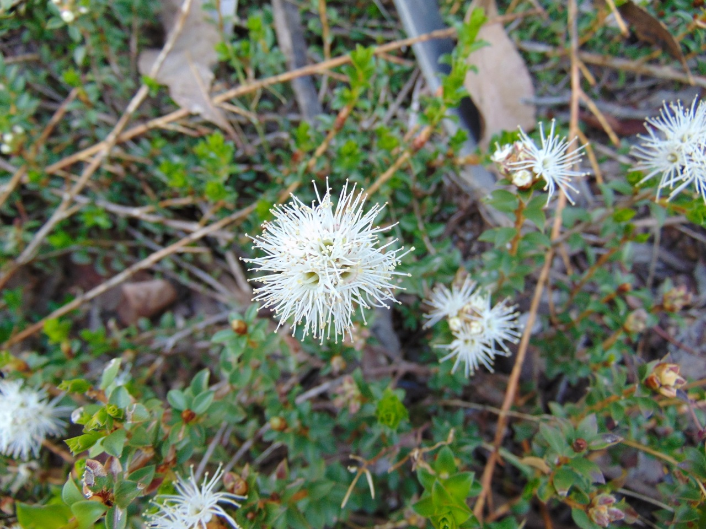

*Photo: Nadiatalent, Australian National Botanic Gardens, Canberra, [CC BY-SA 4.0](https://creativecommons.org/licenses/by-sa/4.0/); unchanged. [Original and attribution](https://commons.wikimedia.org/wiki/File:Kunzea_pomifera_flowers.jpg). This cultivated flower view does not show the whole mat or fruit.*

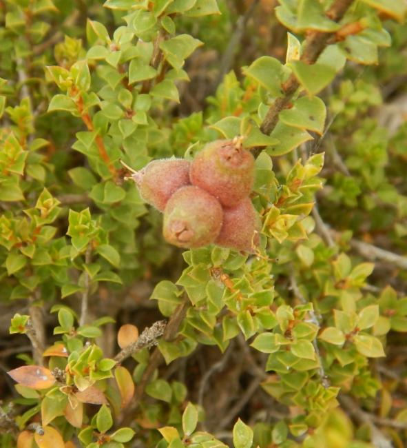

*Photo: David Sando, near Bordertown, South Australia, [CC BY 3.0](https://creativecommons.org/licenses/by/3.0/); unchanged. [Original and attribution](https://commons.wikimedia.org/wiki/File:Kunzea_pomifera.jpg). The small image shows fruit but does not establish edible ripeness.*

### Conditional ripe-fruit use

1. Use only a plant positively identified in advance and growing where collection is expressly allowed.
2. Select fully ripe, intact fruit. **Do not use the photograph above as the ripeness standard.** Leave green, damaged, mouldy or contaminated fruit.
3. Rinse with drinking-quality water and remove obvious stem or leaf material.
4. Eat the ripe fruit fresh. This entry does not teach drying, preserving, leaves, medicine or a serving limit.

**Expected taste:** the Bunganditj-attributed identification card describes ripe fruit as having a dry apple or peach taste. A separate RIRDC industry source describes apple, spice and juniper notes. Plant variety and ripeness change the result. Taste never establishes identity.

**Food value:** a 2025 peer-reviewed study measured one Victorian-grown sample at about **299 kJ (71 kcal) per 100 g including its natural water**. The fruit came from a grower near Nhill and had been frozen at harvest. This is much better evidence than copying a dried value, but it is still one cultivated source, not a guarantee for wild plants. A claimed **998 kJ per 100 g** in an older report is explicitly dry weight and is not the fresh-fruit value.

**Cultural attribution boundary:** GMTOAC's 2023 *Nyamat Mirring Plan* identifies muntrie berries as an important food species on Gunditjmara Sea Country and describes contemporary restoration. The plan does not supply a scientific name for that term, so this botanical entry does not silently claim an exact equivalence. The high-level cultural record is attributed to GMTOAC; its seasonal detail and knowledge remain Gunditjmara ICIP, not a generic harvest recipe.

**Food and taste checks:** [South Australian bush-food identification cards](https://cdn.environment.sa.gov.au/landscape/docs/lc/aboriginal-bush-foods-identification-cards-gen.pdf), [RIRDC *Focus on Muntries*](https://irp-cdn.multiscreensite.com/4c3353cf/files/uploaded/Muntries.pdf), [2025 Journal of Food Engineering study](https://doi.org/10.1016/j.jfoodeng.2025.112526) and [GMTOAC *Nyamat Mirring Plan 2023–2033*](https://www.gunditjmirring.com/_files/ugd/b5965f_d96b4f9d1df44da9ae128eb9689ae028.pdf). **Entry:** SP-006; working only, no botanical, cultural or food-safety approval.

## Cherry ballart — Exocarpos cupressiformis

**Status — LEARN BEFORE TRAVEL:** This advanced recognition page explains the documented food part but does not recommend first-time emergency use.

This is an **advanced recognition page**, not a first-time emergency food recommendation. The useful part is counter-intuitive and tiny.

> **WARNING — THE RED PART IS A SWOLLEN STALK, NOT THE HARD FRUIT**
>
> **Evidence confidence: High for the botanical distinction and documented edible red stalk; Moderate for the preparation summary; Insufficient for novice identification or calorie planning.** The working set now includes a 5 mm scale drawing of the tiny flowers and two-part fruiting structure, but no complete bark, colour/ripeness, minute-leaf or matched-lookalike plate has been reviewed.
>
> **Wording confidence: 82% (subjective).** This rates this warning against the cited sources—not identity, safety, technique success or survival.

### Features to check together

- A bright green shrub or small tree, sometimes up to about 10 m.
- Many fine, drooping, grooved green twigs that can give a cypress-like look.
- True leaves reduced to tiny scale-like leaves, about half a millimetre long, arranged one after another.
- Small flowers along the fine twigs, mainly from September to May.
- At fruiting, a fleshy stalk about **4–6 mm** long becomes orange to red. A separate hard oval fruit about **4–5 mm** long sits at its end.

**Habitat and Victoria:** widespread in woodland and forest across much of Victoria, but not common enough to promise a meal at a rescue site. Do not dig or transplant it; this page does not teach propagation.

**Botanical check:** [VicFlora](https://vicflora.rbg.vic.gov.au/flora/taxon/10a16917-01e0-46cc-8bd8-359df2467806).

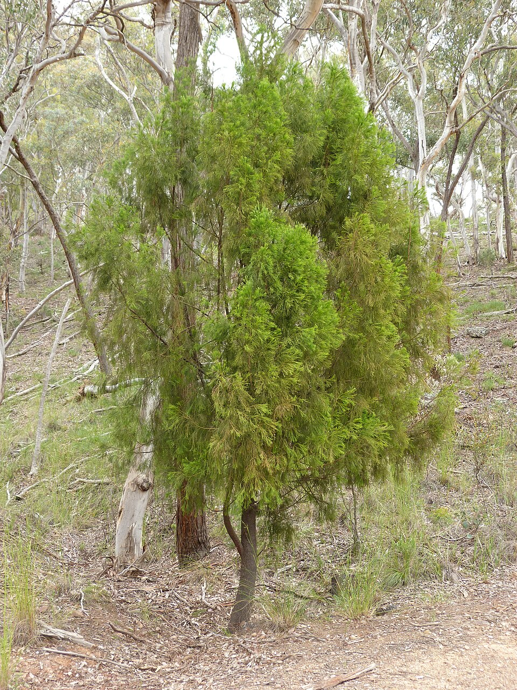

*Photo: Donald Hobern, ACT, [CC BY 2.0](https://creativecommons.org/licenses/by/2.0/); Wikimedia 960-pixel resize, otherwise unchanged. [Original and attribution](https://commons.wikimedia.org/wiki/File:Exocarpos_cupressiformis_tree_1.jpg). This is a habit view only.*

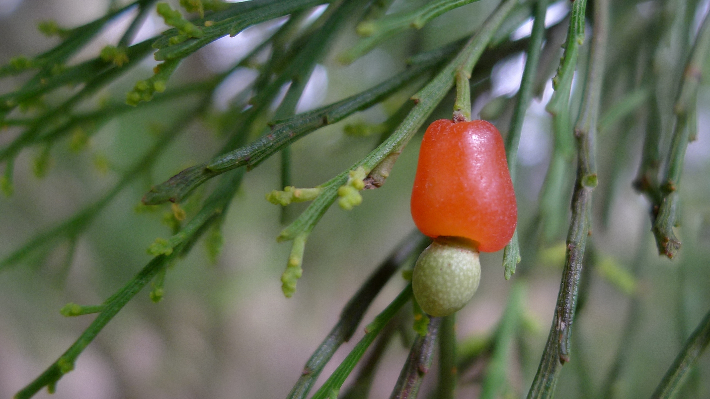

*Photo: John Tann, Tasmania, [CC BY 2.0](https://creativecommons.org/licenses/by/2.0/); unchanged. [Original and attribution](https://commons.wikimedia.org/wiki/File:Exocarpos_cupressiformis_fruit_(6700452189).jpg). The key stalk-versus-hard-fruit distinction is visible; scale and lookalikes are absent.*

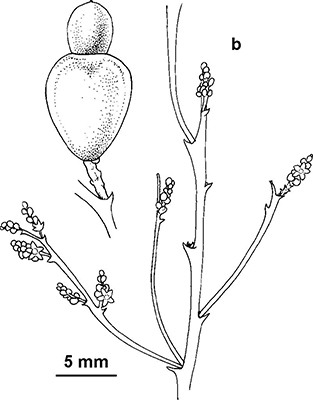

*Drawing: M. Moir, [CC BY-NC-SA 4.0](https://creativecommons.org/licenses/by-nc-sa/4.0/); unchanged. [Source fact sheet and attribution](https://apps.lucidcentral.org/plants_se_nsw/text/entities/exocarpos_cupressiformis.htm). Personal non-commercial edition only. The drawing explains the structure and scale; it cannot show colour, ripeness, bark, whole habit, minute leaf scales or lookalikes.*

### What a trained person may use

For a plant already known with certainty, the deep-red fleshy **stalk** is the documented edible part. Yellow or orange stalks are described as bitter or strongly drying or puckering in the mouth; deep-red stalks close to falling are described as sweet and more pleasant. Separate the hard attached fruit and discard it. This edition does not call the hard fruit toxic; its food use is simply unsupported here.

There is no useful energy or portion result. The edible part is only a few millimetres long. Treat this as an identification lesson, not food procurement. Do not spend time searching for it during a short rescue wait.

**Food-part and taste checks:** [ANBG Aboriginal Plant Use](https://www.anbg.gov.au/apu/plants/exoccupr.html) and [Yarra Ranges plant directory](https://www.yarraranges.vic.gov.au/PlantDirectory/Shrubs/Shrubs-1.5-10-metres/Exocarpos-cupressiformis), read with VicFlora. The ANBG page is an older secondary compilation: it attributes raw stalk use to Flood (1980), the yellow-versus-deep-red comparison to Oates and Seeman (1979), and the orange, mouth-drying account to Cribb and Cribb (1987). It names no Traditional Owner group, so it is not treated as current cultural authority. **Entry:** SP-007; education-only working page.

## Ruby saltbush — Enchylaena tomentosa var. tomentosa

**Status — CONDITIONAL FOOD:** Use only after exact identification and lawful, uncontaminated collection; no safe serving size is established.

On Dja Dja Wurrung Country, DJAARA publicly records **Girrkitj** for *Enchylaena tomentosa*. The cultural name and record belong in that exact Djandak context. The botanical account below uses VicFlora's narrower Victorian variety, *E. tomentosa* var. *tomentosa*; it does not silently claim that DJAARA made or approved that taxonomic choice.

> **WARNING — NO SAFE SERVING SIZE HAS BEEN ESTABLISHED**
>
> **Evidence confidence: High for the Victorian botanical account and for documented use of the fruit; Moderate for the food-part summary; Insufficient for identifying your specimen or choosing an amount to eat.** DJAARA's guide warns that too much may cause illness but gives no quantity. No botanist or food-safety reviewer has approved this page.
>
> **Wording confidence: 78% (subjective).** This rates this warning against the cited sources—not identity, safety, technique success or survival.

### Features to check together

- A low, spreading or upright shrub, sometimes reaching about **1.5 m** high.
- Dense fine branches. Young stems and leaves usually look grey-green because they carry short white to rusty hairs.
- Narrow, fleshy leaves shaped like tiny cylinders or spindles, usually **5–20 mm long**, attached without a leaf stalk.
- A small, button-like fleshy covering around the fruit, **3–6 mm across**. It can be green, yellow or red; colour alone does not prove ripeness.
- Fruit mainly from **September to April** in the VicFlora account.

**Habitat and Victoria:** widespread in northern and north-western Victoria in mallee scrub, woodland on heavy alluvial soils—heavy soils deposited by rivers—and disturbed ground. It also occurs occasionally among coastal rocks and in dry rain-shadow country north and west of Melbourne. It is not a statewide promise of food.

**Botanical check:** [VicFlora](https://vicflora.rbg.vic.gov.au/flora/taxon/2669e841-5687-4e49-a6e1-e89fd7bd97f8). VicFlora records wide variation and hybrids with *Maireana turbinata*. Some Victorian plants also approach the less hairy var. *glabra* known just beyond the state border. Stop if the hair, leaf or fruit pattern does not agree.

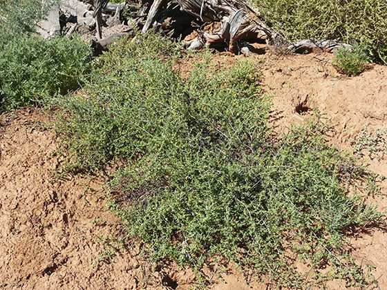

*Photo: Don Wood, Scotia Sanctuary, western New South Wales; [CC BY 4.0](https://creativecommons.org/licenses/by/4.0/). [Source fact sheet and attribution](https://apps.lucidcentral.org/plants_se_nsw/text/entities/enchylaena_tomentosa_var._tomentosa.htm). This is an overall-shape view, not a Victorian voucher or complete identification.*

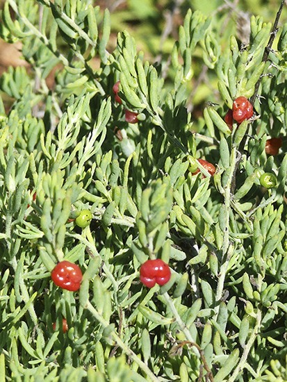

*Photo: Don Wood, Scotia Sanctuary, western New South Wales; [CC BY 4.0](https://creativecommons.org/licenses/by/4.0/). [Source and attribution](https://apps.lucidcentral.org/plants_se_nsw/text/entities/enchylaena_tomentosa_var._tomentosa.htm). No scale, flower or variety comparison is shown.*

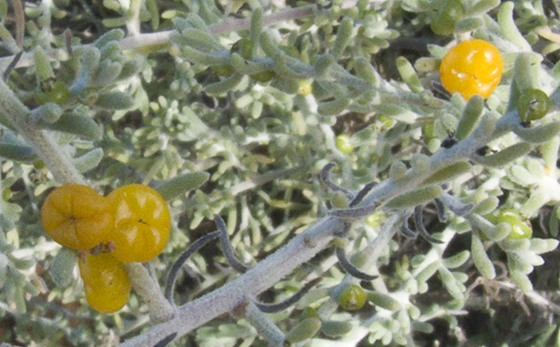

*Photo: Don Wood, Scotia Sanctuary, western New South Wales; [CC BY 4.0](https://creativecommons.org/licenses/by/4.0/). [Source and attribution](https://apps.lucidcentral.org/plants_se_nsw/text/entities/enchylaena_tomentosa_var._tomentosa.htm). This useful colour-variation view still lacks scale and a flower close-up.*

### Conditional fruit use

This is a reminder for a plant learned beforehand, not a way to approve a new find. For a lawfully available, uncontaminated plant already known with certainty, first confirm that the exact patch's pesticide and herbicide history is known. If it is unknown, stop; appearance, smell and rinsing cannot clear the plant.

1. Trace the proposed fruit to the same hairy stem and narrow fleshy leaves you checked.
2. Use only an intact fruit at a ripe stage learned beforehand for that positively identified plant. Sources describe ripe fruit as yellow, red, orange or pink. Do not eat green fruit, and never use colour alone to prove identity or ripeness.
3. Rinse it with drinking-quality water.
4. The small fruit and its central seed are documented as edible. This entry gives no use for the leaves, tea or medicine.

**Expected taste:** two separate public sources describe the fruit as **salty-sweet**. That is an expectation after identification, not an identity test. Spit it out and stop if it is unexpectedly unpleasant, but a salty-sweet taste does not prove the plant safe.

**Food value:** no defensible fresh-fruit kJ or kcal result was found. A 1993 Australian bush-food table records the energy for *E. tomentosa* fruit as **not determined**, although it reports about 65% water. Missing energy cannot be calculated from selected nutrients. The fruit is tiny. Treat it as flavour, not a ration or drinking-water source.

**Food and cultural sources:** the [South Australian government garden fact sheet](https://cdn.environment.sa.gov.au/landscape/docs/mr/Native-food-fact-sheet_ruby-saltbush.pdf) independently supports the edible fruit, seed and salty-sweet description. [DJAARA's DJAKITJ page](https://djakitj.com.au/) identifies Girrkitj as a Dja Dja Wurrung native food, and [Djaara Balaki Wuka](https://imags.com.au/published/Djaara_Balaki_Wuka_Nyerna_Djay_Wurreka/40/) records the name, raw ripe-fruit use, taste and moderation warning on Djandak. DJAARA states that its knowledge remains Dja Dja Wurrung intellectual property and that the resource is not to be republished without consent. Its guide also says it draws on several sources, does not guarantee that every statement is accurate and has not tested the documented traditional uses. It is cultural-use evidence, not toxicology, dose evidence or approval of this page. This personal guide therefore gives a short attributed summary only: it does not copy site locations, a seasonal calendar or another use. **Entry:** SP-010; working only.

## Prickly currant-bush — Coprosma quadrifida

**Status — CONDITIONAL FOOD:** Use only after exact identification and lawful, uncontaminated collection; similar fruit on another plant is not enough.

Museums Victoria's Bunjilaka guide records **Morr** as the Woi wurrung name. This is a bounded museum-recorded attribution, not direct Traditional Owner review or approval of this page. It applies to the named source and Country; it is not a pan-Victorian name.

> **WARNING — SIMILAR COPROSMA FRUIT IS NOT AUTOMATICALLY FOOD**
>
> **Evidence confidence: High for the Victorian botanical description and documented ripe-fruit use; Moderate for this preparation summary; Insufficient for novice identification from the pictures.** Closely related plants and hybrids can carry similar orange-red fruit. The final plate has not had botanical or food-safety review.
>
> **Wording confidence: 80% (subjective).** This rates this warning against the cited sources—not identity, safety, technique success or survival.

### Features to check together

- An upright, tangled-looking shrub, commonly **2–5 m** high.
- Slender young branches that are hairy and often end in sharp points.
- Small opposite leaves, commonly **5–15 mm long** and **2–5 mm wide**. They are thin and dull rather than thick and mirror-glossy.
- A clear network of veins on the leaf underside, not merely one strong vein.
- Tiny male and female flowers usually on separate plants. Male flowers show hanging anthers; female flowers show two long pale styles.
- Glossy orange to red oval or rounded fruit, **5–8 mm long**, with the remains of the flower forming a small crown at the tip.

**Habitat and Victoria:** widespread and often locally common in moist open forest, streamside scrub, fern gullies and rainforest. VicFlora records flowers from August to January. Museums Victoria records small red fruit in summer; an older ANBG compilation says fruit can be abundant in late summer to autumn. Check the plant, not a calendar promise.

**Botanical check:** [VicFlora species account](https://vicflora.rbg.vic.gov.au/flora/taxon/1b8f3911-2ea5-499d-88af-ffe7fc4dbdb4) and [VicFlora genus account](https://vicflora.rbg.vic.gov.au/flora/taxon/19bf8b14-adce-49ce-b84d-31cca4199f1e).

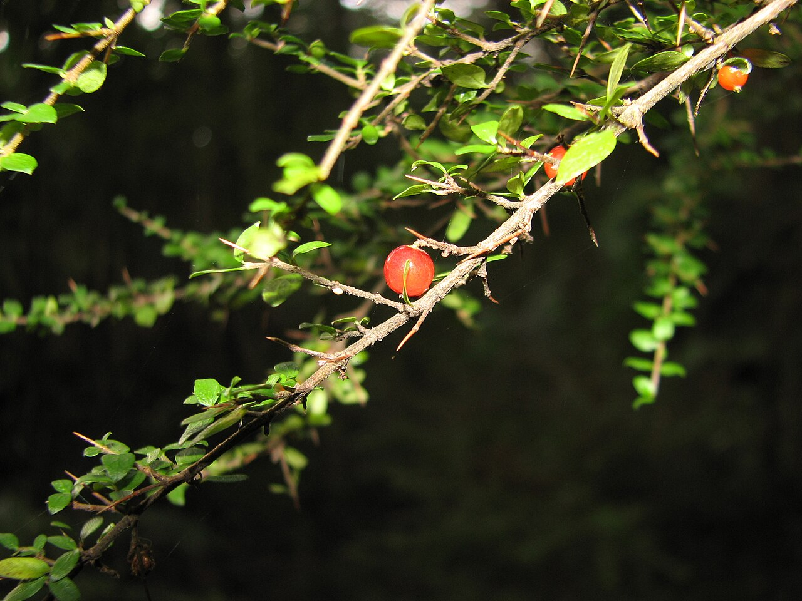

*Photo: Melburnian, Mount Toolebewong, Victoria; Wikimedia 1280-pixel resize, otherwise unchanged; [CC BY-SA 3.0](https://creativecommons.org/licenses/by-sa/3.0/). [Original and attribution](https://commons.wikimedia.org/wiki/File:Coprosma_quadrifida.JPG). The file page contains conflicting dates. No whole shrub, ruler or lookalike is shown.*

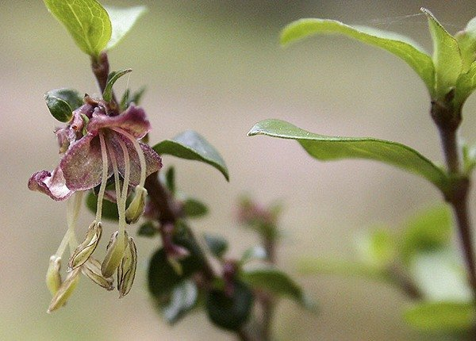

*Photo: Lorraine Phelan, near Heywood, Victoria; [CC BY 4.0](https://creativecommons.org/licenses/by/4.0/). [Source fact sheet and attribution](https://apps.lucidcentral.org/plants_se_nsw/text/entities/coprosma_quadrifida.htm). Male flowers do not become fruit; this macro has no scale.*

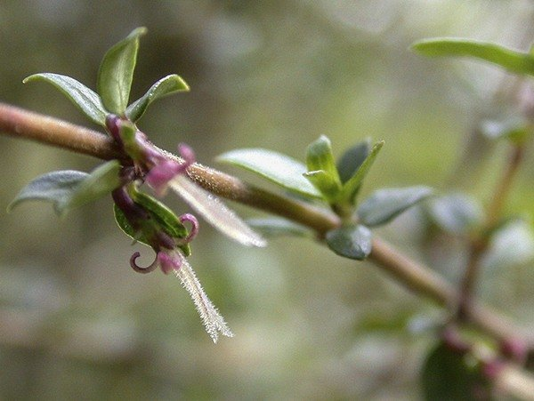

*Photo: Lorraine Phelan, near Heywood, Victoria; [CC BY 4.0](https://creativecommons.org/licenses/by/4.0/). [Source and attribution](https://apps.lucidcentral.org/plants_se_nsw/text/entities/coprosma_quadrifida.htm). No ripe fruit, whole shrub or scale is shown in this view.*

### Conditional ripe-fruit use

For a lawfully available plant already known with certainty, first confirm that the exact patch's pesticide and herbicide history is known. If it is unknown, stop; appearance, smell and rinsing cannot clear the plant.

1. Trace the fruit to a sharp-ended branch with the matching tiny, thin leaves. Check the vein network underneath a leaf.
2. Select only intact, glossy red fruit at a ripe stage learned beforehand. Leave green, orange, mouldy, damaged, fallen, flood-exposed or visibly fouled fruit.
3. Rinse with drinking-quality water.
4. Eat the soft fruit and spit out its one or two hard seeds. This entry gives no use for the leaf, branch, root or unripe fruit.

**Expected taste:** older sources describe ripe fruit as **sweet and juicy**. No controlled Victorian taste study was found; variation is expected. Taste never confirms the species.

**Food value:** no defensible species-specific fresh energy value was found in the current Australian database or the reproduced 1993 bush-food tables. The fruit is small and the seed takes part of its mass. Do not borrow a value for European currants, gooseberries, another *Coprosma* or “generic berries”. Treat it as refreshment only. No safe serving size or allergy review was found; do not make an emergency your first trial.

### Lookalikes, hybrids and wildlife

- *Coprosma hirtella* has much larger leaves, commonly 15–50 mm long, and clustered flowers.
- *Coprosma nitida* has stiff, thick, glossy leaves with one main vein rather than the clear underside network described above.
- Introduced karamu, *Coprosma robusta*, has hybridised with *C. quadrifida* on the Mornington Peninsula. Do not transfer this food entry to a hybrid or an uncertain plant.

No specific poisonous lookalike was established in the reviewed sources. That is not proof that every similar red fruit is safe. [VicFlora *C. hirtella*](https://vicflora.rbg.vic.gov.au/flora/taxon/a895f8d0-06f0-4523-af8b-7720bed7d2df), [VicFlora *C. nitida*](https://vicflora.rbg.vic.gov.au/flora/taxon/606835d3-5c6f-46a3-a091-e9cef78da66a), and the [Victorian karamu assessment](https://www.environment.vic.gov.au/__data/assets/pdf_file/0030/523749/FRR-Karamu-Invasion-PTP-Nom-886.pdf).

A south-eastern Australian field study found that birds removed much of the ripe fruit crop and usually passed viable seed. Do not strip a shrub; leave most fruit for wildlife. [French, O'Dowd and Lill, 1992](https://doi.org/10.1111/j.1442-9993.1992.tb00778.x).

**Food and cultural sources:** [Museums Victoria Bunjilaka](https://museumsvictoria.com.au/bunjilaka/about-us/the-plants-of-milarri-garden/) attributes Morr to Woi wurrung and records the small red summer fruit as eaten. The [Cardinia and Casey Indigenous Plant Guide](https://www.rbg.vic.gov.au/media/r3rbnaae/indigenous-plant-guide-casey-and-cardinia.pdf) independently records sweet red fruit eaten raw or cooked. The [ANBG account](https://www.anbg.gov.au/apu/plants/coprquad.html) is an older secondary compilation and is used only for its clearly attributed raw-fruit, seed and taste details. **Entry:** SP-011; working only.

## Lilly pilly — Syzygium smithii

**Status — CONDITIONAL FOOD:** This East Gippsland entry applies only to positively identified ripe fruit from a lawful, uncontaminated site; the raw-fruit limit is unknown.

The accepted name is *Syzygium smithii*. Older sources may call it *Acmena smithii*. Museums Victoria records **Wanduin** specifically as the Gunaikurnai name for the **fruit**, not a generic Victorian name for every lilly pilly. This is a bounded museum-recorded attribution; no direct Traditional Owner review or approval of this page is recorded.

> **WARNING — EAST-GIPPSLAND TREE; RAW-FRUIT LIMIT UNKNOWN**
>
> **Evidence confidence: High for the Victorian botanical account and documented ripe-fruit use; Moderate for the general seed-removal precaution; Insufficient for novice identification or a safe serving size.** An older safety review reports unconfirmed digestive problems after excessive raw Syzygium fruit, especially whole fruit with full-sized seeds. It gives no number that this book can turn into a safe portion.
>
> **Wording confidence: 78% (subjective).** This rates this warning against the cited sources—not identity, safety, technique success or survival.

### Features to check together

- A tree up to about **20 m** in Victoria's native range.
- Red-brown bark, smooth to slightly flaky, with lengthwise cracks on older stems.
- Young twigs often square when cut across.
- Leaves in opposite pairs, **3–14 cm long** and **1–6 cm wide**, dark green above and paler below. Many side veins, a clear vein running near the edge and many oil dots are useful close features.
- Clusters of many small cream-white flowers with many fine stamens; mainly November to February in VicFlora.
- Round fruit **6–14 mm across**, recorded from white to purple. Colour varies and does not identify the tree by itself.

**Habitat and Victoria:** naturally occurs mainly in rainforest and along watercourses from near the Mitchell River eastwards, with a separate population on Wilsons Promontory. Cultivated plants sometimes spread around Melbourne and nearby foothills. A garden escape is not proof of wild provenance or lawful access.

**Botanical check:** [VicFlora](https://vicflora.rbg.vic.gov.au/flora/taxon/4e303824-a7e2-4d2f-9b46-4d47e2555d41). 

“Lilly pilly” is used for several species and cultivars. Without a matched lookalike plate and prior learning, this page cannot distinguish an unfamiliar tree. Stop rather than transfer the food record to another lilly pilly.

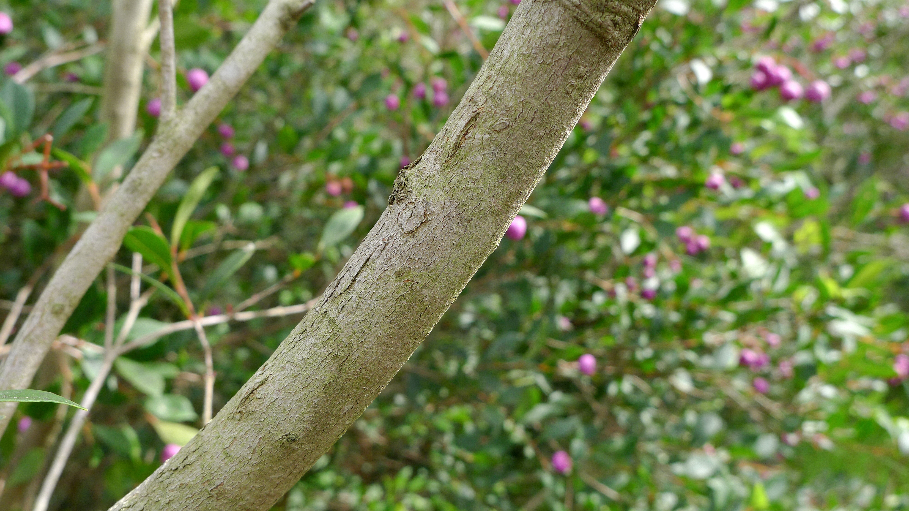

*Photo: John Tann, Nymboida National Park, New South Wales, 2014; unchanged; [CC BY 2.0](https://creativecommons.org/licenses/by/2.0/). [Original and attribution](https://commons.wikimedia.org/wiki/File:Lilli_pilli_bark_(16216021622).jpg). The source label is not a voucher; no older-trunk comparison, ruler or whole tree is shown.*

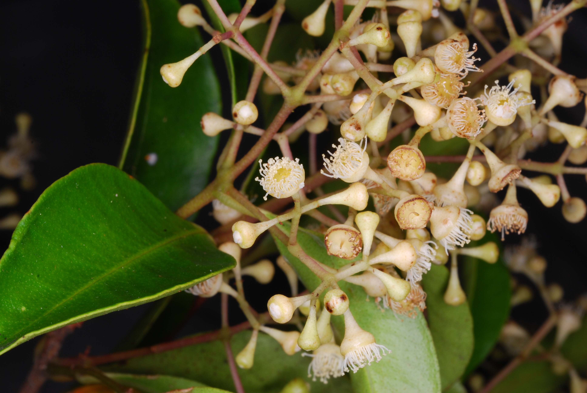

*Photo: Buprestman, Mount Keira, New South Wales, 2015; unchanged; [CC BY-SA 4.0](https://creativecommons.org/licenses/by-sa/4.0/). [Original and attribution](https://commons.wikimedia.org/wiki/File:2015-11-13_~_NSW_-_Mount_Keira_-_Syzygium_smithii.jpg). The description and file metadata differ by one day. No scale or whole tree is shown.*

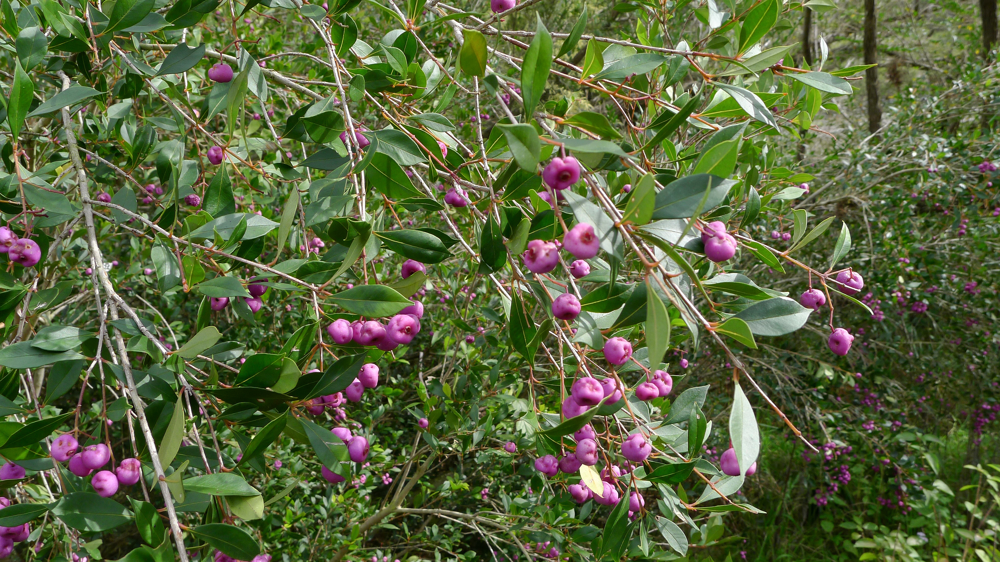

*Photo: John Tann, Nymboida National Park, New South Wales, 2014; unchanged; [CC BY 2.0](https://creativecommons.org/licenses/by/2.0/). [Original and attribution](https://commons.wikimedia.org/wiki/File:Lilli_pilli_fruit_(15596952543).jpg). Species placement comes from the Commons category rather than a linked voucher. The fruit is not cut open and there is no scale.*

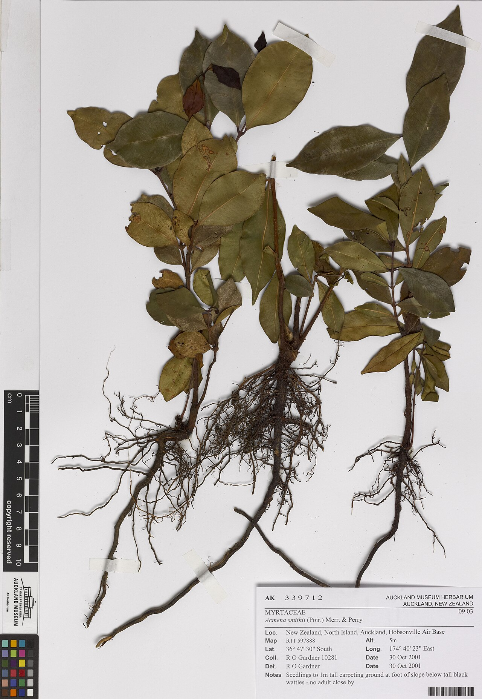

*Auckland Museum Herbarium specimen AK339712, collected and identified by R. O. Gardner in New Zealand; Wikimedia 1280-pixel resize, otherwise unchanged; [CC BY 4.0](https://creativecommons.org/licenses/by/4.0/). [Specimen page and attribution](https://commons.wikimedia.org/wiki/File:Acmena_smithii_(Poir.)_Merr._and_Perry_(AM_AK339712).jpg). Pressed seedlings give scale and leaf reference, not the posture, bark or fruit of a Victorian adult tree.*

### Conditional ripe-fruit use

For a lawfully available tree already known with certainty, first confirm that the exact patch's pesticide and herbicide history is known. If it is unknown, stop; appearance, smell and rinsing cannot clear the tree.

1. Trace the fruit to the identified branch and recheck its leaves, veins and young twig.
2. Select intact, ripe white-to-purple fruit. Reject mouldy, damaged, fallen, flood-exposed or sprayed fruit.
3. Rinse with drinking-quality water.
4. Split the fruit with clean fingers or a clean knife before putting it in your mouth. Remove and discard any full-sized seed; eat only the soft flesh. Seed removal is a precaution, not a proven detoxification method.

**Expected taste:** the Gunaikurnai-context Bunjilaka account describes Wanduin as **tart and juicy**. An older New South Wales community account says sweet and juicy. Expect sweet-to-tart variation with tree and ripeness. An unpleasant result is a reason to stop, not an identification test.

**Food value:** the 1993 Australian Aboriginal-food tables give **89 kJ per 100 g**—about **21 kcal**—for raw *Acmena smithii* fruit. They label it an average but do not state the sample count, place, cultivar or whether any Victorian population was included. Even if your weighed edible flesh matched that old figure, 250 g would be only about 223 kJ or 53 kcal. That comparison is not a portion recommendation. Do not spend rescue time leaving a safe position to seek this low-energy fruit.

The 2001 bush-food safety review says reports were mostly negative but records uncorroborated digestive complaints after over-indulgence in raw Syzygium fruit, especially fruit eaten with full-sized seeds. It advises against excessive raw intake but supplies no numeric limit. This edition therefore cannot tell you how much is safe and does not treat lilly pilly as a meal.

**Food, safety and cultural sources:** [Museums Victoria Bunjilaka](https://museumsvictoria.com.au/bunjilaka/about-us/the-plants-of-milarri-garden/) supplies the exact Gunaikurnai fruit-name attribution and tart/juicy raw-fruit record. The [ANBG account](https://www.anbg.gov.au/apu/plants/acmesmit.html) preserves the separately named Wreck Bay community source and is not transferred as Victorian cultural authority. Nutrition comes from the [1993 tables reproduced by Kidney Health Australia](https://kidney.org.au/wp-content/uploads/2025/11/KHA-First-Nations-booklet-Bush-tucker-and-kidney-disease.pdf); the intake limit comes from the [2001 RIRDC safety review](https://www.ausbushfoods.com/bushfoodsonline/reports/Safety/bush_food_safety-01-28.pdf). **Entry:** SP-012; working only.

## European blackberry complex — Rubus fruticosus aggregate

**Status — CONDITIONAL FOOD:** Private-site-only boundary. Use only on private land with the owner's current permission and treatment history. Do not eat public-land or roadside fruit.

This is an introduced noxious weed complex, not one reliably identifiable species. Agriculture Victoria says the management name covers at least nine species in Victoria plus hybrids. The three photographs below are source-labelled *Rubus anglocandicans*, apparently the state's most widespread member, but they must not be used to name every blackberry thicket.

> **WARNING — DO NOT EAT ROADSIDE, RESERVE OR OTHER PUBLIC-LAND BLACKBERRIES**
>
> **Evidence confidence: High that the *Rubus fruticosus* aggregate has edible fruit; High that Victorian councils document public-land spraying and advise against eating fruit there; Moderate for using the photographs to recognise the broad complex; Insufficient for proving the exact member or treatment history of a patch.** Council-documented spray programs can overlap fruiting, and signs may be absent, removed or moved. Do not assume washing or cooking makes treated or unknown fruit safe.
>
> **Wording confidence: 89% (subjective).** This rates this warning against the cited sources—not identity, safety, technique success or survival.

### Recognising the broad complex

- A perennial, prickly, scrambling shrub forming dense thickets several metres high.
- Arching or trailing canes that can reach **7 m**, with straight or curved prickles.
- Leaves arranged one after another on the cane and divided into **three or five** oval, toothed leaflets. Some species have a whitish hairy underside.
- White or pink flowers, **2–3 cm** across, with five petals and many stamens.
- Fruit made of many small juicy beads, **1–3 cm** across, changing green to red to black. Victorian fruit develops mainly from late December to April.
- A ripe European blackberry remains attached to its pale central core when picked. Victoria's native brambles have red or orange ripe fruit that comes away from that core.

**Habitat and Victoria:** mainly higher-rainfall parts of Victoria, especially bushland, streams, plantations and grazing land. Exact members can be hard to identify. Use [Agriculture Victoria's aggregate account](https://agriculture.vic.gov.au/biosecurity/weeds/weeds-information/blackberry) and the [VicFlora *R. anglocandicans* account](https://vicflora.rbg.vic.gov.au/flora/taxon/390a7b22-b707-45b2-8ac5-6750bfaf4b12) for the limits of these photographs.

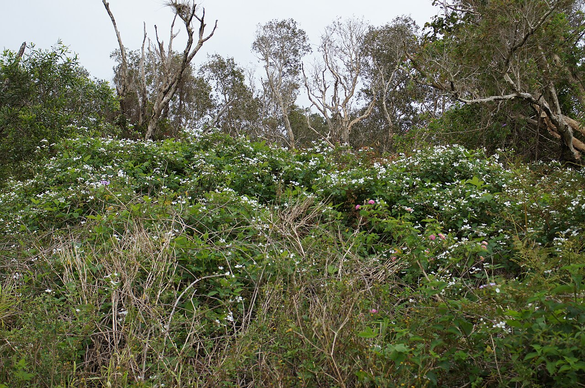

*Photo: Harry Rose / Macleay Grass Man, South West Rocks, New South Wales, 2011; Wikimedia 1280-pixel resize, otherwise unchanged; [CC BY 2.0](https://creativecommons.org/licenses/by/2.0/). [Original and attribution](https://commons.wikimedia.org/wiki/File:Rubus_anglocandicans_plant_NC1.jpg). This shows thicket form only; other plants are mixed through it and the exact aggregate member cannot be proved from this view.*

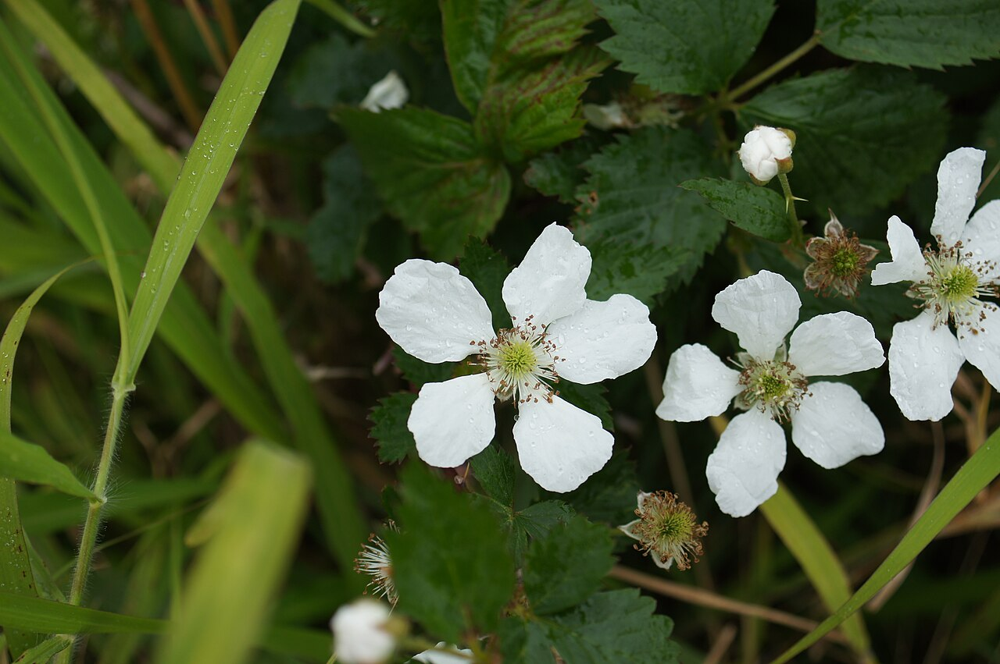

*Photo: Harry Rose / Macleay Grass Man, South West Rocks, New South Wales, 2011; Wikimedia 1280-pixel resize, otherwise unchanged; [CC BY 2.0](https://creativecommons.org/licenses/by/2.0/). [Original and attribution](https://commons.wikimedia.org/wiki/File:Rubus_anglocandicans_flower_NC1.jpg). The cane angles, prickles and pale leaf underside are not shown clearly.*

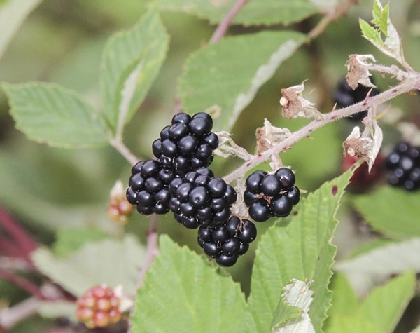

*Photo: Michael Bedingfield, near Tharwa, Australian Capital Territory; [CC BY 4.0](https://creativecommons.org/licenses/by/4.0/). [Source fact sheet and attribution](https://apps.lucidcentral.org/plants_se_nsw/text/entities/rubus_anglocandicans.htm). The picture is source-labelled *R. anglocandicans*; fruit alone cannot settle the exact member or spray history.*

### The only conditional use retained

Do not use public-land fruit. Only consider fruit on private land when the owner gives permission **and the person responsible for treatment records confirms that the exact patch has not been chemically treated**. Unknown history means stop. Absence of a sign, chemical smell or damaged leaves is not confirmation.

If those conditions and the whole-plant check are met:

1. Use only sound, fully black fruit still attached to the checked cane. Do not enter a dense thicket or risk an eye injury for food.
2. Reject red, green, mouldy, fallen, animal-fouled, flood-exposed or polluted-site fruit.
3. Wash the fruit with drinking-quality water and eat it raw. Do not use cooking as a way to make a sprayed or uncertain fruit safe.
4. Do not carry fruit or seed to another site, plant it or discard seed elsewhere. Agriculture Victoria states that transporting a declared noxious weed, its seed or any part capable of growing requires a permit.

**Expected taste:** no controlled species-level taste result was found for this difficult aggregate. A familiar ripe blackberry may seem sweet, tart or both, but that general expectation cannot name the member, show that it is ripe or reveal herbicide exposure.

**Food value:** FSANZ gives **192 kJ per 100 g including fibre**, about **46 kcal**, for raw commercial blackberry. Most of that record comes from composite retail samples; their exact taxa or cultivars are not named. It is the best Australian scale comparison found, not a measurement of a Victorian wild thicket. At that proxy value, a weighed 250 g would be about 480 kJ or 114 kcal—around 5.5% of the 8700 kJ food-label reference. Field yield and safety are not promised.

**Food, spray and legal checks:** [NSW Government WeedWise](https://weeds.dpi.nsw.gov.au/Weed/Blackberry) explicitly records edible fruit for the *Rubus fruticosus* species aggregate. [Macedon Ranges Shire](https://www.mrsc.vic.gov.au/Live-Work/Environment/Weeds-and-pest-animals/Common-Weeds) says local control usually occurs December–March, overlapping fruiting, and tells people to avoid roadside, reserve and other public-land fruit because warning signs may be missing. An undated [Yarra Ranges Council notice](https://www.yarraranges.vic.gov.au/EE-Newsletter/Blackberry-Spraying-Underway) gives the same local no-consumption precaution. These are documented council-level warnings, not a current statewide survey. [Agriculture Victoria's weed-permit guidance](https://agriculture.vic.gov.au/biosecurity/protecting-victoria/legislation-policy-and-permits/permits-for-noxious-weeds-in-victoria) states when a permit is required. Nutrition: [FSANZ F001267](https://www.foodstandards.gov.au/science-data/food-nutrient-databases/afcd/search/food/F001267).

All members of this European complex are introduced. No Victorian Traditional Owner food attribution was found, so no Aboriginal language name or pre-colonial use is assigned. This says nothing about contemporary Aboriginal experience; it only prevents the book from inventing an attribution. **Entry:** SP-013; public-land use rejected, private-site use conditional.

## Cranberry heath — Styphelia humifusa

**Status — CULTURAL-NON-HARVEST:** Learn the plant and its separately attributed cultural records; this edition gives no field-eating instruction.

Older books and image files usually call this plant *Astroloma humifusum*. VicFlora treats that name as a synonym of the accepted name *Styphelia humifusa*. It is not the cultivated cranberry sold as food.

> **WARNING — RECOGNITION AND CULTURAL CONTEXT ONLY**
>
> **Evidence confidence: High for the accepted species, Victorian features and documented use of the small pulp; Moderate for the source-labelled photographs; Insufficient for a novice to identify and eat a specimen.** A ripe fruit may remain green, related heaths can need flower details to separate, and no modern species-specific calorie, toxicology or safe-serving evidence was located. This edition gives no field-eating instruction.
>
> **Wording confidence: 90% (subjective).** This rates this warning against the cited sources—not identity, safety, technique success or survival.

### Features to learn together

- A low mat, spreading shrub or occasional upright shrub, up to about **70 cm** high. Its form varies markedly, including within the Grampians and Little Desert.
- Fine hairs on young branchlets.
- Crowded narrow leaves, **5–18 mm** long and **0.6–3 mm** wide. Each has a sharp little tip; the edges have sparse fine teeth or hairs.
- Red tube-shaped flowers, usually single and partly hidden among the leaves. The five spreading lobes are densely bearded on their inner face. That close flower detail matters in the *Styphelia* key.
- Round to oval fruit, only **5–10 mm** long. VicFlora says it is green when ripe but can be tinged with purple or become dark purple.

**Habitat and Victoria:** common and widespread from near-coastal country to inland Victoria, especially in heathy or grassy woodland and open forest. VicFlora records flowers mainly January–July. Other regional sources give broader flowering and fruit periods. The Dja Dja Wurrung seasonal-calendar page mentions ripe fruit in both a spring and an autumn passage. Those records describe local observation; they do not create one statewide picking month.

**Botanical checks:** [VicFlora species account](https://vicflora.rbg.vic.gov.au/flora/taxon/7875b303-cd9e-40dd-9894-304dbe0c29b9), [VicFlora synonym](https://vicflora.rbg.vic.gov.au/flora/taxon/6fd6774a-6076-4e07-8f64-3a81f4bf94ac), [VicFlora key](https://vicflora.rbg.vic.gov.au/flora/key/2309) and the [Plants of South Eastern New South Wales fact sheet](https://apps.lucidcentral.org/plants_se_nsw/text/entities/styphelia_humifusa.htm).

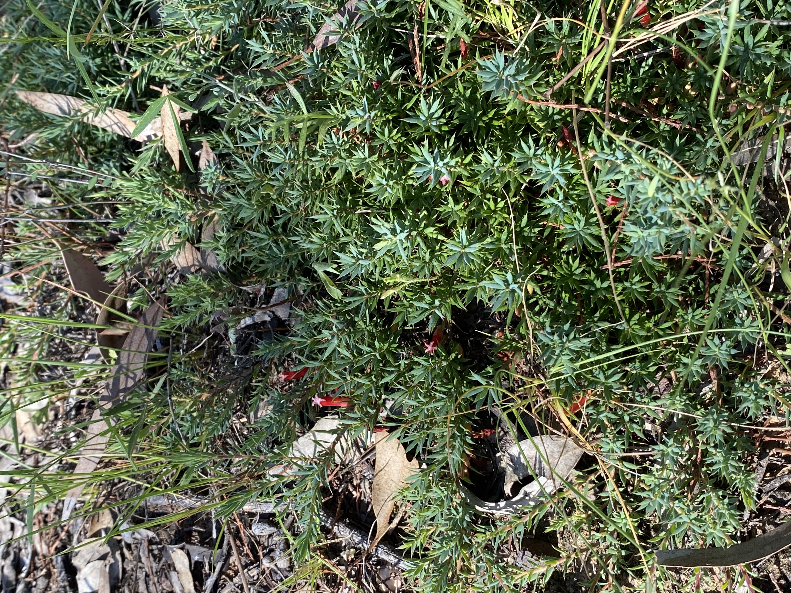

*Photo: Allthingsnative, Glen Davis, New South Wales, 16 January 2021; unchanged; [CC BY-SA 4.0](https://creativecommons.org/licenses/by-sa/4.0/). [Original and attribution](https://commons.wikimedia.org/wiki/File:Astroloma_humifusum_habit.jpg). The source uses the older synonym. This view shows variable ground-hugging habit but not a ruler, fruit or close diagnostic flower parts.*

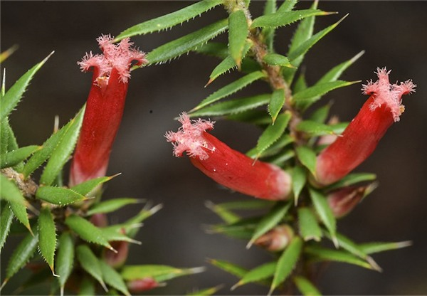

*Photo: Murray Fagg / Australian Plant Image Index, South East Forest National Park, New South Wales; date not stated; unchanged; [CC BY 4.0](https://creativecommons.org/licenses/by/4.0/). [Source fact sheet and attribution](https://apps.lucidcentral.org/plants_se_nsw/text/entities/styphelia_humifusa.htm). It shows the hairy flower lobes and leaf edges, but no scale, whole plant, fruit or matched related species.*

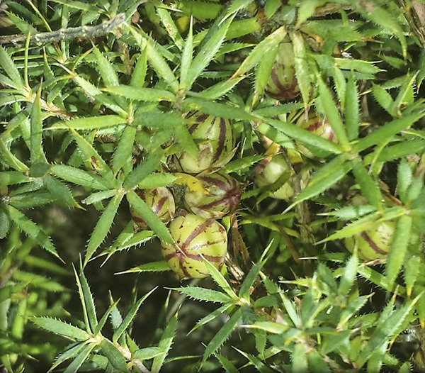

*Photo: Russell Best, east of Ballarat, Victoria; date not stated; unchanged; [CC BY 4.0](https://creativecommons.org/licenses/by/4.0/). [Source fact sheet and attribution](https://apps.lucidcentral.org/plants_se_nsw/text/entities/styphelia_humifusa.htm). Source-identified fruiting stems, not an independent authentication. The photograph has no scale, cut fruit, hard-stone view or lookalike.*

### What the food evidence does—and does not—establish

Several independent sources document people eating the small amount of pulp around the hard stone. An older ANBG compilation describes it as sweet and sticky and records raw use. Older descriptions also call the flavour apple-like. Those are taste expectations after identification, never an identification test.

The fruit is tiny and much of it is hard stone. No defensible measurement of fresh edible-pulp weight, kilojoules, water, safe serving or field-gathering rate was located. It cannot be counted as a ration. The hard stone may also damage a tooth or choke a person if it is put into the mouth carelessly. That is why the page stops before an eating procedure.

### Knowledge kept with Country

- **Dja Dja Wurrung Country, Mount Alexander:** a seasonal calendar compiled by Dja Dja Wurrung Elder and cultural adviser Uncle Rick Nelson, Karl Just and named collaborators records **Gurndi** and says its berries ripen and are ready to eat. The artwork and calendar are not reproduced here.
- **Wadawurrung Country:** Surf Coast Nature Search says its cultural information was supplied by the then-named Wathaurung Aboriginal Corporation, now Wadawurrung Traditional Owners Aboriginal Corporation. It records small edible fruits sought by children.

These accounts are respected as local cultural records. They do not provide this book with a universal Victorian name, a novice botanical key, a safe serving or permission to collect. [Dja Dja Wurrung seasonal calendar](https://www.mountalexander.vic.gov.au/Explore-the-shire/Castlemaine-Botanical-Gardens/Explore-the-collections/Dja-Dja-Wurrung-seasonal-calendar); [Wadawurrung-supplied Surf Coast account](https://scnaturesearch.com.au/plant/Cranberry%20Heath); [ANBG historical food summary](https://www.anbg.gov.au/apu/plants/astrhumi.html). **Entry:** SP-018; education only pending botanist, food-safety and cultural-scope review.

## River mint — Mentha australis

**Status — CULTURAL-NON-HARVEST:** This page records bounded food and cultural context but supplies no wild tea, medicine, oil or food dose.

River mint is a culturally important Victorian plant and a contemporary culinary herb. This page deliberately separates that record from an untested survival recipe.

> **WARNING — DO NOT IMPROVISE A TEA, MEDICINE, OIL OR FOOD DOSE**
>
> **Evidence confidence: High that the named sources document food and cultural uses; High that a 2026 study found variable pulegone in the plant's volatile fraction; Moderate for the source-labelled photographs; Insufficient for a safe amount of wild leaf or for novice identification.** The study measured relative chemical peaks in extracts, not milligrams in a leaf serving. It neither proves that ordinary leaves are poisonous nor supplies a safe dose. No eating instruction is given until a food-safety specialist resolves that exposure and a botanist approves the lookalike comparison.
>
> **Wording confidence: 90% (subjective).** This rates this warning against the cited sources—not identity, safety, technique success or survival.

### Recognition features—not an eating key

- A perennial herb that can form a mat, sprawl or stand to about **80 cm**.
- Four-angled stems, sometimes purple-tinged, ranging from almost hairless to bristly.
- Leaves in opposite pairs, **6–60 mm** long and **4–20 mm** wide, with pointed tips. Their edges may be whole or toothed and their hairiness varies.
- White, pink or purple tube-shaped flowers in compact clusters where the leaves meet the stem.
- A strong mint smell when a leaf is rubbed. Smell is common to several mints and must not decide the identity.
- Wet habitat such as stream and swamp edges or clay depressions. An introduced lookalike, pennyroyal, can occupy seasonally waterlogged ground in Victoria too.

**Botanical checks:** [VicFlora *Mentha australis*](https://vicflora.rbg.vic.gov.au/flora/taxon/c07e6892-942b-41de-bb6e-515108ee79ba), [VicFlora mint genus and key](https://vicflora.rbg.vic.gov.au/flora/taxon/de14cfad-b40f-439c-9d18-d7410b83e49e) and the [CC BY fact sheet](https://apps.lucidcentral.org/plants_se_nsw/text/entities/mentha_australis.htm).

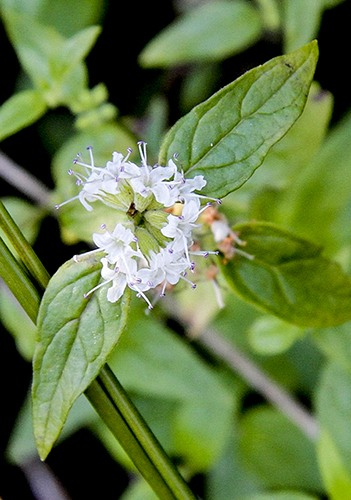

*Photo: Lyn Allison, Melbourne, Victoria; date not stated; unchanged; [CC BY 4.0](https://creativecommons.org/licenses/by/4.0/). [Source fact sheet and attribution](https://apps.lucidcentral.org/plants_se_nsw/text/entities/mentha_australis.htm). The close view does not show plant habit, scale, roots or the calyx details needed for a complete key.*

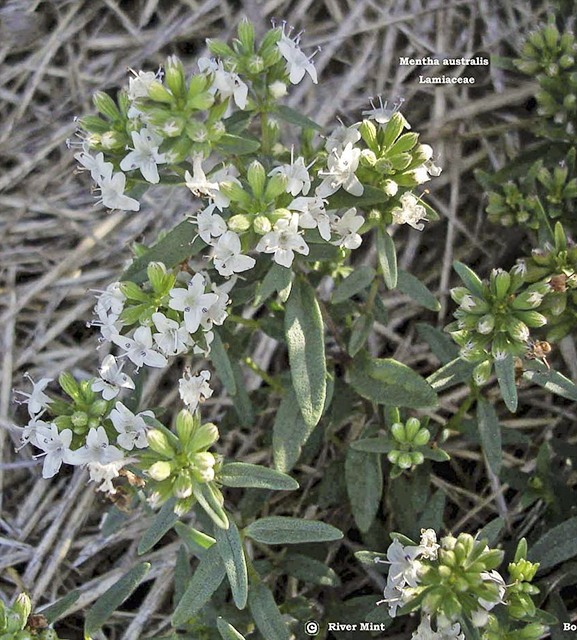

*Photo: Richard Hartland, Victoria; date not stated; unchanged, including the embedded label; [CC BY 4.0](https://creativecommons.org/licenses/by/4.0/). [Source fact sheet and attribution](https://apps.lucidcentral.org/plants_se_nsw/text/entities/mentha_australis.htm). One photographed form only; stem cross-section, scale and matched native mints are absent.*

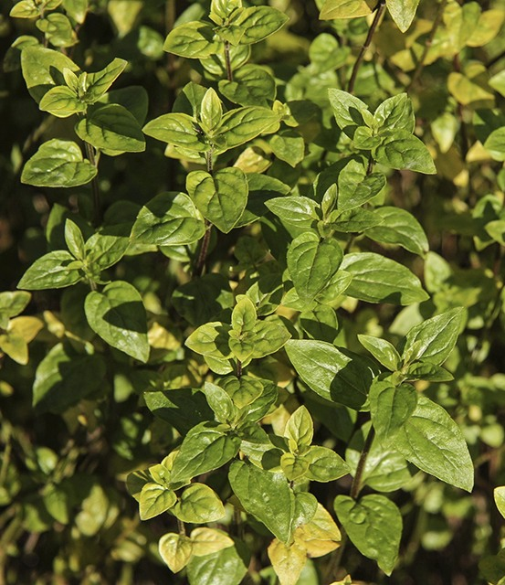

*Photo: Lyn Allison, Melbourne, Victoria; date not stated; unchanged; [CC BY 4.0](https://creativecommons.org/licenses/by/4.0/). [Source fact sheet and attribution](https://apps.lucidcentral.org/plants_se_nsw/text/entities/mentha_australis.htm). This is a useful variation view, not an edible-identification photograph. It may be from the same population as the first Lyn Allison image.*

### Pennyroyal is one reason smell is not enough

Naturalised pennyroyal, *Mentha pulegium*, can also sprawl or root at its nodes and smell mint-like. VicFlora describes smaller, often rounder leaves with blunt or rounded tips, dense mauve-lilac flower clusters and specific ten-veined calyx details. River mint usually has pointed leaves, but leaf shape varies and a picture is not a full key.

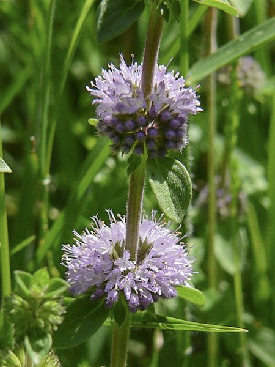

*Photo: Jackie Miles; place and date not stated; unchanged; [CC BY 4.0](https://creativecommons.org/licenses/by/4.0/). [Source fact sheet and attribution](https://apps.lucidcentral.org/plants_se_nsw/text/entities/mentha_pulegium.htm). This is a warning comparison, not a complete identification plate. Safe Work Australia classifies pennyroyal **oil** as toxic if swallowed; that oil warning must not be exaggerated into a measured toxicity claim for every whole leaf.*

Do not taste either plant to decide which it is. Do not distil, extract or swallow essential oil. Do not make a strong infusion from an uncertain mint. [VicFlora pennyroyal account](https://vicflora.rbg.vic.gov.au/flora/taxon/d68a6c49-9295-426e-a4a7-a98fb560a2b1); [Safe Work Australia pennyroyal-oil classification](https://hcis.safeworkaustralia.gov.au/HazardousChemical/Details?chemicalID=5814).

### Why this edition withholds food and medicine instructions

FSANZ records river mint as a traditional Australian food. DJAARA's DJAKITJ enterprise separately describes it as a contemporary culinary herb. No suitable fresh-leaf calorie value was located; in ordinary culinary use it is flavouring, not meaningful survival energy.

A 2026 peer-reviewed comparison found that *M. australis* oil yield was consistently below **0.2% of plant mass**, but the relative share of pulegone within the measured volatile fraction varied. One plant cultivated from a Clifton Hill source had a reported relative peak of about **70% pulegone**. Those are not percentages of the leaf and cannot be turned into a tea strength or safe serving. The result is a reason to pause, not a claim that a normal sprig causes poisoning.

### Cultural record—not clinical treatment

- **Dja Dja Wurrung Country / Djandak:** DJAARA's DJAKITJ enterprise records both a traditional medicinal context and contemporary culinary use. This guide does not repeat the medicinal method or imply a dose or treatment. DJAARA retains its cultural knowledge as Dja Dja Wurrung ICIP.
- **Gunaikurnai Country:** Gunaikurnai Land and Waters Aboriginal Corporation's Whole-of-Country Plan records river mint among plants used by Gunaikurnai ancestors for chest and breathing problems. It gives no recipe or clinical claim.
- **Coranderrk / Woiwurrung record:** Wandoon Estate Aboriginal Corporation's *Plants of Coranderrk* brochure records **Panaryle** and marks food and medicinal uses. Its icons do not define a dose or treatment.
- **Djab Wurrung record:** Museums Victoria's Bunjilaka guide records **Poang-Gurk** and earth-oven flavouring as a bounded museum account, not direct present-day permission or a statewide name.

Attribution confidence in these exact public records is high. Clinical effectiveness and a safe wild-leaf dose are not established. They are not substitutes for asthma medicine, antibiotics, 000, a breathing assessment or any treatment in the first-aid chapter. [DJAKITJ](https://djakitj.com.au/); [GLaWAC Whole-of-Country Plan](https://gunaikurnai.org/wp-content/uploads/2021/07/Gunaikurnai-Whole-of-Country-Plan-ONLINE.pdf); [Plants of Coranderrk](https://nespurban.edu.au/wp-content/uploads/2020/10/Coranderrk-Plant-Brochure-pdf-002.pdf); [Museums Victoria Bunjilaka](https://museumsvictoria.com.au/bunjilaka/about-us/the-plants-of-milarri-garden/); [2026 chemistry study](https://doi.org/10.3390/plants15050778). **Entry:** SP-019; education only.

## Sweet quandong — Santalum acuminatum

**Status — CONDITIONAL FOOD:** Only the ripe outer flesh is considered, after exact identification and lawful, uncontaminated collection. Never eat the kernel using this guide.

This is a northern and north-western Victorian plant, not a general statewide fallback. It is widespread in that part of Victoria but VicFlora describes it as generally uncommon.

> **WARNING — RIPE OUTER FLESH ONLY; DO NOT EAT THE KERNEL**
>
> **Evidence confidence: High for the accepted species, edible ripe flesh and exact FSANZ food record; Moderate for this personal-use preparation summary and the source-labelled images; Insufficient for identifying your specimen without a botanist-reviewed comparison.** VicFlora calls the kernel edible, but a separate bush-food safety review found unusual kernel chemistry and no defensible field dose. This guide therefore excludes every quandong kernel. Red fruit alone is not an identification.
>
> **Wording confidence: 81% (subjective).** This rates this warning against the cited sources—not identity, safety, technique success or survival.

### Features to check together

- An upright shrub or small tree to about **6 m**, often producing new stems from its roots.
- Hairless, spreading to drooping young branches with visible lengthwise angles or ridges.
- Opposite narrow leaves, usually **3–9 cm** long and **3–15 mm** wide, often curved like a sickle. Both surfaces are about the same yellowish-green colour.
- Many small green-to-orange four-part flowers in branched clusters at the ends of stems.
- Round ripe fruit **15–25 mm** across, normally bright, shiny red and rarely yellow.
- A large, very hard stone with deep pits. The edible flesh around it may be only **3–5 mm** thick.

**Habitat and season:** woodland in northern and north-western Victoria. VicFlora records flowering mainly October–May but does not give a single Victorian fruiting period. Rain, locality and individual trees vary. Do not leave a known position on the assumption that fruit will be present.

**Botanical checks:** [VicFlora sweet quandong](https://vicflora.rbg.vic.gov.au/flora/taxon/83d92c86-0107-4c54-9eea-2a24c3fc810d), [Australian National Botanic Gardens](https://www.anbg.gov.au/gnp/interns-2002/santalum-acuminatum.html) and [Plants of South Eastern New South Wales](https://apps.lucidcentral.org/plants_se_nsw/text/entities/santalum_acuminatum.htm).

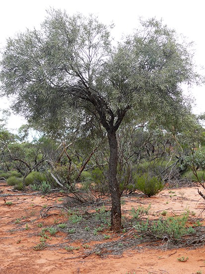

*Photo: Don Wood, Scotia Sanctuary, western New South Wales; date not stated; unchanged; [CC BY 4.0](https://creativecommons.org/licenses/by/4.0/). [Source fact sheet and attribution](https://apps.lucidcentral.org/plants_se_nsw/text/entities/santalum_acuminatum.htm). This non-Victorian view shows one tree form but not root suckers, scale, close bark, flowers or fruit.*

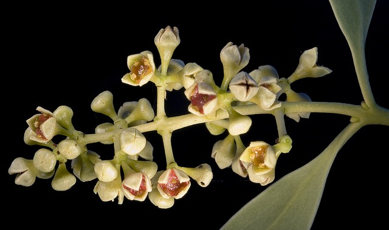

*Photo: Kevin Thiele, Western Australia; date not stated; unchanged; [CC BY 4.0](https://creativecommons.org/licenses/by/4.0/). [Source fact sheet and attribution](https://apps.lucidcentral.org/plants_se_nsw/text/entities/santalum_acuminatum.htm). Detached close view on a dark background; no scale, whole tree, fruit or Victorian voucher.*

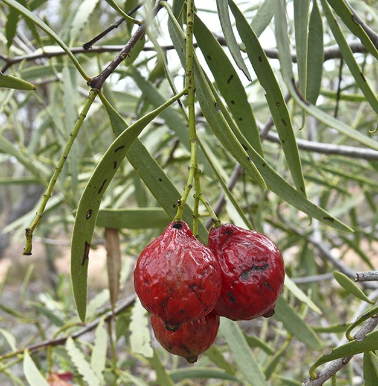

*Photo: Don Wood, Scotia Sanctuary, western New South Wales; date not stated; unchanged; [CC BY 4.0](https://creativecommons.org/licenses/by/4.0/). [Source fact sheet and attribution](https://apps.lucidcentral.org/plants_se_nsw/text/entities/santalum_acuminatum.htm). The source labels these ripe; their wrinkled late-stage appearance must not become the only ripeness rule.*

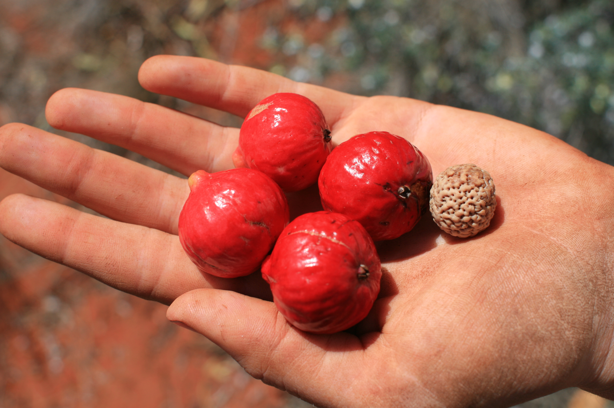

*Photo: JennyKS, Angas Downs, Northern Territory, 3 September 2011; unchanged; [CC BY-SA 3.0](https://creativecommons.org/licenses/by-sa/3.0/). [Original and attribution](https://commons.wikimedia.org/wiki/File:Quandong_(Santalum_acuminatum)_fruit_%26_seeds.JPG). The hand gives rough size context, not a ruler. Fruit and loose stone are source-labelled, not botanist-authenticated for this book.*

### Bitter quandong: a named Victorian comparison

Victoria also has bitter quandong, *Santalum murrayanum*. VicFlora says its fruit flesh is exceedingly bitter and inedible. Its leaves are usually much narrower and shorter—mostly **1.5–3.5 cm** by **1.5–4 mm**—and can occur in whorls of three. Authoritative descriptions disagree about fruit colour: VicFlora says green to brownish, while a Lucid fact sheet says red to brownish red. More useful specialist features include the narrower leaves and the flower parts falling away to leave a circular scar at the top of the fruit; in sweet quandong those parts persist. The bitter-quandong stone is described as wrinkled or only slightly pitted rather than deeply pitted. These differences require the whole plant and expert review; do not use taste or fruit colour to settle them.

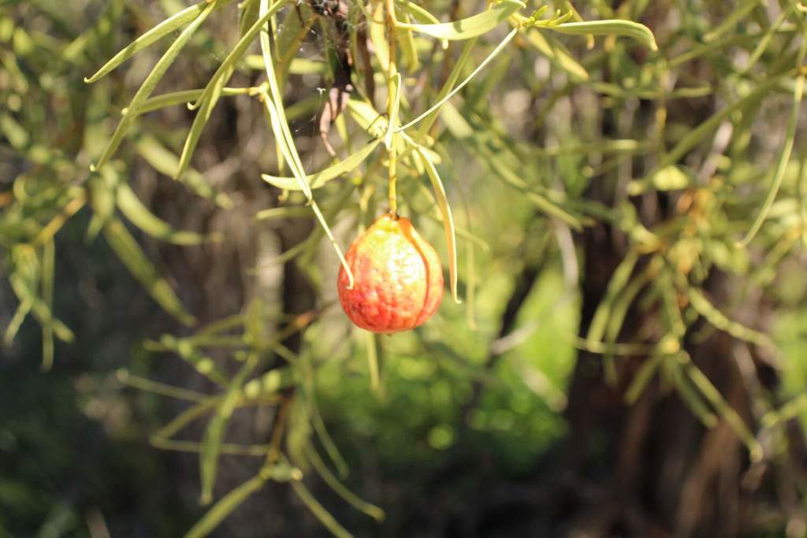

*Photo: Em Lamond, Western Australia, 8 September 2021; unchanged; [CC BY 4.0](https://creativecommons.org/licenses/by/4.0/). [Original, observation link and attribution](https://commons.wikimedia.org/wiki/File:Santalum_murrayanum.jpg). The source links an iNaturalist observation rather than a herbarium voucher, so specialist review is still required. The orange-red fruit agrees with one authoritative description but not another: useful proof that colour alone cannot clear a specimen.*

For the limited sweet-quandong use below, stop if the fruit is not bright shiny red. A red fruit is still **not** positive identification because bitter quandong may also be reddish. Stop as well if the leaves are short and extremely narrow or whorled, the terminal flower-cluster pattern is absent, the flower parts do not persist at the top of the fruit, the hard stone is not deeply pitted, or any other feature conflicts. Other Victorian *Santalum* species include threatened plants. [VicFlora bitter quandong](https://vicflora.rbg.vic.gov.au/flora/taxon/41325b21-f3b1-4da4-b203-cf178a47aedd), [Lucid bitter-quandong comparison](https://keys.lucidcentral.org/keys/v3/scotia/key/Plants%20and%20Fungi%20of%20south%20western%20NSW/Media/Html/Santalum_murrayanum.htm) and [Critically Endangered northern sandalwood](https://vicflora.rbg.vic.gov.au/flora/taxon/3e8ef0a8-298f-4447-8f75-c2115bbe237d).

### Conditional ripe-flesh use

Only after the tree is already known with certainty, collection is lawful, the site is uncontaminated and the fruit can be traced to the checked branch:

1. Select intact, sound, bright red ripe fruit. This edition excludes the rare yellow form because the lookalike gate is incomplete.
2. Reject mouldy, damaged, animal-fouled, flood-exposed, fallen or chemically treated fruit. Unknown pesticide or herbicide history means stop.
3. Rinse with drinking-quality water. Split the fruit with clean fingers or a clean knife.
4. Remove the entire hard stone. Eat only the surrounding soft outer fruit tissue. Do not crack, roast, grind or eat the kernel inside the stone.

**Expected taste:** published descriptions range from sweet to tart, tangy, somewhat astringent and not especially sweet. FSANZ records **8.1 g total sugars per 100 g** in its analysed commercial flesh. Tree, ripeness and processing matter. Strong bitterness is a stop signal after an already identified fruit has been opened; it is never a taste test for identity.

**Food value:** current FSANZ data give **213 kJ per 100 g including fibre**, about **51 kcal**, for commercially supplied frozen fruit flesh with kernels removed. The database labels the source as analysed; its energy figure is calculated from measured nutrient components. It is not a measurement of whole fruit, stones or a Victorian wild tree. At that exact value, 250 g of weighed edible flesh would be about **533 kJ or 127 kcal**—about **6.1%** of the 8700 kJ food-label reference. That is arithmetic, not a serving recommendation. Gathering 250 g of edible tissue may require many fruits because most of each fruit is stone.

An older Australian table gives **335 kJ per 100 g** as an average of four raw fruit samples. The sample origin is not stated, and the result differs materially from the current commercial frozen record. The two values are kept separate rather than averaged. No safe serving, allergy-free claim, wild yield or personal energy requirement has been established.

**Why the kernel is excluded:** a 2001 safety review says kernels can be rich in oil and protein but reports that **32–46% of their fatty acids** in five *Santalum* species was the unusual santalbic acid. Rats fed an extreme diet in which kernels supplied half of absorbed energy showed liver biochemical and metabolic effects. The review also found a strongly variable unpleasant compound that roasting did not remove. This does not prove that one kernel poisons a person. It does mean this guide has no evidence-based field dose or processing method and will not turn a calorie-dense kernel into advice.

**Cultural attribution gap:** sweet quandong is culturally important in many parts of Australia, but no Victoria-specific Traditional Owner account suitable for reuse was located in this pass. The guide therefore assigns no Victorian Aboriginal name and does not import a method from another Country. This is an explicit research gap, not a denial of cultural knowledge.

**Food and safety checks:** [FSANZ traditional-food record](https://www.foodstandards.gov.au/sites/default/files/2025-10/Record%20of%20Views%20updated%20October%202025.pdf), [FSANZ food record F007571](https://www.foodstandards.gov.au/science-data/food-nutrient-databases/afcd/search/food/F007571), [FSANZ energy method](https://www.foodstandards.gov.au/science-data/food-nutrient-databases/afcd/search/nutrients/ENERGY-04) and the [RIRDC bush-food safety review](https://www.ausbushfoods.com/bushfoodsonline/reports/Safety/bush_food_safety-01-28.pdf). **Entry:** SP-020; conditional ripe-flesh page only, kernel withheld.

## Kangaroo apples — recognise and avoid

**Status — DO NOT EAT:** Do not taste kangaroo-apple fruit at any stage using this guide.

Victoria has two widespread native plants commonly called kangaroo apple: *Solanum aviculare* and *Solanum laciniatum*. Historical food records exist, but this personal guide does not convert them into emergency eating advice.

> **WARNING — DO NOT EAT OR TASTE KANGAROO APPLE**
>
> **Evidence confidence: High for the accepted Victorian species, their described mature fruit colours, the presence of solasodine-related compounds and their listing in the Food Standards Code; Moderate for the source-labelled photographs; Insufficient for a safe wild serving, preparation, novice identification or harmless taste test.** Even ripe fruit has been reported to retain some solasodine. No evidence located for this edition shows what amount, if any, would be safe for a stranded person.
>
> **Wording confidence: 94% (subjective).** This rates this warning against the cited sources—not identity, safety, technique success or survival.

The Food Standards Code lists *S. aviculare* and *S. laciniatum* in Schedule 23 as prohibited plants for food that is sold, processed or handled for sale, or imported. That commercial rule is not by itself a diagnosis of poisoning from one fruit. Together with unresolved alkaloid dose, lookalikes and identification difficulty, however, it is a strong reason not to issue a personal field-eating recipe.

### Know what the warning may look like

| Feature | *Solanum aviculare* | *Solanum laciniatum* |
|---|---|---|
| Form | Shrub or small tree to about 4 m; no prickles | Shrub to about 3 m; often purplish stems; no prickles |
| Leaves | Large and either deeply lobed or narrow and entire | Large and either deeply lobed or narrow and entire; the lobed form can be especially broad |
| Flowers | Blue-violet, usually about 25–40 mm across, with pointed lobes | Deep purplish-blue, usually about 30–50 mm across, with notched lobes |
| Fruit colour described by VicFlora | Orange-red to scarlet | Yellow to orange-yellow |
| Fruit size described by VicFlora | About 10–15 mm across | About 15–20 mm across |

These differences overlap in a real plant and require more than a photograph. VicFlora warns that ripe fruit is necessary for reliable identification of many *Solanum* species. A purple flower, lobed leaf or orange fruit never means “edible kangaroo apple”.

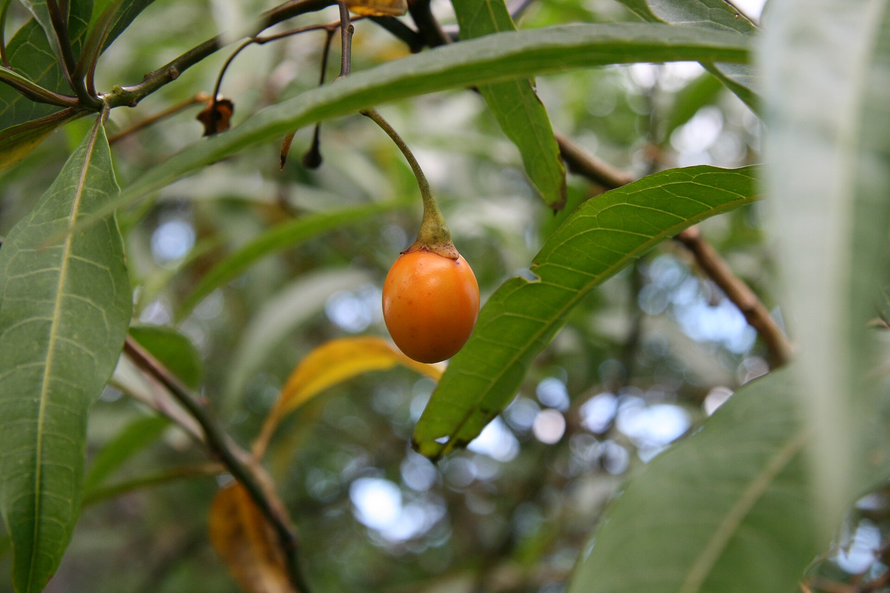

*Photo: Casliber, Marrickville, New South Wales, 25 July 2010; Wikimedia display derivative, otherwise unchanged; [CC BY-SA 4.0](https://creativecommons.org/licenses/by-sa/4.0/). [Original and attribution](https://commons.wikimedia.org/wiki/File:Saviculare.jpg). One urban, source-identified fruit without a ruler, flowers, whole habit or linked voucher. Colour agrees with the mature-fruit description but does not establish safety.*

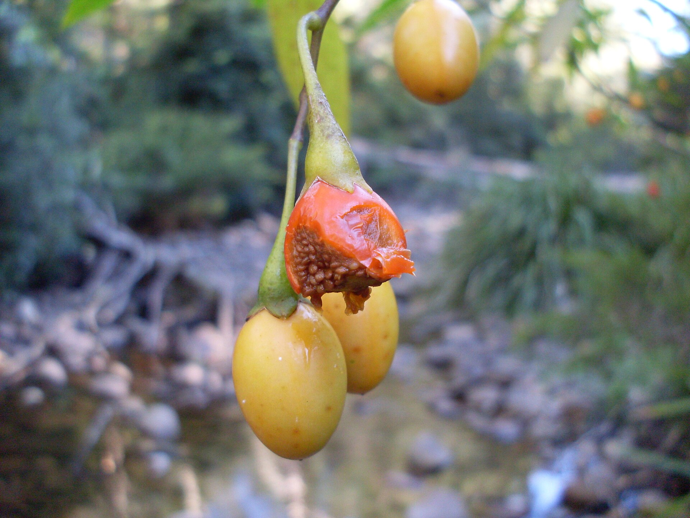

*Photo: John Tann, Bimberamala Creek, Morton National Park, New South Wales, 9 May 2009; Wikimedia display derivative, otherwise unchanged; [CC BY 2.0](https://creativecommons.org/licenses/by/2.0/). [Original and attribution](https://commons.wikimedia.org/wiki/File:Solanum_aviculare_fruit_3.jpg). Mixed colours and damage make this a warning against colour-only decisions, not a ripening sequence.*

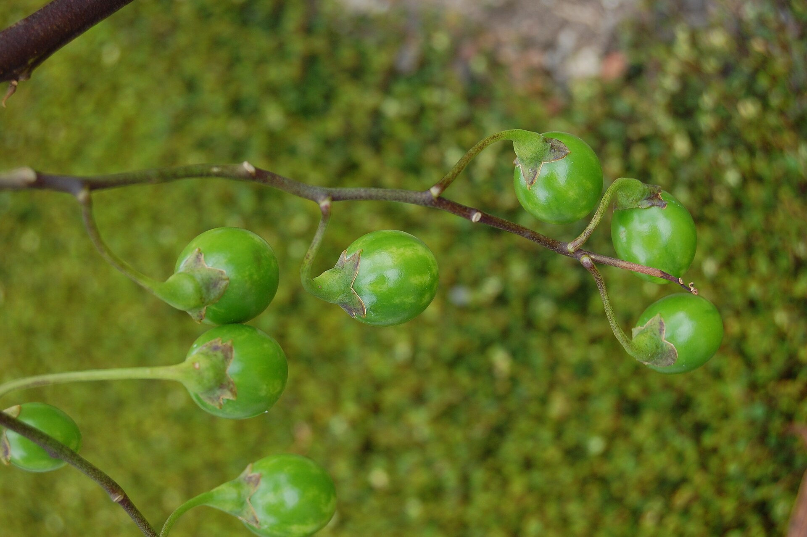

*Photo: Wikimedia user Rl, 28 July 2007; place not supplied; Wikimedia display derivative, otherwise unchanged; [CC BY-SA 3.0](https://creativecommons.org/licenses/by-sa/3.0/). [Original and attribution](https://commons.wikimedia.org/wiki/File:2007_solanum_laciniatum_2.jpg). The plant is source-identified, but the stage is an inference. There is no ruler, locality, whole habit or linked voucher.*

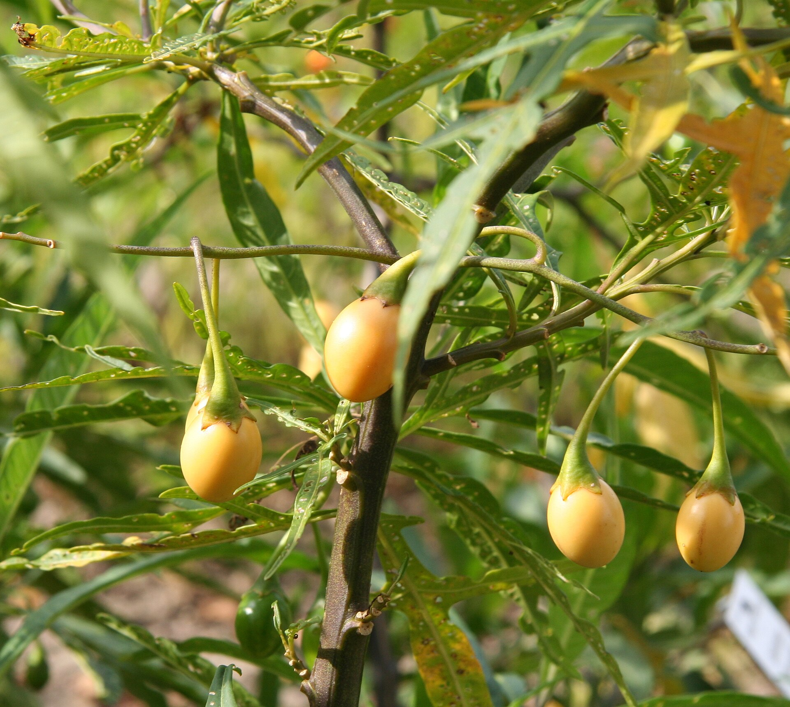

*Photo: Michael Wolf, Penig, Botanischer Garten Dresden, Germany, 28 September 2016; Wikimedia display derivative, otherwise unchanged; [CC BY-SA 3.0](https://creativecommons.org/licenses/by-sa/3.0/). [Original and attribution](https://commons.wikimedia.org/wiki/File:Solanum_laciniatum_fruits_01.jpg). This cultivated non-Australian specimen shows a source-identified ripe-colour stage, not Victorian habitat, a safe serving or a colour test.*

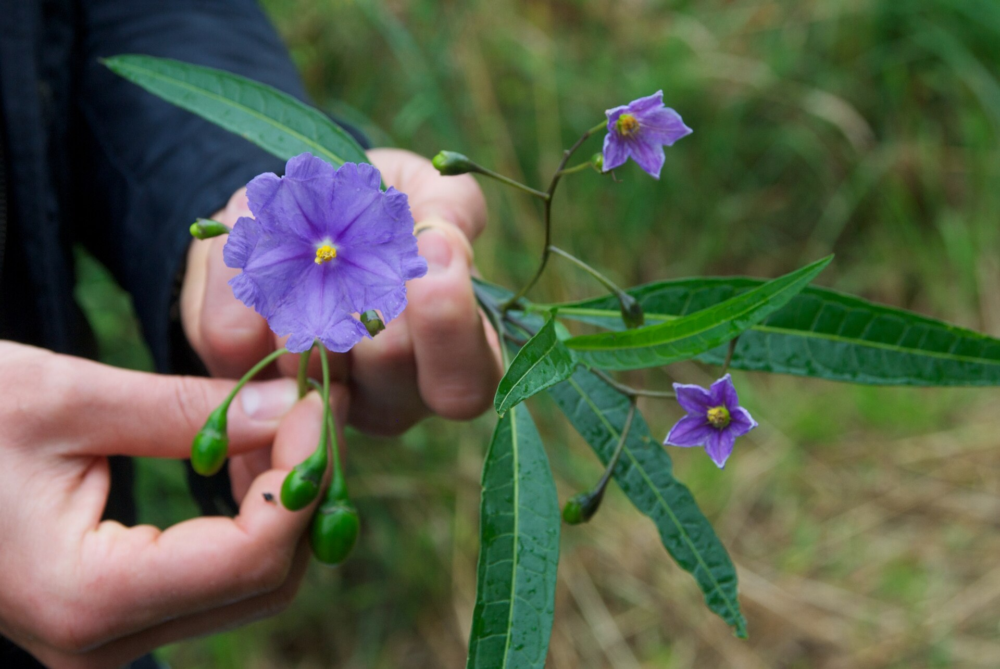

*Photo: Jon Sullivan, Akaroa area, New Zealand, 22 January 2011; Wikimedia display derivative, otherwise unchanged; [CC BY-SA 4.0](https://creativecommons.org/licenses/by-sa/4.0/). [Original and attribution](https://commons.wikimedia.org/wiki/File:Solanum_laciniatum_and_Solanum_aviculare.jpg). Supporting difference only: *S. laciniatum* is at left and *S. aviculare* at right. These are cut, hand-held sprigs without a ruler or whole-plant context.*

### Food value, taste and cultural boundary

**Calories:** no value is supplied because this page gives no safe serving or eating clearance. A calorie number could wrongly make a hazardous experiment look worthwhile.  
**Expected taste:** none is supplied. Do not taste an unknown nightshade. Bitterness is neither a safe dose measure nor an identification method.  
**If someone eats it:** remove remaining plant material from the mouth, keep a sample or clear photograph if this can be done safely, and call the Poisons Information Centre on **13 11 26**. Call **000** first for collapse, abnormal breathing, a seizure or serious symptoms. Do not induce vomiting.

The Australian Government's *Flora of Australia* records a historical account of ripe *S. aviculare* berries being eaten in the Lake Condah area. A bush-food safety review also records historical use of ripe fruit from both species while noting solasodine in ripe fruit. These sources show that the knowledge and context were more exact than “all kangaroo apples are food”. They do not give this book current permission, a culturally authorised method, a safe serving or a novice key. No direct current Traditional Owner-controlled source suitable for a preparation account was located, so no community name or method is added.

**Checks:** [VicFlora *S. aviculare*](https://vicflora.rbg.vic.gov.au/flora/taxon/c016037c-901d-445f-abb3-ab681d0e11fb), [VicFlora *S. laciniatum*](https://vicflora.rbg.vic.gov.au/flora/taxon/405b3c14-17cb-41ab-a549-f3aab34e2281), [VicFlora genus warning](https://vicflora.rbg.vic.gov.au/flora/taxon/2557555f-7c74-48bc-bb1d-286fe65f860f), [Flora of Australia volume 29](https://www.dcceew.gov.au/sites/default/files/env/pages/94a0be92-9b0b-42f6-b37e-b3c0798f94fa/files/flora-australia-29-solanaceae.pdf), [bush-food safety review](https://www.ausbushfoods.com/bushfoodsonline/reports/Safety/bush_food_safety-01-28.pdf) and [current Schedule 23](https://www.legislation.gov.au/F2015L00435/latest/text). **Entry:** SP-027; hazard recognition only.

## Common apple-berry — Billardiera mutabilis

**Status — DO NOT EAT:** Use this page for education only; the guide cannot reliably separate every specimen from the endangered relative.

This slender climber is common through much of Victoria. Its fruit has a well-documented food history, but this page is deliberately a recognition lesson rather than an eating instruction.

> **WARNING — EDUCATION ONLY; DO NOT IDENTIFY OR EAT AN APPLE-BERRY FROM THIS PAGE**
>
> **Evidence confidence: High for the accepted species, the cited Victorian features and published ripe-fruit food record; Moderate for the source-labelled photographs; Insufficient for a novice to separate every specimen from the endangered common apple-berry, *Billardiera scandens*, or to choose a safe serving.** VicFlora says the two species can be difficult to distinguish and records intermediate plants in parts of north-eastern and eastern Victoria. No botanist or food-safety specialist has approved this page. It gives no field-eating procedure.
>
> **Wording confidence: 92% (subjective).** This rates this warning against the cited sources—not identity, safety, technique success or survival.

### Features to learn together

- A slender twining or scrambling plant that uses other vegetation for support. It may climb to about **2 m**, but the pictures below do not show a complete whole-plant habit.
- Thin, hairless leaves attached directly or almost directly to the stem, usually **18–80 mm long** and **3–18 mm wide**. They are narrow to narrowly egg-shaped and may have gently wavy edges.
- Hanging bell-like flowers on slender stalks. They begin yellow-green and can develop blue, mauve or purple colouring as they age.
- A plump oblong berry about **10–20 mm long**, usually green or yellowish and mostly hairless, containing many seeds.

**Habitat and season:** VicFlora records it in heathland, woodland and forest from near sea level to the subalps. Flowering is mainly September–January. A Surf Coast account describes fruit from autumn onward, while PlantNET says probably late summer. These are local or broad guides, not a guaranteed Victorian fruit calendar.

**Botanical checks:** [VicFlora common apple-berry](https://vicflora.rbg.vic.gov.au/flora/taxon/169cd940-d54d-4f2c-9160-f723f9551d5c), [NSW PlantNET](https://plantnet.rbgsyd.nsw.gov.au/cgi-bin/NSWfl.pl?lvl=sp&name=Billardiera~mutabilis&page=nswfl) and [Plants of South Eastern New South Wales](https://apps.lucidcentral.org/plants_se_nsw/text/entities/billardiera_mutabilis.htm).

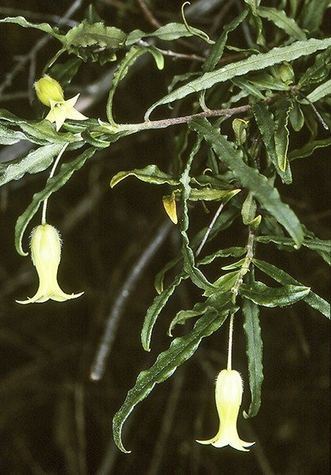

*Photo: Don Wood, Bomaderry Creek Regional Reserve near Nowra, New South Wales; date not stated; unchanged; [CC BY 4.0](https://creativecommons.org/licenses/by/4.0/). [Source fact sheet and attribution](https://apps.lucidcentral.org/plants_se_nsw/text/entities/billardiera_mutabilis.htm). This non-Victorian view shows flowers and leaves, not whole habit, fruit, scale or the endangered comparison species.*

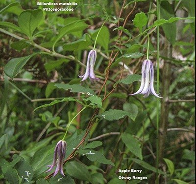

*Photo: Richard Hartland, Otway Ranges, Victoria; date not stated; unchanged, including the embedded labels; [CC BY 4.0](https://creativecommons.org/licenses/by/4.0/). [Source fact sheet and attribution](https://apps.lucidcentral.org/plants_se_nsw/text/entities/billardiera_mutabilis.htm). The small Victorian view helps show flower-colour change and one climbing form, but it has no scale, ripe fruit or matched lookalike.*

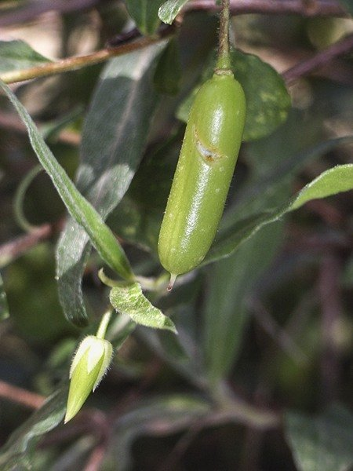

*Photo: Russell Best, Macedon Ranges, Victoria; date not stated; unchanged; [CC BY 4.0](https://creativecommons.org/licenses/by/4.0/). [Source fact sheet and attribution](https://apps.lucidcentral.org/plants_se_nsw/text/entities/billardiera_mutabilis.htm). The source identifies the taxon, but the fruit's eating-stage ripeness is not established. It is not an eating clearance.*

### Why the endangered relative stops an eating instruction

The current narrow species *Billardiera scandens* is listed Endangered in Victoria. Compared with *B. mutabilis*, it is usually more shrub-like, has more strongly rolled-under leaf edges, shorter and stouter flower or fruit stalks, and fruit covered in dense hairs. Those are useful study points, not a novice decision key. VicFlora says separation can still be difficult and records intermediate plants around Beechworth, Lake Hume and the Snowy River. Do not collect either species when there is doubt. [VicFlora *B. scandens*](https://vicflora.rbg.vic.gov.au/flora/taxon/6c325a2f-c22e-4773-83ae-6c5a2a810385); [Victorian conservation assessment](https://bio-prd-naturekit-public-data.s3.ap-southeast-2.amazonaws.com/species_assessments/Billardiera_scandens_504290.pdf).

### Food, expected taste and energy limits

VicFlora describes *B. mutabilis* fruit as edible. A Surf Coast page says the ripe fruit becomes translucent and very sticky. The same page attributes a stewed-apple taste description to information supplied by the then-named Wathaurung Aboriginal Corporation. **That expected taste is context only after expert identification. It is not an identification test.** Do not taste an unknown berry.

No reliable species-specific result was found for fresh kilojoules, calories, edible-pulp weight, allergens, toxicology or a safe amount. The fruit is small and contains many seeds. Calling it a useful calorie source would be guesswork. Older instructions filed under the broad name *B. scandens* may predate the modern species split and are not transferred here.

### Knowledge kept with its source

The Surf Coast plant page is not controlled by the present Wadawurrung Traditional Owners Aboriginal Corporation. It states that its Indigenous-use information was supplied by the organisation under its former Wathaurung name. This guide preserves that publisher, former name, plant and place together; it does not turn the statement into generic “Aboriginal knowledge”, a statewide name or permission to collect. [Surf Coast common apple-berry page](https://scnaturesearch.com.au/plant/Common%20Apple-berry); [site attribution statement](https://www.scnaturesearch.com.au/contact/).

**Entry:** SP-022; education only. Upgrade requires a botanist-approved plate of both *Billardiera* species and intermediates, a conservation and lawful-site rule, food-safety review, and direction from the relevant Traditional Owner organisation for any cultural detail.

## Kangaroo grass — Themeda triandra

**Status — CULTURAL-NON-HARVEST:** The page records botanical and cultural context, not a seed-harvest or flour-making procedure.

Kangaroo grass is one of Victoria's most widespread native grasses. Its seed-food history matters, but a stranded person should not mistake cultural importance for an easy handful of emergency grain.

> **WARNING — EDUCATION ONLY; DO NOT HARVEST, TASTE OR GRIND WILD SEED FROM THIS PAGE**
>
> **Evidence confidence: High for the accepted species, the cited Victorian features and the documented history of grinding seed into flour; Moderate for the source-labelled photographs; Insufficient for novice grass identification, a safe raw or cooked serving, a field calorie return or sustainable wild harvest.** Only small amounts ripen together, ripe seed falls quickly, and no specialist has approved an emergency preparation. This page gives no harvest or recipe.
>
> **Wording confidence: 91% (subjective).** This rates this warning against the cited sources—not identity, safety, technique success or survival.

### Features to learn together

- A tufted perennial grass, often **50–100 cm** tall. Green leaves and stems may turn reddish, copper or purple as flowering develops or conditions change.
- Narrow leaf blades to about **50 cm long** and **5 mm wide**.
- A drooping or one-sided, many-branched flowering head about **10–25 cm long**.
- Clusters containing small spikelets. The fertile spikelet has silky brown hairs and a strong purple-brown awn—the long bristle—about **4–8 cm** long and bent twice when mature.
- Colour alone proves nothing. Age, fire, rain, grazing and locality all change the plant's appearance.

**Habitat and season:** widespread in Victorian grassland and woodland, but uncommon in the Otways and subalps and generally absent from permanently wet, very dry, salty or heavily shaded ground. VicFlora records flowering through much of the year, mainly October–March.

**Botanical checks:** [VicFlora](https://vicflora.rbg.vic.gov.au/flora/taxon/5c4beccd-3eef-434d-9769-4d187abb91e9), [NSW PlantNET](https://plantnet.rbgsyd.nsw.gov.au/cgi-bin/NSWfl.pl?lvl=sp&name=Themeda~triandra&page=nswfl) and the [Australian National Botanic Gardens profile](https://www.anbg.gov.au/apu/plants/themtria.html).

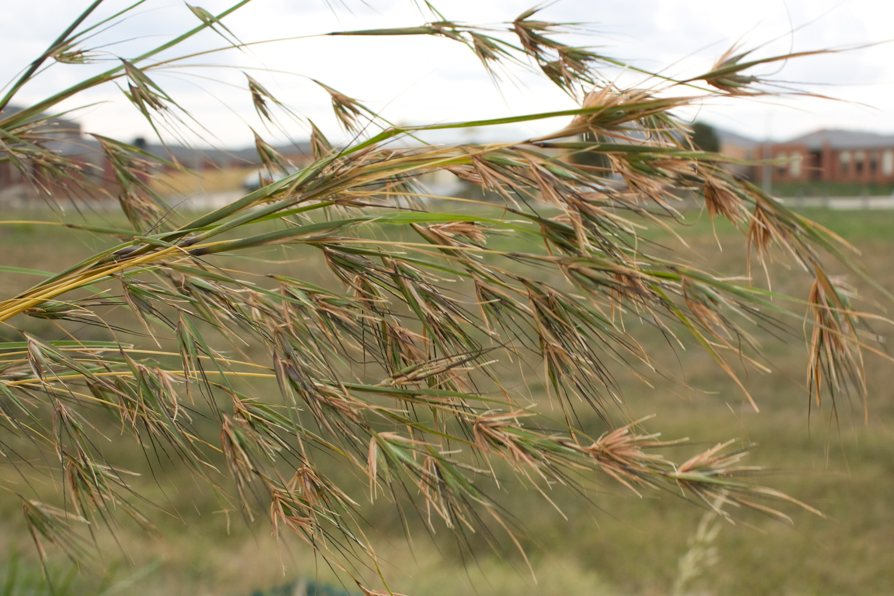

*Photo: Rexness, Wyndham Vale, Victoria, 18 April 2010; unchanged; [CC BY-SA 2.0](https://creativecommons.org/licenses/by-sa/2.0/). [Original and attribution](https://commons.wikimedia.org/wiki/File:Kangaroo_Grass_(Themeda_triandra),_Wyndham_Vale_Australia_(4530201149).jpg). This is a useful Victorian head-and-landscape view, not a full tussock, ruler, ripe-seed test or botanist-authenticated plate.*

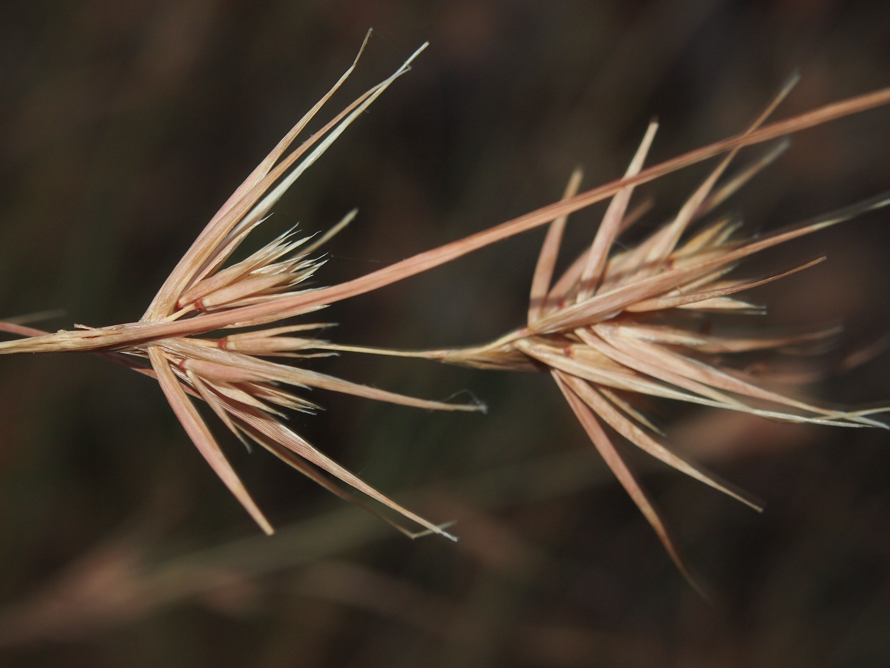

*Photo: Mark Marathon, Northern Territory, 15 June 2017; unchanged; [CC BY-SA 4.0](https://creativecommons.org/licenses/by-sa/4.0/). [Original and attribution](https://commons.wikimedia.org/wiki/File:Kangaroo_grass_seedheads.jpg). The dry non-Victorian view shows one late-stage appearance. It does not establish that seed is present, edible, uncontaminated or ready to gather.*

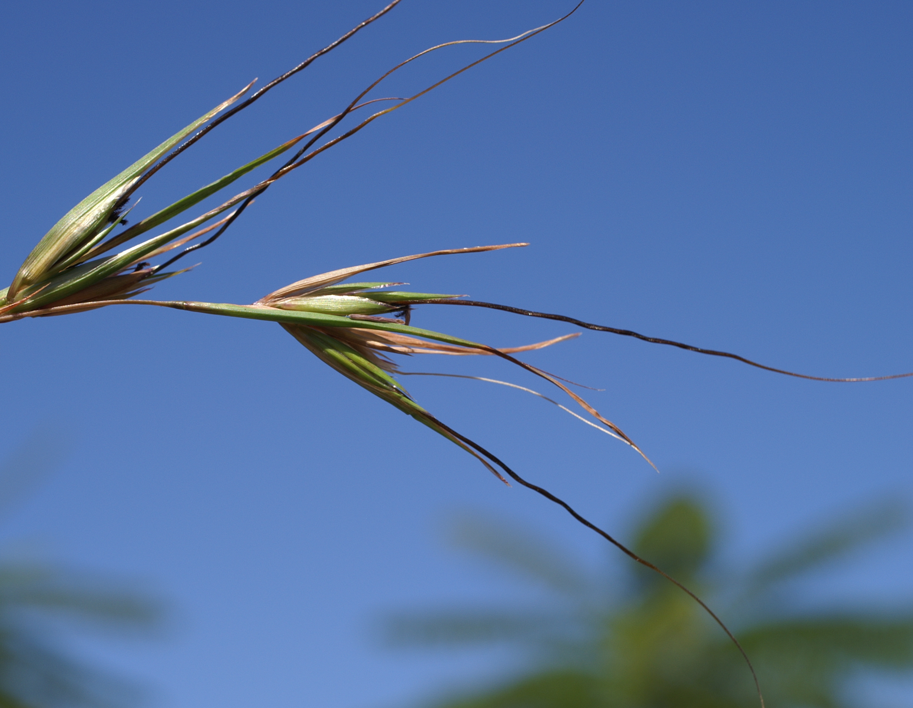

*Photo: Harry Rose / Macleay Grass Man, New South Wales, 12 April 2006; unchanged; [CC BY 2.0](https://creativecommons.org/licenses/by/2.0/). [Original and attribution](https://commons.wikimedia.org/wiki/File:Themeda_triandra_spikelets5_(9604160120).jpg). Close detail is useful, but the plant has no linked herbarium voucher, scale, leaves or whole tussock.*

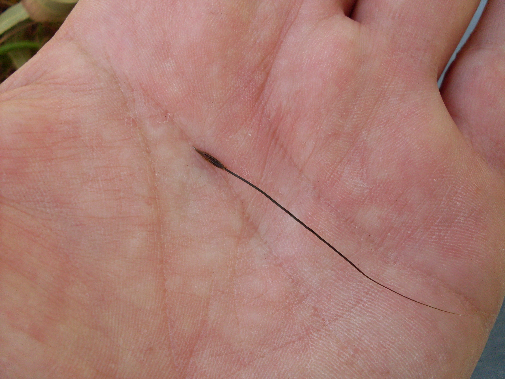

*Photo: John Tann, Jannali, New South Wales, 21 December 2008; unchanged; [CC BY 2.0](https://creativecommons.org/licenses/by/2.0/). [Original and attribution](https://commons.wikimedia.org/wiki/File:Kangaroo_grass_seed_(3128071954).jpg). The hand gives rough context, not a measurement. The source notes that the fresh awn curls after several hours. A detached seed cannot identify the plant or clear it for food.*

### Food work, taste and calorie return

Historical and contemporary sources record kangaroo-grass seed being ground into flour and baked. That does not make it a quick survival snack. The Australian National Botanic Gardens notes that only small amounts ripen at once and seed falls rapidly. Modern agronomy also reports uneven ripening, seed shattering, variable seed quality, low yield and difficult harvesting and processing.

No defensible wild-serving kilojoule or calorie value is available. A CSIRO summary of a Wadawurrung-led research partnership says analysed kangaroo-grass grain had promising protein and carbohydrate results compared with whole wheat, but it does not publish the numerical energy result. A 2023 study deliberately hid the mapping between native species and its nutrition table; its kangaroo-grass material was a composite because there was too little seed. Those numbers cannot be reverse-engineered and assigned to this plant. Livestock-feed values are not human grain nutrition.

**Expected taste:** no reliable, species-specific, simply prepared wild-grain taste benchmark was found. This guide will not invent one. Raw-snacking advice is withheld because the food record centres on processed seed and no field-safety study establishes a raw amount. Even if a future cultivated-grain value proves useful, the energy spent searching, collecting, separating, grinding and cooking still matters.

### Three cultural records that must not be merged

- **Dja Dja Wurrung Country / Djandak:** DJAARA's DJAKITJ enterprise publishes **Buwatj** for *Themeda triandra* and describes seed flour within contemporary Dja Dja Wurrung food work. DJAARA also states that its cultural material must not be misused or published without prior consent. This personal guide records only that attribution and does not reproduce its method, images or Cultural Fire teaching.
- **Coranderrk / Woiwurrung record:** Wandoon Estate Aboriginal Corporation's *Plants of Coranderrk* brochure records **BUATH** beside *Themeda triandra* and marks food and cultural use. An icon supplies no recipe, safe amount or general collection permission.
- **Wadawurrung-led contemporary research:** CSIRO reports a partnership with Wadawurrung Traditional Owners Aboriginal Corporation examining grassland restoration, nutrition and food sovereignty. This is living, governed work—not raw material for an improvised survival recipe.

These names and records answer cultural questions on their own Countries. They do not replace botanical identity, food safety, nutrition or permission, which answer different questions. Do not convert any Cultural Fire account into an instruction to burn grassland. [DJAKITJ](https://djakitj.com.au/); [DJAARA reuse notice](https://djadjawurrung.com.au/resources/); [Plants of Coranderrk brochure](https://nespurban.edu.au/wp-content/uploads/2020/10/Coranderrk-Plant-Brochure-pdf-002.pdf); [CSIRO Wadawurrung partnership](https://www.csiro.au/en/news/All/Articles/2024/January/Wadawurrung-grasslands-nutrition).

**Entry:** SP-023; education only and non-harvest. Any future preparation belongs in a cultivated-source, Traditional Owner-led and specialist-reviewed context, not opportunistic wild collection.

## Coast beard-heath — Leucopogon parviflorus

**Status — DO NOT EAT:** This education page supplies no eating or harvesting instruction and cannot exclude every similar white-fruited heath.

This coastal shrub bears tiny white fruit with a documented food history. The fruit is too small and the evidence too limited to promise meaningful emergency energy.

> **WARNING — EDUCATION ONLY; PROTECTED-FLORA AND LOOKALIKE CHECKS ARE INCOMPLETE**
>
> **Evidence confidence: High for the accepted species, Victorian coastal range, cited features and documented ripe-flesh food use; Moderate for the source-labelled photographs; Insufficient for novice identification, a safe serving, a reliable fresh-calorie value or public-land collection.** Victoria has several small white-fruited *Leucopogon* species. Native Ericaceae are declared restricted-use protected flora. No eating or harvesting instruction is given.
>
> **Wording confidence: 92% (subjective).** This rates this warning against the cited sources—not identity, safety, technique success or survival.

### Features to learn together

- An upright shrub or small tree, usually **1–5 m** high. On exposed dunes it may be much lower and wind-shaped.
- Narrow, smooth leaves about **15–35 mm long** and **3–7 mm wide**, often paler or bluish-green underneath. The thickened tip is channelled above.
- Short flower spikes near the ends of branches, each holding about **6–13 small white flowers**.
- Dense white hairs inside the flower tube and on the lobes—the “beard”.
- Round fleshy fruit about **4.5–5 mm** across, white when ripe, with a large hard stone.

**Habitat and season:** common on dunes and sandstone or limestone slopes along almost the whole Victorian coast, usually close to the sea. VicFlora records flowering mainly September–November. A South Australian source gives fruit September–February; this is not presented as a verified statewide Victorian calendar.

**Botanical checks:** [VicFlora](https://vicflora.rbg.vic.gov.au/flora/taxon/a0c8b368-801a-4fd9-bc60-1a8f39bd01a6), [NSW PlantNET](https://plantnet.rbgsyd.nsw.gov.au/cgi-bin/NSWfl.pl?lvl=sp&name=Leucopogon~parviflorus&page=nswfl) and [Plants of South Eastern New South Wales](https://apps.lucidcentral.org/plants_se_nsw/text/entities/leucopogon_parviflorus.htm).

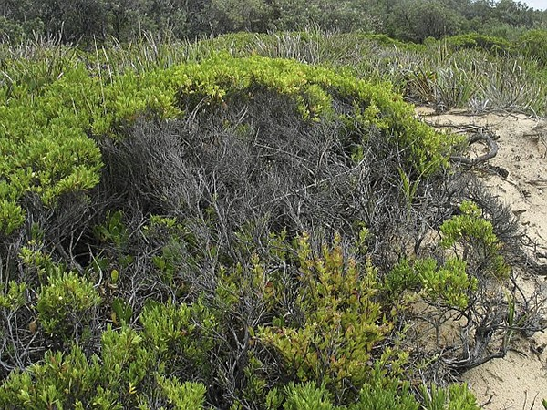

*Photo: Jackie Miles; place and date not stated; unchanged; [CC BY 4.0](https://creativecommons.org/licenses/by/4.0/). [Source fact sheet and attribution](https://apps.lucidcentral.org/plants_se_nsw/text/entities/leucopogon_parviflorus.htm). The source identifies the species, but this is one unmeasured habit view without flowers, fruit or nearby comparison shrubs.*

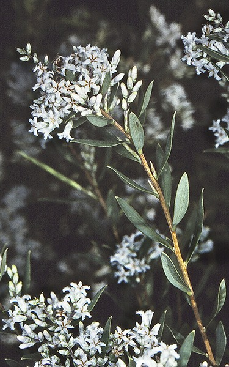

*Photo: Don Wood, Warden Head, Ulladulla, New South Wales; date not stated; unchanged; [CC BY 4.0](https://creativecommons.org/licenses/by/4.0/). [Source fact sheet and attribution](https://apps.lucidcentral.org/plants_se_nsw/text/entities/leucopogon_parviflorus.htm). The non-Victorian view shows repeated flower spikes and leaves, but not ripe fruit, scale or a matched Victorian lookalike.*

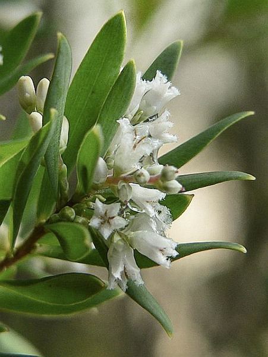

*Photo: Jackie Miles; place and date not stated; unchanged; [CC BY 4.0](https://creativecommons.org/licenses/by/4.0/). [Source fact sheet and attribution](https://apps.lucidcentral.org/plants_se_nsw/text/entities/leucopogon_parviflorus.htm). The flower hairs are visible, but the picture does not show scale, lower leaf surfaces, fruit or whole habit.*

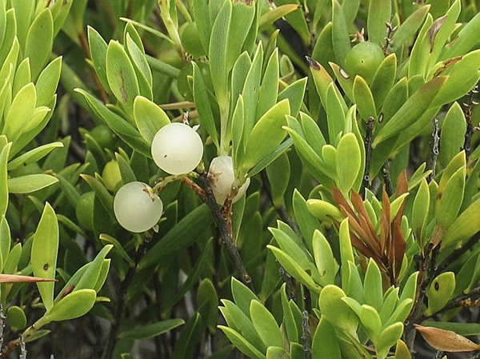

*Photo: Jackie Miles; place and date not stated; unchanged; [CC BY 4.0](https://creativecommons.org/licenses/by/4.0/). [Source fact sheet and attribution](https://apps.lucidcentral.org/plants_se_nsw/text/entities/leucopogon_parviflorus.htm). The fruit is source-labelled but has no ruler, cut view, hard-stone view or matched related species. White fruit alone is never enough.*

### Food, expected taste and the missing calorie answer

Several sources document people eating the correctly identified ripe white flesh raw. Published descriptions include sweet, juicy, mildly acidic and grape-like. Those words describe an expected result **after** expert identification; they are not a taste test. This edition gives no eating step and makes no claim about the hard stone.

A peer-reviewed Victorian study collected about **300 g** of berries from **one plant** near Warrnambool in February 2017 and could not obtain enough fruit for another collection in 2019. It found about **72% moisture**. On a dry-weight basis, the sample contained about **13% fat, 2.6% protein, 4.2% fibre and 59.1% carbohydrate**. The paper does not provide a direct fresh edible-flesh energy result, and it is unclear how the hard stone affected the figures. This guide therefore does **not** calculate fresh kJ or kcal from them.

The fruit's small size, large stone and the research team's difficulty collecting it mean it should not be treated as dependable calories. A 100 g whole-fruit pile would not equal 100 g edible flesh. No modern human allergen, toxicology or safe-serving study was located.

### Lookalikes, law and knowledge held by Country

Victoria has several *Leucopogon* species with small pale fruit and white bearded flowers. A useful final plate must show the whole plant, upper and lower leaf surfaces, leaf tip, flower spike, ripe fruit, hard stone and matched local alternatives. Habitat, whiteness and taste cannot replace that work.

The Victorian protected-flora list declares native members of the heath family, Ericaceae, as restricted-use protected flora. Park and State-forest rules still apply. This page is not permission to collect. [Victorian protected-flora list](https://www.environment.vic.gov.au/__data/assets/pdf_file/0037/719686/Declared-Protected-Flora-List.pdf).

Three separate cultural-source records are preserved without merging them:

- The Warrnambool food-composition research acknowledges help from **Martang Djab Wurrung elders** in collecting local fruit and says the collection followed the blessing of Indigenous Elders. That describes the research relationship; it is not this guide's permission or a published community recipe.
- A South Australian government card records **Ngoor-le** in **Bunganditj** context. That name and geography stay together and are not presented as a Victorian statewide name.
- The Surf Coast page says its Indigenous-use information—that the fruit is edible—was supplied by the then-named **Wathaurung Aboriginal Corporation**. The current host is not a Traditional Owner-controlled publication, so this remains a carefully labelled supplied account rather than direct present-day authority.

[Peer-reviewed Victorian study](https://doi.org/10.1111/ijfs.14400); [study thesis and methods](https://vuir.vu.edu.au/41825/1/NJUME_Collise-thesis_nosignature.pdf); [South Australian identification cards](https://cdn.environment.sa.gov.au/landscape/docs/lc/aboriginal-bush-foods-identification-cards-gen.pdf); [Surf Coast coastal beard-heath page](https://scnaturesearch.com.au/plant/Coastal%20Beard-heath); [Surf Coast attribution statement](https://www.scnaturesearch.com.au/contact/).

**Entry:** SP-024; education only and non-harvest. Upgrade requires a botanist-reviewed Victorian comparison plate, legal and conservation review, fresh edible-flesh nutrition, food-safety review, and direction from the relevant Traditional Owner organisation.

## Cumbungi — Typha species

**Status — CULTURAL-NON-HARVEST:** This page preserves named cultural context and identification limits; do not enter wetlands, pull, dig or eat cumbungi from it.

Cumbungi is conspicuous in many Victorian wetlands, but a familiar outline is not a species identification. Victoria has two native species, *Typha orientalis* and *T. domingensis*, and the naturalised *T. latifolia*.

> **WARNING — EDUCATION ONLY; DO NOT PULL, DIG OR EAT CUMBUNGI FROM THIS PAGE**
>
> **Evidence confidence: High that three *Typha* species occur in Victoria and that foliage alone cannot separate them; Moderate for the source-labelled *T. orientalis* photographs; Low for transferring the old nutrition and taste record to a found plant; Insufficient for a novice identity, safe part, season, preparation, serving, lawful harvest or contaminant clearance.** Wetland digging is destructive and may expose you to deep mud, unstable banks, contaminated sediment or water. No harvesting sequence is given.
>
> **Wording confidence: 93% (subjective).** This rates this warning against the cited sources—not identity, safety, technique success or survival.

### What the photographs can teach

- Cumbungi is a robust perennial wetland plant with upright shoots from branching underground stems.
- Long, flat, parallel-veined leaves rise mainly from the base.
- The flowerhead has a slender male section above a thicker female section.
- A mature female head eventually opens into pale seed fluff.

These features orient you to the group, not the species. VicFlora says the leaves and other non-flowering parts cannot reliably distinguish Victorian *Typha*. Identification requires close examination of tiny flower scales and female flower parts, often with magnification. Over-mature heads are especially poor evidence because those small parts may already have fallen.

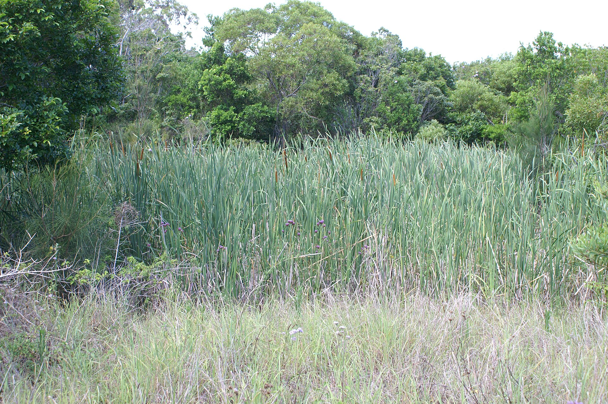

*Photo: Harry Rose / Macleay Grass Man, South West Rocks area, New South Wales, 15 December 2005; Wikimedia display derivative, otherwise unchanged; [CC BY 2.0](https://creativecommons.org/licenses/by/2.0/). [Original and attribution](https://commons.wikimedia.org/wiki/File:Typha_orientalis_habit4_SWR_NC_-_Flickr_-_Macleay_Grass_Man.jpg). This is a non-Victorian, source-identified *T. orientalis* example. Habitat context only: foliage cannot separate Victoria's three species.*

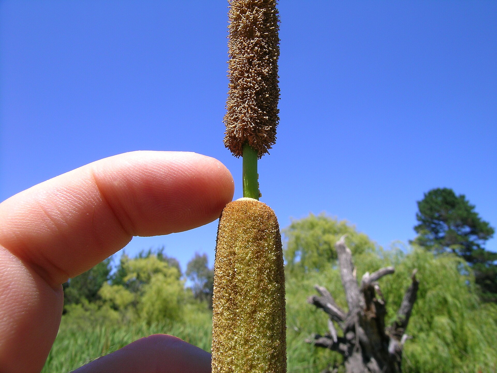

*Photo: Harry Rose / Macleay Grass Man, Northern Tablelands, New South Wales, 12 January 2008; Wikimedia display derivative, otherwise unchanged; [CC BY 2.0](https://creativecommons.org/licenses/by/2.0/). [Original and attribution](https://commons.wikimedia.org/wiki/File:Typha_orientalis_flowerhead5_NT_-_Flickr_-_Macleay_Grass_Man.jpg). A finger gives rough size context, not a measurement. The microscopic characters needed for species identification are absent.*

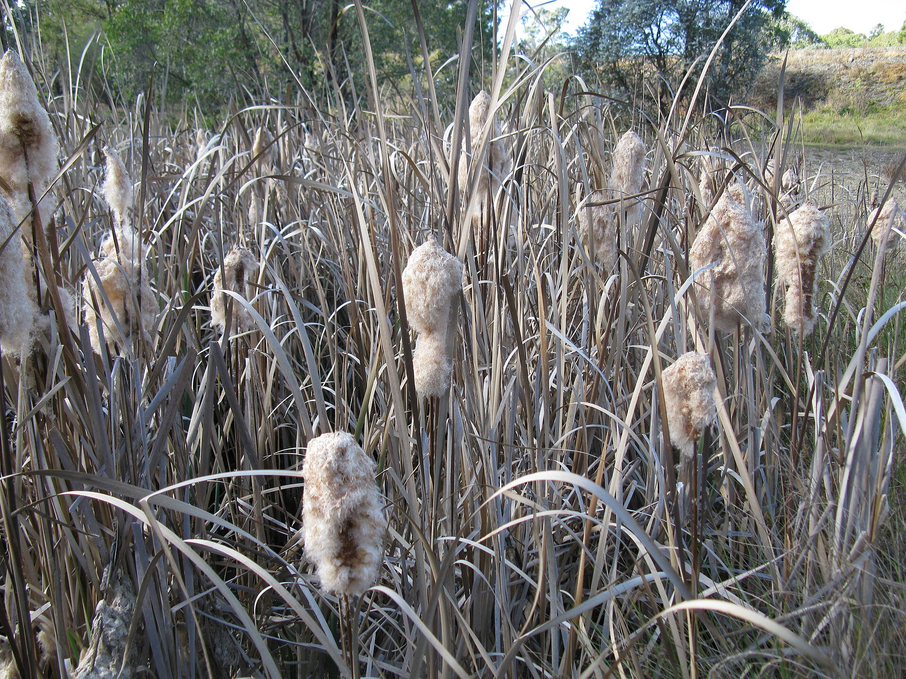

*Photo: Harry Rose / Macleay Grass Man, Northern Tablelands, New South Wales, 24 May 2014; Wikimedia display derivative, otherwise unchanged; [CC BY 2.0](https://creativecommons.org/licenses/by/2.0/). [Original and attribution](https://commons.wikimedia.org/wiki/File:Typha_orientalis_flowerhead10_NT_-_Flickr_-_Macleay_Grass_Man.jpg). This shows life stage, not a harvest stage. Important identification parts may have fallen and the male section is absent.*

### Calories, taste and practical return

An older Australian food-composition table, located only through a later secondary discussion in this pass, reports **277 kJ per 100 g**, about **66 kcal**, for one raw peeled *T. orientalis* underground-stem sample. It also reports about 69.9% water, 14.1 g carbohydrate and 12.2 g fibre per 100 g. The sample's Country, collection season, preparation history, edible trimming and number of tests are not clear. A recent Warrnambool-area study examined *T. orientalis* underground material, but its laboratory results measured after drying do not supply a cooked field serving or energy return.

At the old value, even a weighed 250 g of that exact raw peeled sample would be about **693 kJ or 165 kcal**. That arithmetic is not a safe serving or an estimate of what a person could gather. It excludes the work, injury risk, wetland access, cleaning, fuel, cooking, waste and legal limits. Do not count it as available survival energy.

**Expected taste:** the later discussion describes a potato-like result after cooking, but it does not establish a safe modern process for an identified Victorian species. No taste is authorised here, and taste must never be used to decide the plant.

### Cultural context — not an eating instruction

A 2005 public submission written by **Yorta Yorta Elder Dr Wayne Atkinson** records cumbungi among Yorta Yorta wetland plant uses in the Barmah–Millewa landscape. It uses a common plant name, not a modern species identification, and does not give this guide permission to reproduce a cultural method.

The current Yorta Yorta Whole-of-Country Plan states that its information may be used only with documented Yorta Yorta Nation Aboriginal Corporation permission, so its plant detail is not reproduced here. A Taungurung Land & Waters Council page was a relevant research lead, but its ICIP notice requires prior written consent to deal with website content; its plant detail is therefore not repeated in this guide. A Warrnambool study records elders' project-specific assistance and blessing for that research; its preparation passage cites an older publication, not a named current knowledge holder. None of these sources means an organisation or Elder has approved this guide.

This short paragraph is **private-copy context only**. Seek Yorta Yorta Nation Aboriginal Corporation direction before any sharing or publication and TLaWC's written consent before using its plant knowledge. Do not reproduce personal recollections or derive a recipe from the historical submission.

**Checks:** [VicFlora *Typha* genus and key](https://vicflora.rbg.vic.gov.au/flora/taxon/0db0a449-7b40-4fce-a52c-52d1a5d5fa03), [VicFlora broadleaf cumbungi](https://vicflora.rbg.vic.gov.au/flora/taxon/d8e250bb-40c8-422d-aa20-c93bfce43664), [Dr Atkinson's 2005 VEAC submission](https://waynera.wordpress.com/wp-content/uploads/2010/10/veacsubm05.pdf), [YYNAC Whole-of-Country Plan and permission notice](https://www.gbcma.vic.gov.au/downloads/Traditional_Owners/YYWOC%20Plan%20web%20version%2027%20May%202021.pdf), [TLaWC ICIP notice](https://taungurung.com.au/indigenous-cultural-and-intellectual-property-icip/), [Warrnambool research](https://doi.org/10.1111/ijfs.14400) and the [secondary nutrition-history discussion](https://www.anthropologyfromtheshed.com/project/typha-root-ancient-nutritious-food-in-noongar-culture). **Entry:** SP-028; education only and non-harvest.

## Water-ribbons — Cycnogeton species

**Status — CULTURAL-NON-HARVEST:** This page records cultural context and identification limits; do not enter water, dig or eat water-ribbons from it.

Water-ribbons are aquatic plants with long strap-like leaves and tuber-bearing roots. Victoria has **six** *Cycnogeton* species. The pictures below show *C. procerum*, one example, not every plant called water-ribbons in a cultural or historical record.

> **WARNING — EDUCATION ONLY; DO NOT ENTER WATER, DIG OR EAT WATER-RIBBONS FROM THIS PAGE**
>
> **Evidence confidence: High for the current genus, six Victorian species and the described *C. procerum* features; Moderate for the two source-labelled photographs; Low for assigning an old *Triglochin procera* nutrition result to the present species; Insufficient for a novice identity, underground-part comparison, safe preparation, serving, lawful harvest or contaminant clearance.** Two Victorian relatives, *C. dubium* and *C. microtuberosum*, are listed Endangered under the Flora and Fauna Guarantee Act. Digging destroys the feature needed to tell some species apart.
>
> **Wording confidence: 93% (subjective).** This rates this warning against the cited sources—not identity, safety, technique success or survival.

### What the example looks like

*Cycnogeton procerum* is a robust perennial of still or slow-moving fresh water. Its glossy strap-like leaves can float or stand upright and may reach several metres. A separate stalk carries a dense fruiting spike. The woody underground stem sends out long roots ending in elongated tubers. The fruit's shape, number of parts and the underground tuber pattern matter for identification; leaves alone are not enough.

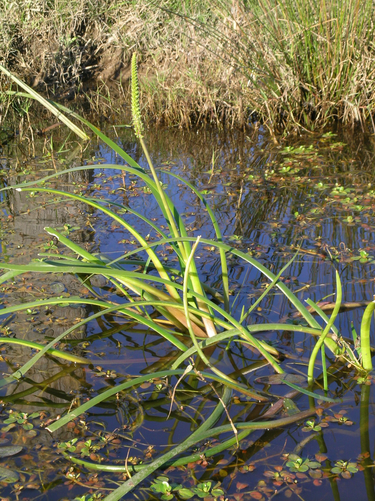

*Photo: Harry Rose / Macleay Grass Man, New South Wales, 22 July 2005; Wikimedia display derivative, otherwise unchanged; [CC BY 2.0](https://creativecommons.org/licenses/by/2.0/). [Original and attribution](https://commons.wikimedia.org/wiki/File:Cycnogeton_procerum_plant2_-_Flickr_-_Macleay_Grass_Man.jpg). Above-ground context only. Other aquatic plants are present; no ruler, underground anatomy, Victorian voucher or matched relative is shown.*

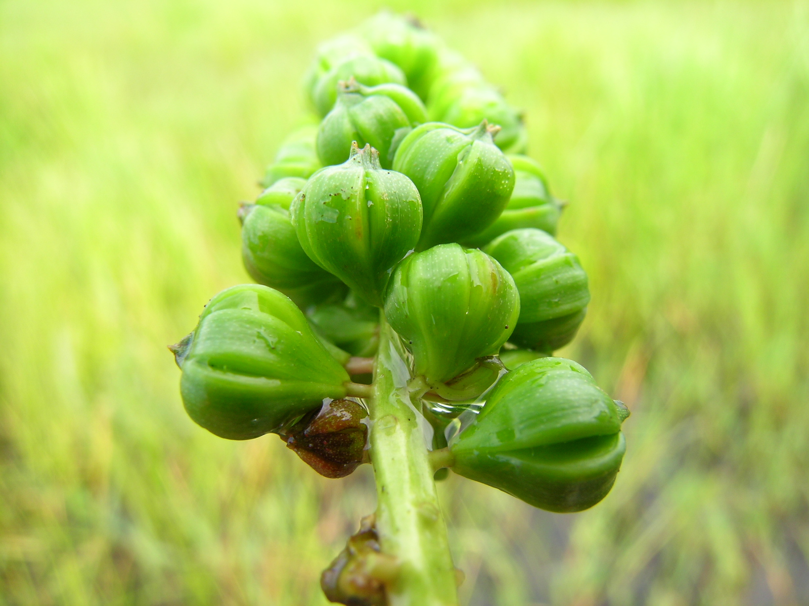

*Photo: Harry Rose / Macleay Grass Man, New South Wales, 14 March 2005; Wikimedia display derivative, otherwise unchanged; [CC BY 2.0](https://creativecommons.org/licenses/by/2.0/). [Original and attribution](https://commons.wikimedia.org/wiki/File:Cycnogeton_procerum_fruit3_-_Flickr_-_Macleay_Grass_Man.jpg). Fruit geometry is useful, but this partial unscaled spike alone cannot establish the species, maturity or edibility.*

The essential underground comparison is missing. No rights-cleared, specimen-verified image was found showing the woody rhizome, long roots and elongated terminal tubers beside the smaller tuber patterns of related Victorian species. Until a botanist-vouchered plate exists, this cannot become an identification or food page.

### Calories, taste and practical return

An old food table reports **297 kJ per 100 g**, about **71 kcal**, for a root sample under the former name *Triglochin procera*. It reports about 79.1% water, 1.4 g protein, 0.1 g fat and 17.4 g carbohydrate. Botanical work later split the older *Triglochin procera* group into several *Cycnogeton* species. The sample's exact current species, Country, season, preparation and number of tests are not established here. The number cannot be assigned confidently to the plant in front of you.

At that old value, 250 g would be about **743 kJ or 177 kcal**. That is arithmetic for the historical sample, not a serving, safe-food value or likely return. Digging, washing, cooking, discarded material, wetland danger, contaminants, conservation and collection law make the real cost much higher.

**Expected taste:** no reliable, present-species taste benchmark suitable for this guide was found. Do not taste an aquatic root or an unknown plant.

### Cultural context — kept with Country

Dr Wayne Atkinson's 2005 public submission records water-ribbons among **Yorta Yorta** wetland plant uses. The Bureau of Meteorology's Gariwerd seasonal calendar separately records Water Ribbon as cooked and eaten during Ballambar, or early summer. That page says the custodians use the Djapwurrong and Jardwadjali language groups and that Elders and Directors of Gariwerd gave the Bureau permission to host the calendar. Neither source identifies a modern *Cycnogeton* species, usable part, safe serving or complete preparation. Permission to host the calendar is not permission for this guide to reproduce its artwork or wider knowledge.

Other reviewed Traditional Owner documents were not converted into food claims: a Wurundjeri Woi Wurrung-led study says water-ribbons were collected on a reach of the Birrarung but does not say in that passage that they were eaten; an Eastern Maar seasonal source records the plant in streams but does not claim food use. A Taungurung source was not summarised because TLaWC's ICIP notice requires prior written consent to deal with its website content. Their wording, artwork and further knowledge are not reproduced. This restraint is part of respecting the sources, not evidence that knowledge was absent.

This is **private-copy context only**. Seek direction from the relevant Gariwerd custodians and Yorta Yorta Nation Aboriginal Corporation, as well as any content owner's permission, before wider use.

**Checks:** [VicFlora *Cycnogeton* genus](https://vicflora.rbg.vic.gov.au/flora/taxon/9180eaf6-12f8-4590-8835-64e2c78cd4be), [VicFlora tall water-ribbon](https://vicflora.rbg.vic.gov.au/flora/taxon/687f7914-0b59-4c43-855a-d0619a49a832), [Endangered *C. dubium*](https://vicflora.rbg.vic.gov.au/flora/taxon/5eb4ba79-83c4-43be-beff-e9bd6ffbf773), [Endangered *C. microtuberosum*](https://vicflora.rbg.vic.gov.au/flora/taxon/76557c5c-570b-4de0-be0f-f6f596babfac), [Dr Atkinson's submission](https://waynera.wordpress.com/wp-content/uploads/2010/10/veacsubm05.pdf), [Bureau of Meteorology Gariwerd calendar and permission note](https://www.bom.gov.au/resources/indigenous-weather-knowledge/indigenous-seasonal-calendars/gariwerd-calendar), [TLaWC ICIP notice](https://taungurung.com.au/indigenous-cultural-and-intellectual-property-icip/) and the [secondary old-table reproduction](https://www.anthropologyfromtheshed.com/project/typha-root-ancient-nutritious-food-in-noongar-culture). **Entry:** SP-029; education only and non-harvest.

## Beaded glasswort or samphire — Salicornia quinqueflora

**Status — CULTURAL-NON-HARVEST:** Learn the plant and the Krauatungalung Country context; this page cannot clear identity, contamination, harvest or eating.

The word **samphire** is used for several different succulent saltmarsh plants. This page concerns *Salicornia quinqueflora*, formerly called *Sarcocornia quinqueflora*. VicFlora accepts two subspecies in Victoria. The widespread one is subsp. *quinqueflora*; the other is not covered by this page.

> **WARNING — RECOGNITION ONLY; DO NOT EAT WILD SAMPHIRE USING THIS GUIDE**
>
> **Evidence confidence: High for the accepted species name, broad form, Victorian occurrence and FSANZ wording; Moderate for the source-labelled photographs; Insufficient for identifying a particular plant, separating every similar glasswort, detecting contamination, choosing a lawful site, or giving a safe wild serving.** FSANZ lists *S. quinqueflora* as not novel in a food-law assessment, but it also says metal contaminants must be monitored when plants are wild harvested. You cannot do that by looking, smelling, rinsing or tasting.
>
> **Wording confidence: 93% (subjective).** This rates this warning against the cited sources—not identity, safety, technique success or survival.

### What the pictures can show

VicFlora describes a native perennial usually no more than about **30 cm high**. It may spread along the ground or form short upright tufts. The green branchlets are fleshy and divided into obvious joints. Individual fleshy sections are usually about **5–20 mm long**. The terminal flower or fruit spikes are about **1–5 cm long**. The actual flowers are tiny and partly hidden in the fleshy spike.

It occurs in many Victorian districts, especially in saline or brackish coastal and estuarine ground, and sometimes around inland salt lakes. Habitat supports an identification; it does not prove one.

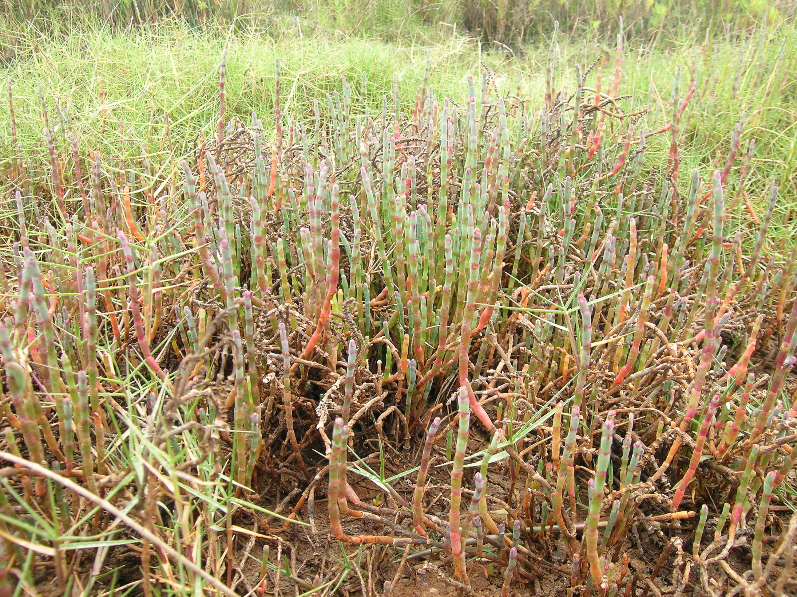

*Photo: Harry Rose / Macleay Grass Man, capture place not supplied, [CC BY 2.0](https://creativecommons.org/licenses/by/2.0/); unchanged. [Original and attribution](https://commons.wikimedia.org/wiki/File:Sarcocornia_quinqueflora_plant1_-_Flickr_-_Macleay_Grass_Man.jpg). The old genus name appears on the source. This distant view has no ruler, Victorian voucher or similar-species comparison.*

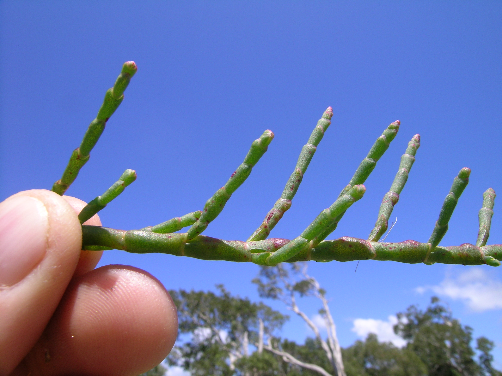

*Photo: Harry Rose / Macleay Grass Man, 30 December 2007, capture place not supplied, [CC BY 2.0](https://creativecommons.org/licenses/by/2.0/); unchanged. [Original and attribution](https://commons.wikimedia.org/wiki/File:Sarcocornia_quinqueflora_stem1_-_Flickr_-_Macleay_Grass_Man.jpg). A hand gives rough context, not a measurement. Flowers, seed hairs and confusing species remain unresolved.*

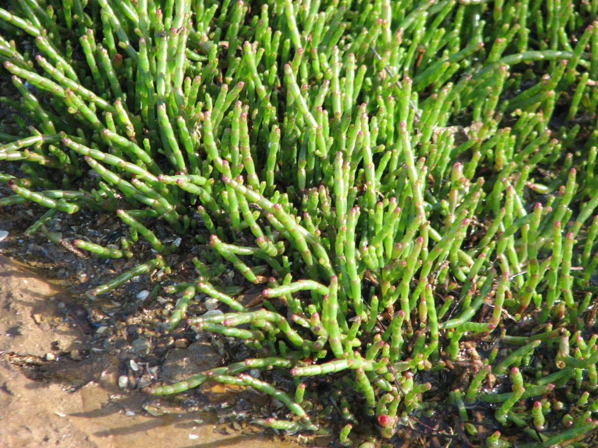

*Photo: Melburnian, Ricketts Point, Victoria, September 2008, [CC BY 3.0](https://creativecommons.org/licenses/by/3.0/); unchanged. [Original and attribution](https://commons.wikimedia.org/wiki/File:Sarcocornia_quinqueflora.jpg). This is useful Victorian context, but there is no linked herbarium voucher or scale and it shows only one colour and growth state.*

### Why a salty-looking shoot is not enough

Victoria also has *Salicornia blackiana* and numerous *Tecticornia* species. The plants can be difficult to separate without mature flowers, seeds and a botanical key. Seven Victorian *Tecticornia* taxa are listed Endangered under the current Flora and Fauna Guarantee threatened list. Suitable coastal habitat can also form part of the federally listed **Subtropical and Temperate Coastal Saltmarsh** ecological community, and saltmarsh is important wildlife habitat.

Stop if any of these are true:

- you know only the common name “samphire”;
- the patch is near a drain, road, mine, industrial land, sewage influence, treated reserve or polluted sediment;
- you cannot separate the plant from every similar Victorian species;
- you would have to damage a saltmarsh patch or collect where plants are protected;
- your reason for continuing is that a restaurant, shop or online post sells “samphire”.

Commercial food does not establish the identity or contaminant level of a wild plant.

Passing this stop list would still not identify a plant or permit harvesting or eating.

### Taste, calories and practical return

Lower-level culinary sources describe prepared young samphire shoots as salty and sometimes slightly peppery. That is a report about food already selected for cooking. **Do not taste a wild plant to check its identity.** A salty taste would not separate the species or reveal metals and other contaminants.

No defensible energy value for fresh Victorian *S. quinqueflora* was found. A study of freeze-dried *Tecticornia* material from north-western Australia concerns different taxa, a different region and a dry laboratory sample; its numbers are not transferred here. Samphire is therefore **not counted as survival calories** in this guide.

### Knowledge kept with Country

The Gunaikurnai and Victorian Government joint plan for Lake Tyers State Park on **Krauatungalung Country** says samphire and sea asparagus, named there as *Sarcocornia* species, are important bush-food plants. That is valuable Gunaikurnai place-based knowledge. The older genus name now sits within *Salicornia* in VicFlora, but the plan does not identify this exact subspecies, give a preparation, or authorise this guide to turn the statement into a statewide recipe.

This is short, independently worded context for the private copy. The plan remains copyrighted and Gunaikurnai authority is not transferred to the reader. Seek Gunaikurnai direction and permission before sharing, adapting or publishing this material.

**Checks:** [VicFlora species account](https://vicflora.rbg.vic.gov.au/flora/taxon/69057b9f-c8e8-4249-b995-90ccd98db22a), [common Victorian subspecies](https://vicflora.rbg.vic.gov.au/flora/taxon/bae09e45-7116-4b40-8b16-f6f94525230d), [similar *S. blackiana*](https://vicflora.rbg.vic.gov.au/flora/taxon/b9c54c67-4dcc-4651-9897-eb29783e8622), [Victorian *Tecticornia* genus](https://vicflora.rbg.vic.gov.au/flora/taxon/1688601f-f65a-4061-a2ba-41c4d6134265), [FSANZ July 2026 Record of Views, pp. 50–51](https://www.foodstandards.gov.au/sites/default/files/2026-07/Record%20of%20Views%20updated%20July%202026.pdf), [July 2026 Victorian threatened list](https://www.environment.vic.gov.au/__data/assets/pdf_file/0028/793801/FFG_Threatened_List_July_2026.pdf), [national coastal-saltmarsh advice](https://www.dcceew.gov.au/environment/biodiversity/threatened/conservation-advices/subtropical-temperate-coastal-saltmarsh), [Lake Tyers joint plan](https://www.parks.vic.gov.au/-/media/project/pv/main/parks/documents/management-plans/lake-tyers-state-park-joint-management-plan.pdf) and [Parks Victoria Lake Tyers context](https://www.parks.vic.gov.au/places-to-see/parks/lake-tyers-state-park). **Entry:** SP-031; recognition only and non-harvest.

## Bulbine lily — Bulbine bulbosa

**Status — CULTURAL-NON-HARVEST:** This page records botanical and separately attributed cultural context. It gives no wild digging or eating method.

Bulbine lily is an important Victorian plant to recognise, but this guide does not treat its underground part as an emergency ration. Digging removes the food-storage organ and normally destroys or badly damages the plant. A non-flowering clump is also a poor novice identification target.

> **WARNING — DO NOT DIG OR EAT BULBINE LILY USING THIS GUIDE**
>
> **Evidence confidence: High for the accepted species, the cited botanical description and the separately attributed cultural records; Moderate for the source-labelled photographs; Insufficient for identifying a particular plant, ruling out every similar species, selecting a lawful patch, or giving a complete safe preparation.** Victoria has five *Bulbine* species. The Endangered *B. crassa* occurs around Wilsons Promontory and nearby islands and was formerly recorded under a name suggesting a coastal form of *B. bulbosa*.
>
> **Wording confidence: 93% (subjective).** This rates this warning against the cited sources—not identity, safety, technique success or survival.

### Features an expert would check together

VicFlora describes *B. bulbosa* as a tufted perennial up to about **50 cm high**, usually with a bulb-like tuber and thick fleshy roots. Its leaves are narrow, often hollow or channelled, up to about **30 cm long** and **1–5 mm wide**. One or two upright flower stalks carry yellow flowers. Each flower has six petal-like parts; the fine pattern of hairs on all six filaments—the slender stalks that hold the pollen-bearing tips—is part of the species key. The rounded to egg-shaped capsule is only about **4–7 mm long**. Flowering is mainly spring to summer.

Those measurements and the flower's small internal features matter. “Long soft leaves and a yellow flower” is not an identification.

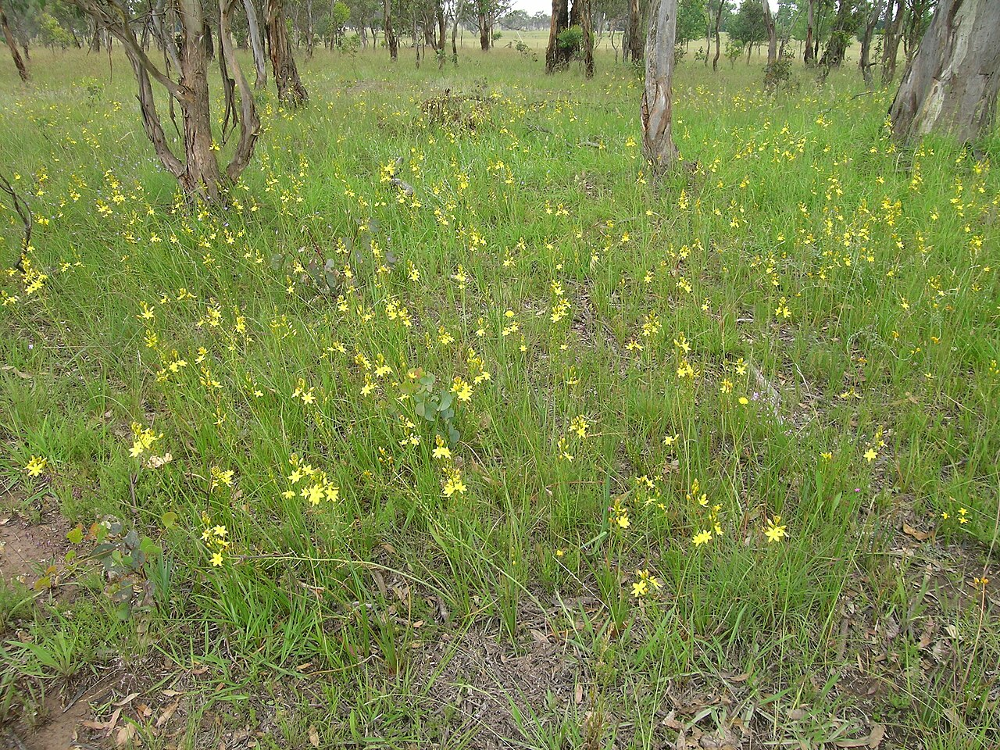

*Photo: Harry Rose / Macleay Grass Man, New South Wales, [CC BY 2.0](https://creativecommons.org/licenses/by/2.0/); Wikimedia 1280-pixel derivative, otherwise unchanged. [Original and attribution](https://commons.wikimedia.org/wiki/File:Bulbine_bulbosa_habit5_(8406130245).jpg). Individual leaf bases, flower parts, capsules and underground structures are too small to check.*

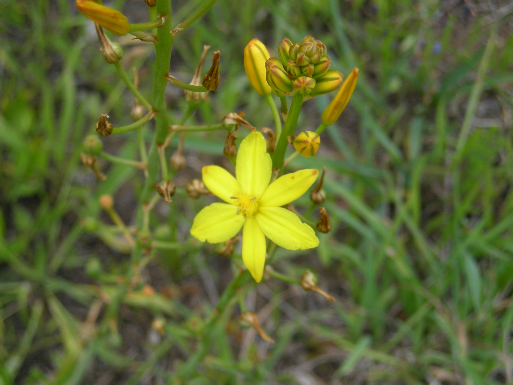

*Photo: Harry Rose / Macleay Grass Man, New South Wales, 15 December 2007, [CC BY 2.0](https://creativecommons.org/licenses/by/2.0/); unchanged. [Original and attribution](https://commons.wikimedia.org/wiki/File:Bulbine_bulbosa_flower1_(8406124555).jpg). No ruler, whole plant, leaf base, filament detail, capsule, tuber or comparison species is shown.*

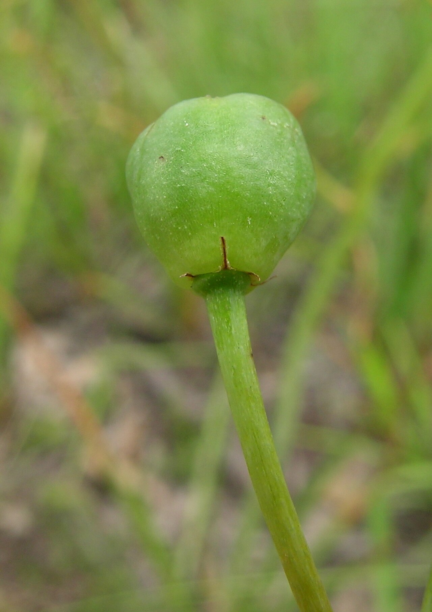

*Photo: Harry Rose / Macleay Grass Man, New South Wales, 23 January 2013, [CC BY 2.0](https://creativecommons.org/licenses/by/2.0/); Wikimedia crop derivative, otherwise unchanged. [Original and attribution](https://commons.wikimedia.org/wiki/File:Bulbine_bulbosa_fruit1_(8406129235)_(cropped).jpg). Capsule shape alone cannot identify the plant or support digging.*

The plate is still missing a botanist-vouchered Victorian whole plant, measured leaf base, filament macro, mature seed and lawful cultivated underground-organ view. The missing underground picture is deliberate: showing a loose “bulb” without its verified plant could invite dangerous matching.

### Taste, calories and why no recipe follows

The Bunjilaka plant guide describes the corm in its Woi wurrung context as sweet-tasting and says it was probably cooked first. That is a cultural and historical description, **not a taste test or a complete cooking instruction**.

An older composition table reports about **251 kJ, or 60 kcal, per 100 g** for a raw bulb sample. The sample's Country, season, number of tests, exact edible trimming and effect of safe preparation are not established here. The number is retained only as historical scale. It does not tell you how many plants must be killed, how much edible cooked material remains, or whether your specimen is safe. No field serving is recommended.

### Knowledge kept with Country

Museums Victoria's Bunjilaka guide records **Pike** in a **Woi wurrung** context. Separately, DJAARA's 2021–22 annual report says Dja Dja Wurrung community members agreed that certain basic plant words could be public and lists **bam, barm** for bulbine lily. These two records belong to different named contexts and are not merged into a generic “Aboriginal name”. Neither gives this guide permission to publish a harvesting or cooking method.

The DJAARA document and website retain Dja Dja Wurrung knowledge as Indigenous Cultural and Intellectual Property and require permission for publication. This private copy gives only the basic public words and a source link. Remove or re-clear this text before the guide is shared.

**Checks:** [VicFlora *B. bulbosa*](https://vicflora.rbg.vic.gov.au/flora/taxon/1eb00dc2-54bf-402a-8968-8361bb9d64bf), [VicFlora *Bulbine* genus](https://vicflora.rbg.vic.gov.au/flora/taxon/e36d15d3-68b4-4d36-9624-4368427f7467), [Endangered *B. crassa*](https://vicflora.rbg.vic.gov.au/flora/taxon/ce16bb44-31b2-4840-99fd-682e3c724bab), [former coastal name now treated as *B. crassa*](https://vicflora.rbg.vic.gov.au/flora/taxon/6b2f3db8-7763-40cf-943b-68595212fb8e), [Bunjilaka plant guide](https://museumsvictoria.com.au/bunjilaka/about-us/the-plants-of-milarri-garden/), [DJAARA 2021–22 annual report](https://djadjawurrung.com.au/wp-content/uploads/2022/11/DJAARA-Annual_Report_2021_22.pdf), [DJAARA resources and ICIP notice](https://djadjawurrung.com.au/resources/) and the [older food-table reproduction](https://kidney.org.au/wp-content/uploads/2025/11/KHA-First-Nations-booklet-Bush-tucker-and-kidney-disease.pdf). **Entry:** SP-016; cultural and stewardship page, non-harvest.

## Common nardoo — Marsilea drummondii

**Status — DO NOT EAT:** Do not try to detoxify or prepare nardoo using this guide.

Nardoo can look abundant after floodwater recedes. That abundance is dangerous if it suggests an easy flour. *Marsilea drummondii* contains **thiaminase**, an enzyme that destroys vitamin B1. Poorly processed nardoo can cause serious deficiency. This guide will not shorten skilled knowledge into an improvised “detox” recipe.

> **DANGER — DO NOT EAT OR TRY TO DETOX NARDOO FROM THIS GUIDE**
>
> **Evidence confidence: High for the accepted species, thiaminase hazard, four Victorian *Marsilea* species and the separately attributed cultural records; Moderate for the source-labelled photographs; Insufficient for identifying your specimen or for any novice processing method.** Grinding, roasting, boiling or copying one historical step is not assumed to make it safe. Use this page to recognise and avoid a dangerous shortcut.
>
> **Wording confidence: 96% (subjective).** This rates this warning against the cited sources—not identity, safety, technique success or survival.

### What it looks like—and why leaves are not enough

Common nardoo is a native aquatic fern, not a true clover. Each frond ends in four broadly wedge-shaped leaflets arranged as two opposite pairs. The stalk is usually about **3–30 cm long**. On drying mud, hard brown, hairy spore cases called **sporocarps** may appear. VicFlora describes them as about **6–9 mm** across, with their unbranched stalks usually much longer than the sporocarp.

Leaf size, scalloping and hairiness vary with growth conditions. Victoria has four *Marsilea* species, and sterile plants may not be identifiable with confidence. The shape, teeth and stalk of the mature sporocarp are important expert features.

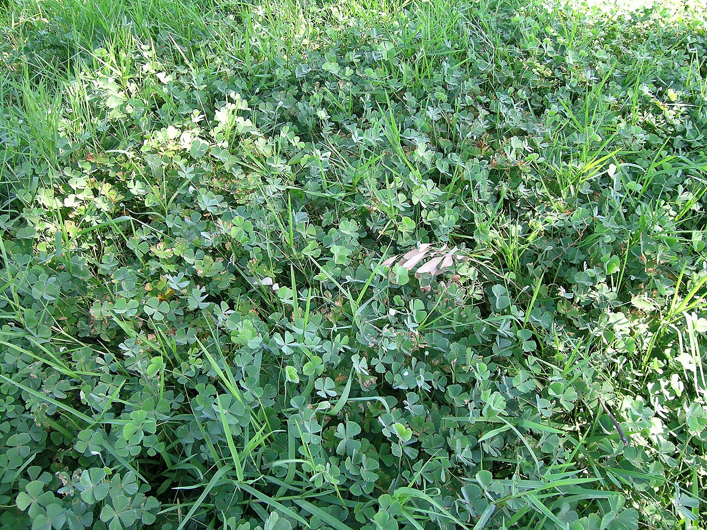

*Photo: Harry Rose / Macleay Grass Man, 3 April 2008, capture place not supplied, [CC BY 2.0](https://creativecommons.org/licenses/by/2.0/); Wikimedia 1280-pixel derivative, otherwise unchanged. [Original and attribution](https://commons.wikimedia.org/wiki/File:Marsilea_drummondii_habit_NWP4.jpg). Mixed vegetation, no scale and no visible sporocarp prevent a species identification from this view.*

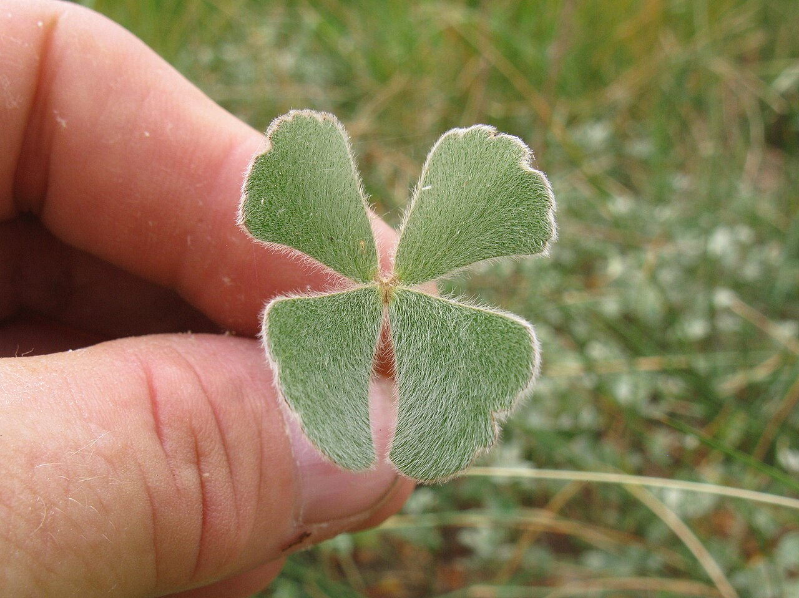

*Photo: Harry Rose / Macleay Grass Man, 4 December 2016, capture place not supplied, [CC BY 2.0](https://creativecommons.org/licenses/by/2.0/); Wikimedia 1280-pixel derivative, otherwise unchanged. [Original and attribution](https://commons.wikimedia.org/wiki/File:Marsilea_drummondii_leaf_CWS5.jpg). The hand gives rough context only; the leaf is held away from an attached sporocarp and rhizome.*

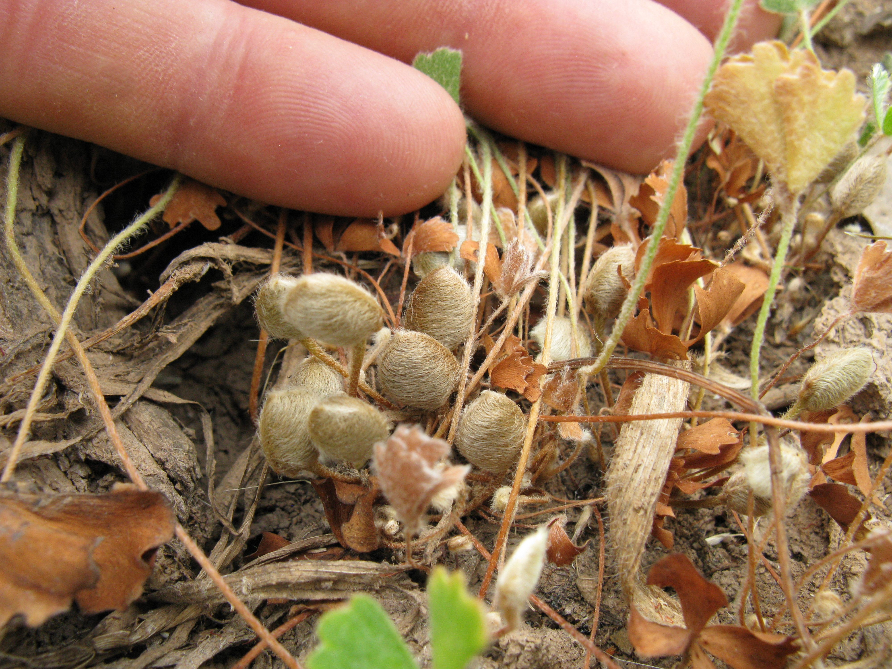

*Photo: Harry Rose / Macleay Grass Man, 4 December 2016, capture place not supplied, [CC BY 2.0](https://creativecommons.org/licenses/by/2.0/); unchanged. [Original and attribution](https://commons.wikimedia.org/wiki/File:Marsilea_drummondii_capsules_CWS2.jpg). There is no ruler or attached full frond, and the stalk and comparison species are incomplete.*

### Taste, calories and survival meaning

No expected taste is provided because this is a **do-not-eat page**. Taste would not show whether thiaminase had been reduced enough. No field-usable energy value or safe serving is supplied. A food may contain carbohydrate yet still make a stranded person worse; calorie arithmetic cannot cancel a vitamin-destroying hazard.

If any nardoo has been eaten, call the Victorian Poisons Centre on **13 11 26 now**; do not wait for symptoms. Call **000 first** if the person has collapsed or is unconscious, has stopped breathing or is struggling to breathe, is having a seizure, or appears to have anaphylaxis. Do not make the person vomit. Tell the adviser what was eaten, how it was prepared, the amount and when.

### Knowledge kept with Country

Museums Victoria's Bunjilaka guide records **Dullum Dullum** in a **Wemba Wemba** context and describes a skilled food tradition. Separately, DJAARA's public 2021–22 annual report lists the Dja Dja Wurrung plant words **gitjawil dhurung**, translated there as “many seeds”, for nardoo. DJAARA's Country Plan also records nardoo within continuing Dja Dja Wurrung food knowledge.

These records show expertise, not a licence to imitate fragments of a method. The page does not reproduce the Bunjilaka preparation sequence, and it does not combine Wemba Wemba and Dja Dja Wurrung names into one generic tradition. DJAARA's publication limits remain recorded; seek the relevant Traditional Owner authority before sharing or expanding the text.

**Checks:** [VicFlora common nardoo](https://vicflora.rbg.vic.gov.au/flora/taxon/b5e156de-1964-491c-bfc2-f71e230cbb48), [VicFlora *Marsilea* genus](https://vicflora.rbg.vic.gov.au/flora/taxon/38f7e1f6-4651-404a-b3e0-daaf4863c51f), [ANBG hazard account](https://www.anbg.gov.au/gnp/interns-2004/marsilea-drummondii.html), [ANBG Water for a Healthy Country profile](https://www.anbg.gov.au/cpbr/WfHC/Marsilea-drummondii/index.html), [Victorian poisoning guidance](https://www.betterhealth.vic.gov.au/sites/default/files/2021-03/poison_advice_dl_brochure_artwork.pdf), [Bunjilaka plant guide](https://museumsvictoria.com.au/bunjilaka/about-us/the-plants-of-milarri-garden/), [DJAARA 2021–22 annual report](https://djadjawurrung.com.au/wp-content/uploads/2022/11/DJAARA_Annual_Report_2021_22.pdf), [DJAARA Country Plan](https://djadjawurrung.com.au/wp-content/uploads/2021/04/Dhelkunya-Dja-Country-Plan-2014-2034.pdf) and [DJAARA resources and ICIP notice](https://djadjawurrung.com.au/resources/). **Entry:** SP-017; danger page and rejected novice field-food instruction.

## Nitre-bush or Dillon bush — Nitraria billardierei

**Status — DO NOT EAT:** Recognition only; the field identity, safe serving and full African-boxthorn comparison are incomplete.

Nitre-bush is a native shrub of saline country whose ripe fruit is described as edible by VicFlora and PlantNET. It is still **not cleared for field eating in this edition**. The plant can be confused at a glance with African boxthorn, and the guide does not yet have the full fruit-and-stone comparison or an independent food-safety review.

> **WARNING — EDUCATION ONLY; NOT YET VALIDATED FOR FIELD EATING**
>
> **Evidence confidence: High for the accepted species, Victorian form and distribution, and authoritative statements that the ripe fruit is edible; Moderate for the source-labelled photographs and the partial boxthorn comparison; Insufficient for a novice identity, safe serving, full lookalike exclusion, lawful harvest, or the safety of the hard stone and other plant parts.** Use this page for recognition. Do not taste either shrub.
>
> **Wording confidence: 92% (subjective).** This rates this warning against the cited sources—not identity, safety, technique success or survival.

### Features to compare together

VicFlora describes a rigid, tangled, sometimes spine-ended shrub up to about **2 m high**. Young branchlets and both sides of the leaves are covered with close-lying hairs. Leaves are narrow, often clustered, about **5–40 mm long** and **1–5 mm wide**, with a pointed tip. Tiny white flowers have five petals only **2–4 mm long**. Ripe fruit is oval to oblong, about **10–20 mm long**, and may be purple, red or golden. Each fruit has one hard stone.

In Victoria, nitre-bush is mainly found on saline flats and floodplains in the north-west, often on clay or gypsum-rich soil. There are isolated records on limestone cliffs near Portland. Flowers are recorded mainly from September to December.

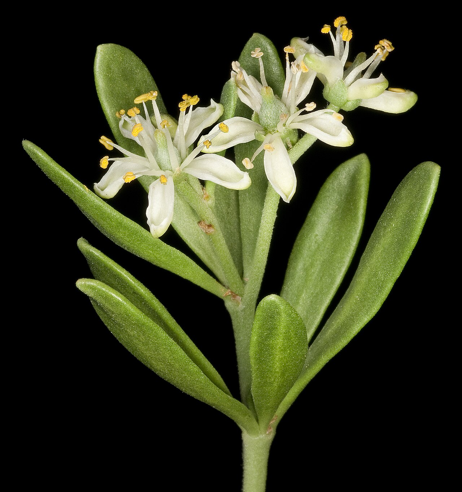

*Photo: Kevin Thiele, 8 October 2012, non-Victorian, exact place not supplied, [CC BY 2.0](https://creativecommons.org/licenses/by/2.0/); Wikimedia 1280-pixel derivative, otherwise unchanged. [Original and attribution](https://commons.wikimedia.org/wiki/File:Nitraria_billardierei_(8729570925).jpg). No linked voucher, ruler, whole habit, ripe fruit or stone is shown.*

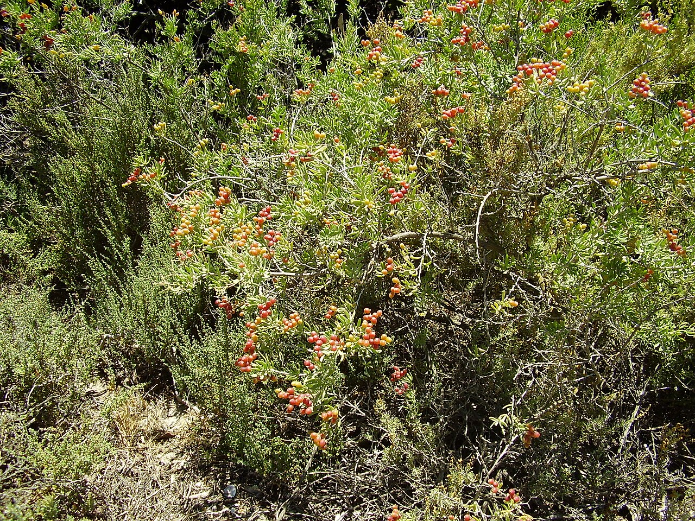

*Photo: Peripitus, St Kilda, South Australia, 14 January 2007, [CC BY-SA 4.0](https://creativecommons.org/licenses/by-sa/4.0/); Wikimedia 1280-pixel derivative, otherwise unchanged. [Original and attribution](https://commons.wikimedia.org/wiki/File:Nitraria_billardierei.jpg). This is not a Victorian specimen. Other vegetation crosses the shrub, and no fruit is cut to show the single stone.*

### Main warning comparison: African boxthorn

African boxthorn, *Lycium ferocissimum*, is a dense introduced shrub that is widespread in Victoria. It can reach about **5 m**, has stout spines, smooth broader leaves, white flowers with purple markings, and shiny round orange-red berries about **1 cm wide** containing many small seeds.

Nitre-bush instead has hairy young branchlets, narrower pointed leaves, much smaller plain white flowers, and oblong fruit with one hard stone. These differences must all agree. A red or orange berry beside a thorn is not enough.

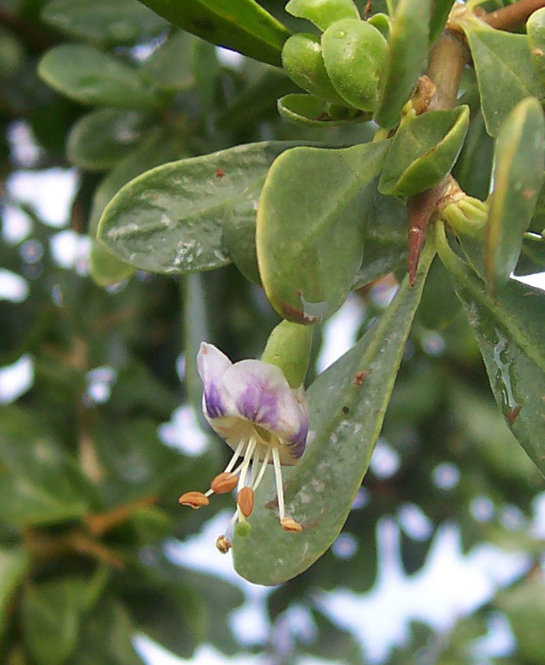

*Photo: Fir0002, Victoria, 26 April 2005, [CC BY-SA 3.0](https://creativecommons.org/licenses/by-sa/3.0/) and GFDL 1.2; unchanged. [Original and attribution](https://commons.wikimedia.org/wiki/File:African_boxthorn_flower.jpg). This warning view lacks the whole shrub, fruit and many-seed section. It cannot prove that another shrub is nitre-bush.*

Any one of these features rules nitre-bush out: a hairless shrub, a round berry with many seeds, a flower with purple markings, or any missing required nitre-bush feature. Their absence does not identify nitre-bush or permit picking or eating. Do not handle a thorny shrub where an eye injury, puncture or fall could result.

### Taste, calories and present status

A lower-level regional source describes ripe nitre-bush flesh as light and slightly sweet. This is a loose description, not a controlled Victorian result and never an identification test. **No tasting is authorised on this page.**

No defensible energy value for fresh *N. billardierei* fruit was found. Livestock dry-matter figures, another *Nitraria* species and overseas food tables cannot be substituted. Even if a future review clears the ripe flesh, the fruit cannot yet be counted as a known calorie source.

Before this entry can become conditional food guidance, it needs a botanist-approved plate showing a Victorian whole plant, branchlet hairs, measured leaf, flower, ripe fruit and single stone beside equivalent African-boxthorn views. A food-safety reviewer must then confirm the edible part, exclusions and preparation. Until then, there is no picking or eating sequence.

### Cultural evidence boundary

No suitable public Victorian Traditional Owner-controlled source was located for a species-specific nitre-bush food or preparation statement. This guide does not fill that gap with a generic “Aboriginal use”, move knowledge from another Country, or treat an old secondary record as present community permission.

**Checks:** [VicFlora nitre-bush](https://vicflora.rbg.vic.gov.au/flora/taxon/855ebb8a-20f0-4043-9de8-16170018bac6), [PlantNET](https://plantnet.rbgsyd.nsw.gov.au/cgi-bin/NSWfl.pl?lvl=sp&name=Nitraria~billardierei&page=nswfl), [Flora of Australia](https://www.dcceew.gov.au/sites/default/files/env/pages/fb3709f5-d0b4-4a15-94bc-17686ac6a9ae/files/flora-australia-26-meliaceae-rutaceae-zygophyllaceae.pdf), [Victorian Resources Online](https://vro.agriculture.vic.gov.au/dpi/vro/vrosite.nsf/pages/water_sss_dilon_bush), [VicFlora African boxthorn](https://vicflora.rbg.vic.gov.au/flora/taxon/b3e0a7b4-1cfe-450b-b8de-2aa3cab20d4e), [Agriculture Victoria African boxthorn](https://agriculture.vic.gov.au/biosecurity/weeds/weeds-information/african-boxthorn) and [Weeds Australia comparison](https://weeds.org.au/profiles/african-boxthorn/). **Entry:** SP-032; education only, with possible future conditional review.

## White elderberry — Sambucus gaudichaudiana

**Status — DO NOT EAT:** The modern species-specific food-safety evidence and serving limit are insufficient for field use.

White elderberry is a low native elder of cool, damp Victorian forests. Its mature pale fruit has a strong documented food history. This edition still stops short of telling you to eat it because the modern species-specific food-safety evidence and serving limit are not strong enough.

> **WARNING — EDUCATION ONLY; DO NOT EAT WHITE ELDERBERRY FROM THIS PAGE**
>
> **Evidence confidence: High for the accepted species, Victorian description and published mature-fruit food record; Moderate for the source-labelled photographs and raw-fruit history; Low for the one old species-specific cyanogenic screen; Insufficient for identifying your specimen, proving full ripeness, defining a safe serving, or clearing any other plant part.** Other elder species contain cyanogenic compounds in some parts. Do not transfer European or North American elderberry recipes to this plant.
>
> **Wording confidence: 92% (subjective).** This rates this warning against the cited sources—not identity, safety, technique success or survival.

### Features to learn together

VicFlora describes a shrub or low soft-stemmed plant usually around **1 m**, sometimes about **2 m**, high. New stems grow from a perennial swollen rootstock. Check all of these features together:

- opposite compound leaves, each divided into **3–11** toothed or lobed leaflets;
- leaf stalks that are absent or very short on some parts of the leaf;
- broad, branched flower clusters, usually about **8–20 cm** across;
- many small white flowers; and
- small pale fruit about **5 mm** across, described in botanical literature as white or pale yellow when mature.

Flowering is mainly from **October to February**. The plant occurs widely in Victoria in cool, shaded forest, damp gullies and gorges. Habitat supports a name; it never proves one.

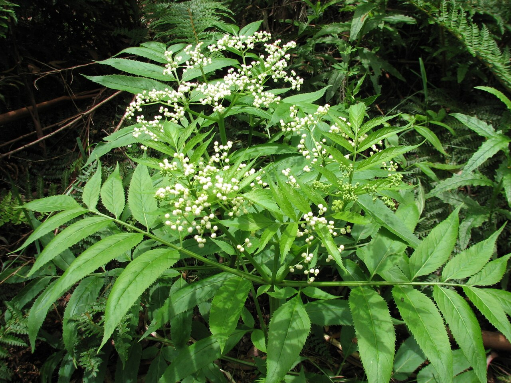

*Photo: Melburnian, Mount Donna Buang, Victoria, 27 December 2009; Wikimedia 1280-pixel display derivative, otherwise unchanged; [CC BY 3.0](https://creativecommons.org/licenses/by/3.0/). [Original and attribution](https://commons.wikimedia.org/wiki/File:Sambucus_gaudichaudiana.jpg). A useful Victorian flowering view, but no ruler, mature fruit, old stem, rootstock or linked herbarium voucher is shown.*

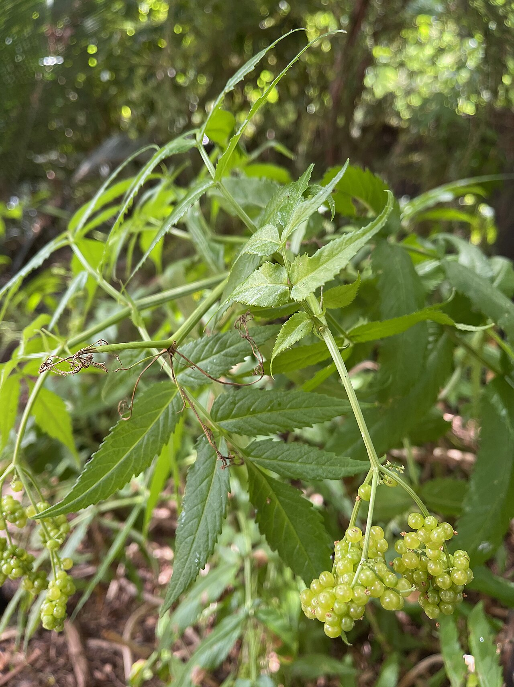

*Photo: Canley, 15 January 2021; place not supplied; Wikimedia 1280-pixel display derivative, otherwise unchanged; [CC BY-SA 4.0](https://creativecommons.org/licenses/by-sa/4.0/). [Original and attribution](https://commons.wikimedia.org/wiki/File:Sambucus_gaudichaudiana_berries.jpg). The file now renders cleanly. The pale green-translucent appearance does not prove full ripeness, and the view has no ruler, flower, rootstock or matched elder comparison.*

Only two reliable reusable modern views passed this image screen. A complete plate still needs a measured flower, mature and immature fruit together, old and new stems, rootstock, a cut fruit and seed, and matched Victorian elder comparisons.

### Food record, taste and energy

The Australian National Botanic Gardens records white berries eaten raw and describes them as juicy, pleasantly flavoured and a little sour. Museums Victoria's Bunjilaka guide separately says the cream-coloured berries can be eaten raw. A botanical paper describes a pale yellow or whitish edible drupe about 5 mm across; its study's mean fruit mass was **86 milligrams**.

That mass shows scale, not a serving. At the study mean, 100 whole fruits would weigh only about **8.6 g** before any rejected or inedible material. No species-specific fresh-food kJ or kcal value, safe amount, allergy result or modern human toxicology endpoint was found. Do not substitute a calorie value from another elder species.

An old chemical screen did not detect a cyanogenic reaction in its tested *S. gaudichaudiana* material. One old negative test cannot clear every fruit stage, plant part, place or serving. A modern review of elder species shows that cyanogenic chemistry varies. That is why this page records the food history but gives no eating sequence.

Do not eat green or uncertain fruit, flowers, leaves, stems, bark, roots or separated seeds. If any part is swallowed and there is doubt about identity or safety, call **13 11 26** without waiting for symptoms; call **000 first** for collapse, abnormal breathing, seizure or serious symptoms. Do not induce vomiting.

### Knowledge kept with its source

The Bunjilaka page records **Burne-burne** in a **Djabwurrung** context and **Garawed** in a **Gunaikurnai** context. These are two separately attributed museum records, not one statewide name. The page is public cultural material, but it is not presented here as direct current permission from either Traditional Owner organisation and does not approve this guide's use as a field-food key.

**Checks:** [VicFlora](https://vicflora.rbg.vic.gov.au/flora/taxon/8d09d79f-7e81-43a9-96c6-ac70773fbccb), [Australian National Botanic Gardens](https://www.anbg.gov.au/apu/plants/sambgaud.html), [Museums Victoria Bunjilaka](https://museumsvictoria.com.au/bunjilaka/about-us/the-plants-of-milarri-garden/), [Cunninghamia botanical account](https://www.botanicgardens.org.au/sites/default/files/2023-06/Volume-7%282%29-2001-Cun7Ben241-462.pdf), [older species-specific chemical screen](https://www.sciencedirect.com/science/article/abs/pii/S0305197899001052) and [modern elder chemistry review](https://pmc.ncbi.nlm.nih.gov/articles/PMC10096080/). **Entry:** SP-033; education only.

## Rounded noon-flower — Disphyma crassifolium subsp. clavellatum

**Status — DO NOT EAT:** This education page gives no field preparation, safe serving or verified permission chain.

Rounded noon-flower is a small creeping succulent of saltmarsh, sea cliffs and other saline ground. It is not the same plant as the larger native pigface described earlier. This page records identification limits, a public food-use account and the plant's poor energy return. It does not tell a stranded reader to eat it.

> **WARNING — EDUCATION ONLY; DO NOT EAT ROUNDED NOON-FLOWER FROM THIS PAGE**
>
> **Evidence confidence: High for the accepted Victorian subspecies and its botanical features, and that a City of Melbourne page labels a Bunurong leaf-food account; Moderate for the source-labelled photographs and wider leaf-use evidence; Low for transferring the overseas food-composition result to Victorian wild leaves; Insufficient for the page's Traditional Owner authorship or approval chain, a novice identity, a safe serving, a field preparation, an unverified site's history, or the food or medicinal safety of fruit, flowers, roots and sap.** The missing identity, serving, provenance, site and specialist checks keep this page non-actionable even though food use is documented.
>
> **Wording confidence: 90% (subjective).** This rates this warning against the cited sources—not identity, safety, technique success or survival.

### Features that must all agree

- A mat-forming plant with creeping stems that may spread to about **2 m**.
- Narrow, smooth, fleshy leaves usually about **1–4 cm** long, sometimes longer, and about **2–8 mm** thick.
- Leaves that look almost cylindrical or gently three-sided rather than broad, flat pigface leaves.
- Pink to purple daisy-like flowers about **2–5 cm** across, opening in bright daytime conditions.
- A **dry capsule** about **1 cm** wide that opens into several valves and contains many tiny seeds—not the large fleshy pigface fruit.

VicFlora records flowering mainly from **October to February**. The subspecies occurs along much of the Victorian coast in saltmarsh and on sea cliffs. It also occurs in north-western saline depressions and on some heavy alluvial soils.

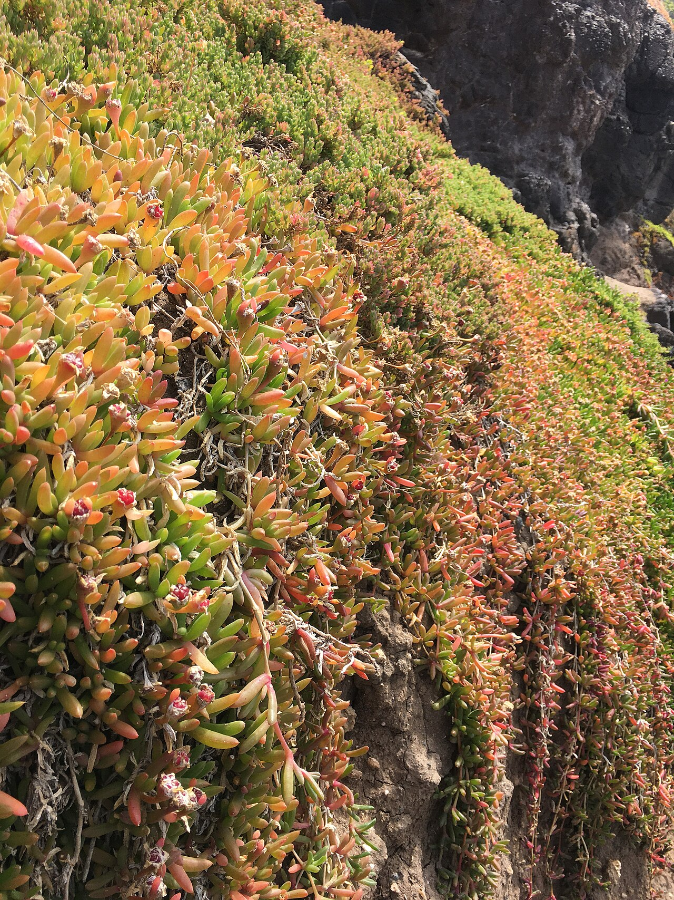

*Photo: Kehropaias, Cape Schanck, Mornington Peninsula National Park, Victoria, 23 December 2020; Wikimedia 1280-pixel display derivative, otherwise unchanged; [CC BY-SA 4.0](https://creativecommons.org/licenses/by-sa/4.0/). [Original and attribution](https://commons.wikimedia.org/wiki/File:Rounded_noon-flower_at_Cape_Schanck,_Mornington_Peninsula_National_Park.jpg). This Victorian habitat view shows the mat and succulent leaves but no open flower, measured leaf section or clearly opened dry capsule. A national-park photograph is not permission to pick.*

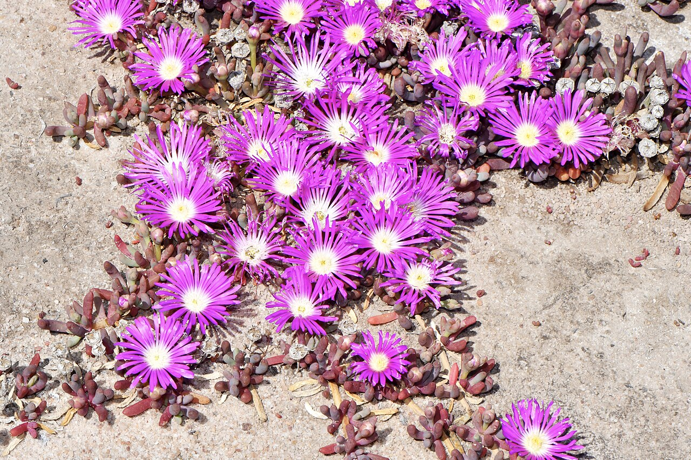

*Photo: Fred Hort / Jean and Fred Hort, Western Australia, 4 October 2022; Wikimedia 1280-pixel display derivative, otherwise unchanged; [CC BY 2.0](https://creativecommons.org/licenses/by/2.0/). [Original and attribution](https://commons.wikimedia.org/wiki/File:Disphyma_crassifolium_-_Flickr_-_jeans_Photos.jpg). Useful flower-and-leaf support only. It is a Western Australian species-level image, not a verified Victorian-subspecies specimen, and it lacks a ruler, fruit and linked voucher.*

### Stop before gathering or tasting it

Do not use the plant if any one of these applies:

- you know it only by a loose name such as “pigface”, “karkalla”, “ice plant” or “salty fingers”;
- you are trying to identify it for the first time from these pictures;
- any feature above is missing or disagrees;
- there is white or milky sap;
- you did not verify the exact site's access, treatment and contamination history before the emergency;
- the plant is beside a road, drain, port, industrial ground, sewage influence, sprayed reserve, contaminated floodwater or another suspect site;
- it is in a park, reserve, protected saltmarsh or another place where picking is not clearly permitted;
- collecting would uproot stems, strip a patch or trample the surrounding saltmarsh;
- drinking water is short and you hope the succulent leaves will replace it; or
- you plan to use the fruit, petals, roots, sap or a medicinal application.

Passing this rejection list does not identify the plant. It only stops obvious unsafe candidates.

### Food record, taste, calories and water

The City of Melbourne page labels this as a Bunurong account and records the leaves eaten raw or cooked. That is meaningful, place-linked context, but the page does not show a named Bunurong author or approval chain. It is not a safe serving, a field recipe, land permission or proof that the reader's plant is the same taxon. This edition gives no eating sequence. If you have separate, properly authorised teaching about this plant, follow that teaching rather than extending this page.

Published sensory work on cultivated *D. crassifolium* describes salty leaves. Do not taste a plant to identify, reject or clear it. Taste cannot reveal absorbed contamination or establish a safe amount.

One peer-reviewed study of cultivated *D. crassifolium* in Portugal reported about **34 kJ, or 8.1 kcal, per 100 g fresh leaf**. That is an overseas species-level sample, not this Victorian subspecies or a wild-site average. It shows only that the studied leaves were a very low-energy green. No field serving is supplied.

The leaves are not drinking water or treatment for dehydration. Their salt content and uncertain site chemistry make that shortcut unsafe.

### Knowledge kept with Country

The City of Melbourne's public page labels a **Bunurong** account that records the leaves eaten raw or cooked and ripe fruit enjoyed in summer. The same page says there is no known record of ancestral Wurundjeri Woi-wurrung use, then separately presents contemporary information from **Ngarigo Elder Rodney Mason of south-eastern New South Wales**. Those accounts are not merged.

This guide retains only the council page's narrow Bunurong-labelled leaf statement as private-copy context. The page's fruit description is not turned into an instruction because it has not been reconciled with the botanically dry capsule. Its topical-use statements are not medical treatment and are excluded. Public access to the council page does not imply Bunurong authorship, approval or endorsement of this guide.

**Checks:** [VicFlora](https://vicflora.rbg.vic.gov.au/flora/taxon/2593ded9-b360-497b-a1e8-089b53b51947), [PlantNET](https://plantnet.rbgsyd.nsw.gov.au/cgi-bin/NSWfl.pl?lvl=in&name=Disphyma~crassifolium~subsp.+clavellatum&page=nswfl), [Victorian Resources Online](https://vro.agriculture.vic.gov.au/dpi/vro/vrosite.nsf/pages/water_sss_rounded_noonflower), [City of Melbourne cultural page](https://participate.melbourne.vic.gov.au/floral-emblem/rounded-noon-flower), [nutrition study](https://www.mdpi.com/2076-3921/12/6/1161), [sensory study](https://www.mdpi.com/2076-3417/15/16/8799) and the [Victorian native-vegetation rules](https://www.environment.vic.gov.au/native-vegetation/native-vegetation-removal-regulations). **Entry:** SP-034; education only.

## Old-man saltbush — Atriplex nummularia

**Status — DO NOT EAT:** Wild subspecies identity, site chemistry and a safe human serving cannot be established from this page.

Old-man saltbush is widely sold and grown as a salty native food plant. That commercial familiarity is exactly why a wild plant can invite overconfidence. Victoria has two subspecies, one is threatened, and chemistry changes with the site.

> **WARNING — EDUCATION ONLY; DO NOT EAT WILD OLD-MAN SALTBUSH FROM THIS PAGE**
>
> **Evidence confidence: High for the accepted species, two Victorian subspecies, broad features, Endangered status of subsp. *omissa* and the known ability of saltbushes to accumulate salt, oxalate and nitrate; Moderate for the three source-labelled pictures and the commercial-food record; Low for applying one commercial sample's food value to a wild Victorian plant; Insufficient for subspecies identity, site chemistry, safe human serving or field preparation.** A grey salty leaf is not a safe identification test.
>
> **Wording confidence: 93% (subjective).** This rates this warning against the cited sources—not identity, safety, technique success or survival.

### Features an expert would check

VicFlora describes a grey-green shrub up to about **3 m high**. Male and female flowers occur on separate plants. Leaves vary but are often broad, around **15–40 mm** long, and may have smooth or toothed edges. The female plant forms two thick, mealy grey coverings around each seed. These paired coverings are called **fruiting bracteoles**; they are usually about **6–10 mm** long.

The two Victorian subspecies are not always readily distinguished. Their subtle fruiting-bract differences matter, so a leaf-only plant is unsuitable for a novice decision.

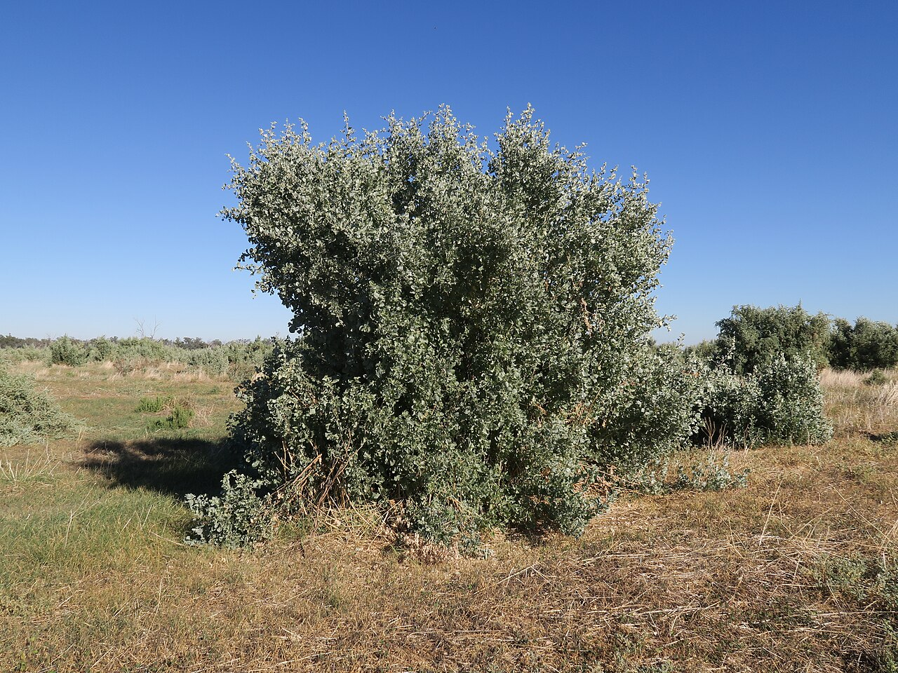

*Photo: Harry Rose / Macleay Grass Man, 30 April 2017; place and subspecies not supplied; Wikimedia 1280-pixel display derivative, otherwise unchanged; [CC BY 2.0](https://creativecommons.org/licenses/by/2.0/). [Original and attribution](https://commons.wikimedia.org/wiki/File:Atriplex_nummularia_-_Large_shrub.jpg). Habit support only; no linked voucher, scale, flowers, fruiting bracteoles or Victorian subspecies is established.*

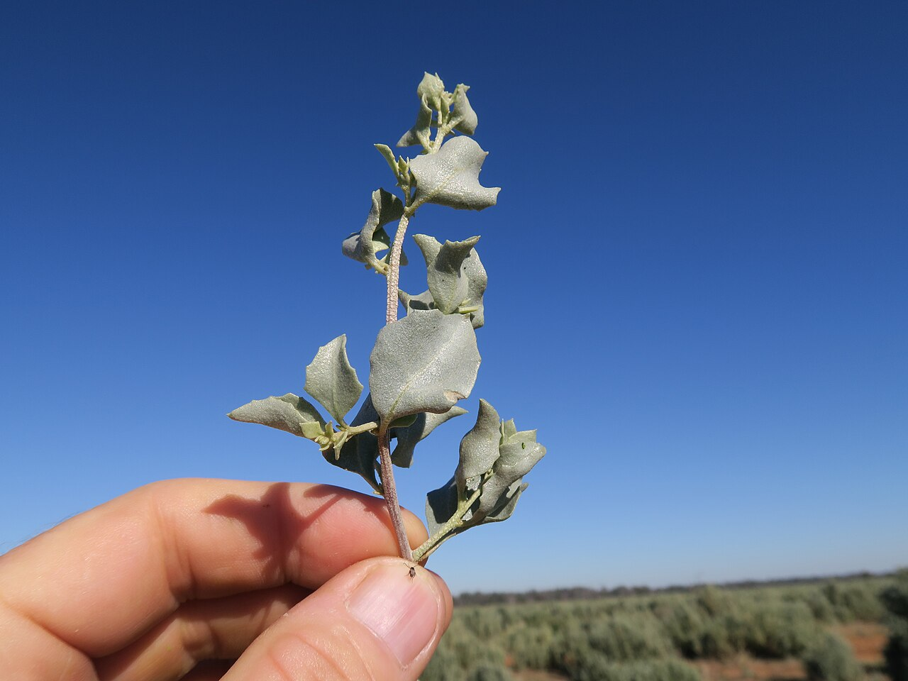

*Photo: Harry Rose / Macleay Grass Man, 30 April 2017; place and subspecies not supplied; Wikimedia 1280-pixel display derivative, otherwise unchanged; [CC BY 2.0](https://creativecommons.org/licenses/by/2.0/). [Original and attribution](https://commons.wikimedia.org/wiki/File:Atriplex_nummularia_-_Stem_and_leaf.jpg). Leaf shape and colour vary and cannot distinguish the Victorian subspecies or establish food safety.*

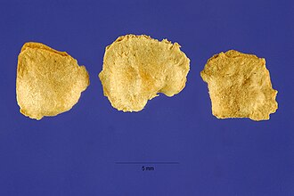

*Photo: Steve Hurst, USDA Agricultural Research Service; Australian material, date and subspecies not supplied; Wikimedia 330-pixel display derivative, otherwise unchanged; United States federal public-domain image. [Original and provenance](https://commons.wikimedia.org/wiki/File:Atriplexnummularia.jpg). The small image appears to show dry fruiting bracteoles or seed-containing units, not clearly exposed naked seeds. It cannot resolve the Victorian subspecies.*

Subsp. *omissa* is listed **Endangered** in Victoria. Do not collect an uncertain plant, a restoration planting or any population that could be the threatened subspecies.

### Food value and chemistry

One Australian laboratory report on a refrigerated commercial leaf sample recorded **111 kJ, about 26.5 kcal, per 100 g fresh leaf**, with 3.6 g protein, 0.3 g fat and 0.1 g available carbohydrate. The sample was supplied commercially in 2011. Its place, Victorian relevance and subspecies were not established. The number says nothing about a wild patch beside a road, saline drain or treated reserve.

The one-sample value is useful only as a scale showing that the leaves are low in energy. It is not a serving, a wild-plant measurement or evidence that gathering them would repay the effort. No safe wild amount is supplied.

Expected taste in culinary use is salty. Taste cannot measure sodium, oxalate, nitrate, pesticides or metals and cannot identify the species. NSW agricultural guidance says saltbush plants can accumulate significant salt, oxalate and nitrate; livestock poisoning has occurred. Livestock feeding limits are not human advice, but the variability is enough to reject a generic wild serving.

### Cultural evidence boundary

FSANZ records a history of food use for old-man saltbush. Beth Gott's University of Melbourne essay discusses *Victorian Koorie Plants*, prepared with the Yangennanock Women's Group, but the accessible text does not give this project a clear exact-taxon, Nation-and-Country preparation statement suitable for reuse. The guide does not fill that gap with a generic claim.

**Checks:** [VicFlora species account](https://vicflora.rbg.vic.gov.au/flora/taxon/1c3973ea-5147-4b9a-9009-f089bd793e6f), [subsp. *nummularia*](https://vicflora.rbg.vic.gov.au/flora/taxon/bf801dbc-11b6-4b2f-9dd8-1a9ff3c3fe3d), [Endangered subsp. *omissa*](https://vicflora.rbg.vic.gov.au/flora/taxon/d4fb3488-1942-403c-8d8c-9b257cb4cafe), [Victorian conservation assessment](https://bio-prd-naturekit-public-data.s3.ap-southeast-2.amazonaws.com/species_assessments/Atriplex_nummularia_subsp_omissa_504233.pdf), [FSANZ Record of Views](https://www.foodstandards.gov.au/sites/default/files/2025-10/Record%20of%20Views%20updated%20October%202025.pdf), [Australian commercial-sample report](https://ausbushfoods.com/bushfoodsonline/reports/Health/Nutritional_Data_12-099.pdf), [NSW DPI](https://www.dpi.nsw.gov.au/agriculture/pastures-and-rangelands/species-varieties/pf/factsheets/old-man-saltbush) and [Beth Gott's essay](https://medicalhistorymuseum.mdhs.unimelb.edu.au/__data/assets/pdf_file/0006/3475329/09_Bush-Med-reprint-eBook.pdf). **Entry:** SP-021; illustrated education only.

## Seaberry saltbush — Rhagodia candolleana subsp. candolleana

**Status — DO NOT EAT:** The field identity, safe serving, toxicology and contamination checks are incomplete.

Seaberry saltbush is a sprawling coastal shrub with small crimson fruit. A Victorian study documents ripe berries eaten directly, but no field serving or fresh energy value follows from that record.

> **WARNING — EDUCATION ONLY; DO NOT EAT SEABERRY FROM THIS PAGE**
>
> **Evidence confidence: High for the accepted Victorian name, features, distribution and the exact Warrnambool ripe-berry food record; Moderate for the source-labelled field image and two accessioned herbarium sheets; Insufficient for a novice identity, safe serving, fresh edible-flesh calories, human toxicology, contaminant clearance, or use of leaves and other parts.** The current cultural authority and the original study relationship also need direct review before any shared edition.
>
> **Wording confidence: 91% (subjective).** This rates this warning against the cited sources—not identity, safety, technique success or survival.

### Name and features

VicFlora uses *Rhagodia candolleana* subsp. *candolleana*. Kew currently places the same taxon under **Chenopodium candolleanum**. This book follows the Victorian flora and records the other name so that a search does not look like a different food plant.

Check these features as a group:

- a sprawling or climbing shrub, sometimes reaching about **4 m**;
- leaves that may be opposite or alternate, usually about **10–30 mm** long and **3–20 mm** wide;
- a shiny green upper leaf surface and a grey, scaly underside;
- small flowers in clusters; and
- mature fruit about **5 mm** wide, crimson to dark red, held within a reddish fleshy flower covering, with a small dark seed.

The plant is widespread along the Victorian coast and also occurs near some brackish wetlands and salt lakes. Flowering is mainly **September to December**. The Warrnambool research collected ripe berries in February, which is a study date, not a statewide fruiting promise.

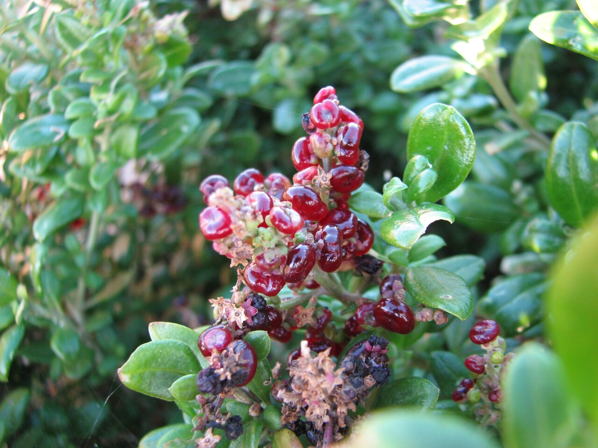

*Photo: Melburnian, Cape Woolamai, Victoria, 22 May 2009; Wikimedia 1280-pixel display derivative, otherwise unchanged; [CC BY 3.0](https://creativecommons.org/licenses/by/3.0/). [Original and attribution](https://commons.wikimedia.org/wiki/File:Rhagodia_candolleana.jpg). Useful Victorian crimson-fruit and upper-leaf support; the source does not establish ripeness. The grey-scaly underside, whole habit, flower, cut fruit, seed and linked voucher are missing.*

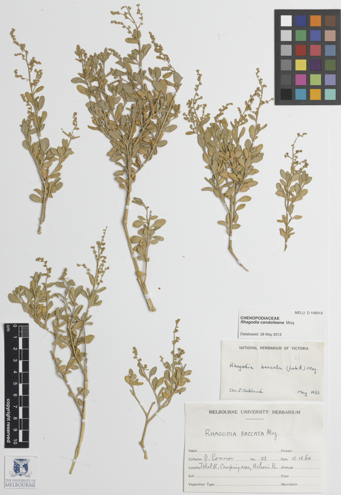

*University of Melbourne Herbarium accession MELUD109313a; collected by D. Connor, Tidal River camping area, Wilsons Promontory National Park, 12 December 1964; downloaded display image, unchanged; © University of Melbourne 2026, [CC BY-NC 3.0 AU](https://creativecommons.org/licenses/by-nc/3.0/au/). [Catalogue record](https://online.herbarium.unimelb.edu.au/collectionobject/MELUD109313a) and [terms](https://online.herbarium.unimelb.edu.au/terms-of-use). Personal non-commercial edition only. The historical label uses an older name and pressed material cannot show fresh colour or texture.*

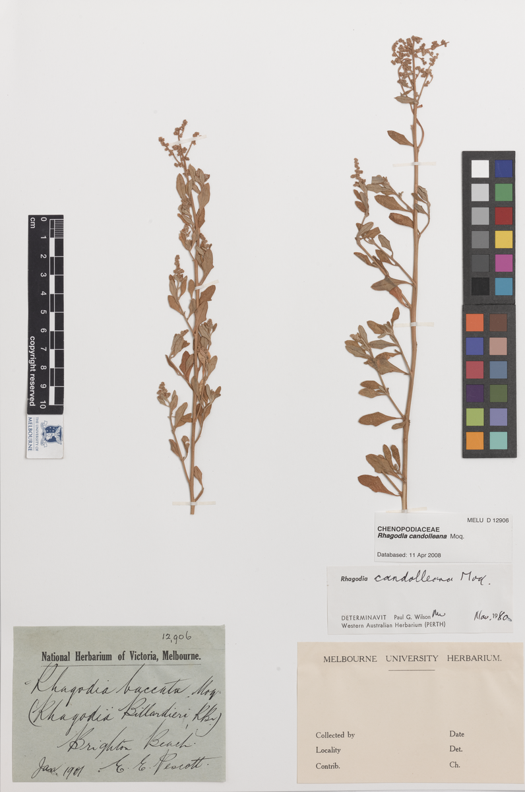

*University of Melbourne Herbarium accession MELUD012906a; collected by E. E. Pescott, Brighton Beach, Victoria, January 1901; downloaded display image, unchanged; © University of Melbourne 2026, [CC BY-NC 3.0 AU](https://creativecommons.org/licenses/by-nc/3.0/au/). [Catalogue record](https://online.herbarium.unimelb.edu.au/collectionobject/MELUD012906a) and [terms](https://online.herbarium.unimelb.edu.au/terms-of-use). Personal non-commercial edition only. Dried morphology and historical provenance are useful, but there is no fresh colour, leaf-surface macro or fruit section.*

### African-boxthorn warning

African boxthorn, pictured earlier in the nitre-bush entry, is a dense introduced shrub with long spines, smooth leaves clustered at the nodes and round orange-red berries about **1 cm** wide with many seeds. Agriculture Victoria says the fruit may be toxic to people.

Seaberry is not identified merely by lacking one boxthorn feature. Stop if the shrub is strongly thorny, the leaves are smooth on both sides, the berry is around 1 cm and many-seeded, or any required seaberry feature is absent. Passing those rejections still does not prove seaberry.

### Food, taste and energy

A 2020 peer-reviewed study reports that ripe *R. candolleana* berries were collected near Warrnambool and consumed directly in the documented food context. The material was collected under a government permit, with Martang Djab Wurrung Elder involvement, botanist assistance and voucher preparation. Agriculture Victoria separately describes the mature fruit as **bitter**.

That careful research process is not an emergency identification method. The paper measured dry-basis nutrients and found that some minerals varied between the two collection years. It does not give a validated fresh edible-flesh kJ or kcal value, safe serving, allergy result or human toxicology endpoint. A tiny fruit with an unknown edible yield cannot be budgeted as survival energy.

Leaves and other parts are excluded. Do not taste a berry to test the name.

### Knowledge, research and current authority

The Warrnambool paper names a **Martang Djab Wurrung** research relationship. Permission and blessing for that study do not transfer to this book. The Martang Registered Aboriginal Party was later revoked; Eastern Maar Aboriginal Corporation now has Registered Aboriginal Party responsibility over part of the relevant area. That later governance fact does not erase or relabel the original study.

This private page records only the published relationship and high-level ripe-berry food history. Any shared edition needs direction from the people connected with the original work and the current relevant Traditional Owner authority.

**Checks:** [VicFlora](https://vicflora.rbg.vic.gov.au/flora/taxon/ac23e358-6c03-42bc-ae42-f0efaa418da7), [Australian Plant Census record](https://bie.ala.org.au/species/Rhagodia%2Bcandolleana%2Bsubsp.%2Bcandolleana), [Kew synonym record](https://powo.science.kew.org/taxon/77117826-1), [Warrnambool study](https://doi.org/10.1111/ijfs.14400), [Agriculture Victoria seaberry account](https://vro.agriculture.vic.gov.au/dpi/vro/vrosite.nsf/pages/sip_seaberry_saltbush), [Agriculture Victoria African boxthorn](https://agriculture.vic.gov.au/biosecurity/weeds/weeds-information/african-boxthorn), [Martang RAP revocation](https://www.aboriginalheritagecouncil.vic.gov.au/revocation-registered-aboriginal-party) and [Eastern Maar RAP context](https://www.aboriginalheritagecouncil.vic.gov.au/eastern-maar-aboriginal-corporation). **Entry:** SP-035; education only.

## Chocolate lily — Arthropodium strictum

**Status — CULTURAL-NON-HARVEST:** This page keeps food history with named Countries and records conflicting raw-use sources; it gives no wild digging or eating method.

Chocolate lily is an important native food plant with fragrant purple flowers and small underground tubers. The public Victorian sources do not agree on raw use, and digging removes the plant's stored food. This is therefore a cultural and stewardship page, not a wild-food recipe.

> **WARNING — DO NOT DIG OR EAT WILD CHOCOLATE LILY FROM THIS PAGE**
>
> **Evidence confidence: High for the accepted species, Victorian botanical features, documented food importance and the fact that public sources conflict about raw use; Moderate for the three source-labelled photographs and separately attributed cultural accounts; Insufficient for a novice identity, lawful sustainable harvest, raw safety, a validated cooking time or temperature, safe serving or fresh-food energy.** Smelling chocolate does not establish the species or food safety.
>
> **Wording confidence: 94% (subjective).** This rates this warning against the cited sources—not identity, safety, technique success or survival.

### Features an expert would check together

VicFlora describes a tufted plant up to about **1.2 m high**. The small tubers can be up to about **2 cm** long and sit **3–5 cm** out from the rootstock. The plant base has persistent old leaf fibres. Leaves are narrow and flat or slightly channelled, usually **10–60 cm** long and **1–10 mm** wide.

The upright flowering stem is usually branched. Each flower sits by itself in the angle of a small bract. Flowers are deep pink or mauve, occasionally blue, and usually chocolate-scented. Purple pollen-bearing tips with mostly bright yellow appendages are useful close features. Flowering is mainly **October to December**.

Chocolate lily is locally common in grassy plains and woodlands across much of Victoria. It is rare in the Mallee and absent from the Alps and far east beyond the Bairnsdale area. A fragrant purple flower outside that pattern is not identified by scent.

VicFlora also records an unresolved Victorian entity called ***Arthropodium* sp. 3**. It resembles chocolate lily and has a largely overlapping range. Its exact relationship and food status cannot be assumed from resemblance.

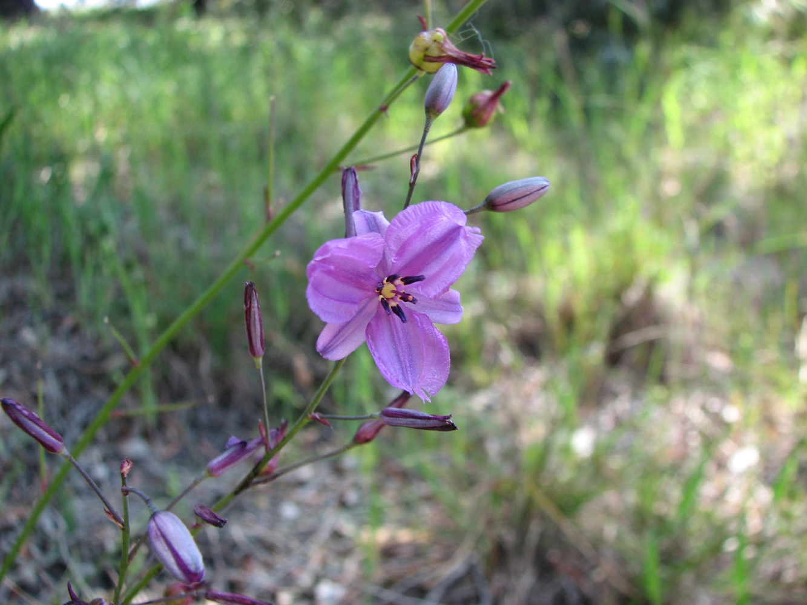

*Photo: Melburnian, Points Arboretum, Coleraine, Victoria, 7 November 2009; unchanged; [CC BY 3.0](https://creativecommons.org/licenses/by/3.0/). [Original and attribution](https://commons.wikimedia.org/wiki/File:Arthropodium_strictum.jpg). Despite the filename, this is not a whole-plant view. Basal leaves, rootstock, tubers, capsule, seed, scale and linked voucher are absent.*

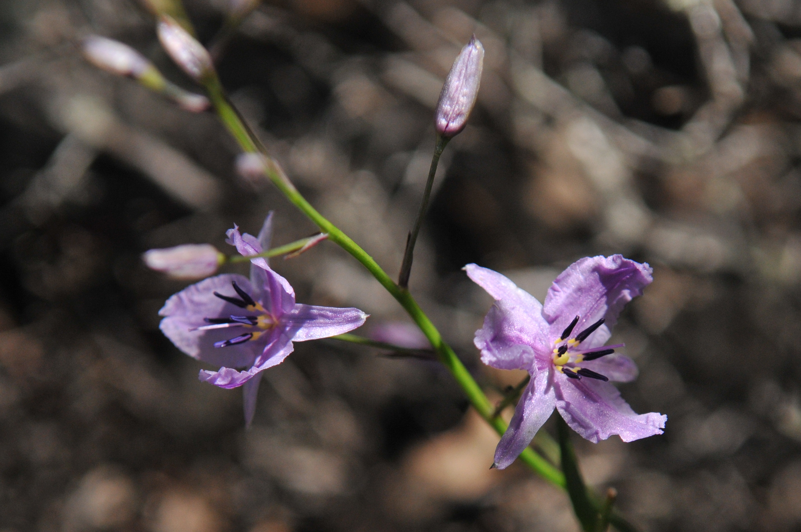

*Photo: Mikeybear, Mount Abrupt, Grampians National Park, Victoria, 30 November 2013; unchanged; [CC BY-SA 3.0](https://creativecommons.org/licenses/by-sa/3.0/). [Original and attribution](https://commons.wikimedia.org/wiki/File:Dichopogon_strictus.jpg). The source uses a recorded synonym. This shows flowering habitat, not permission to collect; basal and underground parts are not visible.*

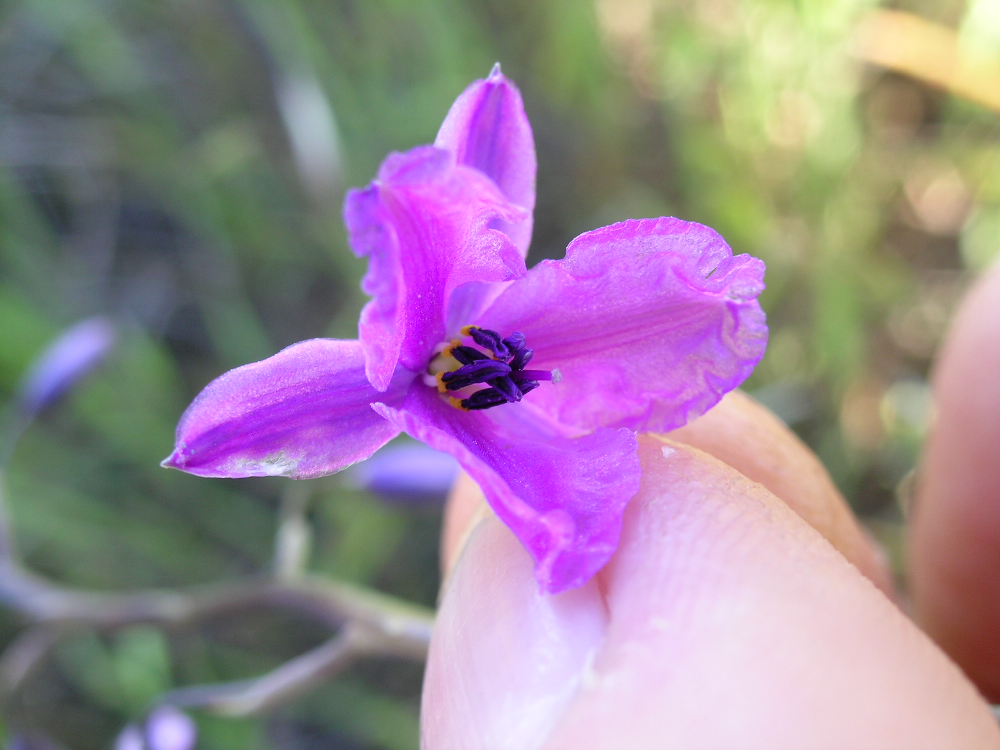

*Photo: Harry Rose / Macleay Grass Man, Burra, South Australia; source posted 19 July 2015; unchanged; [CC BY 2.0](https://creativecommons.org/licenses/by/2.0/). [Original and attribution](https://commons.wikimedia.org/wiki/File:Arthropodium_strictum_flower10_Burra_SA_-_Flickr_-_Macleay_Grass_Man.jpg). Useful non-Victorian flower detail without ruler, whole plant, leaf base, tuber, seed or matched relative.*

No picture shows the underground part. That gap is deliberate: a detached “edible tuber” photograph without the verified attached plant could encourage a dangerous match.

### Food conflict, taste and energy

The City of Melbourne page's section labelled Wurundjeri Woi-wurrung says tubers were roasted before eating because they are poisonous raw. Its separate section labelled Bunurong records roasted tubers with a **sweet, nutty** flavour. A Taungurung-partnered Mansfield garden page says **Djimba Wendarri** tubers were eaten raw or cooked.

The conflict is not solved by choosing the most convenient version. It may reflect different practice, place, material or source wording. No raw instruction and no guessed cook time appear here. The expected sweet, nutty taste is retained only as a clearly Bunurong-attributed description of roasted food, not an identification or safety test.

The Warrnambool laboratory study measured about **65.6–66.8% water** in its tuber samples and reported nutrients on a dry basis. It did not supply a validated fresh-field kJ or kcal value, safe serving or cooking endpoint. This guide does not manufacture a calorie number from incomplete data.

### Knowledge and stewardship

The City of Melbourne page separately labels sections Wurundjeri Woi-wurrung and Bunurong, but the page does not show a named author or approval chain for those sections. The section labelled Bunurong describes careful seasonal tending and replanting, not casual extraction. The Mansfield garden was developed by the Gadhaba Local Aboriginal Network in partnership with Taungurung Land & Waters Council and places its account on Yowung-illam-balluk Country.

These records deserve attention precisely because they show knowledge, care and place—not a shortcut for a stranded novice. Their different raw/cooked statements remain visible. None is represented as endorsement of this guide, and the detailed tending practice is not copied into a generic harvesting technique.

**Checks:** [VicFlora](https://vicflora.rbg.vic.gov.au/flora/taxon/994436f9-653f-4531-a0cb-81a13e86e52a), [unresolved *Arthropodium* sp. 3](https://vicflora.rbg.vic.gov.au/flora/taxon/79622410-daf9-4a0c-bb1d-39ec5577cd49), [City of Melbourne cultural page](https://participate.melbourne.vic.gov.au/floral-emblem/chocolate-lily), [Taungurung-partnered Mansfield garden](https://taungurung.com.au/mansfield-sign-1/), [Wurundjeri-partnered Digging It project](https://mcmc.org.au/parkland-management/caring-for-our-country/digging-it) and [Warrnambool study](https://doi.org/10.1111/ijfs.14400). **Entry:** SP-036; cultural and stewardship page, non-harvest.

## Pale vanilla-lily — Arthropodium milleflorum

**Status — CULTURAL-NON-HARVEST:** This page preserves bounded food history and named cultural context; it gives no wild digging or eating method.

Pale vanilla-lily is a tall, pale-flowered relative of chocolate lily. Its roots have a documented food history, but an old low-energy figure, destructive digging and difficult relatives make it a poor emergency target.

> **WARNING — DO NOT DIG OR EAT WILD PALE VANILLA-LILY FROM THIS PAGE**
>
> **Evidence confidence: High for the accepted species, Victorian features, broad distribution and the existence of threatened or unresolved Victorian relatives; Moderate for the three source-labelled pictures and broad historical food record; Low for applying the old raw-root energy row to a found Victorian plant; Insufficient for a novice identity, safe preparation, serving, expected taste, lawful sustainable harvest or underground-part comparison.** “Vanilla” describes the flower scent, not the taste or safety of the root.
>
> **Wording confidence: 94% (subjective).** This rates this warning against the cited sources—not identity, safety, technique success or survival.

### Features an expert would check together

VicFlora describes a tufted perennial up to about **1.3 m** high. Tubers are usually **2–3 cm** long and sit **2–8 cm** from the rootstock. Basal leaves are flat or spreading, sometimes blue-grey, and can reach about **40 cm** long and **25 mm** wide.

The flowering stem branches and carries groups of **2–9** flowers at a node. Flowers may be white, pale mauve or pale pink. The fine hairs on the pollen-bearing stalks are white near their base and purple closer to the purple anther. These tiny features matter. Flowering is mainly **November to February**.

In Victoria it is chiefly a montane and subalpine plant along the Great Divide, with scattered records in cool lowlands. Habitat is supportive, not diagnostic.

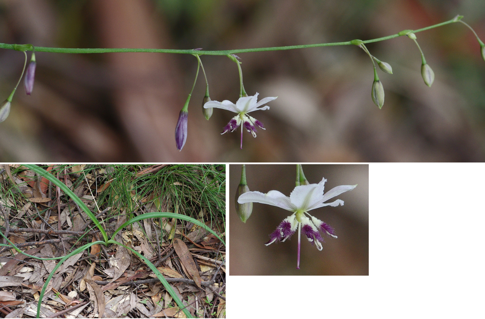

*Photo montage: DavidFrancis34, Victoria, 10 December 2010; unchanged; [CC BY-SA 2.0](https://creativecommons.org/licenses/by-sa/2.0/). [Original and attribution](https://commons.wikimedia.org/wiki/File:Arthropodium_milleflorum_(24904981901).jpg). This is the most informative current view, but it still lacks a ruler, tubers, rootstock, capsule, seed, linked voucher and matched relatives.*

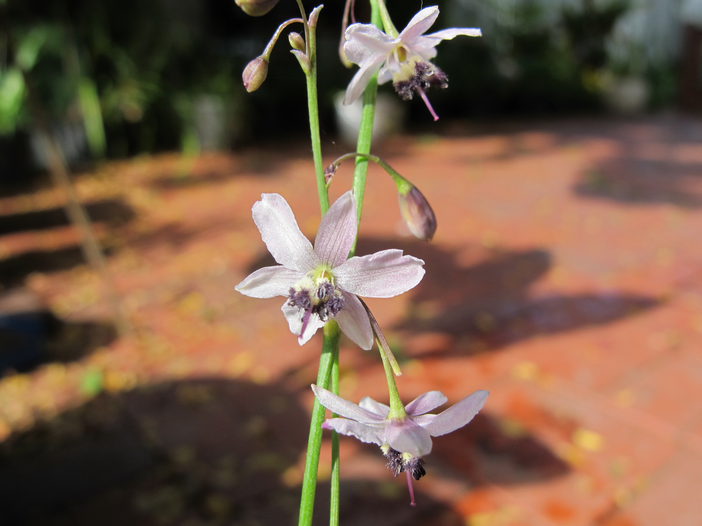

*Photo: Nathan Johnson, 4 December 2010; place not supplied; unchanged; [CC BY-SA 2.0](https://creativecommons.org/licenses/by-sa/2.0/). [Original and attribution](https://commons.wikimedia.org/wiki/File:Arthropodium_milleflorum.jpg). Despite the filename, this is not a verified whole-plant or Victorian habitat view. Underground structures and most basal leaves are not shown.*

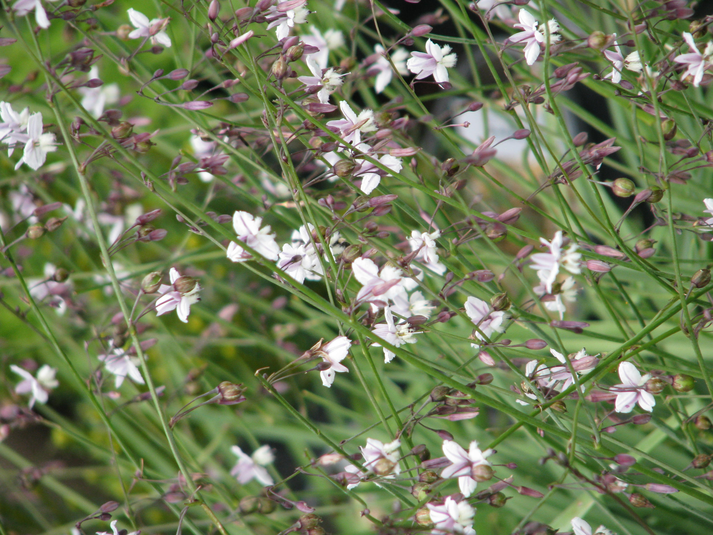

*Photo: Steve Law / peganum, 6 July 2015; place not supplied and possibly cultivated; unchanged; [CC BY-SA 2.0](https://creativecommons.org/licenses/by-sa/2.0/). [Original and attribution](https://commons.wikimedia.org/wiki/File:Arthropodium_milleflorum_(19448923476).jpg). A useful flowering-form view only; the capture season, locality, basal leaves, tubers and voucher are unresolved.*

Victoria also has an Endangered unnamed entity called ***Arthropodium* sp. 1** and another unresolved entity called ***Arthropodium* sp. 2**. Flower size, arrangement, anthers and other fine characters help separate them. A pale many-flowered lily is not enough.

### Food value, taste and practical return

An older Australian food table reports **124 kJ, about 30 kcal, per 100 g raw root** under “Vanilla Lily”. The reproduced table does not establish the specimen's Country, current taxon, sample count, season, trimming, storage or safe preparation. The number is historical scale only.

The old value indicates a low-energy food, not a serving or likely field yield. Finding, correctly identifying and digging a useful mass would destroy plants, consume time and energy, and risk threatened lookalikes for a small return.

No reliable expected-taste benchmark suitable for this guide was found. Do not assume the root tastes like vanilla, and do not taste it to check the name.

### Knowledge kept with Country

Australian National Botanic Gardens material records vanilla-lily roots among foods of south-eastern Australia. A separate Coliban Water booklet says its Traditional Knowledge section was written by **Dja Dja Wurrung man Harley Douglas** and records **Gitjawil matom** for chocolate lily and vanilla lily.

The booklet's plant text calls the underground structures “tuberous fruits”, which conflicts with botanical descriptions. This guide preserves the Dja Dja Wurrung attribution but does not repeat that phrase as plant anatomy or turn the source into a field recipe. The booklet is a third-party publication, so DJAARA's website terms are not claimed as its legal licence. Under this project's ICIP rule, the short attributed statement remains private-copy context and must be cleared with DJAARA before wider use.

**Checks:** [VicFlora](https://vicflora.rbg.vic.gov.au/flora/taxon/124bad05-8e7f-4f30-86f7-8fdb5f766ea0), [Endangered *Arthropodium* sp. 1](https://vicflora.rbg.vic.gov.au/flora/taxon/71bc5863-e614-484b-a0e6-8d505575dd1f), [unresolved *Arthropodium* sp. 2](https://vicflora.rbg.vic.gov.au/flora/taxon/c262beb1-bf4d-4b0c-9d90-b08af737224f), [Victorian threatened list](https://www.environment.vic.gov.au/__data/assets/pdf_file/0028/793801/FFG_Threatened_List_July_2026.pdf), [Australian National Botanic Gardens](https://www.anbg.gov.au/aborig.s.e.aust/roots.bulbs.html), [ANBG plant profile](https://www.cpbr.gov.au/gnp/trainees-2017/arthropodium-milleflorum.html), [Coliban Water booklet](https://coliban.com.au/files/2020-11/Smart%20Gardens%20for%20a%20Dry%20Climate%202020_Website.pdf), [Dja Dja Wurrung joint-management plan](https://www.parks.vic.gov.au/-/media/project/pv/main/parks/documents/management-plans/resource-library/dja-dja-wurrung-parks---joint-management-plan---resources---2018.pdf?rev=2f0cd05957a8480b97ce462169d5efc2) and [older food-table reproduction](https://kidney.org.au/wp-content/uploads/2025/11/KHA-First-Nations-booklet-Bush-tucker-and-kidney-disease.pdf). **Entry:** SP-037; cultural and stewardship page, non-harvest.

## Murnong: important knowledge, not a wild emergency pantry

**Status — CULTURAL-NON-HARVEST:** This page preserves separately governed records and the taxonomic problem; it gives no wild identification, digging or preparation method.

Current Royal Botanic Gardens Victoria work applies the name **Microseris walteri** to the plump-tubered murnong most securely associated with food use. Similar *Microseris* species can require tubers or seeds to separate. **Microseris scapigera is critically endangered in Victoria.** An image search found photographs whose “walteri” titles conflicted with their database records for “lanceolata”, so no identification photograph is shown here.

> **WARNING — DO NOT DIG WILD MURNONG FROM THIS PAGE**
>
> **Evidence confidence: High for murnong's documented importance on separately named Countries and for the modern taxonomic problem; Insufficient for a novice wild identification, lawful harvest, energy value or preparation instruction.** Digging removes the edible tuber and usually the plant. No wild-harvest procedure is given.
>
> **Wording confidence: 95% (subjective).** This rates this warning against the cited sources—not identity, safety, technique success or survival.

The record is not one generic “Aboriginal use”:

- **Wadawurrung Country:** Wadawurrung Traditional Owners Aboriginal Corporation's 2020 *Paleert Tjaara Dja* Country Plan records murnong as once plentiful on the volcanic grasslands and places its renewal within Wadawurrung-led care for Country.
- **Gunditjmara Country:** GMTOAC's 2013 Budj Bim fact sheet identifies Yam Daisy as *Microseris* species and records **Muurang** in Dhauwurd Wurrung. The source's broader taxonomy is preserved rather than silently replaced with one modern species.
- **Taungurung Country:** the 2016 *Taungurung buk dadbagi* Country Plan describes murnong as a staple and important carbohydrate and records its severe decline after introduced grazing animals.
- **Dja Dja Wurrung Country / Djandak:** DJAARA's 2024–25 Annual Report describes the Women's Knowledge Group's “Right Plant, Right Way” work to return murna or yam daisies through seed rescue and research partnership.
- **Wurundjeri Woiwurrung Country:** the Wurundjeri Woi Wurrung Cultural Heritage Aboriginal Corporation's 2021 *biik wurrdha* overview records likely murnong cultivation areas in its Jacksons Creek study area and their depletion after grazing began.

These are separately governed records, not interchangeable proof of a statewide technique. They show why the simple survival-book idea “find a daisy and dig a tuber” is both unsafe and disrespectful. Murnong was part of active knowledge, seasonal practice and managed Country. Its former role as a staple does not prove that present wild patches can sustain one stranded person.

No secure modern species-specific field energy figure was found for *M. walteri*. Older calorie claims use broad or changed taxonomy. Do not borrow the measured value for the critically endangered *M. scapigera*.

**Sources and authority:** [RBGV, “A name for Murnong”](https://www.rbg.vic.gov.au/media/ervnjq1p/muelleriavol_34_-_p63_walsh.pdf), [VicFlora M. walteri](https://vicflora.rbg.vic.gov.au/flora/taxon/83b57182-7112-49e7-923e-c667f89f89bf), [VicFlora M. scapigera](https://vicflora.rbg.vic.gov.au/flora/taxon/0227cb8c-4a85-47ae-9b9e-24d4ba831aae), [Wadawurrung Country Plan](https://www.wadawurrung.org.au/_files/ugd/d96c4e_72611327c6a54d3198c0499ac5c26e54.pdf), [GMTOAC fact sheet](https://www.gunditjmirring.com/_files/ugd/b5965f_ee8f55ed4e7d48f994d3c392d87989d8.pdf), [Taungurung Country Plan](https://taungurung.com.au/wp-content/uploads/2021/01/Taungurung_Country-Plan.pdf), [DJAARA Annual Report](https://djadjawurrung.com.au/wp-content/uploads/2025/12/DJAARA_Annual-Report-2024-25_A4_Digital_LR.pdf) and [Wurundjeri Woi Wurrung Corporation overview](https://www.wurundjeri.com.au/wp-content/uploads/2021/11/RU001-JCRPCVS-Overview-Document-print-spread-low-rez.pdf). Each organisation retains authority over its knowledge. **Entry:** SP-008; cultural-history and non-harvest page only.

## Why there is no generic wattleseed recipe

**Status — DO NOT EAT:** This guide supplies no wild wattle identification, harvest or processing method. Use commercially prepared food.

“Wattle” means a large genus, not one food. VicFlora records many Victorian *Acacia* taxa. A seed being dry, hard or carried in a pod does not make its species edible or its preparation safe.

The calorie attraction is real but easy to misuse. One study of precisely identified **Acacia longifolia subsp. sophorae** seed found about **1485 kJ (355 kcal) per 100 g** in raw, low-moisture ground seed. VicFlora lists the study's name *Acacia sophorae* as a synonym of that accepted Victorian name. The number is calculated dry-seed energy, not a safe ready-to-eat field value. Later research found substances that can interfere with digestion; one measured effect was strong inhibition of trypsin, an enzyme that helps digest protein. Processing changed those substances, and commercial roasting conditions varied. A copied “roast for a few minutes” rule would not be a validated safety method.

Traditional Owner publications may refer to wattle seed on a named Country without naming a botanical species. That cultural record does not authorise this book to guess the species or detach a preparation method. This edition therefore gives no wild wattle identification, harvesting or cooking steps. Use commercially prepared food. Any other use requires exact botanical identification and validated processing advice. If the advice comes from cultural knowledge, it also requires consent from the relevant Traditional Owner authority.

**Evidence:** [VicFlora's exact coast-wattle account and synonyms](https://vicflora.rbg.vic.gov.au/flora/taxon/032751af-9771-46f8-99f0-dd6da352096f), [Shelat and colleagues' 2019 species-specific nutrition study](https://pmc.ncbi.nlm.nih.gov/articles/PMC6836056/) and [Adiamo and colleagues' food-safety study](https://doi.org/10.1111/ijfs.16572). **Entry:** SP-009; rejected as novice field-food instruction.

## Plants deliberately withheld from the edible list

| Plant or group | Why it is not an actionable entry |
|---|---|
| Common apple-berry — *Billardiera scandens* | The narrow current taxon is Endangered in Victoria and can be difficult to separate from *B. mutabilis*. Older broad-name food records may not apply to the present taxon. See the *B. mutabilis* education page and S-357 |
| *Microseris scapigera* | Listed as Critically Endangered under Victoria's Flora and Fauna Guarantee Act; no harvest instruction. See S-349 |
| Other wattles | Species-specific identity, food use and processing cannot be inferred from the genus. See S-356 |
| Mountain pepper — *Tasmannia lanceolata* | Commercial leaf and fruit powders are seasonings, not dependable calories. The strong compound polygodial can irritate, fresh-food energy was not established and a 2001 review found Victorian Aboriginal culinary attribution uncertain. No field dose or food entry. [VicFlora](https://vicflora.rbg.vic.gov.au/flora/taxon/5505a156-251b-4f32-8711-f4e08c2ab9c2); [safety review](https://www.ausbushfoods.com/bushfoodsonline/reports/Safety/bush_food_safety-01-28.pdf) |
| Kurrajong — *Brachychiton populneus* subsp. *populneus* | An old table reports high energy for nearly dry seed, but seed-pod hairs can irritate skin, eyes and airways and no validated novice field process was found. The calorie number is not permission to open or prepare a pod. [VicFlora](https://vicflora.rbg.vic.gov.au/flora/taxon/9667c726-1e6f-4af5-acf3-ddfbfb77feb2); [nutrition-table reproduction](https://kidney.org.au/wp-content/uploads/2025/11/KHA-First-Nations-booklet-Bush-tucker-and-kidney-disease.pdf); [safety review](https://www.ausbushfoods.com/bushfoodsonline/reports/Safety/bush_food_safety-01-28.pdf) |
| Sea celery — *Apium prostratum* | Victoria has two varieties with many intermediate populations. The parsley family also contains dangerously poisonous plants, including hemlock, and the uncommon coastal relative *A. insulare* is listed Vulnerable in Victoria. No complete diagnostic plate, safe field serving, dependable calorie value or current Victorian Traditional Owner-controlled preparation source was established in this pass. A celery-like look or smell is not an identity or safety test. [VicFlora sea celery](https://vicflora.rbg.vic.gov.au/flora/taxon/1b7fb9dc-3acf-4909-af9a-c1f9da7d5636); [VicFlora parsley family](https://vicflora.rbg.vic.gov.au/flora/taxon/5fa5d696-7012-4964-aad6-2029878539b8); [Vulnerable island celery](https://vicflora.rbg.vic.gov.au/flora/taxon/2c1e8987-9c53-4cd5-9f76-661a3211764a) |
| Common purslane — *Portulaca oleracea* | Raw purslane is only about **84 kJ or 20 kcal per 100 g** in the cited US food sample, so it is a watery green rather than useful survival energy. Oxalate is high and variable; published cooking results conflict, large-meal kidney-injury cases exist, disturbed-ground contamination is common, and poisonous prostrate spurge can look similar. No field-safe portion can be defended, especially during dehydration. [VicFlora](https://vicflora.rbg.vic.gov.au/flora/taxon/cd5fc762-22ae-45a5-ab93-02f7cef0a5c0); [USDA food record](https://fdc.nal.usda.gov/food-details/169274/nutrients); [clinical review](https://academic.oup.com/ckj/article/15/2/194/6349203); [kidney-injury case review](https://pmc.ncbi.nlm.nih.gov/articles/PMC10347717/); [Victorian prostrate-spurge warning](https://vro.agriculture.vic.gov.au/dpi/vro/vrosite.nsf/pages/weeds_spotted-spurge) |
| Wild fungi | Poisonous Victorian species can resemble edible ones and cooking does not make a poisonous mushroom safe. See S-312 |

This is not a claim that Victoria has only twenty-nine food-relevant plants. It is a record of what currently has enough evidence to discuss without pretending the guide is already an expert-reviewed flora. A rejected instruction is also useful: it stops an attractive calorie claim or cultural reference from becoming an unsafe shortcut. More species should be added only as complete entries with useful photographs, nutrition honesty and stop rules—not as a long unverified list.

## Reference — natural-material evidence

The action cards above are based on [Animated Knots' three-strand braid](https://www.animatedknots.com/three-strand-braid-knot), [Scouts' plait instructions](https://prod-cms.scouts.org.uk/media/12699/scotland-spring-2018.pdf), [Animated Knots' sheet bend](https://www.animatedknots.com/sheet-bend-knot) and [Scouting Resources' sheet bend](https://www.scoutresources.org.uk/SR/knots/knots_bends_sheet.html). They corroborate the forms, not the strength of an improvised material. No cultural weaving pattern or specific Traditional Owner technique is claimed. Natural adhesives, bark containers and named Victorian fibre extraction remain withheld until identification, legal, toxicity, performance and cultural review are complete.

## Traditional Owner knowledge, Country and permissions

The Federation of Victorian Traditional Owner Corporations' 2021 *Victorian Traditional Owner Native Foods and Botanicals Strategy* states that Traditional Owners hold rights and interests in biocultural species—plants and animals whose biology, care, use and cultural knowledge are connected—and in the associated knowledge and practices. It says the native-food sector's cultural and intellectual property belongs to Traditional Owners. Access and use should be led by Traditional Owners, based on culturally appropriate consent and fair benefit.

Traditional Owners are the authority for their own cultural and ecological knowledge and its relationship to Country. That authority deserves attention, respect and precise attribution. It does not turn one community's knowledge into a generic Victorian rule, and it does not replace the separate botanical, medical, legal or food-safety evidence needed for a survival instruction.

That principle changes how this guide is written:

- knowledge is named by Country and source rather than labelled simply “Aboriginal”;
- public access to a Country Plan is treated as permission to read and cite it, not permission to copy, adapt, illustrate or turn it into a generic recipe;
- historical practice, living practice and contemporary restoration are kept separate;
- Traditional Owner collection rights and cultural authority are not transferred to the reader;
- botanical verification and, for food, toxicology or food-safety review are still required, because cultural authority, plant taxonomy and individual medical safety answer different questions;
- actionable medicine, cultural fire, water extraction, traps and detailed harvesting are excluded unless the relevant Traditional Owner organisation actively co-designs and approves the exact use and the applicable legal, ecological and medical or safety reviews are also complete. A brief, source-bound historical or contemporary context may be noted without reproducing a method, dose or recipe.

### How to read the attribution on each plant page

| Source relationship | How this guide labels and limits it |
|---|---|
| Published or led by a Traditional Owner organisation | The organisation, people or Country and the exact publication are named. Public availability permits reading and citation only; the source's ICIP and reuse terms still apply. Examples in this chapter include DJAARA, Gunaikurnai Land and Waters Aboriginal Corporation, Gunditj Mirring Traditional Owners Aboriginal Corporation and Wandoon Estate Aboriginal Corporation. |
| Traditional Owner-authored, supplied or co-produced material hosted elsewhere | The named contributor or organisation and the host are both kept visible. Hosting does not turn the material into the host's knowledge or this guide's permission. Examples include the Uncle Rick Nelson calendar, Wadawurrung-supplied material and Dr Wayne Atkinson's Yorta Yorta work. |
| A museum or council page that labels an account by Country or people | It is described as a museum-recorded or council-labelled account. Unless the page shows it, this guide does not claim current Traditional Owner authorship, approval or endorsement. Bunjilaka and the City of Melbourne pages fall in this category. |
| A research paper that acknowledges participation, help, permission or blessing | The exact research relationship remains attached to that study. It is not treated as permission for this guide, a community recipe or present-day cultural authority. |

Names and short statements remain inside their individual species entries, beside the source that supports them. They are deliberately not gathered into a detachable statewide name list. The Surf Coast apple-berry and coast beard-heath statements remain labelled as information supplied by the then-named Wathaurung Aboriginal Corporation rather than silently presented as current Wadawurrung-controlled publications. Bunjilaka is a secondary museum source; it is not current permission or endorsement from the people it names. A strong cultural attribution does not, by itself, establish a clinical treatment, a botanical identification key, a safe serving or permission to harvest.

The Warrnambool food-composition research records Martang Djab Wurrung involvement and an Elder blessing for that study. That relationship applies to the reported research; it is not permission for this guide. The later revocation of the Martang Registered Aboriginal Party and current Eastern Maar responsibilities neither erase nor relabel the original relationship. Any shared edition would need direction from people connected with the original work and the relevant current Traditional Owner authority.

No cultural image, seasonal calendar, site-level or culturally sensitive location, medicinal recipe or harvesting design has been copied. DJAARA expressly retains Dja Dja Wurrung knowledge as ICIP and says its material must not be misused or republished without prior written consent. Other source documents remain copyrighted even when freely readable. Even for this personal edition, those conditions remain recorded. Any version shared with another person must reopen permission and wording review.

**Governance and attribution sources:** [Victorian Traditional Owner Native Foods and Botanicals Strategy](https://fvtoc.com.au/wp-content/uploads/2023/05/Traditional-Owner-Native-Foods-and-Botanicals-Strategy.pdf), [North Central Regional Catchment Strategy — Traditional Owners](https://northcentral.rcs.vic.gov.au/themes/traditional-owners/), which describes a free, prior and informed consent process before Traditional Owner material was published, [Victorian Aboriginal Heritage Council Traditional Knowledge discussion](https://www.aboriginalheritagecouncil.vic.gov.au/taking-care-culture-discussion-paper/traditional-knowledge), [IP Australia guidance](https://www.ipaustralia.gov.au/understanding-ip/indigenous-knowledge/how-to-engage-indigenous-knowledge), [DJAARA resources and ICIP notice](https://djadjawurrung.com.au/resources/), [DJAARA's DJAKITJ material](https://djakitj.com.au/), [Wandoon Estate Aboriginal Corporation's Plants of Coranderrk](https://nespurban.edu.au/wp-content/uploads/2020/10/Coranderrk-Plant-Brochure-pdf-002.pdf), [GLaWAC's Whole-of-Country Plan](https://gunaikurnai.org/wp-content/uploads/2021/07/Gunaikurnai-Whole-of-Country-Plan-ONLINE.pdf) and [Museums Victoria Bunjilaka's named plant guide](https://museumsvictoria.com.au/bunjilaka/about-us/the-plants-of-milarri-garden/).

**Review:** SP-003–SP-037; IM-067–IM-069, IM-071–IM-115, IM-117–IM-159 and IM-202. Source comparisons and visual checks were updated on 8 September 2026; status labels and the warning/evidence/wording-confidence gate were reconciled on 29 September 2026, and the separately governed provisional bower-fruit view was added on 30 September 2026. These pages now contain twenty-nine pictured food-relevant or hazard-recognition entries: twenty education-only, hazard-recognition or cultural non-harvest pages, one private-site-only blackberry boundary and eight conditional native-food pages. They include Country-specific context where a named source supports it; direct Traditional Owner approval of this manuscript has not occurred. Attribution gaps remain explicit for council, museum, research and hosted accounts. Ninety plant photographs and one botanical drawing are supporting views, not a complete identification system. Botanical and food-safety review, complete lookalike plates, cultural permissions and field usability tests remain unfinished. See the [second-wave review](../../research/WILD_FOOD_SECOND_WAVE_REVIEW.md), [third-wave review](../../research/WILD_FOOD_THIRD_WAVE_REVIEW.md), [fourth-wave review](../../research/WILD_FOOD_FOURTH_WAVE_REVIEW.md), [fifth-wave review](../../research/WILD_FOOD_FIFTH_WAVE_REVIEW.md), [sixth-wave food review](../../research/WILD_FOOD_SIXTH_WAVE_REVIEW.md), [sixth-wave cultural review](../../research/SIXTH_WAVE_CULTURAL_REVIEW.md), [seventh-wave food review](../../research/WILD_FOOD_SEVENTH_WAVE_REVIEW.md) and [seventh-wave cultural review](../../research/SEVENTH_WAVE_CULTURAL_REVIEW.md).
