# Food, fishing and wildlife

> **WARNING — FOOD AND WILDLIFE REVIEW OUTSTANDING**
>
> **Evidence confidence:** High for cited food-safety, wildlife and Victorian trap-law guidance; Moderate for the practical fishing sequence. Exact animal identification, humane dispatch, processing and the illustrated pages still need specialist review.
>
> **Wording confidence: 84% (subjective).** This rates the warning against the cited evidence—not food safety, identification, success or survival.

## Do this now

1. Put first aid, rescue, shelter and water before food.
2. Use carried food first. Choose food that needs the least extra water and fuel; keep it closed and away from contamination.
3. Keep prescribed emergency food or glucose available for the person whose plan requires it.
4. Give no food, drink or gel to anyone who is drowsy, cannot swallow normally or is recovering poorly from a seizure.
5. **Do not eat wild mushrooms, shellfish, an unknown fish or a plant first identified during the emergency.**
6. Do not hunt, trap or take native mammals, birds, reptiles, frogs or eggs using this guide. Victorian native wildlife is protected; being stranded is not blanket legal permission.
7. Do not improvise a snare, deadfall or leg-hold trap. The Victoria-specific rabbit gate below explains the controlled methods and why no bush-made trap is supplied.

Do not budget calories from an unweighed wild food. A number for commercial fillet or fruit does not identify a species or describe a whole catch. Treat its energy as **unknown** unless the species, edible cooked part, preparation and weight all match a reliable value.

## Mushrooms and shellfish are not emergency shortcuts

**Do not collect wild mushrooms for food.** Poisonous Victorian species can resemble edible ones. Cooking or drying does not make a poisonous mushroom safe. After a suspected ingestion, call the Poisons Information Centre on **13 11 26**; do not wait for illness.

> **WARNING — WILD SHELLFISH ARE NOT CLEARED AS SURVIVAL FOOD**
>
> Dangerous toxins and pollution can be invisible; cooking or freezing may not remove marine biotoxins. This guide cannot clear a species, site or day. **Do not collect or eat wild pipis, oysters, mussels, scallops or other shellfish using this guide.**
>
> **Evidence confidence: High** for these hazards; **Insufficient** for site clearance. **Wording confidence: 95% (subjective).**

If anyone has breathing trouble, weakness or paralysis, collapse, a seizure, confusion or altered consciousness after eating seafood, call **000**. For less severe nausea, vomiting, stomach pain or diarrhoea, call **NURSE-ON-CALL on 1300 60 60 24**. Do not wait for severe symptoms after eating seafood covered by a current warning.

Sources: [Victorian mushroom advice](https://www.health.vic.gov.au/health-advisories/poisonous-mushrooms-growing-victoria), [VFA food safety](https://vfa.vic.gov.au/recreational-fishing/recreational-fishing-guide/food-safety), [Gippsland Lakes advice](https://www.health.vic.gov.au/water/gippsland-lakes-seafood) and [FSANZ seafood toxins](https://www.foodstandards.gov.au/consumer/prevention-of-foodborne-illness/bacteria-foodborne-illness/toxins-in-seafood).

## Rabbits and other small animals — no snare shortcut

> **WARNING — VICTORIAN TRAPPING LAW AND FOOD-SAFETY REVIEW**
>
> **Do not make or set an improvised snare, deadfall or leg-hold trap.** In Victoria, non-kill snares and kill traps require prior approval. Rabbit leg-hold and confinement traps are also controlled by trap design, land permission, location, checking and animal-welfare rules. There is no blanket lost-person exemption in the trapping regulations.
>
> **Evidence confidence: High** for the current Victorian trap categories and ordinary permission rules; **Moderate** for this condensed legal summary; **Insufficient** for novice capture, humane dispatch, carcass inspection, field dressing or rabbit-specific cooking. **Wording confidence: 94% (subjective).** This estimates how closely the warning matches the checked sources—not legality in every circumstance, capture success, food safety or survival.

### Do this now

- Use carried food first. Food remains below rescue, warmth, shelter and water.
- Do not leave a known rescue position to follow tracks or search for a warren.
- If you lack lawful equipment, permission, training or a humane plan, **do not trap**.
- Do not trap native wildlife. Never eat an animal found dead or a rabbit from a site with positive or unknown baiting or poison-treatment history.

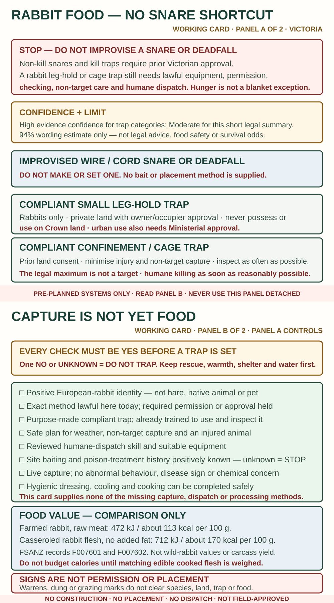

*IM-207. Original working decision card. It gives no trap construction, bait, placement, dispatch, cutting or cooking method. Victorian legal, animal-welfare, wild-game food-safety, practical and stressed-reader review remain outstanding.*

### Which trap methods are usable here?

| Method | Victorian position | What this guide tells you |
|---|---|---|
| Improvised wire or cord snare | Non-kill snares require Ministerial approval and prescribed features. | **Do not make or set one.** |
| Deadfall, spring snare or other kill trap | Kill traps require Ministerial approval and humane-design controls. | **Do not make or set one.** |
| Small leg-hold trap | A compliant small trap is for **rabbits only**. It needs owner or occupier approval, cannot be used or possessed on Crown land, and needs extra approval in an urban area. | Pre-planned private-land pest control only. No setting method. |
| Cage or confinement trap | It needs owner, occupier or Crown-land-manager consent, non-target controls and inspection. A captured pest must be humanely killed as soon as reasonably possible. | Exact compliant trap, prior permission and training only. No design or placement method. |

The regulation titled **“Emergency use of traps”** concerns a Ministerial response to a new pest incursion, not a lost person. Do not plan around a possible after-the-event legal defence.

Sources: [in-force Victorian trap regulations](https://www.legislation.vic.gov.au/in-force/statutory-rules/prevention-cruelty-animals-regulations-2019/004), [leghold traps](https://agriculture.vic.gov.au/biosecurity/pest-animals/trapping-pest-animals/leghold-traps), [confinement traps](https://agriculture.vic.gov.au/biosecurity/pest-animals/trapping-pest-animals/confinement-traps), [animal-welfare approvals](https://agriculture.vic.gov.au/livestock-and-animals/animal-welfare-victoria/pocta-act-1986/animal-welfare-licences-and-approvals) and [Victorian hunting welfare code](https://agriculture.vic.gov.au/livestock-and-animals/animal-welfare-victoria/pocta-act-1986/victorian-codes-of-practice-for-animal-welfare/code-of-practice-for-the-welfare-of-animals-in-hunting-revision-no-1). Rules and approvals can change.

### A rabbit trap is a complete system

Every answer must be **yes** before a trap is set:

1. Is it positively identified as a European rabbit—not a hare, native animal or pet?
2. Is the exact method lawful here today, with every required permission or approval?
3. Is the purpose-made trap compliant and familiar, and can you inspect it as regularly as possible rather than treating the legal maximum as a target interval?
4. Can you prevent and safely manage an injured or non-target capture?
5. Can you humanely kill a captured rabbit as soon as reasonably possible, using a reviewed method and suitable equipment?
6. Do you positively know the site's baiting and poison-treatment history, have no chemical concern, see no abnormal behaviour or disease sign, and have a safe way to dress, cool and cook the rabbit hygienically?
7. Can you do this without weakening rescue, shelter, warmth or the water plan?

Any **no** or **unknown** means **do not set the trap**. This edition deliberately withholds dispatch, field-dressing and rabbit-cooking steps until the exact methods have animal-welfare and wild-game food-safety review.

### Rabbit signs are for observation, not trap placement

European rabbits are usually active from late afternoon to early morning. Warrens, dung heaps, short-grazed patches, scratchings and seedlings cut at about 45 degrees may show activity. They often use well-drained ground and cover near creek banks, gullies, rocks, logs, scrub, buildings or debris.

These signs do **not** prove species, permission, a safe trap site or safe food. Observe from the safe waiting place. Do not reach into a burrow or follow signs away from rescue visibility.

European hares are larger and use shallow above-ground resting places rather than rabbit warrens. A rule applying to a rabbit trap does not automatically apply to a hare. This edition has no hare-trapping method.

Sources: [Agriculture Victoria European rabbit](https://agriculture.vic.gov.au/biosecurity/pest-animals/established-pest-animal-species/european-rabbit), [integrated rabbit control](https://agriculture.vic.gov.au/biosecurity/pest-animals/invasive-animal-management/integrated-rabbit-control) and [European hare](https://agriculture.vic.gov.au/biosecurity/pest-animals/established-pest-animal-species/european-hare).

### How much food might rabbit provide?

The Australian Food Composition Database provides this **food comparison**, not a wild-rabbit yield:

| Database food | Energy per 100 g edible meat | Protein | Fat |
|---|---:|---:|---:|
| Farmed rabbit, whole meat, raw; bone and offal removed | 472 kJ / about 113 kcal | 23.2 g | 2.1 g |
| Rabbit flesh, casseroled without added fat | 712 kJ / about 170 kcal | 29.3 g | 5.7 g |

These are farmed or retail samples, not wild Victorian animals; the cooked record is old and partly derived. A carcass is not 100% edible meat, and cooking changes weight. **Do not convert carcass weight into calories.** Taste is not an identity or safety test.

Source: [FSANZ Australian Food Composition Database](https://www.foodstandards.gov.au/science-data/food-nutrient-databases/afcd). The records used are F007601 and F007602.

### Other small animals — quick exclusions

| Animal or source | Victoria-focused decision |
|---|---|
| Native mammals, birds, reptiles, frogs or eggs | **Do not take or trap them using this guide.** Native wildlife is protected unless a specific lawful authority applies. |
| Rats or mice | **Do not use as food.** Low return, native-rodent confusion, disease and poison risk outweigh possible energy. |
| Roadkill or an animal found dead | **Do not eat it.** Time, temperature, injury, disease, poison and contamination are unknown. |
| Rabbit where baiting or poison-treatment history is positive or unknown | **Do not eat it.** Do not assume cooking makes a possibly poisoned rabbit safe; this guide supplies no clearance method. |
| Yabbies | A possible later entry, but only with positive identification, current VFA rules, lawful gear, safe bank access and known crustacean tolerance. Do not transfer fish instructions. |
| Insects, grubs, snails or worms | No generic Victorian eating rule is supplied. Species, pesticide, parasite and allergy risks make “eat bugs” unsafe advice. |

Victoria protects native wildlife, and permissions that apply to Traditional Owners under particular agreements do not transfer to the general public. Traditional Owner food knowledge is not included merely because it is publicly documented. Inclusion requires direction from the relevant cultural authority, a permission-and-scope review, and attribution agreed with that authority; none of this creates a general capture permission.

Sources: [Victorian wildlife-control authority guide](https://www.vic.gov.au/authority-control-wildlife-application-guide), [Victorian rabbit-bait requirements](https://agriculture.vic.gov.au/farm-management/chemicals/requirements-for-using-1080-and-PAPP-animal-bait/1080-and-papp-animal-bait), [Victorian rodent health advice](https://www.health.vic.gov.au/environmental-health/rodents-pest-control) and [VFA yabby rules](https://vfa.vic.gov.au/recreational-fishing/recreational-fishing-guide/catch-limits-and-closed-seasons/types-of-fish/yabby-freshwater).

## Fishing: before trying to catch a meal

> **WARNING — FISH IDENTITY, WATER SAFETY AND RULES**
>
> The working atlas below is incomplete. This guide supplies **no species-specific humane dispatch, bleeding or cleaning method**. Do not cast unless you already know how to identify, lawfully handle, humanely dispatch and clean every likely catch with your equipment.
>
> **Evidence confidence:** High for official rules checked 29 September 2026; Moderate for this decision sequence; Insufficient for the missing species procedures. **Wording confidence: 90% (subjective).** Rules and closures can change.

Fish only if **every** answer is yes:

- More urgent first aid, rescue, shelter, water and warmth work is complete.
- You can stay on firm ground without climbing, wading, entering surf or leaving the rescue location.
- You have lawful tackle and permitted bait; unless exempt, you hold the required Victorian Recreational Fishing Licence.
- You checked the current [VFA Guide](https://vfa.vic.gov.au/recreational-fishing/recreational-fishing-guide), [Fisheries Notices](https://vfa.vic.gov.au/operational-policy/legislation-and-regulation/fisheries-notices), site signs and [EPA alerts](https://www.epa.vic.gov.au/check-air-and-water-quality) for this water and date.
- You can positively identify every likely catch and state its current protected status, season, size, bag, possession and required release or disposal action.
- You already have a suitable, practised, species-specific humane dispatch and cleaning method. **This guide does not provide one.**
- You can keep the catch cold or cook it promptly with a safe, lawful setup.

Any **no** or **unknown** means **do not fish**. Clear water, no online alert, or the labels “noxious”, “protected” or “unwanted” do not establish food safety.

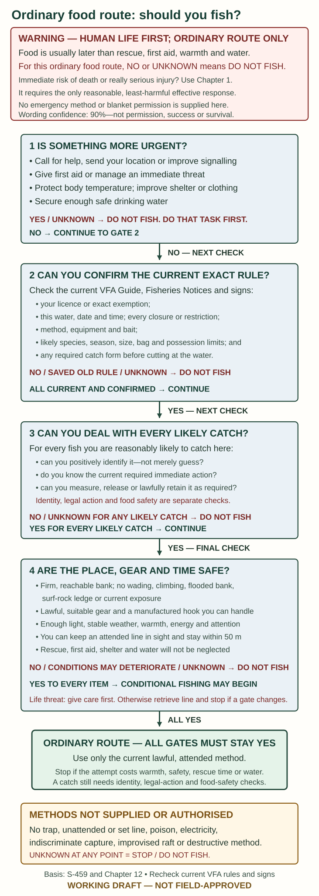

*IM-175. Working decision card, not a declaration that fishing is lawful or safe. Specialist and stressed-reader review remain outstanding.*

**No tackle:** use carried food. This edition has no dependable hook-and-line substitute made from a twig and guessed plant fibre. Do not use poison, electricity, indiscriminate traps or an improvised raft.

Safety references: [VFA fishing safety](https://vfa.vic.gov.au/education/fish-safe-fish-smart), [responsible fishing](https://vfa.vic.gov.au/recreational-fishing/recreational-fishing-guide/responsible-fishing-behaviours) and [rule reminders](https://vfa.vic.gov.au/recreational-fishing/recreational-fishing-guide/rule-reminders). This is not a live closure report.

## Fishing: only if practised before the emergency

### Assemble one basic fishing rig

**What you need:** sound fishing line, one small sliding sinker, a swivel, a short separate length of line, a suitable manufactured hook, and permitted bait. A rod/reel or purpose-made handline must suit the fish and place. Use lead-free tackle where available; keep all sinkers out of mouths.

A **swivel** is the small rotating connector between lines. The short line beyond it is the **trace**. This example uses ordinary monofilament line, not an untested braid or fibre substitute.

1. Slide the sinker onto the main line.
2. Tie the main line to one end of the swivel.
3. Cut a trace about **40–50 cm** long for this basic example.
4. Tie one trace end to the other swivel eye.
5. Tie the hook to the free end. Check each knot before putting bait on.

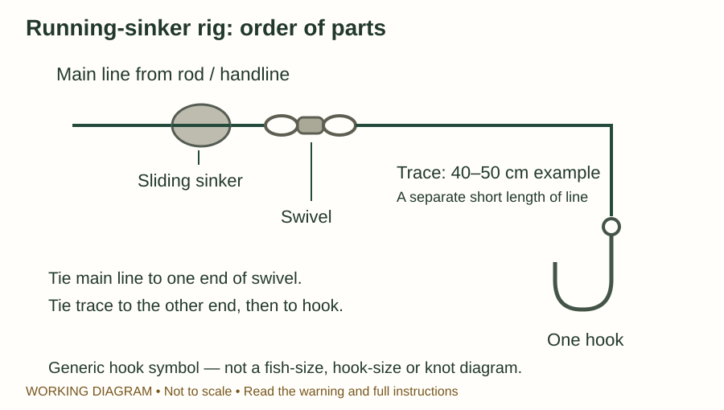

*Original diagram IM-070. The hook is a generic symbol; the diagram does not choose a hook for a fish species.*

**Basis:** [VFA Family Fishing Guide](https://vfa.vic.gov.au/education/fishing-info-for-kids/family-fishing-guide) and [NSW DPI rigging guide](https://www.dpi.nsw.gov.au/__data/assets/pdf_file/0010/1390897/NSW-Fisheries-FFL-broadsheet.pdf). NSW gives a shorter trace example; this is a variable rig choice, not a contradiction about how the parts connect.

### Tie a uni knot to a hook or swivel

> **WARNING — PRACTISE WITH YOUR LINE**
>
> **Evidence confidence: High for the knot structure; Moderate for this untested illustrated teaching sequence.** This is a fishing connection, not a rescue knot. Five or six turns are not a universal specification for every line material or diameter.
>
> **Wording confidence: 84% (subjective).** This rates this warning against the cited sources—not identity, safety, technique success or survival.

1. Pass the free end through the metal eye and double it back beside the main line.
2. Bend that free end into a loop alongside the doubled line.
3. Pass the free end around **both parallel line sections and through the loop**, making five or six turns.
4. Moisten with clean water. Pull the free end gently to draw the turns together.
5. Slide the knot down to the eye and tighten steadily.
6. Leave a visible short tail rather than cutting against the knot. Pull firmly by the line and a safe part of the connector, with the hook point guarded. Retie if turns cross badly, the tail moves or the line is damaged.

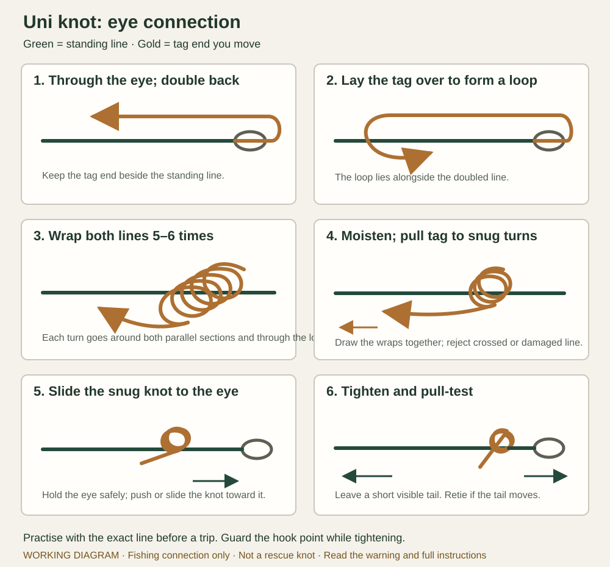

*Original working diagram IM-116. Green is the standing line; gold is the moving tag end. The eye is generic and the hook point is omitted. The drawing does not prove the connection will hold with your line.*

**Cross-checks:** [NSW DPI](https://www.dpi.nsw.gov.au/__data/assets/pdf_file/0010/1390897/NSW-Fisheries-FFL-broadsheet.pdf), [Animated Knots](https://www.animatedknots.com/uni-knot). Five turns in one example and five–six in another do not establish the best count for your line.

### Bait, lower, watch and retrieve

Use only bait permitted for the exact water and target species. Sweetcorn is used in some Victorian fisheries, but some waters prohibit natural bait or berley, including corn. Do not use it unless the current rule allows it. Never use frogs, tadpoles or frog eggs; undersize fish; live bait taken from another water; live noxious species; fish eggs; or uncooked trout or salmon as bait or berley.

Put the bait on with the hook point directed away from hands. Keep people clear of the hook's path. For a short, reachable position, lower the rig under control; do not swing it around your head. Never wrap fishing line around a finger, hand or limb.

Set lines are illegal. While a rod-and-line or handline is in the water, keep it in sight and remain within **50 metres**. If first aid, shelter or rescue work takes you away, retrieve the line first.

Retrieve steadily when a fish is hooked; with a circle hook, use steady pressure rather than a violent strike. Use a suitable landing net if available. Do not climb down a bank, lean over deep water or try to recover a snagged hook from the water. A lost hook is preferable to a second emergency.

> **WARNING — EMBEDDED FISHHOOK REMOVAL IS NOT SUPPLIED**
>
> **Evidence confidence: High for leaving penetrating-eye and other deep or high-risk embedded objects in place and obtaining medical care; Insufficient for a generic field fishhook-removal technique.** This guide has no reviewed push-through, cut-the-barb or backing-out method.
>
> **Wording confidence: 91% (subjective).** This rates this warning against the cited sources—not identity, safety, technique success or survival.
>
> Do not yank, twist, push through or cut around an embedded hook. For a hook in or near an eye, do not press or flush the penetrated eye; call **000** and prevent rubbing or pressure. Call **000** for serious bleeding, collapse or another immediate threat. For a hook embedded deeply, in the face, hand or over a joint, or with altered feeling, movement or circulation, leave it in place and obtain urgent medical help. While waiting, prevent the hook and attached tackle from moving without pressing it farther in. Follow [Poisoning and eye injury](06-first-aid-and-evacuation.md#poisoning-and-eye-injury) and [Smaller wounds and waiting for evacuation](06-first-aid-and-evacuation.md#smaller-wounds-and-waiting-for-evacuation); this is a holding boundary, not a removal procedure.

**With a first-aid kit:** The kit does not make removal safe. For a penetrated eye, use a rigid eye shield only as described in the first-aid chapter, without pressure. For another site, follow its retained-object and bleeding guidance while arranging medical help.

**Without a first-aid kit:** Do not improvise a removal tool or press a dressing onto the hook. Keep the person from snagging or moving it, and arrange medical help.

*IM-173. Original working holding-and-escalation card based on ANZCOR embedded-object guidance, St John eye-injury guidance, Healthdirect wound guidance and the Chapter 6 controls. It gives no hook-removal method. Its 91% figure estimates confidence in the wording only, not the probability of a safe outcome. Australian clinical and stressed-reader review remain outstanding.*

If the attempt supplies no food and is using warmth, energy or attention needed elsewhere, stop and reassess. There is no universal “fish here for an hour” survival rule.

**Basis:** VFA rig/bait information above, [VFA bait and berley rules](https://vfa.vic.gov.au/recreational-fishing/recreational-fishing-guide/fishing-equipment/bait-and-berley), [NSW DPI beginner guidance](https://www.dpi.nsw.gov.au/__data/assets/pdf_file/0010/1390897/NSW-Fisheries-FFL-broadsheet.pdf), and [Fishcare handling advice](https://fishcare.org.au/fishright-with-fishcare/); S-328/S-329/S-339/S-441/S-442. The near-bank sequence is a bounded synthesis, not a fishing lesson tested with a novice.

### Decide what to do with the catch immediately

Keep the fish in the water where possible while identifying it. Wet your hands, support it horizontally and minimise handling. Keep fingers clear of teeth, spines, eyes and gills. For scale fish, measure from the tip of the closed mouth to the end of the tail; other animals may use a different measurement.

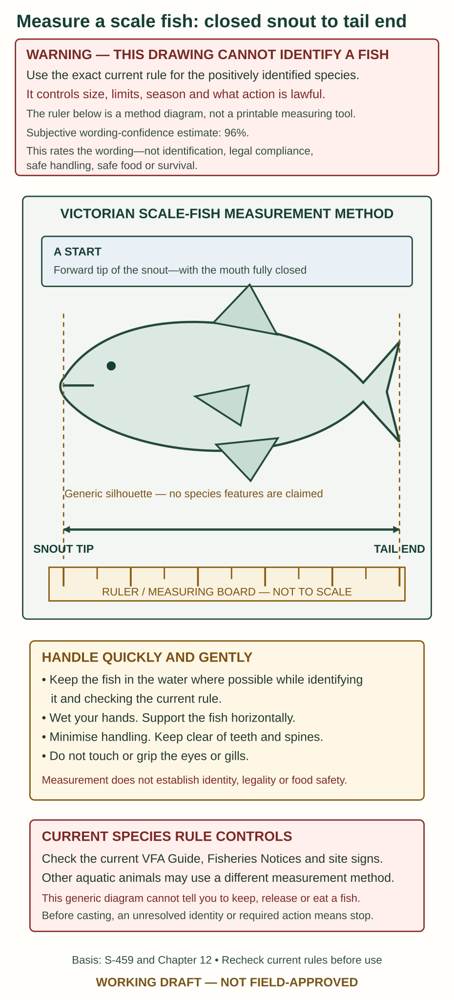

*IM-176. Original working method card based on VFA's current fishing definitions. Its 96% figure estimates confidence in the wording only, never the probability of correct identification, legal compliance, safe handling, safe food or survival. Use a real accurate measuring board or ruler and the current positively identified species rule.*

- **Protected, out-of-season, outside-size-limit, excess or unwanted fish:** release immediately with the least possible harm.
- **Toadfish and puffers:** never eat; return immediately and unharmed.
- **Positively identified European carp:** kill humanely; never return it alive or use it as live bait. Do not leave it on the bank.
- **A suspected aquatic pest other than confirmed European carp:** do not collect or remove it merely because it looks unfamiliar. Native species can be mistaken for pests. Photograph it if that is safe and report it to VFA.
- **An unidentified fish:** do not keep or eat it. This guide cannot give one universal “kill or release” instruction because the legally required action depends on identity. Avoid fishing where you cannot identify likely catches. If an accidental unknown catch creates doubt, minimise handling and contact VFA on **136 186** when possible.

For a fish that must be released, remove a mouth hook with suitable pliers where this can be done safely. If deeply hooked, do not dig through the animal; follow species-specific release guidance, generally cutting the line close to the mouth. Consider a positively identified, lawful food fish for eating only if you already have the separate, species-specific dispatch and cleaning competence that this guide does not supply.

**Sources:** [VFA handling and release](https://vfa.vic.gov.au/recreational-fishing/recreational-fishing-guide/responsible-fishing-behaviours), [noxious aquatic species](https://vfa.vic.gov.au/operational-policy/pests-and-diseases/noxious-aquatic-species-in-victoria), [suspected aquatic pests](https://vfa.vic.gov.au/operational-policy/pests-and-diseases/noxious-aquatic-species-in-victoria/aquatic-pests), [European carp](https://vfa.vic.gov.au/recreational-fishing/recreational-fishing-guide/catch-limits-and-closed-seasons/types-of-fish/freshwater-scale-fish/european-carp), [toadfish and puffers](https://vfa.vic.gov.au/recreational-fishing/recreational-fishing-guide/catch-limits-and-closed-seasons/types-of-fish/marine-and-estuarine-scale-fish/toadfish-and-puffers) and [Fishcare](https://fishcare.org.au/fishright-with-fishcare/); S-331/S-333/S-443–S-445. These do not provide a complete recognition plate or one statewide disposal method for every fish.

## Wildlife contact — act before identifying

- For collapse, breathing difficulty, severe allergic reaction, weakness or other serious symptoms, call **000** and follow [First aid](06-first-aid-and-evacuation.md).
- **Ordinary local bee, wasp or ant sting:** remove a visible bee stinger promptly; use a wrapped cold pack or cool wet cloth. Do not use pressure immobilisation.
- **Unknown tick, spider or marine exposure:** call **13 11 26** for exposure-specific advice. Do not transfer snakebite, hot-water, vinegar or tick advice to an unknown animal.
- **Bat bite, scratch or saliva exposure:** wash skin with soap and water for **15 minutes**; rinse eyes or mouth with water. Obtain urgent medical assessment even for a tiny mark.
- Do not approach an animal for a photograph. Do not handle bats, snakes, carcasses, droppings or unfamiliar marine animals.

The fuller with-kit/without-kit holding advice appears in the reference section below.

---

## Reference boundary — identification and review notes

The atlas and detailed notes below support learning before travel. They do not complete the missing fish-identification, humane-dispatch or cleaning skills and do not turn an unknown catch into food.

## Reference — working fish recognition and legal-disposition atlas

> **WARNING — SMALL, UNAPPROVED ATLAS; NOT AN EATING CLEARANCE**
>
> **Evidence confidence: High for the official rule pages as checked 29 September 2026; Moderate for the recognition summaries; Insufficient for first-time novice identification of difficult or partly seen fish.** This atlas covers only European carp, redfin and black bream, with yellowfin bream as a difficult comparison. Many other Victorian fish are absent. No fish-identification specialist or fisheries-law reviewer has approved the finished pages.
>
> **Wording confidence: 86% (subjective).** This rates this warning against the cited sources—not identity, safety, technique success or survival.
>
> Use several visible features together. A colour, common name, habitat or photograph by itself is never enough. If a required feature is hidden, damaged, folded or unclear, the identification has failed. A legal fish can still be unsafe to eat, and a correctly identified fish can still be unlawful to keep at that water or time.

These are factual source photographs, not generated fish art. They have passed a file-level rights check and a visual-quality check, but not expert specimen review. Open the full-size image in the reader when a feature is too small. The captions say what each photograph cannot establish.

### If the catch is still unknown

> **DANGER — THERE IS NO UNIVERSAL KILL-OR-RELEASE ANSWER**
>
> **Evidence confidence: High that different fish can require different immediate actions; Insufficient for one terminal instruction that is safe for every unidentified catch.** A protected or unlawful fish may require prompt release, while a positively identified European carp must not be returned alive.
>
> **Wording confidence: 91% (subjective).** This rates this warning against the cited sources—not identity, safety, technique success or survival.

Keep the fish in the water where possible while making a prompt check. Minimise handling. Do not assume that an unfamiliar fish is a pest, food or carp. Do not intentionally retain it for food. Check the current official source immediately and call VFA on **136 186** when communication is available.

If identity and the required action cannot be resolved promptly, this working edition has **no safe universal terminal instruction**. That is a real gap, not permission to choose whichever action seems convenient. It is also why the pre-cast gate says not to fish unless every reasonably likely catch can be identified and lawfully dealt with.

### European carp — *Cyprinus carpio*

> **DANGER — APPLY THE MUST-KILL RULE ONLY AFTER POSITIVE IDENTIFICATION**
>
> **Evidence confidence: High for the ordinary-form features and current VFA rule; Moderate for using this incomplete photo set with mirror and leather forms; Insufficient for a no-barbel fish or suspected carp–goldfish hybrid.** A false positive could kill a fish that should have been released.
>
> **Wording confidence: 90% (subjective).** This rates this warning against the cited sources—not identity, safety, technique success or survival.

Carp occur in many Victorian freshwater rivers, lakes and slower waters. Place is supporting context only; it does not prove identity.

For an ordinary fully scaled fish, require this combination:

- a stocky, moderately deep body;
- a small eye and blunt snout;
- a thick-lipped mouth that can extend forward;
- ordinarily **four whisker-like barbels**: one longer barbel at each mouth corner and one shorter barbel at each end of the upper lip;
- one long-based dorsal fin along the back; and
- large, thick scales over most of the body.

If the mouth, barbels or dorsal-fin arrangement cannot be checked, stop. Colour and body depth are not decisive.

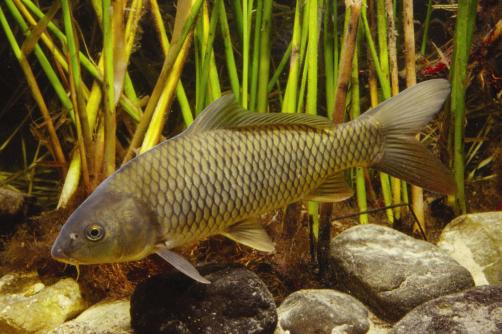

*IM-177. European carp, ordinary scaled form. Gunther Schmida via [Fishes of Australia](https://fishesofaustralia.net.au/home/species/3964), [CC BY-NC-SA 3.0](https://creativecommons.org/licenses/by-nc-sa/3.0/), unchanged. Locality is not supplied. This personal-edition image is non-commercial and ShareAlike. It is not a complete identification plate.*

#### Scale forms do not create separate species

Mirror and leather carp are forms of *Cyprinus carpio*, not different species. A mirror carp may have a few very large, irregularly placed scales. A leather carp may have very few scales or an almost scaleless flank. Do not force the ordinary scale checklist onto either form.

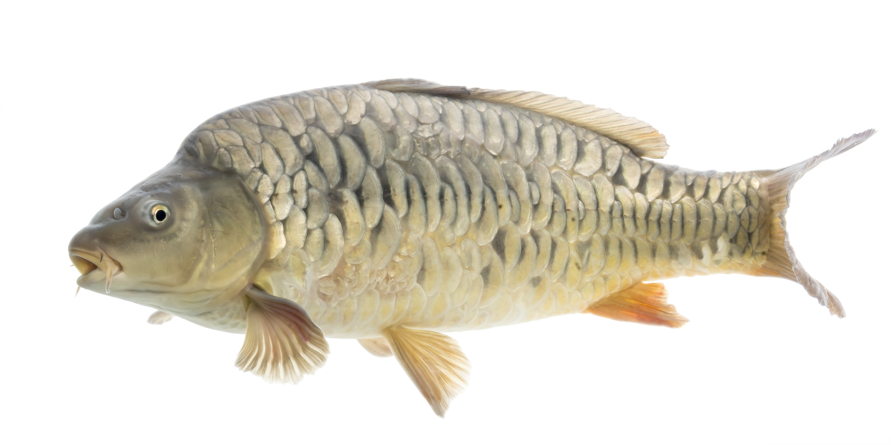

*IM-178. Mirror carp at Gavins Point National Fish Hatchery, South Dakota, by Sam Stukel/USFWS; [public domain source file](https://commons.wikimedia.org/wiki/File:%22Mirror_Carp%22_(Cyprinus_carpio)_(51022632707).jpg), unchanged. It shows a scale pattern only, not Victorian distribution, ordinary colour or a complete identification.*

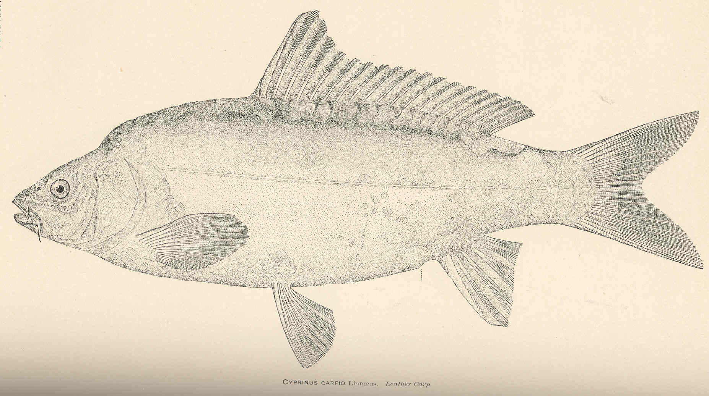

*IM-179. Historical leather-carp illustration by Hugh McCormick Smith from an 1890 North American fisheries report, via the Freshwater and Marine Image Bank, University of Washington; [public-domain file page](https://commons.wikimedia.org/wiki/File:FMIB_37931_Cyprinus_Carpio_Linnaeus_Leather_Carp.jpeg), unchanged. It is not a Victorian specimen photograph or modern diagnostic plate. Use it only to understand why “large scales everywhere” cannot be required of every carp.*

#### Goldfish and hybrids are a stop trap

Wild goldfish can be olive, bronze or pale rather than bright orange. Goldfish normally have no mouth barbels, but absence of barbels does **not** prove goldfish: carp–goldfish hybrids may have weak or absent barbels. A no-barbel carp-like fish remains unresolved in this atlas.

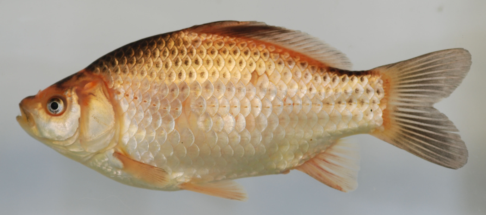

*IM-180. Wild-type goldfish from the Patuxent River, Maryland, by Robert Aguilar/Smithsonian Environmental Research Center; [CC BY 2.0](https://creativecommons.org/licenses/by/2.0/) via the [file page](https://commons.wikimedia.org/wiki/File:Carassius_auratus_(S0141)_(12460419425).jpg), unchanged. It is non-Australian and does not show the species' full colour or body-form range. No-barbel hybrids remain unresolved.*

#### Current Victorian action — recheck before fishing

As checked on 29 September 2026, VFA states:

- no minimum legal size;
- no bag limit;
- a **positively identified** European carp must be killed immediately and must not be returned alive;
- do not leave a dead carp on the bank; and
- a dead carp may be taken away or cut so that the carcass sinks before being returned to the water.

The last option is a narrow carp rule, not permission to cut or dump another fish. This guide gives **no dispatch, cutting or disposal technique**. If you do not already have the humane species-specific skill and suitable equipment needed to comply, do not cast where carp is a likely catch. See the current [VFA European carp rule](https://vfa.vic.gov.au/recreational-fishing/recreational-fishing-guide/catch-limits-and-closed-seasons/types-of-fish/freshwater-scale-fish/european-carp), S-460 and S-463.

### Redfin or English perch — *Perca fluviatilis*

> **WARNING — RED FINS OR DARK BANDS ALONE ARE NOT ENOUGH**
>
> **Evidence confidence: High for the combined feature set and current VFA rule; Moderate for this single candidate side view; Insufficient for a partly hidden, dull, juvenile or damaged fish without matched comparison views.**
>
> **Wording confidence: 92% (subjective).** This rates this warning against the cited sources—not identity, safety, technique success or survival.

Redfin occur in many Victorian lakes, dams and slower river reaches. Require the features to agree:

- a deep body that is fairly narrow from side to side;
- a large head and mouth reaching to about the eye;
- **two clearly separate dorsal fins**, with a spiny first dorsal;
- five or more broad dark vertical bands;
- a dark blotch near the rear of the first dorsal fin; and
- red or orange lower fins: the paired pelvic fins under the front half and the single anal fin underneath nearer the tail, with warm colour on the outer or lower tail.

The two-dorsal arrangement, first-dorsal blotch and bands matter more than colour by itself. If those features cannot all be checked, stop.

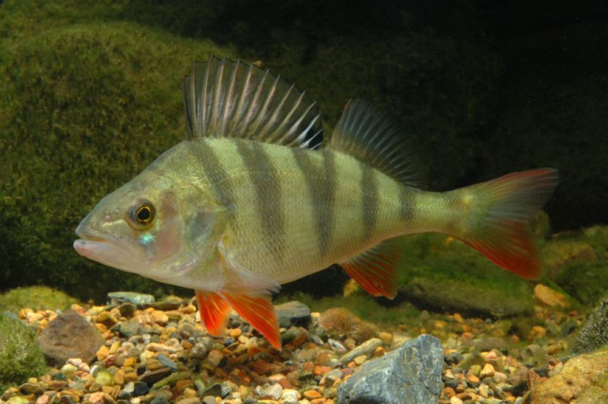

*IM-181. Redfin by Gunther Schmida via [Fishes of Australia](https://fishesofaustralia.net.au/home/species/3690), [CC BY-NC-SA 3.0](https://creativecommons.org/licenses/by-nc-sa/3.0/), unchanged. Locality is not supplied. The image does not show every spine or the range of juvenile, dull or folded-fin appearances; it is not a complete key.*

The first dorsal fin is spiny and the gill-cover area has a strong spine. Keep hands away from those structures and the hook. No exact grip is supplied because it has not passed practical review.

As checked on 29 September 2026, VFA states that redfin have no minimum legal size and no bag limit. VFA **encourages** anglers not to return redfin because they prey on native fish. That is not the same wording as the carp must-kill rule. It is illegal to transport live fish without VFA approval. A retained fish still needs positive identity, current exact-water clearance, humane dispatch competence, cold storage and safe cooking. See the current [VFA redfin rule](https://vfa.vic.gov.au/recreational-fishing/recreational-fishing-guide/catch-limits-and-closed-seasons/types-of-fish/freshwater-scale-fish/redfin), S-461 and S-463.

### Black bream and yellowfin-bream comparison

**Black bream:** *Acanthopagrus butcheri*  
**Yellowfin bream:** *Acanthopagrus australis*

> **DANGER — THIS COMPARISON CANNOT YET AUTHORISE RETENTION**
>
> **Evidence confidence: High that black and yellowfin bream are difficult to separate and can hybridise; Moderate for the general black-bream feature list; Insufficient for a novice non-colour separator.** Juvenile black bream may have yellowish fins. Water and lighting alter colour. This project has not found and tested a non-colour shortcut that makes the distinction dependable for a novice.
>
> **Wording confidence: 82% (subjective).** This rates this warning against the cited sources—not identity, safety, technique success or survival.

Black bream occur in Victorian coastal rivers, estuaries and coastal lakes. For a **possible** black bream, compare several features:

- robust, deep body;
- sharply rounded snout;
- one continuous dorsal fin along the back;
- large scales and a visible lateral line running along the side;
- bronze, olive or gold-brown upper body with a paler belly; and
- usually dusky-brown lower and tail fins.

Yellowfin bream usually have yellowish pelvic and anal fins. That colour is supporting evidence only. Juvenile black bream may also be yellowish, and the species can hybridise in Victoria. A common-name search is unsafe because “black bream” can name unrelated fish; keep the scientific name with every page.

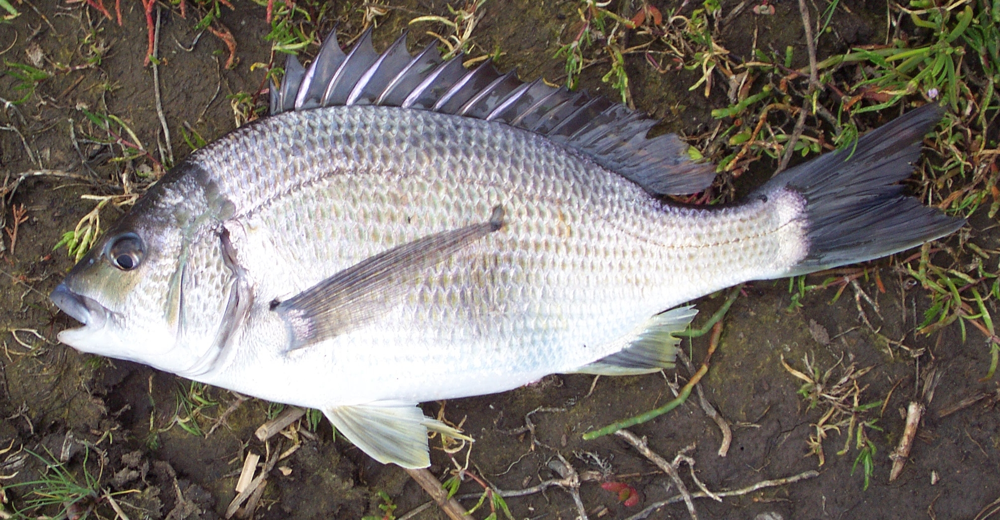

*IM-182. Black bream from the Snowy River, Victoria, 8 November 2003, by Axel Strauß; [CC BY-SA 3.0](https://creativecommons.org/licenses/by-sa/3.0/) via the [file page](https://commons.wikimedia.org/wiki/File:Acanthopagrus_butcheri_01.jpg), unchanged. Handling, glare and lighting affect colour. The photograph does not supply a tested separator from yellowfin bream or resolve a hybrid.*

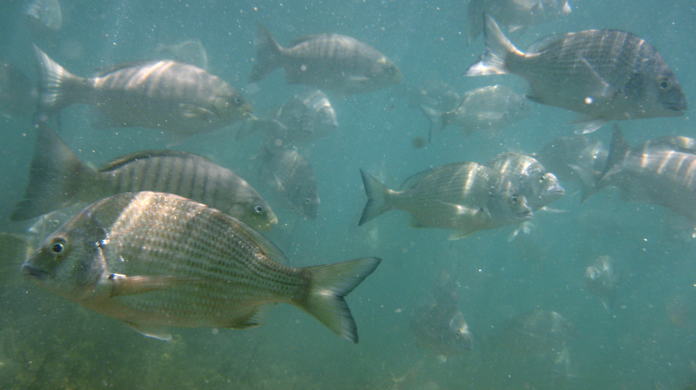

*IM-183. Yellowfin bream by Sylke Rohrlach; [CC BY-SA 2.0](https://creativecommons.org/licenses/by-sa/2.0/) via the [file page](https://commons.wikimedia.org/wiki/File:Yellowfin_Bream-Acanthopagrus_australis_(8378154419).jpg), unchanged. Exact locality is not stated. This group view is not matched to the black-bream photograph and cannot decide an individual fish's identity.*

#### Current general bream rule — recheck before fishing

As checked on 29 September 2026, the current VFA page states:

- minimum legal size for all bream species, including tarwhine: **28 cm**; and
- combined general bag limit: **10**.

For black bream in the Gippsland Lakes and tributaries, excluding Lake Tyers, a separate 2026 notice set a **28 cm minimum**, **38 cm maximum** and **bag limit of 7**. The notice commenced on 27 August 2026 and was drafted to expire 12 months later unless revoked sooner. These figures are deliberately time-stamped. Reopen the current [VFA bream rule](https://vfa.vic.gov.au/recreational-fishing/recreational-fishing-guide/catch-limits-and-closed-seasons/types-of-fish/marine-and-estuarine-scale-fish/bream-all-species) and [Fisheries Notices](https://vfa.vic.gov.au/operational-policy/legislation-and-regulation/fisheries-notices) before use.

Current regulation and VFA web wording specifically prohibit filleting black bream in or on Victorian waters, except at a cleaning table at a boat ramp; a downloadable VFA guide uses the broader wording “Bream can't be filleted”. This guide resolves neither that publication conflict nor the difficult species identification by inventing permission. It supplies no cutting method. Keep the catch whole and obtain a current authoritative answer before any processing at the water.

**Do not use this working bream comparison to retain or eat a fish when black-versus-yellowfin identity matters.** It remains a recognition-warning page until a Victorian fish-identification specialist supplies a tested non-colour comparison and novice false-positive testing passes. See S-462 and S-464.

### What the atlas still lacks

The photographs make this chapter more useful, but they do not complete the identification gate. Still required are matched mouth and barbel close-ups for carp, verified hybrid views, redfin spine and folded-fin views, matched adult and juvenile bream plates, a tested non-colour bream comparison and novice trials using realistic poor views. No AI-generated fish image may fill those gaps.

The [fish-atlas content and test packet](../../research/FISH_ATLAS_CONTENT_DRAFT.md) records the detailed evidence, image brief and failure tests. The atlas stays visibly unapproved and `FIELD_READY_BUILD` remains `NO`.

### A fish lawfully retained for food — dispatch method not supplied

> **WARNING — HUMANE KILLING NEEDS SPECIES KNOWLEDGE**
>
> **Evidence confidence: High that humane dispatch depends on species, anatomy, effective stunning and current legal requirements; Insufficient for a generic field technique.** Brain position, required force, confirmation signs and any later bleeding cut vary. This page has no species-specific anatomy plate and no practical welfare review.
>
> **Wording confidence: 93% (subjective).** This rates this warning against the cited sources—not identity, safety, technique success or survival.
>
> **This guide does not provide an actionable dispatch or bleeding method.** A generic direction such as striking “above the eyes” or cutting “the gills” can be anatomically wrong, prolong suffering and expose the handler to teeth, spines or a knife. Learn and practise the exact humane method for each likely species with a competent instructor before relying on fishing for food. If you cannot already identify, control and humanely dispatch that species with suitable equipment, do not use this page as authority to retain it for food.

Before bleeding, cleaning, cutting or cooking a catch at the water, check its current species rule. Some catch must remain whole or in a prescribed carcass form until you are away from the water. If you cannot confirm that the intended preparation is lawful at that place, do not cut it there.

Do not leave a live fish to suffocate, bleed it while conscious, or rely on an ice slurry to kill it humanely. Current species rules still apply, including the rule that positively identified European carp must not be returned alive. Check current VFA species guidance or call **136 186** when communication is available. The absence of a method here is a reason to learn before fishing, not permission to improvise after a catch.

**Cross-checks:** [RSPCA fish intended for eating](https://kb.rspca.org.au/categories/wild-animals/aquatic-animals/what-is-the-most-humane-way-to-kill-a-fish-intended-for-eating), [NSW catch-and-release handbook](https://www.dpi.nsw.gov.au/__data/assets/pdf_file/0010/1561744/nsw-recreational-fishing-catch-and-release-handbook.pdf) and VFA responsible-fishing guidance. They support the need for humane, species-appropriate handling; they do not turn this page into a reviewed Victorian dispatch method.

## Clean and cook a known food fish — cleaning method not supplied

> **WARNING — CLEANING CANNOT REMOVE EVERY HAZARD**
>
> **Evidence confidence: High for cold storage and separation, and for Victoria's general 75°C consumer advice; Moderate for using 75°C as one conservative working target for an ordinary wild-caught finfish.** Current Australian sources are not harmonised: fish figures of 63°C, 69°C and broader food advice of 70°C or 75°C appear in different contexts. A Victorian seafood/food-safety specialist still needs to approve the final target and wording. This is not a toxin-removal method. It does not make a poisonous species, chemically contaminated fish or spoiled catch edible. No cleaning method is supplied below; the cooking steps start with already-cleaned portions from a small, already dead, ordinary finfish.
>
> **Wording confidence: 82% (subjective).** This rates this warning against the cited sources—not identity, safety, technique success or survival.

Use a stable washable surface, clean water, a suitable knife and clean hands or food-handling gloves. Keep bait and raw fish separate from drinking openings and ready-to-eat food. Do not use a knife when your hands are too cold, injured or shaky to control it.

**Cleaning is not an immediately usable procedure in this edition.** It provides no species-specific anatomy plate, cutting path or practically reviewed sequence. Do not infer where to cut from the words “gills” or “internal organs”, and do not probe or slice an unfamiliar animal. Learn and practise cleaning for each likely species before travel. Until then, this section applies only to a lawful, positively identified fish that has already been cleaned competently. Do not eat organs or roe on the assumption that the flesh's food status applies to them. Use drinking-quality water for food-contact cleaning; do not rinse fish, hands or tools in a suspect creek.

Keep fish cold on ice if it will not be cooked immediately. Shade is not refrigeration. Without cold storage, do not plan a stockpile for later meals.

For portions that were already cleaned competently and lawfully:

1. Use a clean pot or pan on a stable, lawful outdoor cooking setup. Follow [Fire](08-fire.md); a food need does not make a prohibited flame lawful.
2. Put a clean food-thermometer probe into the centre of the thickest flesh. For this working edition, cook to **75°C** and wait for the reading to stop changing. This is a deliberately conservative choice from Victorian consumer guidance, not a species-specific law. The checked sources give no hold time at 75°C, so none is invented here.
3. Without a thermometer, keep cooking until the thickest flesh is opaque—not translucent—and separates easily with a fork. This is less reliable than a temperature reading. If either check fails, keep cooking. Neither method removes seafood toxins, histamine, chemical contamination or spoilage.
4. Move cooked fish to a clean surface using clean utensils, not the raw-fish plate.
5. Remove bones carefully and eat promptly. Do not give fish to someone with impaired swallowing.

![Fish-cooking card for a lawful, positively identified ordinary finfish portion that was already cleaned competently: reject any failed identity, legal, spoilage, toxin or contamination gate; keep raw and cooked sides separate; with a clean sanitised food thermometer, check the centre of the thickest flesh against the working 75-degree-Celsius target, or without a thermometer use the lower-assurance opaque-and-separates-with-a-fork check; neither route fixes toxins, chemicals, spoilage or mistaken identity.](../assets/fish-cooking-card.svg)

*IM-174. Original working cooking card based on VFA, Victorian Health, FSANZ and Healthdirect guidance. Australian source temperatures are not harmonised, so 75°C remains a conservative working choice awaiting Victorian seafood/food-safety review. Its 82% figure estimates confidence in the bounded wording only, not the probability that a fish is safe. The card is not a species-identification, dispatch, cleaning or preservation method.*

Do not eat emergency-caught fish raw or try a quick cold-smoking, salting or sun-drying treatment as preservation.

**Sources:** [VFA eating your catch](https://vfa.vic.gov.au/recreational-fishing/recreational-fishing-guide/food-safety), [Victorian Better Health cooking advice](https://www.betterhealth.vic.gov.au/health/healthyliving/food-safety-when-cooking), [Victorian Department of Health food-safety guide](https://www.health.vic.gov.au/sites/default/files/2023-09/your-guide-to-food-safety.pdf), [FSANZ thermometer placement](https://www.foodstandards.gov.au/business/food-safety/thermometers), [Healthdirect's lower fish comparator](https://www.healthdirect.gov.au/food-safety-infographic), [Food Safety Information Council's 63°C/15-second parasite comparator](https://www.foodsafety.asn.au/topic/seafood-parasites/), [FSANZ raw-fish risks](https://www.foodstandards.gov.au/consumer/prevention-of-foodborne-illness/raw-fish-dishes), [FSANZ seafood-toxin limits](https://www.foodstandards.gov.au/consumer/prevention-of-foodborne-illness/bacteria-foodborne-illness/toxins-in-seafood) and [Penn State fish handling](https://extension.psu.edu/proper-care-and-handling-of-fish-from-stream-to-table). The different temperatures have not been averaged. These sources do not supply the missing species-specific anatomy plate or practical review needed for dispatch and cleaning.

## Read animal signs without chasing them

For rabbits and hares, use the earlier [rabbit signs and legal gate](#rabbit-signs-are-for-observation-not-trap-placement). It is an observation aid, not permission to place a trap.

Look from your known, safe position. Photograph a print straight down with a ruler or another known-size object beside it. Record several prints and the surrounding ground; one partial mark rarely tells the whole story. Note direction, number of toes or hoof divisions, spacing and whether there is a clear trail.

Keep observation separate from inference: “three split-hoof marks in soft mud” is an observation; “a deer went to water this morning” is several assumptions. Do not taste droppings, handle carcasses, reach into dens or follow a trail away from a rescue location. Tracks alone do not establish drinking water or an edible animal.

This is an original observation worksheet, not a species-identification key. A checked Victorian track plate remains needed.

## Avoid bites rather than identify them after contact

Give wildlife room to leave. Do not reach blindly into holes, move a snake, handle a bat or pick up an unfamiliar marine animal. Keep footwear on and inspect clothing before use.

For a bite or sting with collapse, breathing difficulty, weakness or a severe allergic reaction, call 000 and use [first aid](06-first-aid-and-evacuation.md). A photograph is useful only if it can be taken without approach, handling or treatment delay.

### Ordinary bee, wasp or ant sting

> **WARNING — THIS IS ONLY FOR AN ORDINARY LOCAL STING**
>
> **Evidence confidence: High for prompt visible bee-stinger removal, local cooling and the emergency signs listed below; Moderate for applying this short summary without clinical review of the finished page.** Collapse, breathing difficulty, mouth or throat swelling, or a serious allergic reaction leaves this local-care path.
>
> **Wording confidence: 91% (subjective).** This rates this warning against the cited sources—not identity, safety, technique success or survival.

Remove a visible bee stinger promptly by scraping or pulling it out; do not delay over the method. Watch for anaphylaxis, especially after previous allergy.

**With a first-aid kit:** Apply a cold pack wrapped in cloth for local pain. Do not use pressure immobilisation for these stings.

**Without a first-aid kit:** Use a cool wet cloth. Do not apply plant paste or cut the skin.

Call 000 for breathing difficulty, collapse, a serious allergic reaction or a sting affecting the mouth/throat with swelling.

**Sources:** [ANZCOR insect stings](https://www.anzcor.org/home/first-aid/guideline-9-4-3-envenomation-from-tick-bites-and-bee-wasp-and-ant-stings), [healthdirect bee/wasp stings](https://www.healthdirect.gov.au/bee-and-wasp-stings), St John S-161; S-154, S-157.

### Ticks, spiders and marine stings

> **WARNING — DO NOT TRANSFER ONE TREATMENT TO ANOTHER ANIMAL**
>
> **Evidence confidence: Insufficient for an unknown-creature treatment rule.** Snakebite bandaging is not the default for every bite. Tick removal advice has a specific Australian allergy risk; jellyfish and fish-spine methods also differ.
>
> **Wording confidence: 90% (subjective).** This rates this warning against the cited sources—not identity, safety, technique success or survival.

Use 13 11 26 for exposure-specific advice; use 000 immediately for serious symptoms. Do not squeeze or irritate an attached tick while seeking advice. Do not apply heat, petroleum jelly or household chemicals to it.

**With a first-aid kit:** Tell the adviser which supplies and exact tick-removal product you have. Do not use a snakebite bandage on an unidentified sting simply because it is in the kit.

**Without a first-aid kit:** Keep the person observed and obtain advice. Lack of supplies is not a reason to use a universal hot-water, vinegar or cutting treatment.

**Sources:** ANZCOR S-150/S-154/S-158/S-159, ASCIA tick guidance S-155 and healthdirect S-156/S-160; contradictions are retained in EP-008. Full creature-specific treatment pages remain incomplete.

### Bat bite, scratch or saliva exposure

> **WARNING — URGENT MEDICAL ASSESSMENT IS REQUIRED**
>
> **Evidence confidence: High for immediate washing and urgent assessment after a bat bite, scratch or relevant saliva exposure; Moderate for this short field summary pending clinical review of the finished page.** Do not wait for symptoms or assume a small mark is harmless.
>
> **Wording confidence: 94% (subjective).** This rates this warning against the cited sources—not identity, safety, technique success or survival.

Do not handle bats, including an injured one. After a bite or scratch, wash the wound thoroughly with soap and water for **15 minutes** and obtain urgent medical assessment, even if the mark looks minor. For saliva in eyes or mouth, rinse thoroughly with water and obtain urgent advice.

**With a first-aid kit:** After washing a skin wound, use a suitable iodine-containing antiseptic if available as directed; do not put skin antiseptic in the eyes.

**Without a first-aid kit:** Begin washing with water and soap if available; do not delay assessment while looking for supplies. Vaccination history does not allow you to dismiss an exposure.

**Sources:** [Victorian Health bat lyssavirus](https://www.health.vic.gov.au/infectious-diseases/rabies-and-australian-bat-lyssavirus), [Australian Immunisation Handbook](https://immunisationhandbook.health.gov.au/contents/vaccine-preventable-diseases/rabies-and-other-lyssaviruses), St John S-168; S-164–S-168.

**Review record:** [EP-008](../../research/evidence-packets/EP-008-victorian-bites-and-stings.md), the [Victorian fish action evidence packet](../../research/FISH_ACTION_EVIDENCE_PACKET.md), the [fish-atlas content and test packet](../../research/FISH_ATLAS_CONTENT_DRAFT.md), the [fish-atlas image-rights packet](../../research/FISH_ATLAS_IMAGE_RIGHTS_PACKET.md), D-075, R-497, S-491–S-498, SP-042–SP-043, SR12-31–SR12-32, IM-070, IM-116 and IM-173–IM-183/IM-207. Updated 2 October 2026; the chapter now includes a Victoria-specific rabbit/small-animal gate, legal method table, rabbit/hare observation limits and source-bounded nutrition values. It deliberately gives no improvised snare, deadfall, trap placement, humane-dispatch, rabbit-dressing or rabbit-cooking method. The fishing knot diagram and atlas have not passed practical or specialist review. The atlas has no universal terminal action for an unidentified catch, no novice-safe non-colour black-versus-yellowfin bream separator, and incomplete carp, hybrid and redfin views. Species-specific dispatch, bleeding and anatomy-dependent cleaning, field tests and specialist approval remain incomplete, so those procedures are withheld. Shellfish remain warning-only. `FIELD_READY_BUILD` remains `NO`.
